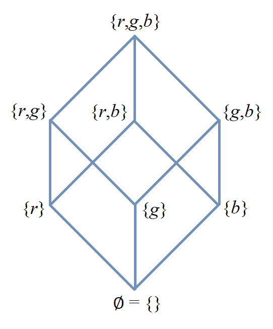
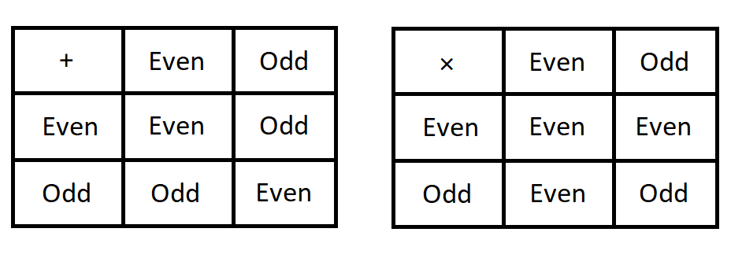

= Relations

//“”

#*CAUTION* - CHAPTER UNDER CONSTRUCTION!#

include::LinkToPublic.adoc[] 

_This chapter was last updated on October 20, 2025._ + 
_Revised the sections/subsections on partial orders, well-ordering, and modular arithmetic._ + 
_Made other minor revisions and fixed typos._ + 
//_added information to the subsection on the well-ordering of $\mathbb{N}$_ + 
//[small]#Contents locked until 11:59 p.m. Pacific Standard Time on May 23, 2025.#

//COMING SOON!

////
---
Stuff from JWong. etc.: 

include id_{A} (the identity relation on A)

NOTE: NEED A NEW CHAPTER ON RELATIONS
Relations
Binary relations - examples, inverses and compositions
Identity relation Id
Properties: 
	Reflexive (Id is a subset), Irreflexive (is disjoint from Id)
	Symmetric (equals its own inverse), Antisymmetric (intersection with inverse is a subset of Id)
	Transitive (composition with self is a subset of self)

Definition: A binary relation Rα on a set S is the closure of a relation R on S with respect to property P if
(a) Rα has property P, (b)R ⊆ Rα and
(c) Rα is a smallest relation on S that includes R and has property P.

Definition: Let R be any binary relation on S, then
R ∪ Id is called reflexive closure of R R ∪ R-1 is called symmetric closure of R R+ is called transitive closure of R
R* is called reflexive and transitive closure of R
Example: For a digraph, (a,b) in transitive closure = “there exists a path from (a,b)”

equivalence relation: reflexive, symmetric, and transitive
	these correspond to partitions of the set into equivalence classes (classic example is Odd and Even integers) - Partition is defined in Set Theory chapter and/or Intro chapter.

partial ordering on S is reflexive, antisymmetric, and transitive

Definition: Relations on Multiple Sets Given two sets S and T, a binary relation from S to
T is a subset of S x T. Given n sets S1, S2, ...Sn, n > 2, an n-ary relation on
S1 xS2 x...xSn isasubset of S1 xS2 x...xSn.

Intro. to Relational Databases Let us take a look at a type of database representation that is based on relations, namely the relational data model.
A database consists of n-tuples called records, which are made up of fields. These fields are the entries of the n-tuples.
The relational data model represents a database as an n-ary relation, that is, a set of records

Example: Consider a database of students, whose records are represented as 4-tuples with the fields Student Name, ID Number, Major, and GPA:
R = {
(Ackermann, 231455, CS, 3.88),
(Adams, 888323, Physics, 3.45), (Chou, 102147, CS, 3.79),
(Goodfriend, 453876, Math, 3.45), (Rao, 678543, Math, 3.90),
(Stevens, 786576, Psych, 2.99)}
Relations that represent databases are also called tables, since they are often displayed as tables.
We can apply a variety of operations on n-ary relations to form new relations.

Definition: The projection Pi1, i2, ..., im maps the n-tuple (a1, a2, ..., an) to the m-tuple (ai1, ai2, ..., aim), where m ≤ n. i.e. select some fields from a record
Example: What is the result when we apply the projection P2,4 to the student record (Stevens, 786576, Psych, 2.99) ?
Solution: It is the pair (786576, 2.99).
In some cases, applying a projection to an entire table may not only result in fewer columns, but also in fewer rows. (select fields from entire table)
Why is that? Some records may only have differed in those fields that were deleted, so they become identical, and there is no need to list identical records more than once.

We can use the join operation to combine two tables into one if they share some identical fields.
Definition: Let R be a relation of degree m and S a relation of degree n. The join Jp(R, S), where p ≤ m and p ≤ n, is a relation of degree m + n – p that consists of all (m + n – p)- tuples (a1, a2, ..., am-p, c1, c2, ..., cp, b1, b2, ..., bn-p), where the m-tuple (a1, a2, ..., am-p, c1, c2, ..., cp) belongs to R and the n-tuple (c1, c2, ..., cp, b1, b2, ..., bn-p) belongs to S.
In other words, to generate Jp(R, S), we have to find all the elements in R whose p last components match the p first components of an element in S. The new relation contains exactly these matches, which are combined to tuples that contain each matching field only once

Example: What is J1(Y, R), where Y contains the fields Student Name and Year of Birth,
Y = {(1978, Ackermann), (1972, Adams), (1917, Chou), (1984, Goodfriend), (1982, Rao), (1970, Stevens)},
and R contains the student records as defined before ?
Solution: The resulting relation is:
{(1978, Ackermann, 231455, CS, 3.88), (1972, Adams, 888323, Physics, 3.45), (1917, Chou, 102147, CS, 3.79), (1984, Goodfriend, 453876, Math, 3.45), (1982, Rao, 678543, Math, 3.90), (1970, Stevens, 786576, Psych, 2.99)}
Since Y has two fields and R has four, the relation J1(Y, R) has 2 + 4 – 1 = 5 fields.
////

// MKD content starts Here

//== the basic idea, informally

Relations are used to describe an association of data. 

For example, imagine a university database of students. The database needs to have a record for each student, and the student's record needs to include fields for the student's name(s), the unique student ID number for the student, the student's current status, a list of courses that the student has enrolled in or has completed (along with the grade earned in each completed course,) and possibly other data associated with the student. One way to visualize the database is as a two-dimensional table, similar to a spreadsheet worksheet, where each row corresponds to a record and each column corresponds to a field; each row can be treated as an ordered $n$-tuple, where $n$ is the number of fields. 

In this chapter, you will learn about the formal definition of relation, operations and properties of relations. You will also learn about some special types of relations, namely partial orderings and equivalence relations. As a special case of equivalence relations, you will learn about congruence relations of integers as well as modular arithmetic.

//Examples: 

//* the comparisons we make between two numbers: Is the first number less than, equal to, or greater than the second number? 

//* the association of a student's name, the student's ID number, and classes in which the student is enrolled. Here there are three sets: The set of names of all students, the set of all student ID numbers, and the set of all classes offered. Notice that the same name and ID number are likely to be associated with multiple classes.

//* the association of siblinghood (e.g., two people are brothers or sisters).

//* the association of each integer with its square. This relation is a function. In fact, every function is a relation since it associates an input with exactly one output.

////
RELATIONS (MKD) - new chapter is needed for this
	ACM CCECC Set/rels/funcs/congruence	
    COMP 152 Functions, Relations and Sets and DS1.
		relations including 
			equivalence relations, 
			equivalence classes
        Relations (
        	reflexivity, 
        	symmetry, 
        	transitivity, 
        	equivalence relations)
	MKD: add Divisibility 
	MKD: add Congruence and Modular Arithmetic (Operations on Congruence Classes)
	MKD: Also check slides (James Wong, etc.) for examples, etc.
	2013 changes/additions:
		Reflexivity, symmetry, transitivity
		Equivalence relations, partial orders
	[Core-Tier2]
			Well orderings

// MKD may also introduce "Well orderings" here
//	should be spelled "well-ordering"

AUG 2024 update on topics
DS2013/Sets, Relations, and Functions	Relations: Reflexivity, symmetry, transitivity
DS2013/Sets, Relations, and Functions	Relations: Equivalence relations, partial orders
DS2008/FunctionsRelationsAndSets	Relations (reflexivity, symmetry, transitivity, equivalence relations)
ACM_CCECC_2005/Sets, relations, functions, congruences	relations including equivalence relations, equivalence classes

AUG 2024 update on topics (modular arithmetic)
DS2013/Basics of Counting	Basic modular arithmetic

RELATIONS - January 2025
DS2013/Sets, Relations, and Functions	Relations: Reflexivity, symmetry, transitivity
DS2013/Sets, Relations, and Functions	Relations: Equivalence relations, partial orders
DS2013/Proof Techniques	Well orderings [Core-Tier2]
DS2008/FunctionsRelationsAndSets	Relations (reflexivity, symmetry, transitivity, equivalence relations)
DS2008/ProofTechniques	Well orderings
ACM_CCECC_2005/Sets, relations, functions, congruences	relations including equivalence relations, equivalence classes
DS2013/Basics of Counting	Basic modular arithmetic
MSF-Discrete_2023	1. Sets, relations, functions, cardinality
MSF-Discrete_2023	5. Modular arithmetic

////

Key terms and concepts covered in this chapter:

* Relations
* Properties of relations (reflexivity, symmetry, transitivity, and other properties)
* Equivalence relations
** Equivalence classes
* Modular arithmetic
** Congruences
* Partial orders
* Well orderings

//== Definition of _n_-ary Relation
== Definition of Relation

Informally, a relation on two or more sets is an association between elements of those sets. 
//_A_ and _B_ is an association between elements from set _A_ and set _B._ 
Formally, a relation is a subset of a Cartesian product of two or more sets. + 
[small]#For simplicity, it is assumed in this textbook that the number of sets used to form the Cartesian product is finite. It _is_ possible to define relations as subsets of a Cartesian product of infinitely many sets, in which case the elements of the relation are infinite sequences.# 

//, but this case is not necessary for this this textbook, we will restrict ourselves to the case of finite sequences.

****
.Definition

//Given sets $A_{1}, \, A_{2}, \, \ldots \, A_{n}$ where $n \geq 2,$ an *_n_-ary relation* on $A_{1}, \, A_{2}, \, \ldots \, A_{n}$ is a subset $R$ of the Cartesian product $A_{1} \times A_{2} \times \cdots \times A_{n},$ that is, $R \subseteq A_{1} \times A_{2} \times \cdots \times A_{n}.$

An *_n_-ary relation* on the sets $A_{1}, \, A_{2}, \, \ldots \, A_{n},$ where $n \geq 2$ is a natural number, is a subset $R$ of the Cartesian product $A_{1} \times A_{2} \times \cdots \times A_{n}.$ That is, _any_ subset 
//$R$ such that 
$R \subseteq A_{1} \times A_{2} \times \cdots \times A_{n}$ is a _n_-ary relation on the sets $A_{1}, \, A_{2}, \, \ldots \, A_{n}.$

The sets $A_{1}, \, A_{2}, \, \ldots \, A_{n}$ are called the *domains* of the relation $R.$ 

The number of sets $n$ is called the *degree* of the relation $R.$
****

Here are several examples of relations.

****
//.Examples {counter:mkdrelex:0} - Relations
.Example {counter:mkdrelex} - Relations
--
--

* Let 
$A$ be the set of names of students currently enrolled at a college, 
$B$ be the set of all possible student ID numbers, and 
$C$ be the set of all classes currently offered at the college. 
//The set $R = \{ (x, y, z) : \text{Student _x_ has ID number _y_ and has declared major z} \}$ is a 3-ary relation, also called a *ternary relation* on $R \subseteq A \times B \times C.$ 
The set \[ R = \{ (x, y, z) \mid \text{Student } x \text{ has ID number } y \text{ and is enrolled in class } z \} \] is a 3-ary relation, also called a *ternary relation,* on $A,$ $B,$ and $C.$
//$A \times B \times C.$ 

* Let 
$S$ be the set of names of students currently enrolled at a college. 
The set \[ R = \{ (x, y) \mid \text{Student } x \text{ is enrolled in a class section in which student } y  \text{ also is enrolled} \} \] is a 2-ary relation, usually called a *binary relation* on $A$ (since the two sets in $A \times A$ are the same set.) 
Most of the focus of this chapter will be on binary relations. 

//* Let $R = \{ (a, b) \in \mathbb{Z} \times \mathbb{Z} | a \text{ is a divisor of } b \}$. $R$ is a binary relation on $\mathbb{Z}.$

//* Let $R = \{ (x, y) \in \mathbb{R} \times \mathbb{R} | x \leq y \}$. $R$ is a binary relation on $\mathbb{R}.$

* Let 
$f : A \rightarrow B$ be any function, as defined formally in the link:./functions.html[Functions] chapter. Recall that part of the formal definition states that $f$ is a subset of $A \times B,$ so the set $f$ is a binary relation on the domains $A$ and $B.$ 
//$f$ be a function with domain $D$ and codomain $C$ as defined formally in the link:./functions.html[Functions] chapter. Recall that, in the formal definition, $f \subseteq D \times C,$ so the set $f$ is a binary relation on the domains $D$ and $C.$ 

****

Notice that for any sets $A_{1}, \, A_{2}, \, \ldots \, A_{n},$ where $n \geq 2$ is a natural number, we always have the following two relations:

* $\emptyset,$ called the *empty relation.* This relation is also called the *void relation* and *trivial relation* in other sources. 
* $A_{1} \times A_{2} \times \cdots \times A_{n},$ called the *universal relation.*

//== Binary Relations 
//A *binary relation* on sets $A$ and $B$ is any subset $R$ of the cartesian product c, that is, $R \subseteq A \times B.$ 
//Example NEEDED where A and B are NOT same set, but not a Functions
//Example: Any function f from A to B is a relation since $f \subseteq A \times B$ (Recall from link:./functions.html[Functions] that the definition of function means that _f_ is defined to be subset of $A \times B.$)

//=== Examples of Binary Relations on a Set 
== Binary Relations on a Single Set

In many cases, the two domains of a binary relation are the [underline]#same# set; for example, the relation may involve comparing two elements of a set _S_ in some way. In this case, the domain $S$ is mentioned only once: A *binary relation on set _S_* is any subset $R$ of the cartesian product $S \times S$, that is, $R \subseteq S \times S.$ 

In the case of a binary relation on $S,$ we often write $aRb$ to mean the same thing as $(a,b) \in R.$ This notation may make more sense after reading the following example.

****
.Example {counter:mkdrelex} - Binary Relations on a Set
--
--

Here are some examples of binary relations on one set.

* $R = \{ (x, y) \in \mathbb{R} \times \mathbb{R} \, | \,  x \leq y \}$. $R$ is a binary relation on $\mathbb{R}.$ We write $x \leq y$ instead of $(x,y) \in R$ (Notice that in this case, we are writing $xRy$ but replacing the $R$ by the symbol $\leq.$)

* $D = \{ (a, b) \in \mathbb{Z} \times \mathbb{Z} \, | \,  a \text{ is a divisor of } b \}$. $D$ is a binary relation on $\mathbb{Z}.$ In this case, we often write $a | b$ instead of $(a,b) \in D.$ You may not be surprised to learn that this relation is called the *divisibility relation* on the integers.

* $M = \{ (a, b) \in \mathbb{Z} \times \mathbb{Z} \, | \,  2 \text{ is a divisor of } (a-b) \}$. $M$ is a binary relation on $\mathbb{Z},$ called *congruence modulo 2.* This textbook uses the common but nonstandard notation $a \equiv_{2} b$ instead of $(a,b) \in M.$ + 
//[small]#Note that the ISO standard notation for this relation is $a \equiv b \mod{2}$ and that other sources use $a \equiv b \pmod{2}.$#
[small]#Note that the ISO standard notation for this relation is $a \equiv b \ \text{mod } 2$ and that other sources use $a \equiv b \ (\text{mod } 2).$#

//$\mathcal{P}(A).$
* For a set $S,$ recall that $\mathcal{P}(S)$ is the power set of $S,$ that is, the set whose elements are all possible subsets of $S.$ Let $R = \{ (A, B) \in \mathcal{P}(S) \times \mathcal{P}(S) \, | \,  A \subseteq B \}.$ $R$ is a binary relation on $\mathcal{P}(S),$ and we write $A \subseteq B$ instead of $(A,B) \in R.$

* For a set $S,$ we can also define a different relation $R = \{ (A, B) \in \mathcal{P}(S) \times \mathcal{P}(S) \, | \,  A \subset B \},$ that is, $A$ is a proper subset of $B.$ This relation is also a binary relation on $\mathcal{P}(S),$ and we write $A \subset B$ instead of $(A,B) \in R.$

* Let $S$ be _any_ nonempty set. The set $\mathbf{id}_S = \{ (x, x) \in \mathbb{R} \times \mathbb{R} \, | \,  x \in S \}$ is a binary relation on $S$ which we refer to as the *identity relation* on $S$ (Other sources call this *the diagonal* of $S,$ or simply the *equality relation* on $S.$) We write $a=b$ instead of $(a,b) \in \mathbf{id}_S.$

//* $B = \{ \text{("rock", "scissors"), ("paper", "rock"), ("scissors", "paper")} \}$ is a binary relation on the set $\{ \text{"rock", "paper", "scissors"} \}.$ We write $xBy$ (that is, "$x$ beats $y$") instead of $(x,y) \in B.$
* $L = \{ \text{("rock", "paper"), ("paper", "scissors"), ("scissors", "rock")} \}$ is a binary relation on the set $\{ \text{"rock", "paper", "scissors"} \}.$ We write $xLy$ (that is, "$x$ loses to $y$") instead of $(x,y) \in L.$

****

//students enrolled in the same class (out of all students at a college)

//ordering on numbers

//subset lattice

//Divisibility

//congruence of integers modulo m

//the identity relation $id_{A}$

=== Operations on Binary Relations on a Set

Given binary relations $Q$ and $R$ on a set $S,$ we can define several other relations in terms of $Q$ and $R.$ These operations are likely familiar to you as operations on _functions_ but they also work for binary relations on a single set.

* The *inverse* of $R$ is the relation $R^{-1} = \{ (b,a) \, | \, (a,b) \in R \}.$ 
//This can also be described by the biconditional $aRb \leftrightarrow bR^{-1}a.$

* The *composition of _Q_ and _R_* is $R \circ Q = \{ (a,c) \, | \, (a,b) \in Q \land (b,c) \in R \}.$ 

* The *_n_* *th power* of $R$ is defined recursively for all $n \in \mathbb{N}$ as follows.
** $R^{0} = \mathbf{id}_S$
** $R^{k+1} = R \circ R^{k}$ for natural numbers $k > 0.$ + 
[small]#The recursion step uses $k$ instead of $n$ in preparation for the type of arguments used in the chapter on  link:./induction.html[proof by mathematical induction.]#

Building on the $n$th powers of $R,$ we can define two relations.

* $R^{+}$ is the relation $\{ (a,b) \in S \times S \, | \, (a,b) \in R^{k} \text{ for some positive integer } k \}.$ That is, $R^{+}$ is the union of all the positive $n$th powers of $R.$

* $R^{*}$ is the relation $\{ (a,b) \in S \times S \, | \, (a,b) \in R^{k} \text{ for some natural number } k \}.$ That is, $R^{*}$ is the union of all the natural number $n$th powers of $R.$

Notice that $R^{*} = \mathbf{id}_S \cup R^{+}.$

// NEED EXAMPLES OR EXERCISE HERE.

//=== Properties of Binary Relations
=== Properties of Binary Relations on a Set

In this subsection we define five properties that a relation may satisfy.

****
.Definitions

Let $R$ be a binary relation on the set $S.$

* $R$ is *reflexive* if and only if for all $a \in S,$ $(a, a) \in R.$

* $R$ is *irreflexive* if and only if for all $a \in S,$ $(a, a) \not\in R.$

* $R$ is *symmetric* if and only if for all $a \in S$ and $b \in S,$ $(a, b) \in R \rightarrow (b,a) \in R.$

//* $R$ is *antisymmetric* if and only if for all $a \in S$ and $b \in S,$ $(a, b) \in R \rightarrow (b,a) \not\in R.$ 
* $R$ is *antisymmetric* if and only if for all $a \in S$ and $b \in S,$ $(a, b) \in R \land (b, a) \in R \rightarrow a = b.$ + 
[small]#Equivalently, $R$ is *antisymmetric* if and only if for all $a \in S$ and $b \in S,$ $(a, b) \in R \land a \neq b \rightarrow (b,a) \not\in R.$#

* $R$ is *transitive* if and only if for all $a \in S,$ $b \in S,$ and $c \in S,$ $(a, b) \in R \land (b, c) \in R \rightarrow (a,c) \in R.$

****

// NEED EXAMPLES OR EXERCISE HERE.

The following theorem can make it easier to determine when a relationship has each of the five properties. The proof of the theorem is an exercise. 

.Theorem 
****
Let $R$ be a binary relation on the set $S.$

* $R$ is reflexive if and only if $\mathbf{id}_S \subseteq R.$

* $R$ is irreflexive if and only if $\mathbf{id}_S \cap R = \emptyset.$

* $R$ is symmetric if and only if $R^{-1} = R.$

* $R$ is antisymmemtric if and only if $R^{-1} \cap R \subseteq \mathbf{id}_S.$

* $R$ is transitive if and only if $R^{2} \subseteq R.$ + 
[small]#Recall that $R^{2}$ is defined to be the composition $R \circ R.$#

****

=== Closures of Binary Relations with Respect to a Property

For each of the properties reflexivity, symmetry, and transitivity, we define the *closure with respect to the property* of a relation $R$ as follows: The closure is the smallest relation that has the property and includes all the elements of $R.$ That is, you start with $R$ and try to insert in just enough ordered pairs, if any are needed, to make sure that the new relation has the desired property.
// (unless $R$ already has the property, in which case it is its own closure with respect to the property.)

The following theorem justifies that the reflexive closure, symmetric closure, and transitive closure exist for any relation $R.$ The proof of the theorem is an exercise. 

.Theorem 
****
Let $R$ be a binary relation on the set $S.$

* The *reflexive closure* of $R$ is the relation $R \cup \mathbf{id}_S.$

* The *symmetric closure* of $R$ is the relation $R \cup R^{-1}.$

* The *transitive closure* of $R$ is the relation $R^{+}.$

****

Notice that we can also define the *reflexive and transitive closure* of a relation $R$ as the relation $R^{*},$ which is the reflexive closure of the transitive closure of $R.$

However, for some properties, the closure of a relation $R$ with respect to the property may not exist! 

****
.Informal Exercise

The irreflexive closure and antisymmetric closure only exist if $R$ satisfies certain conditions.  

//[env.questions]
//--
. Find a description of the relations $R$ that _do_ have an irreflexive closure. + 
. Find a description of the relations $R$ that _do_ have an antisymmetric closure.
//--

[click.hint]
--
Use the theorem from the previous subsection that describes irreflexive relations and antisymmetric relations in terms of intersections of sets.
--

****

== Equivalence Relations

A binary relation $R$ on a set $S$ is called an *equivalence relation* on $S$ if $R$ is reflexive, symmetric, and transitive.

A first example of an equivalence relation is the diagonal, that is, the equality relation.  Another example is given below. 

[[parity_relation_on_the_integers]] 
****
.Example {counter:mkdrelex} - The Parity Relation on the Integers
--
--

Consider the set $R = \{ (a,b) \in \mathbb{Z} \times \mathbb{Z} \, | \, \text{Both } a \text{ and } b \text{ are odd, or both }  a \text{ and } b \text{ are even.} \}.$

Let's show that $R$ is an equivalence relation. 

** $R$ is reflexive, since $aRa$ for every $a \in \mathbb{Z}.$ That is, both $a$ is odd and $a$ is odd, or both $a$ is even and $a$ is even (since $p \land p \leftrightarrow p$ is a tautology for any propositional variable $p.$)

** $R$ is symmetric, since $aRb$ implies $bRa$ for every pair $a, b \in \mathbb{Z}.$ That is, both $a$ and $b$ are odd whenever both $b$ and $a$ are odd, and both $a$ and $b$ are even whenever both $b$ and $a$ are even (since $p \land q \leftrightarrow q \land p$ is a tautology for any propositional variables $p$ and $q.$)

** $R$ is transitive, since $aRb$ and $bRc$ implies $aRc$ for every triple $a, b, c \in \mathbb{Z}.$ That is, if both $a$ and $b$ are odd and both $b$ and $c$ are odd, then both $a$ and $c$ are odd, and if both $a$ and $b$ are even and both $b$ and $c$ are even, then both $a$ and $c$ are even (since $(p \land q) \land (q \land r) \rightarrow (p \land r)$ is a tautology for any propositional variables $p,$ $q,$ and $r.$)

It is not difficult to see that this relation can also be defined as $R = \{ (a,b) \in \mathbb{Z} \times \mathbb{Z} \, | \, 2 \text{ is a divisor of } (a-b) \}.$ So this relation is the same as the $\equiv_{2}$ relation discussed in an earlier example.

****

Given an equivalence relation $R$ on the set $S$ and an element $x \in S,$ we define the *equivalence class* of $x$ to be $[ x \]_{R} = \{ y \in S \, | \, (x,y) \in R \}.$

[[partition_iff_equivalence_relation]]
.Theorem 
****
Let $R$ be a binary relation on the set $S.$

If $R$ is an equivalence relation then the set of all equivalence classes $\{ [ x \]_{R} \, | \, x \in S \}$ is a partition of S. + 
 + 
Conversely, if $\Pi$ is a partition of $S$, then the relation defined by $R = \{ (x, y) \, | \, x \text{ and } y \text{ are elements of the same subset in } \Pi \}$ is an equivalence relation. + 

****

//[small]#Recall that a partition of a set $S$ is a collection of nonempty subsets of $S$ such that every element of $S$ is an element of exactly one subset of the partition. It may help to review how Venn diagrams for 2 or 3 subsets create a partition containing 4 or 8 subsets of the universal set; see the link:./set_theory[Set Theory] chapter.) And $\Pi$ is just the Greek capital letter "Pi" which is traditionally used for partitions. #

== Order Relations on a Set

It is often useful to be able to compare elements of a set, based on some key property. In this subsection, several examples of such order relations will be discussed.

=== Partial Orderings

// MKD: https://en.wikipedia.org/wiki/Join_and_meet#Examples
//  point out that \subseteq of P(S) forms a lattice (i.e., every subset of P(S) has a join and a meet)

A binary relation $R$ on a set $S$ is called a *partial order* on $S$ if $R$ is reflexive, antisymmetric, and transitive.

// MKD Oct 19 2025 revised example 
****
.Example {counter:mkdrelex} - Partial Orders
//.Example {counter:mkdrelex} - Partial Orders
--
--

//* For the set of real numbers $\mathbb{R}$ the usual order relations $<,$ $\leq,$ $>,$ and $\geq$ are partial orders.

//* For any set $S,$ each of the relations $\subseteq$ and $\subset$ is a partial order on $\mathcal{P}(S),$ the link:./set_theory.htm#power_set_definition[power set] of $S.$ 

For any set $S,$ each of the relations $\subseteq$ and $\subset$ is a partial order on $\mathcal{P}(S),$ the power set of $S.$ 

// MKD Oct 19 2025 inserted image
//image::imagesMKD/subset_lattice_for_set_with_3_members_v2.png[subset_lattice_for_set_with_3_members_v2,542,652,float="center",align="center"]
//image::imagesMKD/subset_lattice_for_set_with_3_members_v2.png[subset_lattice_for_set_with_3_members_v2,181,218,float="center",align="center"] 
 
As an example, 
for the set $S = \{ r, g, b \},$ 
the image shows a link:https://en.wikipedia.org/wiki/Hasse_diagram[*Hasse diagram*] that represents the $\subset$ relation 
//for the $8$ subsets of set $S = \{ r, g, b \}.$ 
on the power set $\mathcal{P}(S).$ 
// of $S = \{ r, g, b \}.$ 
Notice that each line segment in the Hasse diagram connects a first subset of $S$ to a second subset of $S$ that is “immediately above” the first subset in the following sense: Each member of the first subset is also a member of the second subset, but the second subset has one additional member. In the Hasse diagram, two different subsets $A$ and $B$ satisfy $A \subset B$ if and only if there is a “path up” from $A$ to $B$ that uses one or more of the line segments. 

****

// MKD Nov 22 2025 inserted anchor
[[total_ordering]]
==== Total Orderings

A *total ordering* of a set $S$ is a 
//relation 
partial order $R$ on $S$ that has the additional property $(\forall x \in S)(\forall y \in S)(xRy \lor yRx).$ 

//The usual orderings "less than" and "greater than" of the rational numbers $\mathbb{Q}$ and the real numbers $\mathbb{R}$ are examples of total orderings.

****
.Example {counter:mkdrelex} - Total Orderings
--
--

* For the set of real numbers $\mathbb{R}$ the usual order relations $\leq$ and $\geq$ are total orders.

****

====	Well-Orderings

A *well-ordering* of a set $S$ is a total ordering $R$ on $S$ that has the additional property that every nonempty subset of $S$ contains a least element with respect to the order relation.

[[well_ordering_principle_for_natural_numbers]]
// MKD Aug 19-20 2025 
One of the most important examples of a well-ordering in mathematics is the relation $\leq$ on the set of natural numbers $\mathbb{N}.$ 

//.Axiom 
//.Well-Ordering Axiom for $\mathbb{N}$
//.for.the.Natural.Numbers 
.The Well-Ordering Principle for $\mathbb{N}$
****
//The relation $\leq$ on the set $\mathbb{N}$ of natural numbers is a well-ordering.
// MKD Aug 22 2025 
//That is, every 
//Every nonempty subset $S \subseteq \mathbb{N}$ has a least element. 
//That is, 
If $S$ is a nonempty subset of $\mathbb{N}$ then 
there is a natural number $m \in S$ such that for every element $x \in S,$ $m \leq x.$

****

// MKD Aug 21 2025 
//The Well-Ordering Principle is usually assumed as an [.underline]#axiom.# That is, we don't try to prove this principle, but instead assume that the statement is True about the set of natural numbers. + 
// MKD Aug 22 2025 
//In the Remix, the Well-Ordering Principle is assumed as an [.underline]#axiom.# That is, we won't try to prove this principle, but will instead assume that the statement is True about the set of natural numbers. + 
In the Remix, the Well-Ordering Principle is treated as an axiom, a statement that is assumed to be True about the set of natural numbers. + 
// MKD Aug 19 2025 
//“”
// MKD Aug 22 2025 
//[small]#Note: Many textbooks state and prove that the link:./relations.html#well_ordering_principle_for_natural_numbers[Well-Ordering Principle] and the link:./induction.html#the_principle_of_mathematical_induction_for_natural_numbers[Principle of Mathematical Induction] are logically equivalent. The Remix does not follow this course, due to some link:https://link.springer.com/article/10.1007/s00283-019-09898-4[highly technical issues] concerning the formal mathematical definition of the set $\mathbb{N}$ of natural numbers.#

include::WOPPMI.adoc[]

////
[click.Note.to.instructors]
--
[small]#Many textbooks assume either the    link:./relations.html#well_ordering_principle_for_natural_numbers[Well-Ordering Principle] or the link:./induction.html#the_principle_of_mathematical_induction_for_natural_numbers[Principle of Mathematical Induction] as an axiom, and then prove the other principle using that axiom (and also prove that the two principles are logically equivalent.) As the Remix is designed for students of Computer Science, both principles are simply assumed to be True without proof, 
that is, both principles are treated as axioms.  
This choice should not limit student understanding of how these principles can be applied, and also avoids some highly technical issues that arise in formal mathematical definitions of the set $\mathbb{N}$ of natural numbers which would most likely only be of concern to Mathematics majors and their instructors. If you 
want to do a deeper mathematical exploration of these technical issues (e.g., differing formulations of the Peano axioms, and first-order versus second-order logic) you may refer to  link:https://link.springer.com/article/10.1007/s00283-019-09898-4[this article] in _The Mathematical Intelligencer_ as well as the subsection “Nonstandard models” of this  link:https://en.wikipedia.org/wiki/Peano_axioms#Nonstandard_models[Wikipedia  page.]#
--
////

//https://en.wikipedia.org/wiki/Peano_axioms#Nonstandard_models

// MKD Aug 22 2025 
////
At first glance, the Well-Ordering Principle may seem like an “obviously True” statement. 
//, but in fact we can only [.underline]#assume# it to be True - we cannot prove it. 
To understand why we must assume the principle to be True instead of trying to prove it is to understand what “infinity” means. 
////
The Well-Ordering Principle may seem like an “obviously True” statement. To understand why mathematicians would make it clear that they are _assuming_ that this principle is True is to understand what “infinity” means. 

// MKD Oct 19 2025 revised wording
* First, suppose that you are told that the subset $A$ of $\mathbb{N}$ contains the element 10. You can use a brute‑force method to determine the least element of $A:$ Just ask the following sequence of 10 questions, in the order shown. \[ \text{“Is 0 in $A?,$” “Is 1 in $A?,$” $\ldots$, “Is 9 in $A?$”} \] If the answer is “No” to all 10 of these questions, then 10 itself is the least element in $A$,  otherwise, the least number in $A$ is the first value of $k$ for which the answer to the question “Is $k$ in $A?$” is “Yes.” 
//determine the least element of $S$ since either the first “yes” answer determines the least element, or 10 itself is the least element if all the answers are “No.” 
//and know that a certain natural number $n$ is in the set, then we need only //ask at most $n$ questions in the list 
//“Is 0 in $S?,$” “Is 1 in $S?,$” ..., “Is $n-1$ in $S?$” to determine the least element of $S.$ 
//For example, if you know 10 is in $S,$ then you can ask at most 10 questions 
//* Now, suppose that it takes 1 nanosecond to ask and answer each question of the form “Is $k$ in $S?$” for each integer $k,$ and suppose that you are given a new set, also called $S,$ and told that the number you can be sure is in $S$ is $10^{10^{10^{10^{10}}}}$ which is an integer  
* Next, suppose that you are given a new set $S$ and told that the number $10^{10^{10^{10^{10}}}}$ is in $S.$ You again could try to use the brute‑force method of asking the sequence of $10^{10^{10^{10^{10}}}}$ questions: \[ \text{“Is 0 in $S?,$” “Is 1 in $S?,$” $\ldots$, “Is $\left( 10^{10^{10^{10^{10}}}}-1 \right)$ in $S?$”} \] but even if it took only 1 nanosecond to ask and answer each question, 
//of the form “Is $k$ in $S?$” for each integer $k,$ 
the integer $10^{10^{10^{10^{10}}}}$ is greater than the number of nanoseconds estimated for our universe to reach its link:https://en.wikipedia.org/wiki/Timeline_of_the_far_future#cite_ref-bignumber2_177-3[final energy state!] 
//a natural number that is 
//greater than the number of nanoseconds estimated for our universe to reach its link:https://en.wikipedia.org/wiki/Timeline_of_the_far_future#cite_ref-bignumber2_177-3[final energy state!] If you try to use the brute‑force method of asking the sequence of $10^{10^{10^{10^{10}}}}$ questions: \[ \text{“Is 0 in $S?,$” “Is 1 in $S?,$” $\ldots$, “Is $\left( 10^{10^{10^{10^{10}}}}-1 \right)$ in $S?$”} \] 
// questions, 
That is, 
it is possible that the answer to one of these questions is “Yes” but that you would never be able to ask that question before the universe ends! 
// MKD Aug 21 2025 
Notice that you can use link:./logic.html#de_morgans_laws[formal logic] to justify that either the answers to all of those questions would be “No” or that at least one of the questions would have the answer “Yes” — asking the sequence of questions 
//[.underline]#would# 
_would_ determine the least element in $S$ [.underline]#if you had time to ask enough of the questions,# but you (and humanity itself) may not have that much time. For this reason, mathematicians _assume_ that the least element of the set $S$ exists. + 
[small]#Notice that a “timeless being” could know all the answers.# 
//, but cannot prove that you have a way of determining what that least element is. 
//That is, you only have a finite amount of time to determine the least element of $S,$ but that may not be enough time.
//not have an infinite amount of time to determi

//However, suppose instead that we have a set and only know that $10^{10^{10^{10^{10}}}}$ is in the set. Also suppose that it takes 1 nanosecond to ask and answer each of the questions of the form “Is $k$ in $S?$” The problem with using the brute-force question-and-answer method is that  $10^{10^{10^{10^{10}}}}$ is greater than the number of nanoseconds estimated for our universe to reach its link:https://en.wikipedia.org/wiki/Timeline_of_the_far_future#cite_ref-bignumber2_177-3[final energy state!] It is possible that the answer to one of the questions is “yes” but that we would never be able to ask that question before the universe ends.
// questions to get an answer of “yes.”
//run out of time to ask the questions before we ever got an answer “yes!”

// MKD Aug 20 2025 
// PMI implies WO but not the converse?
// https://link.springer.com/article/10.1007/s00283-019-09898-4

== Modular Arithmetic (Revision in Progress!)

// MKD Challenges
//		Find all n such that n^2 \cong 1 mod 7 (Hint: you can make a table of values of the squaring function)
//		Find all n such that n^2 \cong -1 mod 10 (Hint: What positive numbers are congruent to -1 modulo 10)

//$\equiv_{m} = \{ (a, b) \, | \, m \text{ divides } (a-b) \}.$ 

//For any positive integer $m,$ you can define *congruence modulo $m$* as the relation \[\{ (a, b) \, | \, m \text{ divides } (a-b) \}\] and we write $a \equiv_{m} b$ if the pair $(a, b)$ is in the relation. 

// MKD Oct 16-17 2025 rephrased
//For any positive integer $m,$ you can define *congruence modulo $m$* as the relation \[\{ (a, b) \in \mathbb{Z} \times \mathbb{Z} \, : \, m \text{ divides } (a-b) \}.\] 
//Suppose that $m$ is some positive integer greater than 1, which we will treat as a constant. 
Let $m$ stand for some positive integer constant that is greater than 1. 
//You can define *congruence modulo $m$* as the relation \[\{ (a, b) \in \mathbb{Z} \times \mathbb{Z} \, : \, m \text{ divides } (a-b) \}.\] 
The relation *congruence modulo $m$* is defined to be \[\{ (a, b) \in \mathbb{Z} \times \mathbb{Z} \, : \, m \text{ divides } (a-b) \}.\] 
//The symbol $\equiv_{m}$ is used to represent this relation, that is \[a \equiv_{m} b \text{ if and only if } m \text{ divides } (a-b)\]
The symbol $\equiv_{m}$ is used to represent congruence modulo $m$, so \[a \equiv_{m} b \text{ if and only if } m \text{ divides } (a-b).\] 

As an example, $13 \equiv_{3} 7$ because $3$ divides $13-7.$ Another way to see that $13 \equiv_{3} 7$ is to notice that both $13$ and $7$ leave a remainder of $1$ when divided by $3$ using integer long division.  

Notice that the relation $\equiv_{2}$ is the same as the  link:./relations.html#parity_relation_on_the_integers[parity relation] discussed in an example earlier in this chapter. As discussed in that example, $\equiv_{2}$ is an equivalence relation. In fact, for each positive integer constant $m$ that is greater than 1, the relation $\equiv_{m}$ is an equivalence relation.

// MKD Oct 16 2025 wrote a more formal proof
//For each positive integer 
//value of 
//$m,$ $\equiv_{m}$ is an equivalence relation. 

//“”

[[conguence_is_equivalence_relation]]
.Theorem
****

If $m$ is a positive integer greater than 1, then $\equiv_{m}$ is an equivalence relation on $\mathbb{Z}.$

//[click.Proof]
//--
.Proof  

One way to prove this would be to use steps similar to the ones in the link:./relations.html#parity_relation_on_the_integers[parity relation] example to show that $\equiv_{m}$ is reflexive, symmetric, and transitive, but we'll use a different way to prove this theorem: We will show that the  relation $\equiv_{m}$ describes a way to partition $\mathbb{Z}$ into $m$ disjoint subsets, then apply the link:./relations.html#partition_iff_equivalence_relation[theorem] that states that such a partition corresponds to an equivalence relation. +  
 + 
You've already seen how the partition of $\mathbb{Z}$ into the odd integers and the even integers corresponds to the equivalence relation $\equiv_{2}.$  
Before giving a formal proof, let's look at another example. If $m = 3,$ then every integer $a$ can be written in the form $a = q \cdot 3 + r$ where $q$ is an integer and $r$ is one of the integers in the set $\{ 0, 1, 2 \}.$ You can partition $\mathbb{Z}$ into the three subsets listed below: 
\[\{ \ldots, -3, 0, 3, 6, \ldots \},\] 
\[\{ \ldots, -2, 1, 4, 7, \ldots \},\] \[\{ \ldots, -1, 2, 5, 8, \ldots \}.\] 

Notice that each integer is in exactly one of those three subsets 
//of $\mathbb{Z}$ 
so the subsets form a partition of $\mathbb{Z}.$ 
//From the theorem proved earlier in the chapter, there is an equivalence relation that corresponds to this partition. 
It's not difficult to see that two integers are members of the same subset of the partition if and only if $3$ divides their difference, so the subsets of the partition are the equivalence classes of the relation $\equiv_{3},$ that is,  
//\[[ 0 \]_{\equiv_{3}} = \{ \ldots, -3, 0, 3, 6, \ldots \},\] 
//\[[ 1 \]_{\equiv_{3}} = \{ \ldots, -2, 1, 4, 7, \ldots \},\] 
//\[[ 2 \]_{\equiv_{3}} = \{ \ldots, -1, 2, 5, 8, \ldots \}.\] 
We will now present the proof for the general case. Notice that if $a$ is any integer, you can use the division algorithm to find the quotient and remainder such that $a = q \cdot m + r$, where $q$ and $r$ are integers and $0 \leq r < m.$ This shows that each integer $a$ is congruent modulo $m$ to exactly one of the integers in the set $\{ 0, 1, \ldots, m-1 \},$ which means that the $m$ sets 
\[\{ \ldots, -m, 0, m, \ldots \},\] 
\[\{ \ldots, -m+1, 1, m+1, \ldots \},\] 
\[\{ \ldots, -m+2, 2, m+2, \ldots \},\] 
\[ \vdots \] 
\[\{ \ldots, -2, m-2, m+(m-2), \ldots \},\] 
\[\{ \ldots, -1, m-1, m+(m-1), \ldots \}\] 
form a partition of $\mathbb{Z}.$
By the theorem proved earlier in the chapter, $\equiv_{m}$ is an equivalence relation with equivalence classes $\{ [ 0 \]_{\equiv_{m}}, \, [ 1 \]_{\equiv_{m}}, \, [ 2 \]_{\equiv_{m}}, \, \ldots \,  [ m-1 \]_{\equiv_{m}} \}$ is the partition of $\mathbb{Z}$ that corresponds to the relation $\equiv_{m}.$ + 

//--

****

//This proof is an exercise for you. You need to prove that $\equiv_{m}$ is reflexive, symmetric, and transitive, which you can do by adapting the argument used in the example “The Parity Relation on the Integers” above to the case where $m$ is an integer that is greater than $2.$

////
The relation $\equiv_{m}$ corresponds to a partition of the set $\mathbb{Z}$ as described below. +  
For any integer $a,$ you can use the division algorithm to find the quotient and remainder such that $a = q \cdot m + r$, where $q$ and $r$ are integers and $0 \leq r < m,$ so every integer is congruent modulo $m$ to one of the integers in the set $\{ 0, 1, \ldots, m-1 \}.$ The set of equivalence classes $\{ [ 0 \]_{\equiv_{m}}, \, [ 1 \]_{\equiv_{m}}, \, [ 2 \]_{\equiv_{m}}, \, \ldots \,  [ m-1 \]_{\equiv_{m}} \}$ is the partition of $\mathbb{Z}$ that corresponds to the relation $\equiv_{m}.$ + 
Now apply the theorem from the previous section: , you can prove that $\equiv_{m}$ is an equivalence relation on $\mathbb{Z}.$ 
//// 

//“”

We can also do “arithmetic” directly with the equivalence classes of the $\equiv_{m}$ relation. The following example may make this more clear. 

****
.Example {counter:mkdrelex} - Arithmetic with Even and Odd Numbers 
--
--
You likely learned, when you were quite young, that some integers are called "even" and other integers are called "odd." 

Notice that every integer is either even or odd but not both, which means that the set \[\{ \text{the set of all even integers}, \, \text{the set of all odd integers} \}\] or more formally \[\{ \{ \ldots, -4, -2, 0, 2, 4, \ldots \}, \, \{ \ldots, -3, -1, 1, 3, \ldots \} \}\]forms a partition of the set $\mathbb{Z}$ of integers. This partition corresponds to the relation $\equiv_{2},$ that is, congruence modulo 2. The set of all even numbers is the equivalence class $[ 0 \]_{\equiv_{2}}$ and the set of all odd numbers is the equivalence class $[ 1 \]_{\equiv_{2}}.$

You may have learned how to do arithmetic with "Even" and "Odd," too, as shown in the tables.

//image::imagesMKD/EvenAndOdd.png[EvenAndOdd,928,328,float="right",align="center"]
//image::imagesMKD/EvenAndOdd.png[EvenAndOdd,310,110,float="center",align="center"]

When you did arithmetic with "Even" and "Odd," you were really _doing arithmetic with the equivalence classes_ $[ 0 \]_{\equiv_{2}}$ and $[ 1 \]_{\equiv_{2}}.$ For example, it will not matter _which_ two odd numbers you add, the result must be even because the two numbers were odd. You can just do the operations on the remainders that you get after dividing by 2, 
which corresponds to adding the equivalence classes: $[ 1 \]_{\equiv_{2}} + [ 1 \]_{\equiv_{2}} = [ 1+1 \]_{\equiv_{2}} = [ 2 \]_{\equiv_{2}} = [ 0 \]_{\equiv_{2}}$ where the last equality is True because $2$ and $0$ belong to the same equivalence class (that is, they are both even numbers.)

// to which odd number because the result 0 and 1 modulo 2, or Numbers remainders when $m = 2$ when you were quite young, but not in the formal way presented above. 
//this textbook. 
//Instead of referring to the equivalence classes as 0 and 1, you likely used the words "even" and "odd" but could describe certain properties of arithmetic using those words. For example, "odd times even equals even" is a simpler way of stating that if $a \in [1\]_{\equiv_{2}}$ and $b \in [0\]_{\equiv_{2}}$ then $(a \cdot b) \in [0\]_{\equiv_{2}}.$
//You learned to refer to the equivalence classes as "the even numbers" and "the odd numbers," and could describe certain properties of arithmetic using those words. For example, "odd times even equals even" is a simpler way of stating that if $a \in [1\]_{\equiv_{2}}$ and $b \in [0\]_{\equiv_{2}}$ then $(a \cdot b) \in [0\]_{\equiv_{2}}.$

****

The following theorem proves that you can do addition and multiplication with the remainders (or, what amounts to the same thing, the equivalence classes) in the same way as was done with Evens and Odds in the previous example for the relation $\equiv_{m},$ where $m$ can be any integer greater than 1.

.Theorem
****

If $m$ is an integer greater than 1, and $a,$ $b,$ $c,$ and $d$ are integers, and $a \equiv_{m} b$ and $c \equiv_{m} d,$ + 
then $a + c \equiv_{m} b + d$ and $a \cdot c \equiv_{m} b \cdot d.$

.Proof 

Assume that $m,$ $a,$ $b,$ $c,$ and $d$ are integers, $m > 1,$ $a \equiv_{m} b,$ and $c \equiv_{m} d.$ 
This means that $m$ is a divisor of both $(a-b)$ and $(c-d),$ that is, both $(a-b)$ and $(c-d)$ are multiples of $m.$ 

The sum $(a-b) + (c-d)$ must also be a multiple of $m,$ and this sum can be rewritten using properties of addition as $(a+c) - (b+d).$  
//which is still a multiple of $m.$ 
This shows that $m$ is a divisor of $(a+c) - (b+d,)$ which can also be stated as \[(a+c) \equiv_{m} (b+d).\]

The expressions $(a-b) \cdot c$ and $b \cdot (c-d)$ must be multiples of $m,$ and the sum of those expressions is $(a-b) \cdot c + b \cdot (c-d),$ which can be simplified using properties of multiplication and addition to $(a \cdot c) - (b \cdot d).$ This shows that $m$ is a divisor of $(a \cdot c) - (b \cdot d),$ which can also be stated as \[(a \cdot c) \equiv_{m} (b \cdot d).\]

Q.E.D.
****

For example, we can write $9 + 5 \equiv_{12} 2$ (This is an example of "clock arithmetic" using a 12-hour clock: 5 hours after 9 o'clock will be 2 o'clock.)

// 1000294000873 = 1000003 times 1000291
// 1000276000819 = 1000003 times 1000273
// 1000276000819 and 1000294000873

****
.Example {counter:mkdrelex} - Solving a linear congruence
--
--

If it is 12 o'clock now, what is the least number of 7-hour intervals that must pass before the clock will read 4 o'clock?

This question is equivalent to finding the smallest natural number $n$ that solves the linear congruence $7n \equiv_{12} 4.$

One way to solve this congruence is to treat this as a "clock arithmetic" problem: + 
After one 7-hour interval passes, the clock will read 7 o-clock. + 
After two 7-hour intervals pass, the clock will read 2 o-clock, because $7+7=14$ and $14 \equiv_{12} 2.$ + 
After three 7-hour intervals pass, the clock will read 9 o-clock, because $2+7 = 9$. + 
After four 7-hour intervals pass, the clock will read 4 o-clock, because $9+7 = 16$ and $16 \equiv_{12} 4.$. + 
So the least number of 7-hour intervals that must pass before the clock will read 4 o'clock is four. 

Another way to solve this congruence is to consider the remainders of natural number-multiples of 7 after dividing by 12: + 
$1 \cdot 7 = 7$ and $7 \equiv_{12} 7$ + 
$2 \cdot 7 = 14$ and $14 \equiv_{12} 2$ since $14 = 1 \cdot 12 + 2$ + 
$3 \cdot 7 = 21$ and $21 \equiv_{12} 9$ since $21 = 1 \cdot 12 + 9$ + 
$4 \cdot 7 = 28$ and $28 \equiv_{12} 4$ since $28 = 2 \cdot 12 + 4$ + 
Since $4 \cdot 7 \equiv_{12} 4,$ four 7-hour intervals must pass before the clock will read 4 o'clock.

.You try

* Find the smallest natural number $n$ such that $3n \equiv_{11} 5.$
* Explain why there is no natural number $n$ that solves the congruence $4n \equiv_{10} 5.$

****

MORE TO COME!
