= Trees

//“”

#*CAUTION* - CHAPTER UNDER CONSTRUCTION!#

include::LinkToPublic.adoc[] 

_This chapter was last updated on December 1, 2025._ + 
_Added content to the section on binary trees: Tree traversal algorithms, Łukasiewicz's parentheses-free notation (“Polish notation”) and expression trees._ + 
//_Added note on Jan Łukasiewicz's notation (usually called “Polish notation,” subsection to be added later)_ + 
_Revised section on directed trees. Rewrote theorem on second characterization of trees._
//[small]#Contents locked until 11:59 p.m. Pacific Standard Time on May 23, 2025.#

// MKD start topics lists
////
This is a new chapter, split off from the Graph Theory chapter of the GGC textbook.

AUG 2024 update on topics
Trees
Trees: Properties
trees (binary, spanning)
Trees: Traversal strategies
Traversal strategies
Spanning trees/forests
expression trees

TREES - January 2025 
DS2008/GraphsAndTrees	Trees
DS2013/Graphs and Trees	Trees: Properties
DS2013/Graphs and Trees	Trees: Traversal strategies
DS2013/Graphs and Trees	Spanning trees/forests [Core-Tier2]
DS2008/GraphsAndTrees	Trees
DS2008/GraphsAndTrees	Spanning trees/forests
DS2008/GraphsAndTrees	Traversal strategies
DS2001/Graphs and trees	Trees
DS2001/Graphs and trees	Spanning trees
DS2001/Graphs and trees	Traversal strategies
ACM_CCECC_2005/Graphs and trees	trees (binary, spanning)
ACM_CCECC_2005/Graphs and trees	expression trees
ACM_CCECC_2005/Graphs and trees	tree traversals

Also: 
Trees and forests
rooted TREES
binary trees -  full binary tree, complete binary trees, balanced???
APPLICATIONS:
	counting problems
	arithmietic/algebraic expressions
Binary tree representation
Tree traversal algorithms - preorder, inorder, postorder
Fundamental computing algorithms
	Binary search trees
	Depth- and breadth-first traversals
	Minimum spanning tree (Prim’s and Kruskal’s algorithms)

////
// MKD end topics lists

// MKD rewrite this blurb
//A *tree* is a connected graph that contains no simple circuits. 
//Trees are used to model decisions, to sort data, and to optimize networks.

A *tree* is a connected simple graph that contains no cycles. 
Trees are used to model decisions, to sort data, and to optimize networks.

//.Example {counter:treeex} 

Key terms and concepts covered in this chapter:

* Trees
** Definition of “tree” and “forest”
** Properties of trees
** Spanning trees 
** Binary trees 
*** Traversal strategies
*** Expression trees

==  Definitions, Examples, and Properties of Trees and Forests

// MKD Aug 16 2025 
In this section, you will learn some of the basics about trees. 

// MKD Aug 16 2025 
NOTE: Much of the terminology related to trees is not standardized, that is, different textbooks and sources use different terminology for the same types of trees. The Remix uses terminology consistent with link:https://www.routledge.com/Handbook-of-Graph-Theory/Gross-Yellen-Zhang/p/book/9781439880180?srsltid=AfmBOoopymlQNVr5rlo05ShK51PGym1Kv1vJ47zHndypkoXdteehcoYw[_Handbook of Graph Theory,_ Second Edition] by Gross, Yellin, and Zhang.

//A *tree* is a simple graph $T$ that is connected and has no cycles (that is, there is no trail in $T$ that starts and ends at the same vertex.)

// MKD Aug 13 2025 
//IMPORTANT: In this chapter, all graphs are assumed to be undirected (that is, have no directed edges) unless stated otherwise. 

Recall that a simple graph has no loops and no parallel edges. 
//, that is, no edge connects a vertex to itself, and no two edges can connect the same pair of vertices. In a simple graph, each edge is determined by its two vertices. 

Also, recall that a cycle in a graph is a path that starts and ends at the same vertex. 

A *tree* is 
//an undirected 
a 
simple graph that is connected and has no cycles. Some sources use the term *acyclic* to mean "has no cycles."

//+ 
//[small]#
//#

A *forest* is the union of several trees. In other words, a forest is a simple graph that has one or more connected components, where each connected component is a tree.

//image::imagesMKD/Trees1v1.png[Trees1v1,1040,260,float="right",align="center"]
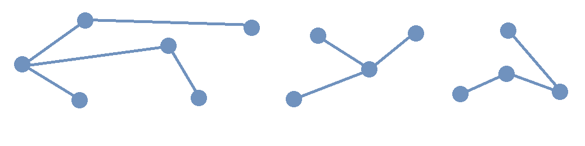 

//The image shows a forest composed of $3$ trees. Notice that for any two vertices in one of the trees, there is only one simple path that joins the vertices. This is True for every tree. 

The image shows a forest composed of three trees. 

Notice that if you choose any pair of vertices in one of the trees in the image, there is only one path that joins that pair of vertices. In fact, this property is True for _any_ tree.

.Theorem 
****
////
Suppose that $G$ is a undirected simple graph. 

$G$ is a tree if and only if for every pair of vertices of $G$ there is exactly one path between the vertices. 
////

Suppose that $G$ is a simple graph. The following statements are logically equivalent. 

* $G$ is a tree.
* $G$ is a simple graph such that for each pair of vertices of $G$ there is exactly one path between the vertices. 

[env.proof]
--
--

First, assume that $G$ is a tree; we will prove, using proof by contradiction, that for every pair of vertices of $G$ there is _exactly one_ path between the vertices. By assumption, $G$ is connected and for every pair of vertices in $G$ there is _at least one_ path joining those two vertices, so we only need to show that there cannot be two different paths that connect the same pair of vertices. To work toward a contradiction, let's suppose that for some pair of vertices $u$ and $v$ there are two different paths between $u$ and $v;$ then we can start to go from $u$ to $v$ along a first path and then “turn around and go back” to $u$ along a second path. This means that there must be a cycle in $G$ that starts and ends at $u.$ + 
[click.Why.must.there.be.a.cycle?]
--
[small]#If we can go all the way from $u$ to $v$ along the first path and then go all the way back, in reverse order, from $v$ to $u$ along the second path without repeating any edges or vertices (except $u$) then we have found a cycle that starts and ends at $u.$ + 
If the two paths have some common edges or vertices, we can use only part of each path to create a cycle that does not repeat any edges or vertices. To do this, write the first path as $v_{0}v_{1}...v_{n-1}v_{n}$ where $u = v_{0}$ and $v = v_{n}$ and let $j$ stand for the smallest positive index such that vertex $v_{j}$ appears in _both_ the first and second paths. Now create a cycle by using the beginning of the first path to go from $u$ to $v_{j}$ and then using the beginning part of the second path that goes from $u$ to $v_j$, but in reverse order, to go back from $v_{j}$ to $u.$ Notice that the index $j$ is chosen so that that no edge or vertex (except $u$ and $v_j$) that we use can belong to both of these shorter paths from $u$ to $v_{j},$ so no edges are repeated when we use this path to go from $u$ back to $u$ -  we have created a cycle.# + 
--
To continue with the proof by contradiction, we've shown that there is a cycle in $G,$ but this contradicts the assumption that $G$ is a tree that has no cycles. This means that the assumption "there is a pair of vertices in $G$ that are connected by two different paths" must be False. We have proven that for any pair of vertices in $G$ there is _exactly one_ path joining that pair of vertices.

////
 + 
[click.But.what.if.the.two.paths.from.$u$.to.$v$.use.some.of.the.same.edges?]
--
[small]#Since a cycle cannot repeat any edges, we may need to "prune" the paths instead of going all the way from $u$ to $v$ along the first path and then all the way back from $v$ to $u$ along the second path. If we write the first path as $v_{0}v_{1}...v_{n-1}v_{n}$ where $u = v_{0}$ and $v = v_{n},$ and we let $j$ stand for the least positive index such that vertex $v_{j}$ appears in _both_ the first and second paths, we can create a cycle by using the edges from the beginning of the first path to go from $u$ to $v_{j}$ and then using the edges from the beginning of the second path, but in reverse order, to go back from $v_{j}$ to $u.$ Notice that the index $j$ is chosen to ensure that no edge can belong to _both_ of these shorter paths from $u$ to $v_{j},$ so no edges are repeated in this cycle.# 
--
////

Secondly, assume that 
$G$ is a simple graph and that 
for every pair of vertices of $G$ there is exactly one path between the vertices. We will prove, using proof by contradiction, that $G$ must be a tree. By assumption, $G$ is connected because for any pair of vertices there is a path between those vertices, so we only need to prove that $G$ has no cycles. 
//; in fact, there is exactly one such path. 
//If $G$ has no cycles then it is a tree, so in order to get a contradiction we assume 
To reach a contradiction, let's suppose that $G$ does have a cycle 
of the form 
$v_{0}v_{1} \cdots v_{n-1}v_{n}$ where $v_{0} = v_{n}$ (that is, $v_{0}$ and $v_{n}$ are the same vertex, but no other vertex is repeated in the cycle.) 
Notice that, because $G$ is a simple graph, the integer $n$ must be greater than or equal to 3. + 
[click.Why.must.n.be.greater.than.or.equal.to.3?]
--
[small]#Notice that $n$ must be positive since there are at least two vertices in the path. + 
If $n=1$ then the cycle is $v_{0}v_{1}$ where $v_{0} = v_{1},$ but this cycle consists of a single loop, which contradicts that $G$ is a simple graph that has no loops. + 
If $n=2$ then the cycle is $v_{0}v_{1}v_{2}$ where $v_{0} = v_{2},$ but this cycle would use the same edge twice which contradicts the definition of a cycle. + 
This shows that $n \geq 3.$# + 
--
//, so 
//we can choose a value of $j$ so that $0 < j < n$ to create two different trails $v_{0} \cdots v_{j}$ and $v_{j} \cdots v_{n}.$  Now reverse the order of vertices in the second path to get two different paths between the vertices $v_{0}$ and $v_{j}$ 
This means that 
// MKD Jun 30 2025 changed "trail" to "path" in the following
we have two different paths, $v_{0}v_{1}$ and $v_{1} \cdots v_{n},$ between $v_0$ and $v_1$ (because $v_{0}$ and $v_{n}$ are the same vertex.) Now we can reverse the order of vertices in the second path to get two different paths between the vertices $v_{0}$ and $v_{1}$ - but we assumed that for every pair of vertices of $G$ there is exactly one path between those vertices. We have derived a contradiction, which means that $G$ cannot have a cycle. Therefore, $G$ is connected and has no cycles, which is the definition of a tree, so $G$ is a tree.

Q.E.D.

****

//(You know that $v_{n}$ is the same as $v,$ which appears in both the first and second paths, so such an integer $j$ must exist and is less than or equal to $n.$ You can now create a cycle by using the beginning of the first path from $u$ to $v_{j}$ and then using the edges from the beginning of the second path, but in reverse order, to go back from $v_{j}$ to $u$ - notice that no edge can belong to both of these shorter paths, so no edges are repeated in the cycle.)
//(You know that $v_{n}$ is the same as $v,$ which appears in both the first and second paths, so such an integer $j$ must exist and is less than or equal to $n.$ )# + 
//Now suppose that for some pair of vertices $u$ and $v$ there are (at least) two different paths between $u$ and $v,$ so we can go from $u$ to $v$ along a first path and then and go back from $v$ to $u$ along a second path. 
//Cycles.cannot.repeat.edges!
//By assumption $G$ is connected so every pair must be connected by at least one path. We conclude by combining the last two sentences that for any pair of vertices there must be exactly one path joining that pair of vertices.

//[small]#A path or circuit is *simple* if it does not contain the same edge more than once. A simple circuit is also called a *cycle.*#

//We now prove 

//Here is another characterization of trees.

// MKD Aug 17 2025 

Next, we will give another characterization of trees, after first proving a lemma.

.Lemma 
****

Suppose that $G$ is a connected simple graph with $n$ vertices and $n-1$ edges, where $n$ is some postive integer greater than or equal to $2.$ Then $G$ must have at least one vertex of degree $1.$

[env.proof]
--
--

$G$ is assumed to be a connected graph, so that every vertex is the endpoint of at least one edge. That is, the degree of every vertex is greater than or equal to $1.$ 

We now use proof by contradiction to show that there is at least one vertex that has degree equal to $1.$ To work towards a contradiction, suppose that every vertex has degree greater than $1,$ that is, the degree of every vertex is greater than or equal to $2.$ This means that the sum of the degrees of all vertices is greater than or equal to $2n.$ By the Handshake Lemma, the sum of the degrees of the vertices must be equal to $2$ times the number of edges, which in this case is $2(n-1).$ We have obtained a contradiction, since the Handshake Lemma proves that the sum of the degrees of the vertices must be equal to $2(n-1)$, but the sum of the degrees of the vertices must also be greater than or equal to $2n.$ 
//which is strictly greater than $2(n-1).$ 
From this contradiction we can conclude that it is False that the degree of every vertex is greater than or equal to $2,$ so there must be at least one vertex with degree less that $2.$ Recalling that 
//the graph is connected means that such a vertex must have degree exactly equal to $1.$ 
the degree of every vertex is greater than or equal to $1$ proves that at least one vertex has degree $1.$ 

****

.Theorem 
****
//For every positive integer $n,$ if a tree has $n$ vertices then the tree has $n-1$ edges.

Suppose that $G$ is a connected simple graph with finitely many vertices. 
The following statements are logically equivalent. 

* $G$ is a tree.
* If $G$ has $n$ vertices, where $n$ is a positive integer, then $G$ has $n-1$ edges. 

[env.proof]
--
--

First, assume $G$ is a tree with $n$ vertices. We will use mathematical induction on $n$ to prove that the number of edges must be $n-1.$   

Let $P(n)$ be the predicate \[P(n): \text{If a tree has } n \text{ vertices  then the tree has } n-1 \text{ edges.}\] We will prove that the proposition $(\forall n \in \mathbb{N}_{>0})P(n)$ is True.

*Basis Step:* $P(1)$ is True since a tree that has $1$ vertex has $0$ edges (otherwise, the edge would have to be a loop, but trees are simple graphs that don't have loops.) + 
We can also prove that $P(2)$ is True in case the proof of $P(1)$ feels unsatisfying. 
//If a tree has $2$ vertices, then there is $1$ edge between those two vertices; since a tree is a simple graph, it cannot have either loops or parallel edges, so a tree with $2$ vertices must have exactly $1$ edge. This proves that $P(2)$ is True. 
If a tree has $2$ vertices, then since a tree is a connected simple graph, the $2$ vertices must be connected by a path, and since a tree cannot have parallel edges, the vertices are the endpoints of exactly $1$ edge. This proves that $P(2)$ is True. 

*Induction Step:* First, we assume that the induction hypothesis $P(k)$ is True for some positive natural number $k$.

Secondly, we will prove that the conditional $P(k) \rightarrow P(k+1)$ must be True, which means we can use _modus ponens_ (or the equivalent tautology $( P(k) \land ( P(k) \rightarrow P(k+1) ) ) \rightarrow P(k+1)$) to show that $P(k+1)$ is also True. 

Assume that $P(k)$ is True for the positive integer $k,$ that is, if a tree has $k$ vertices then the tree has $k-1$ edges. 
We can assume $k \geq 2$ since the cases when $k \in \{ 1, 2 \}$ were proved in the Basis Step. Suppose that we have a tree $T$ that has $k+1$ vertices; we will prove that the tree must have $k$ edges. 
//Let $v$ be a vertex of $T$ such that the degree of $v$ is $1$ - such a vertex must exist because the tree $T$ has no cycles. 
// MKD Aug 17 2025 - may need another lemma for 
// "If G is connected simple graph and every vertex has degree \geq 2 then G has a cycle."
First, there must be at least one vertex $v$ in $T$ such that the degree of $v$ is 1: If every vertex had at least degree $2,$ then we could find a cycle in $T,$ which cannot be True since $T$ is a tree. 
Remove one vertex $v$ that has degree $1$ along with the edge that has $v$ as an endpoint to obtain the subgraph $T-v.$ 
// MKD Jun 30 2025 changed "trail" to "path" in the following 
Notice that for every pair of vertices of $T-v$ there is exactly one path between the vertices, and applying the previous theorem shows that $T-v$ is a tree. Also, $T-v$ has $k$ vertices because we removed only $v,$ so we can apply the Induction Hypothesis to conclude that $T-v$ has $k-1$ edges. Now, reinsert vertex $v$ and the edge that was removed to obtain the tree $T$ that has $k+1$ vertices and $k$ edges. Therefore, if $P(k)$ is True then $P(k+1)$ is True, too. That is, $P(k) \rightarrow P(k+1)$.

*Conclusion Step:* We have proven both the Basis Step and the Induction Step. Therefore, we can 
// MKD Nov 29 2025 removed reference to universal generalization
//use _universal generalization_ to 
conclude that 
for all positive integers $n,$ if a tree has $n$ vertices then the tree has $n-1$ edges.

// MKD Aug 17 2025 

Secondly, assume that $G$ is a connected simple graph that has 
//$n$ vertices and $n-1$ edges, where $n$ is a positive integer. 
a finite number of vertices such that the number of edges is one less than the number of vertices. 
We will use mathematical induction on the number of vertices to prove that $G$ is a tree. 

Let $P(n)$ be the predicate \[P(n): \text{If } G \text{ is a connected simple graph that has } n \text{ vertices and } n-1 \text{ edges then } G \text{ is a tree.}\] We will prove that the proposition $(\forall n \in \mathbb{N}_{>0})P(n)$ is True.

*Basis Step:* $P(1)$ is True since a connected simple graph that has $1$ vertex and $0$ edges is a tree. + 
We can also prove that $P(2)$ is True in case the proof of $P(1)$ feels unsatisfying. 
//If a tree has $2$ vertices, then there is $1$ edge between those two vertices; since a tree is a simple graph, it cannot have either loops or parallel edges, so a tree with $2$ vertices must have exactly $1$ edge. This proves that $P(2)$ is True. 
If G is a connected simple graph that has $2$ vertices and $1$ edge, then the edge cannot be a loop so must have $2$ different endpoints. Since there are only $2$ vertices in $G$, the edge must have those vertices as its endpoints, so $G$ consists of a single edge with distinct endpoints. Since there is exactly one path from one of the vertices to the other, the previous theorem can be applied to show that $G$ is a tree. This proves that $P(2)$ is True. 

*Induction Step:* First, we assume that the induction hypothesis $P(k)$ is True for some positive natural number $k$.

Secondly, we will prove that the conditional $P(k) \rightarrow P(k+1)$ must be True, which means we can use _modus ponens_ (or the equivalent tautology $( P(k) \land ( P(k) \rightarrow P(k+1) ) ) \rightarrow P(k+1)$) to show that $P(k+1)$ is also True. 

Assume that $P(k)$ is True for the positive integer $k,$ that is, if a connected simple graph has $k$ vertices and $k-1$ edges then the graph is a tree. 
We can assume $k \geq 2$ since the cases when $k \in \{ 1, 2 \}$ were proved in the Basis Step. Suppose that we have a connected simple graph $G$ that has $k+1$ vertices and $(k+1)-1$ edges; we will prove that $G$ is a tree. 
// must have $k$ edges. 
From the lemma proved earlier, we know that at least one of the vertices in $G$ must have degree exactly equal to $1;$ let $v$ be such a vertex. Now consider the graph $G-v$ obtained by removing $v$ and the one edge $e_v$ that has $v$ as an endpoint: It is a connected simple graph with $k$ vertices and $k-1$ edges, so the Induction Hypothesis lets us conclude that $G-v$ is a tree. In particular, there is exactly one path between any two vertices in $G-v.$ Now reattach $v$ and the edge $e_v$ that has $v$ as an endpoint. Notice that there is exactly one path between any two vertices in $G:$ Either the two vertices are in $G-v$ (so there is exactly one path) or one vertex, $w,$ is in $G-v$ and the other vertex is $v,$ but in this second case there is exactly one path which goes from $v$ to the other endpoint of the edge $e_v$ and then continues as a path in $G-v$ from that other endpoint to the vertex $w.$  Since there is only one path between $w$ and the other endpoint of $e_v$ in $G-v,$ this path between $w$ and $v$ is the only one possible path in $G.$ In summary, we have shown that there is exactly one path between any two vertices in $G,$ and the previous theorem applies to prove that $G$ is a tree. 

Q.E.D. 

****

== Spanning Trees and Spanning Forests

Recall that a subgraph of a graph $G$ is a graph $H$ such that every vertex of $H$ is a vertex of $G$ and every edge of $H$ is a edge of $G$ (with both endpoints in the vertex set of $H.$) 

A *subtree* of a graph $G$ is a subgraph of $G$ that is also a tree. 
Likewise, a *subforest* of $G$ is a subgraph of $G$ that is also a forest.

//A *spanning tree* of a graph $G$ is a subgraph of $G$ that is a tree such that the vertex sets of $T$ and $G$ are the same. That is, a spanning tree is a connected subgraph of $G$ that includes all the vertices of $G.$ 
//Likewise, a *spanning forest* of a graph $G$ is a subgraph of $G$ that is a tree such that the vertex sets of $T$ and $G$ are the same

A *spanning tree* of a graph $G$ is a subgraph of $G$ that is a tree that includes all the vertices of $G.$ 
Likewise, a *spanning forest* of a graph $G$ is a subgraph of $G$ that is a forest that includes all the vertices of $G.$ 

//image::imagesMKD/three_spanning_trees.png[three_spanning_trees,877,707,align="center"] 
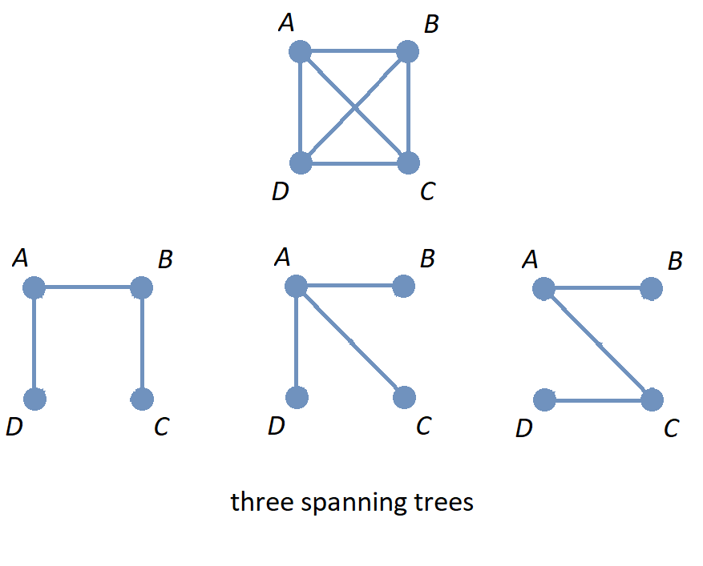 

The image shows the graph $K_{4}$ along with three spanning trees.

//image::imagesMKD/not_spanning_trees.png[not_spanning_trees,650,761,align="center"] 
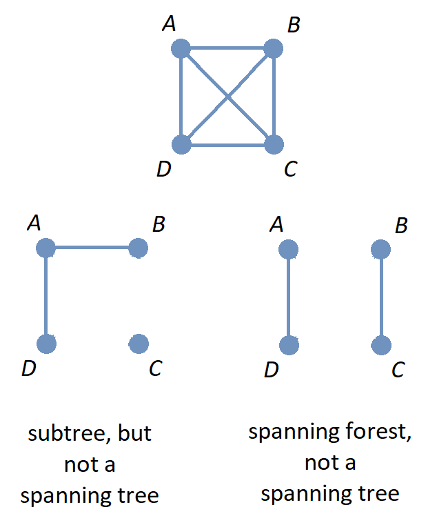 

// MKD July 16 2025 - create real-world scenario of four airports: iland hooper from DABC and back, hub at A and all flights not to final desitnatin A must transfer, and a different island hopper

The image shows the graph $K_{4}$ along with a subgraph that is a subtree that is not a spanning tree, and also a subgraph that is a spanning forest.

// MKD July 16 2025 - tie back to four airport scenario: island hopper never visits C, and no connects between AandB and CandD (two separate countries that are not friendly?)

Spanning trees are used to solve problems that involve simplifying or optimizing networks. You can learn more about some of the applications of spanning trees at this  link:https://en.wikipedia.org/wiki/Spanning_tree#Applications[Wikipedia page.] 

The following subsection presents one such application.

//=== Kruskal’s Algorithm
//=== Finding A Minimal Cost Spanning Tree in a Weighted Graph: Kruskal's Algorithm 
//=== Finding A Minimal-Weight Spanning Tree in a Weighted Graph: Kruskal's Algorithm 
=== Minimal-Weight Spanning Trees in Weighted Graphs

In some applications of graphs with weighted edges, you may need to find a spanning tree that has the minimal total weight possible, that is, a spanning tree with sum of edge weights less than or equal to the corresponding sum for any other spanning tree. 
//The weights may represent the distance between two nodes in a network, but could represent some other quantity such as cost. 
//This textbook will refer to such a spanning tree as a *minimal-weight spanning tree.* + 
Such a spanning tree is referred to as a *minimal-weight spanning tree.* + 
//[small]#Other sources use terms such as *minimum length spanning tree* and *minimum spanning tree* (MST) instead.#
//[small]#Note: Historically, many of these applications involved physical distances between the nodes of a network, so many textbooks and sources use the term *minimum length spanning tree.* Other sources use the term *minimum spanning tree* (MST.)#
[small]#Note: Many textbooks and sources use the term *minimum length spanning tree* because the use of these spanning trees historically arose in problems that involved physical distances between nodes of a network. Other sources use the term *minimum spanning tree,* abbreviated as *MST.*#

As an example, the image shows a weighted graph along with all three possible spanning trees. The minimal-weight spanning tree, with total weight 6, is drawn on the lower left. 

//image::imagesMKD/graph5_MKDrevMST01.png[graph5_MKDrevMST01,1515,707,float="right",align="center"]
//image::imagesMKD/graph5_MKDrevMST01.png[graph5_MKDrevMST01,379,177,align="center"]
//image::imagesMKD/graph5_MKDrevMST01.png[graph5_MKDrevMST01,505,236,align="center"]
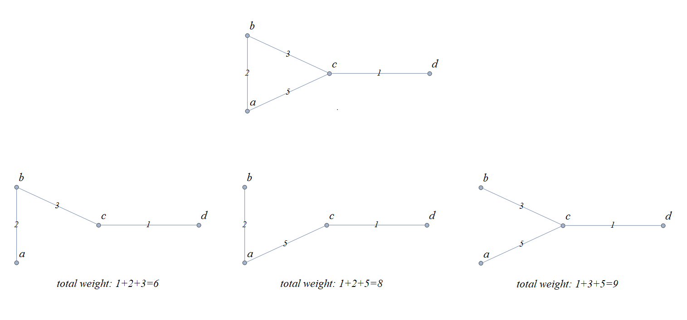

Notice that for the graph in the image, it was both easy and efficient to use “brute force” to look at _all_ of the spanning trees and compute _all_ of the sums of weights for those spanning trees. 
//However, there are several algorithms that can be used in cases where the 
For weighted graphs that have many more vertices and/or edges, you will need to use a more efficient problem-solving strategy. This textbook discusses one such strategy, Kruskal's algorithm, in detail.
//, but there are other algorithms as well. 

==== Kruskal's Algorithm 

//Joseph Kruskal published a link:https://www.jstor.org/stable/2033241[paper] in 1956 that describes an algorithm for constructing “the shortest spanning subtree” of a connected simple graph, assuming that the each edge has a positive weight that represents the distance between its endpoints. 
//However, since the weights can represent a quantity other than distance, e.g., cost, this textbook will refer to the tree that is constructed as a *minimal-weight spanning tree,* that is, a spanning tree with sum of edge weights less than or equal to the corresponding sum for any other spanning tree. + 
//[small]#Some sources use the term *minimum spanning tree* (MST) instead.#

Joseph Kruskal published a link:https://www.jstor.org/stable/2033241[paper] in 1956 that describes an algorithm for constructing “the shortest spanning subtree” of a connected simple graph (Kruskal assumed that the graph has only finitely-many edges, and that each edge has a positive weight which represents the distance between its endpoints.)

** Task: Given a connected graph $G = (V,E)$ with weighted edges, construct a spanning tree of $G$ that has the minimal possible sum of weights.
** Input: The list $E$ of all weighted edges of the graph. 
** Steps:  
. Sort the list of edges $E$ so that each edge $e_{k}$ in the list has a weight that is less than or equal to the next edge $e_{k+1}$ in the list. 
. Define the list $E_{chosen}$ and initialize it as an empty list. 
. Set integer index variable $i$ to 0.
. While $i$ is less than $|E|,$ the number of edges
.. If it is impossible to form a cycle using edge $e_{i}$ along with some (or all) of the edges in list $E_{chosen}$
... Append $e_{i}$ to $E_{chosen}$
.. Increment $i$ by 1  
** Output: The list $E_{chosen}$ of weighted edges.

Notice that the output list $E_{chosen}$ was constructed so that its edges cannot be used to form a cycle in the graph $G.$ Also, since the graph $G$ is assumed to be connected, every vertex will be the endpoint of at least one edge in $E_{chosen},$ so that the graph with vertex set $V$ and edge set $E_{chosen}$ will be a spanning tree of $G.$ 

Also notice that 
//, assuming that there are only finitely-many vertices, 
the condition for the while loop can be changed to “while $|E_{chosen}| < |V| - 1$” since a spanning tree must have one fewer edges than vertices.

****
.Example {counter:treeex} - An example of using Kruskal's algorithm

The image shows a drawing of a simple weighted graph along with all three possible spanning trees. 

//image::imagesMKD/graph5_MKDrevMST01.png[graph5_MKDrevMST01,1515,707,float="right",align="center"]
//image::imagesMKD/graph5_MKDrevMST01.png[graph5_MKDrevMST01,379,177,align="center"]
//image::imagesMKD/graph5_MKDrevMST01.png[graph5_MKDrevMST01,505,236,align="center"]

//You can see that the spanning tree with the minimal sum of weights, 6, is drawn on the left.
The minimal-weight spanning tree, with total weight 6, is drawn on the lower left.

Let's trace through the steps of Kruskal's algorithm to examine how this minimal-weight spanning tree is constructed. The following table represents the input to the algorithm: A list of all the edges of the graph, along with their corresponding weights.

[cols="<1e,>1e",width=30%",align="center",options="header"]
|===
^| *Edge*     ^| *Weight* 
^| {c, d} ^| 1 
^| {a, b} ^| 2 
^| {b, c} ^| 3 
^| {a, c} ^| 5
|===
** Steps:  
. Sort the list of edges of the graph in order of increasing weight (This has already been done in the table shown.)  
. Set $E_{chosen}$ to the empty list. 
. Set the index $i$ to 0.
. Enter the while loop.
$i=0$:: $i$ is less than 4, and it is impossible to form a cycle using $\{c, d\}$ alone, + 
so set $E_{chosen}$ to $[\{c, d\}]$ and set $i$ to 1. 
$i=1$:: $i$ is less than 4, and it is impossible to form a cycle using $\{a, b\}$ along with the edge in $E_{chosen} = [\{c, d\}]$ + 
so set $E_{chosen}$ to $[\{c, d\} , \{a, b\}]$ and set $i$ to 2. 
$i=2$:: $i$ is less than 4, and it is impossible to form a cycle using $\{b, c\}$ along with the edges in $E_{chosen} = [\{c, d\} , \{a, b\}]$ + 
so set $E_{chosen}$ to $[\{c, d\} , \{a, b\}, \{b, c\}]$ and set $i$ to 3. 
$i=3$:: $i$ is less than 4, but it _is possible_ to form a cycle using $\{a, c\}$ along with the edges in $E_{chosen} = [\{c, d\} , \{a, b\}, \{b, c\}]$  + 
so make no change to $E_{chosen}$ and set $i$ to 4. 
$i=4$:: Since $i$ is not less than 4, exit the while loop. 

//Notice that the output is the list $E_{chosen} = [\{c, d\} , \{a, b\}, \{b, c\}]$ which is the list of edges used in the spanning tree drawn on the lower left of the image: The minimal-weight spanning tree. 
The output is $E_{chosen} = [\{c, d\} , \{a, b\}, \{b, c\}]$ which is the list of edges used in the spanning tree drawn on the lower left of the image. That is, in at least this one case, the algorithm does construct a minimal-weight spanning tree. 

[env.question]
--
How could you validate Kruskal's algorithm? + 
That is, how could you prove that Kruskal's algorithm must construct a minimal-weight spanning tree for any input graph that is connected and has finitely-many weighted edges?
--

[click.hint]
--
Try to create a predicate that you could prove True for all natural numbers by using mathematical induction. 
--

****

Here is an exercise for you to try.

// MKD JULY 9 2025
//https://en.wikipedia.org/wiki/List_of_the_busiest_airports_in_the_United_States#Busiest_U.S._airports_by_total_cargo_throughput
// ANC MEM SDF MIA CVG LAX ORD ONT JFK IND

****
//.Example {counter:treeex} - Ten Airports
//.You Try
.Check Your Understanding

Use Kruskal's algorithm to find the minimal-weight spanning tree for the following graph. 

//image::imagesMKD/K10-US-airports.png[K10-US-airports,901,827,float="right",align="center"]
//image::imagesMKD/K10-US-airports.png[K10-US-airports,300,276,float="right",align="center"]
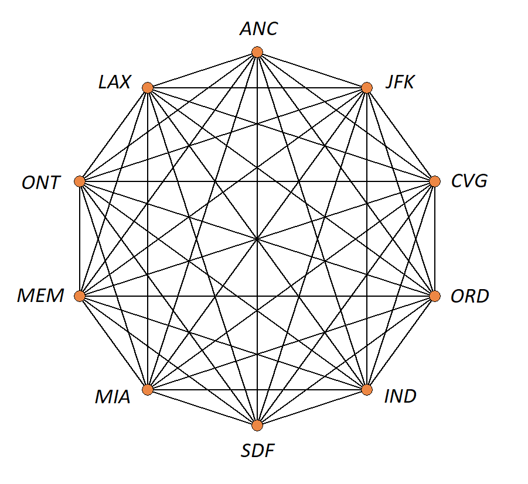
//This drawing of the complete graph $K_{10}$ has vertices labeled with the International Air Transport Association codes of ten of the busiest airports, by total cargo throughput, in the United States of America. 
//The vertices of the complete graph $K_{10}$ have been labeled with the International Air Transport Association codes of ten of the busiest airports, by total cargo throughput, in the United States of America. 
The image shows a graph with vertices representing ten of the busiest airports, by total cargo throughput, in the United States of America. Each vertex is labeled with the International Air Transport Association code for one of the airports, and 
each edge represents the route between the two airports at the endpoints. 
 + 
[small]#Image credit: Remixer-created derivative of original work  link:https://commons.wikimedia.org/wiki/File:9-simplex_graph.png["9-simplex graph.png"]. The original work has been released into the public domain by its author, Tomruen at English Wikipedia. This applies worldwide.#

//The weight of each edge, which is the distance in kilometers between the endpoints, are listed in the table. 
//The table of edges and their weights is given below. 
//Each edge represents the route between the two airports that label the endpoints. The table lists each edge with its corresponding weight, which is the distance between the two airports, in kilometers.

//Each vertex represents one of the airports, and 
//each edge represents the route between the two airports at the endpoints. 
//The weight of each edge is the distance, in kilometers, between the two airports. 
This table lists each edge with its corresponding weight.

++++
<iframe src="./imagesMKD/10_busiest_US_airports_by_total_cargo_throughput_2024.txt"></iframe>
++++ 
//[small]#You can download the table as a link:./imagesMKD/10_busiest_US_airports_by_total_cargo_throughput_2024.txt[tab-delimited text file] so you can sort the list in a spreadsheet.#
[small]#You can download the table as a link:./imagesMKD/10_busiest_US_airports_by_total_cargo_throughput_2024.txt[tab-delimited text file] to import the data into a spreadsheet app to sort the list.#

//https://ethercalc.net/n50a2eholw

You also can view the graph 
//This 
//$K_{10}$ 
//graph can be viewed 
//in a more geographically-appropriate form 
as a map of the routes between the airports 
at Markus Englund's  link:https://www.greatcirclemap.com/?color=%23E2B124&label=iata&routes=ANC-CVG%0AANC-IND%0AANC-JFK%0AANC-LAX%0AANC-MEM%0AANC-MIA%0AANC-ONT%0AANC-ORD%0AANC-SDF%0A%0ACVG-IND%0ACVG-JFK%0ACVG-LAX%0ACVG-MEM%0ACVG-MIA%0ACVG-ONT%0ACVG-ORD%0ACVG-SDF%0A%0AIND-JFK%0AIND-LAX%0AIND-MEM%0AIND-MIA%0AIND-ONT%0AIND-ORD%0AIND-SDF%0A%0AJFK-LAX%0AJFK-MEM%0AJFK-MIA%0AJFK-ONT%0AJFK-ORD%0AJFK-SDF%0A%0ALAX-MEM%0ALAX-MIA%0ALAX-ONT%0ALAX-ORD%0ALAX-SDF%0A%0AMEM-MIA%0AMEM-ONT%0AMEM-ORD%0AMEM-SDF%0A%0AMIA-ONT%0AMIA-ORD%0AMIA-SDF%0A%0AONT-ORD%0AONT-SDF%0A%0AORD-SDF%0A[Great Circle Map] website.

//Use Kruskal's algorithm to find the minimal-weight spanning tree for this graph. 

//Try to work this out for yourself, before revealing the answer. 
//You can click to see the answer below. 
//,.
Try to work this out on your own, then confirm that you correctly found the minimal-weight spanning tree by clicking to see the answer below.

[click.Answer]
--

The image shows the edges of the minimal-weight spanning tree in orange.

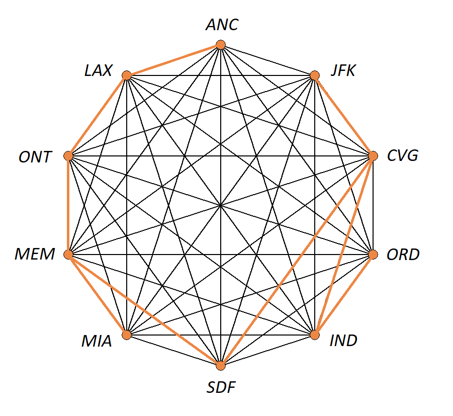 + 
[small]#Image credit: Remixer-created derivative of original work  link:https://commons.wikimedia.org/wiki/File:9-simplex_graph.png["9-simplex graph.png"]. The original work has been released into the public domain by its author, Tomruen at English Wikipedia. This applies worldwide.# + 
 + 
The table lists the edges of the minimal-weight spanning tree. 
++++
<iframe src="./imagesMKD/10_busiest_US_airports_by_total_cargo_throughput_2024_spanning_tree.txt"></iframe>
++++ 
 + 
A map view of the minimal-weight spanning tree can be seen at the link:https://www.greatcirclemap.com/?color=%23ED8744&label=iata&routes=LAX-ONT%0ACVG-SDF%0ACVG-IND%0AIND-ORD%0AMEM-SDF%0ACVG-JFK%0AMEM-MIA%0AMEM-ONT%0AANC-LAX%0A[Great Circle Map] website. 
--

****

//Another view of 
//A map view of 
//the minimal-weight spanning tree can be 
//displayed at the  
//seen at the 

==== Other Algorithms for Minimal-Weight Spanning Trees 

//It is important to note that 
//There are many 
//Two 
Among the 
other algorithms that can be used to find a minimal-weight spanning tree 
//, such as 
are 
link:https://en.wikipedia.org/wiki/Bor%C5%AFvka%27s_algorithm[Borůvka's algorithm] and link:https://en.wikipedia.org/wiki/Prim%27s_algorithm[Prim's algorithm] (also known as the DJP algorithm.) You can learn more about these and other algorithms and their history starting with this section of the  link:https://en.wikipedia.org/wiki/Minimum_spanning_tree#Classic_algorithms[Wikipedia page] about MSTs, as well as the section  link:https://www.appliedcombinatorics.org/book/s_graphalgorithms_historical-notes.html[Historical Notes] from _Applied Combinatorics_ by Keller and Trotter. 

In 2002, Pettie and Ramachandran published a link:https://dl.acm.org/doi/10.1145/505241.505243[paper] for an optimal minimum spanning tree algorithm. 
//The paper is also available at link:https://www.cs.utexas.edu/~vlr/papers/jacm02.pdf[Dr. Ramachandran's web page.] 

// MKD Aug 12 2025 
//== Rooted Trees #SECTION UNDER CONSTRUCTION!# 
== Directed Trees 

Recall that a tree is defined to be a connected simple graph that contains no cycles. 
// MKD Aug 14 2025 
//This implies that the edges of the tree are undirected. 
The edges of a tree are undirected. 

However, there are applications where it is useful to think of a tree as having directed edges. For that purpose, a *directed tree* is defined to be a directed graph whose link:./graph_theory.html#underlying_graph[underlying graph] is a tree. 

=== Rooted Trees 

// MKD Aug 11 2025 note the following:
//	Rosen's 7th edition defines rooted trees to use directed edges, with edges always pointing from parent to child. Rosen then defines *ordered rooted tree* as a rooted tree where the children of each internal node are ordered. 
//	Haggard, Schlipf, and Whitesides treat a rooted tree as a tree with one distinguished node called the root, and use the uniqueness of paths fro the root to other vertices to induce directions on the edges, but drawings show the edges as undirected (but with the root above its children - so the definiton seems to be independent of how the tree is drawn)
// 	Bender and Williamson's _Lists, Decisions, and Graphs_ define a rooted graph as an undirected graph with one vertex specified as the root, implying that a rooted tree is an acylic connected undirected graph with one vertex specified as root. They then define *rooted plane tree* (or *RP-tree* or *ordered tree* or *decision tree*) to be a rooted tree where for each vertex, the children of the vertex have been ordered. They also note taht rooted plane trees are usually just called "trees" by computer scientists.

//Recall the following recursive definition that appears in the link:./recursion.html#rooted_trees[Recursion] chapter.

//“”
// MKD Aug 13 2025 
//In some applications of trees, it is 
In some applications of directed trees, you can view the directed tree as if all paths “flow away” from a single vertex. 
For these applications, the concept of a *rooted tree* is useful.

// MKD Aug 11 2025 revised to eliminate implicit ordering
// MKD Aug 14 2025 
//The set of *rooted trees* can be defined recursively as follows. 
The set of *rooted trees* can be defined recursively as follows. 
[horizontal]
Basis Step:: A single vertex _r_ is a rooted tree.
The vertex _r_ is called the *root node* of this rooted tree. 
Recursion:: Suppose that you have a nonempty finite set of already-constructed rooted trees 
// MKD Aug 14 2025 
//(which will be called the “old” rooted trees below)  
(which will be called “old rooted trees” below)  
such that the following propositions are True: +
	(1) No vertex appears in more than one of the old rooted trees. + 
	(2) No edge has its two endpoints in two different old rooted trees. + 
You can construct a new rooted tree by first creating a new root node _r_ that is not a vertex of any of the old rooted trees, and then, for each of the old root nodes, creating a new directed edge from _r_ to that old root node. 
// MKD Aug 15 2025 
//(that is, the new directed edge has initial vertex _r_ and terminal vertex the root node of the old rooted tree.)
That is, each new directed edge has initial vertex _r_ and terminal vertex the root node of one of the old rooted trees. 

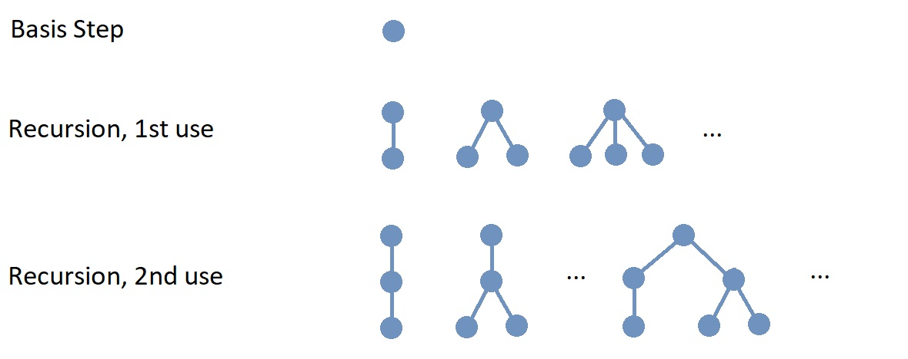 
The image shows the basis step and represents, in part, the results of the first and second 
uses of the recursion step. 
// MKD Aug 14 2025 
//Rooted trees are usually drawn so that the root node appears at the top of the tree. Notice also that the arrows are omitted for the directed edges in the drawing. 
// MKD Aug 15 2025 
//At each step, the new root node is drawn at the top of the rooted tree.
In the image, the new root node created at each step is drawn at the top of the rooted tree.

// MKD Aug 14 2025 
//NOTE: Computer scientists usually omit the arrows on the directed edges in drawings of rooted trees. The direction can be inferred if the root node is drawn at the top 
//(and all children are drawn at the same horizontal line. 
//(and the same is done for each subtree).

// MKD Aug 15 2025 
////
IMPORTANT: #Notice that the directed edges of rooted trees are drawn without arrows!# Computer scientists usually draw rooted trees with the root node at the top, with all 
//children 
root nodes of the previously-constructed rooted trees 
used in the Recursion step drawn 
at the same horizontal level beneath the root node. 
The recursive definition ensures that the direction of each directed edge is “down,” so the arrows are not included in the drawing. 
////
IMPORTANT: #Notice that the directed edges of rooted trees are drawn without arrows!# Computer scientists usually follow this convention: A rooted tree is drawn with the root node at the top, with all the old root nodes of the previously-constructed rooted trees attached in the Recursion step drawn 
at the same horizontal level beneath the root node. This convention, along with the recursive definition, ensures that the direction of each directed edge is “down,” so an arrow is not needed to determine the direction of edge.

// MKD Aug 11 2025 revised wording 
//Notice that any one particular rooted tree you want to construct requires only finitely many uses of the recursion step. 
//However, infinitely-many rooted trees are constructed at each use of the recursion step. 
//Also, infinitely-many uses of the recursion step are needed to construct _all possible_ rooted trees. 
Notice that if you want to construct just one particular rooted tree, you only need to use the Recursion step finitely-many times. 
// MKD Aug 15 2025 revised wording 
//However, at each use of the Recursion step, an infinite number of rooted trees are constructed. 
However, at each use of the Recursion step, there is an infinite number of possible rooted trees that can be constructed. 
Also, to construct _all possible_ rooted trees would require infinitely-many uses of the Recursion step.

// DEFINE parent, child, etc. here 
//In the recursion step, 
//Here are some terms that are used in the context of rooted trees.  
// MKD Aug 15 2025 
//Much, but not all, of the terminology used with rooted trees is borrowed from “family trees.”
Some of the terminology used with rooted trees is borrowed from “family trees,” and other terminology is borrowed from 
//botany (the study of plants.)
plant science. 

// MKD Aug 11 2025 revised wording 
////
* The new root node $r$ added in the recursion step is called the *parent* of the old root nodes $r_{1}, \, \ldots \, r_{n},$ 
and 
//* 
each of the old root nodes $r_{1}, \, \ldots \, r_{n}$ is a *child* of $r.$ The nodes $r_{1}, \, \ldots \, r_{n}$ collectively are called the *children* of $r.$ 
////
* The new root node $r$ added in the Recursion step is called the *parent* of each of the old root nodes, 
and each of the old root nodes is called a *child* of $r.$ The old root nodes collectively are called the *children* of $r.$ 
//* Two or more vertices with the same parent are called *siblings.* 
* Two or more nodes with the same parent are called *siblings.* 
// MKD Aug 15 2025 swapped order of leaf and internal node, added external node
* A node that has one or more children is called an *internal node.* 
* A node that has no children is called a *leaf.* A leaf can also be called an *external node.* 
* The *depth* of node $v$ in a rooted tree is the length of the shortest path from the root node $r$ to the node $v.$ This is also called the *level* of the node $v.$ + 
//[small]#We will prove later in this chapter that there is exactly one path between the root node $r$ and $v.$#
//[small]#We will prove later in this section that there is exactly one path between the root node $r$ and $v,$ os that rooted trees really are a type of tree as defined earlier in the chapter.#
// MKD Aug 15 2025 commented out small text 
//[small]#We will prove later in this section that a rooted tree is also a tree as defined earlier in this chapter, so there is exactly one path between the root node $r$ and $v.$#
//* For each positive integer $k$ that is less than or equal to the height of the rooted tree, *level $k$* is the set of all nodes that are at depth $k.$ 
* A *level* of a rooted tree is the set of all nodes at the same depth. For example, level 1 is the set of all the child nodes of the root node. Level 0 is the set containing only the root node. 
* The *height* of a rooted tree is the maximum of the depths of all the nodes in the rooted tree. 
 
//Rooted trees are usually drawn with the root node at the top of the tree, and the edges can be viewed as “pointing away” from the root node, down into the subtree. + 
// MKD Aug 15 2025 omitted
//As mentioned earlier, rooted trees are usually drawn with the root node at the top of the tree, so each edge can be viewed as “pointing away” from the root node, from a parent node down into a child node's subtree. 
////
//+ 
[small]#Note: In fact, some sources define rooted trees to be _directed graphs_ by using directed edges in the recursion step, replacing the phrase “with one new edge between _r_ and each of the old root nodes” by the phrase “with one directed edge from _r_ to each of the old root nodes” so that each of the new edges is a directed edge with the new root node $r$ as its initial vertex and one of the old root nodes as its terminal vertex. However, even if the rooted tree is defined using directed edges, the rooted tree is often drawn as if the edges are undirected, since drawing the root at the top of tree makes it clear which way the edges should be directed.  
//; this means that the directed edges of a rooted tree will always “point away” from its root node.  
//In this textbook, the rooted tree is defined to be the corresponding link:./graph_theory.html#underlying_graph[underlying graph] of the directed rooted tree. 
Each rooted tree as defined in this textbook corresponds to link:./graph_theory.html#underlying_graph[the underlying graph] of one of these directed-edged rooted tree.# 
////

//so that the new root node $r$ is the initial vertex of each of the new directed edge, with each of the old root nodes $r_{i}$ being a terminal vertex; this means that the directed edges of a rooted tree will always “point away” from its root node.

//In most applications, you can use the underlying undirected tree instead of the roooted tree with directed edges.  
//. no vertex is in more than one of $T_{1}, \, \ldots \, T_{n}$ and  
//. no edge has endpoints in two of $T_{1}, \, \ldots \, T_{n}$ 
//=== Rooted Trees As Directed Graphs 

//=== Rooted Trees Are The Same As Trees
//Although rooted trees are defined differently than trees, these two classes of graphs are identical (as long as we assume that a graph has only finitely many vertices.)

// MKD Aug 14 2025 
//The next lemma shows that the set of rooted trees is essentially the same as the set of trees that have a finite number of vertices.
The next lemma shows that you can construct any rooted tree without using recursion by instead starting with a tree then replacing all the undirected edges by appropriately directed edges. 

****
.Lemma 

//Let $G$ be a graph that has finitely many vertices and edges. 

//. If $G$ is a rooted tree, then $G$ is a tree that has finitely many vertices.
. If $T$ is a rooted tree, then its underlying graph $G$ is a tree that has finitely many vertices.
//. If $G$ is a tree that has finitely many vertices, then $G$ can be constructed as a rooted tree.
. If $G$ is a tree that has finitely many vertices, then $G$ is the underlying graph of a rooted tree $T.$

[click.proof.outline]
--
First, suppose that $T$ is a rooted tree. 
Use strong induction on the number of recursion steps needed to construct the rooted tree to prove that the underlying graph $G$ must be a simple graph such that for each pair of vertices, there is exactly one path between the vertices. 
In more detail, for a rooted tree that was constructed using the recursion step only one time, there is only one path between two vertices of the underlying graph: All paths must pass through the root node. For the induction step, any path in the underlying graph of a rooted tree constructed using the recursion step $k+1$ times will either pass through the new root node or one of the subtree's root nodes (and the induction hypothesis applies to each underlying graph of the subtrees since they were constructed using fewer than $k+1$ applications of the recursion step.) 
Now use the theorem from the first section of the chapter to conclude that $G$ must be a tree, that is, $G$ must be a connected simple graph with no cycles. 
That $G$ must have finitely many vertices follows from the recursive definition of “rooted tree” since at most finitely many vertices are introduced each time the recursion step is used. + 
 + 
Secondly, suppose that $G$ is a tree 
that has finitely many vertices. 
Use strong induction on the number of vertices to prove that a rooted tree $T$ can be constructed so that $G$ is the underlying graph of $T.$ 
In more detail, choose any vertex $r$ of $G,$ which will become the root node of our rooted tree, then remove $r$ and any edges incident to $r$ to create a forest of subtrees $G_{1}, \, \ldots \, G_{n}$ where $n$ is the number of trees in the forest. 
Since each of the subtrees is either a single vertex (which is the basis case for the recursive definition of rooted trees) or a tree that contains fewer vertices than $G,$ we can apply the induction hypothesis to each of the subtrees to show that each subtree $G_{i}$ is the underlying graph of a rooted tree $T_{i}.$ Now apply the recursion step in the definition of rooted trees to reconnect the root nodes of the rooted trees $T_{1}, \, \ldots \, T_{n}$ to $r,$ replacing the undirected edges that had been removed by directed edges from $r$ to each of the root nodes of rooted trees $T_{1}, \, \ldots \, T_{n}.$ This shows that $G$ is the underlying graph of a rooted tree. 
// MKD Aug 15 2025 
//It is important to note that, if the direction of the edges matters, you will get a different rooted tree if you choose a different root node (that is, the implied directions of edges will be different even though the underlying undirected graphs will be isomorphic copies of the undirected tree $G.$)
It is important to note that you will get a different rooted tree if you choose a different root node $r$ since the directed edges will “flow away” from the root node (That is, the directions of the edges will be different for different choices of root node, but the underlying undirected graph will be the same.)
--

****

// MKD Aug 15 2025 
In summary, the lemma tells you that every rooted tree can be thought of as an adaptation of a tree, where you first select a vertex to be the root node and then replace all the edges of the tree by directed edges that “flow away” from the root node.

//Suppose that $G$ is a rooted tree. To show that $G$ is a tree, 
//To show that every rooted tree is a tree, 
// To show that $G$ is a rooted tree 
//(or the underlying graph of a directed rooted tree), 
// Repeat this process for each of the subtrees until you have reached subtrees that consist of single vertices (This must occur since we remove at least one vertex and one edge at each step of the process, based on the link:./relations.html#well_ordering_axiom_for_natural_numbers[Well-Ordering Axiom] for the set of natural numbers). Now, reverse the process to  reconstruct $G$ using the basis and recursion steps in the definition of rooted trees. Thus, any tree is a rooted tree.
//To prove the “only if” direction, 
// Essentially, this is an application the Addition Rule - the union of finitely many (disjoint) sets is also a finite set. The rule is applied once for each use of the recursion step
//To prove the “if” direction, 
//, that is, a single tree can be made into many different rooted trees.

// Applications
// 	Family trees - genetics.
//	Hierarchical file systems - computers
//	Decision trees - analyzing and solving problems
//	Expression trees - represent Boolean or algebraic expressions
//	Counting problems - also used for computing probabilities
// 	others???

 
// MKD added Aug 11 2025 

// MKD Nov 22 2025 inserted ancho 
[[ordered_trees]] 
=== Ordered Trees 

Notice that in the Recursion step of the definition of rooted tree, the new root node is connected to each of the old root nodes, 
// in the set $\{ r_{1}, \, \ldots \, r_{n} \}.$ 
// of the already-constructed subtrees $T_{1}, \, \ldots \, T_{n}$ are connected to the new root node $r.$ 
//In the definition, 
but since the subtrees' roots are members of a set, 
//which means that 
the order in which the new root node is connected to the old root nodes is not important. 
However, in some applications of rooted trees, it _is_ important to note the order in which the new root node is connected to the old root nodes. 
// are connected to the new root node. 
// in $\{ r_{1}, \, \ldots \, r_{n} \}$  
//subtrees in $\{ T_{1}, \, \ldots \, T_{n} \}$ are attached to the new root node. 

// MKD Aug 15 2025 inserted paragraph break
For example, in a family tree, you may want to represent a person by the root node of the tree, then represent their offspring by birth order as the child nodes. In this case, the order of the children matters. 
To do this, you can 
list the old subtrees as the sequence $T_{1}, \, \ldots \, T_{n}$ and list the old root nodes as the sequence $r_{1}, \, \ldots \, r_{n},$ where $n$ is the number of old subtrees used in the Recursion step. 

// MKD Aug 15 2025 
//In this subsection, a revised recursive definition is given to take the order of the indices into account when constructing the rooted tree. In this textbook, a rooted tree constructed using this revised recursive definition will be called an *ordered tree.* + 
In this subsection, a recursive definition for *ordered trees* is presented. This recursive definition takes the order of the indices of the old ordered trees into account when constructing the new ordered tree. + 
// MKD Aug 15 and 16 2025 
//In this textbook, a rooted tree constructed using this revised recursive definition will be called an *ordered tree.* + 
[small]#Warning: Many other names for ordered trees appear in various sources, such as *ordered rooted tree,* *rooted plane tree,* *RP-tree,* and *decision tree.* In fact, some sources even define “rooted tree” to mean what this textbook calls and “ordered tree.”# 
// MKD: Aug  16 2025 https://mathweb.ucsd.edu/~ebender/CombText/ch-9.pdf
//replace the _sets_ of  subtrees $\{ T_{1}, \, \ldots \, T_{n} \}$ and old root nodes $\{ r_{1}, \, \ldots \, r_{n} \}$ by the _sequences_ $T_{1}, \, \ldots \, T_{n}$ and $ r_{1}, \, \ldots \, r_{n}.$ In this way, the children of the root node are ordered in a natural way; in fact, by applying the Recursion step multiple times you can prove by mathematical induction that the children of _every_  internal node of a rooted tree are ordered. 

//    since we only use them  as important, that is, we simply have  is a positive integer and for each positive integer $i \leq n,$ the root node of $T_{i}$ is the vertex $r_{i}.$ +  

// MKD Nov 22 2025 inserted another anchor...
[[ordered_tree_recursive_definition]]
The set of *ordered trees* is defined recursively as follows. 
//+ 
//[small]#This definition is a minor revision to the one that appeared in the link:./recursion.html#rooted_trees[Recursion] chapter.#

[horizontal]
// MKD: Should empty tree be allowed as well?
Basis Step:: A single vertex _r_ is an ordered tree.
Vertex _r_ is the *root node* of this ordered tree. 
Recursion:: Suppose that you have already constructed the ordered trees in the sequence $T_{1}, \, \ldots \, T_{n}$ where $n$ is a positive integer and for each positive integer $i \leq n,$ the root node of $T_{i}$ is the vertex $r_{i}.$ +  
If both of the propositions + 
	(1) No vertex is in more than one of $T_{1}, \, \ldots \, T_{n}.$ + 
	(2) No edge has endpoints in two of $T_{1}, \, \ldots \, T_{n}.$ + 
are True, then you can construct a new ordered tree by first creating a new root node _r_ that is not a vertex of any of the ordered trees 
in the sequence  $T_{1}, \, \ldots \, T_{n}$ and then creating $n$ new directed edges, with one directed edge from $r$ to each of the old root nodes in the sequence $r_{1}, \, \ldots \, r_{n},$ in that order. The ordering of the children of the new root node $r$ 
//is given by 
corresponds to the increasing order of 
the subscripts of the old root nodes (which also allows you to use the same ordering for the old ordered trees.)

// MKD probably needs a graphic illustrating the ordering
//image::imagesMKD/RootedTreeRecursionV2.png[RootedTreeRecursionV2,590,234,align="center"] 
//The image shows the basis step and represents, in part, the results of the first and second uses of the recursion step. 
Ordered trees are usually drawn so that the root node appears at the top of the tree, and for each internal node, the children are drawn in order from left to right.

// MKD Aug 15 2025 
In summary, an ordered tree can be thought of as a special kind of rooted tree where the children of each internal node are ordered. 
//, while a rooted tree can be thought of as a special kind of tree where one vertex is selected to be the root node 
//(and the undirected edges of the tree can be treated as “directed away” from the root node.)
// (Notice that the subtrees of each node can also be ordered in this way.)

// MKD Aug 11 2025 need to mention how isomorphism applies to trees vs rooted trees vs ordered trees 
// MKD Aug 12 2025 - added new subsection 
// MKD Aug 13 2025 - retitled
//=== Isomorphisms of Trees, Rooted Trees, and Ordered Trees 
=== Isomorphisms: Rooted Trees and Ordered Trees 

As discussed in the Graphs chapter, the definition of isomorphism  link:./graph_theory.html#isomorphisms_that_preserve_attributes[can be adapted] to include one-to-one correspondences between the vertex sets of two graphs that preserve specific features of a graph in addition to the adjacency relationships between vertices. 
Examples of such features are edge weights, edge directions, vertex colors, or edge colors. 

// MKD Aug 15 2025 
//In this subsection, examples are presented to show how these adapted definitions apply to rooted trees and ordered trees. 
In this subsection, examples are presented to show how the definition of isomorphism can be adapted for rooted trees and ordered trees. 

// MKD Aug 13 2025 
//==== Nonisomorphic Rooted Trees that are Isomorphic Trees
==== Nonisomorphic Rooted Trees with Isomorphic Underlying Graphs

//image::imagesMKD/NonisomorphicRootedTrees.png[NonisomorphicRootedTrees,493,216,align="center"] 
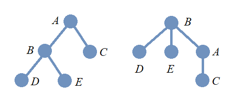 

// MKD Aug 13 2025 
//In the image, two graphs with vertex set $\{ A,\,B,\,C,\,D,\,E \}$ are shown. 
// MKD Aug 14 2025 
//In the image, two graph drawings, both using the vertex set $\{ A,\,B,\,C,\,D,\,E \},$ are shown. 
Here is a question for you: In the image, do the two drawings represent graphs or rooted trees? 
It's okay if you are not sure how to answer this question. Since rooted trees are usually drawn with edges that do not use arrows to indicate the direction, the drawings are ambiguous, and you would probably need more context to decide whether the drawings represent two undirected graphs or two rooted trees. 

// MKD Aug 14 2025 
Notice that the interpretation also effects whether the two drawings represent isomorphic objects. 

// MKD Aug 13 2025 
//If these graphs are viewed as trees, then they are isomorphic as _trees:_  
// because they are isomorphic as graphs: 
// MKD Aug 14 2025 
//On the other hand, if these graphs are viewed as undirected graphs, then they are isomorphic as both _undirected graphs_ and as _trees_ since  
* Suppose that the drawings are interpreted as undirected graphs. These are isomorphic as _undirected graphs,_ and also isomorphic as _trees,_ since  
//Redrawing 
redrawing 
the graph 
on the left as the one on the right 
does not change the adjacency relationships of the vertices. 
//
//However, if 
// MKD Aug 13 2025 
//If instead these graphs are viewed as rooted trees, then they are not isomorphic as _rooted trees_ because the direction of the edge with endpoints $A$ and $B$ changes depending on whether $A$ or $B$ is chosen as the root node. Recall that for rooted trees, the root node is the one drawn at the top, and all edges are directed away from the root node. + 
//If the drawings are interpreted as rooted trees, 
//then the two rooted trees are not isomorphic as _rooted trees_ because the direction of the edge with endpoints $A$ and $B$ changes depending on whether $A$ or $B$ is chosen as the root node. 
// MKD Aug 14 2025 
// MKD Aug 16 2025 
//* Suppose that the drawings are interpreted as rooted trees. These are not isomorphic as _rooted trees_ because the direction of the edge with endpoints $A$ and $B$ depends on whether $A$ or $B$ is chosen as the root node. 
// MKD Aug 14 2025 
// MKD Aug 13 2025 
//That is, you can find rooted trees are not isomorphic, but whose underlying graphs are isomorphic.
//That is, the underlying graphs of the rooted trees are isomorphic, but the rooted trees are not isomorphic.
//The _underlying graphs_ are isomorphic, but the _rooted trees_ are not isomorphic.
// MKD Aug 16 2025 
* Suppose that the drawings are interpreted as rooted trees. The adjacency relationships are the same, but the direction of the edge with endpoints $A$ and $B$ depends on whether $A$ or $B$ is chosen as the root node. The _underlying graphs_ with undirected edges are isomorphic, but the _rooted trees_ are not isomorphic.

==== Nonisomorphic Ordered Trees that are Isomorphic Rooted Trees

//image::imagesMKD/NonisomorphismcOrderedTrees.png[NonisomorphismcOrderedTrees,639,290,align="center"] 
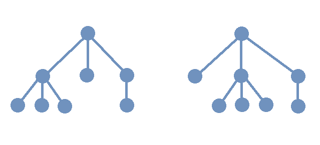 

In the image, two rooted trees are shown. The two rooted trees are isomorphic as _rooted trees_ since the order of the children of the root node does not matter. However, these two rooted trees are not isomorphic as _ordered trees_ since the corresponding children are not in the same order in each rooted tree. 
// + 
//[small]#It may be helpful to think of each of these ordered trees as “telling a story” about a family. On the left, a parent has three children, and the oldest child has three children, the middle child has no children, and the youngest child has one child. On the right, a parent has three children, and the oldest child has no children, the middle child has three children, and the youngest child has one child. The ordered trees can only be isomorphic if they tell the same story about the families, so these ordered trees are not isomorphic. On the other hand, they are isomorphic as _rooted trees_ because they tell the same story when birth order is ignored: Each parent has three children, of whom one has three children, another one has one child, and yet another one has no children.#

// MKD Aug 13 2025 - broke out "telling a story"
It may be helpful to think of each of the two ordered trees as “telling a story” about a family. 

* On the left, a parent has three children, and the oldest child has three children, the middle child has no children, and the youngest child has one child. 
* On the right, a parent has three children, and the oldest child has no children, the middle child has three children, and the youngest child has one child. 

In general, ordered trees are isomorphic if and only if they tell the same story about the families, so these two are not isomorphic as _ordered trees._ On the other hand, they are isomorphic as _rooted trees_ because they tell the same story when the birth order of the children at level 1 is ignored: A parent has three children, of whom one has three children, another one has one child, and yet another one has no children.

== Binary Trees #SECTION UNDER CONSTRUCTION!# 
// ** Algorithms for Binary search trees

// MKD Nov 22 2025 
NOTE: As mentioned near the beginning of this chapter, much of the terminology related to trees is not standardized. The definitions in this section use terminology consistent with link:https://www.routledge.com/Handbook-of-Graph-Theory/Gross-Yellen-Zhang/p/book/9781439880180?srsltid=AfmBOoopymlQNVr5rlo05ShK51PGym1Kv1vJ47zHndypkoXdteehcoYw[_Handbook of Graph Theory,_ Second Edition,] but information on alternative definitions is also stated. 

 
//Binary trees are An important type of rooted tree used in computer science is the *binary tree.*

For any positive integer $m,$ an *m-ary tree* is defined to be 
//a rooted tree 
//an ordered rooted tree 
an ordered tree 
in which each internal node has at most $m$ children. + 
// MKD Aug 16 2025 add small note 
[small]#Some sources define m-ary tree to be a rooted tree instead of an ordered tree.# 
//Note: 

A *binary tree* is a 2-ary tree, or more simply, an ordered tree in which each internal node has at most two children. In a binary tree, the root node is the parent of at most two subtrees $T_{1},$ called the *left subtree,* and $T_{2},$ called the *right subtree.* Notice that in the context of binary trees, it is allowable for either or both of the subtrees to be absent (that is, empty). + 
// MKD Aug 16 2025 reworded small note
// MKD Nov 22 2025 revised small note again, and inserted link
[small]#Some sources allow a binary tree to be “empty,” in the sense that it has no vertices or edges. An “empty binary tree” is not an link:./trees.html#ordered_tree_recursive_definition[ordered tree] as defined above since it has no root node. However, an empty binary tree is useful in computer science applications. For example, when implementing binary trees as data structures, an empty binary subtree corresponds to by a null pointer (or null reference);  a leaf node of a binary tree can be recognized as a node whose left child and right child pointers/references are both null.# 
//#Note: 
// MKD July 15 2025 - also see https://xlinux.nist.gov/dads/HTML/tree.html

// MKD an image with an absent subtree would be good here!

// MKD Nov 21 2025  removed bulleted list (there was only "complete binary tree")
//Here is some additional terminology for binary trees. 

// MKD Aug 16 2025 - omitted James Wong's PowerPoint definition of full binary tree
////
* A binary tree is a *full binary tree* if 
//NOTE: Rosen's, Bender&Williamson's definitions only requires two children, nothing about same depth.
//[arabic]
//.. 
all internal nodes have exactly two children.
// and 
//.. all leaves have the same depth. 
////

// MKD Aug 16 2025 - replaced James Wong's PowerPoint definition of complete binary tree with one based on The Handbook Of Graph Theory
// MKD Nov 21 2025  - inserted image
//* A binary tree is a *complete binary tree* if is one where every level, except possibly the last, is filled and all nodes in the last level are as far left as possible. + 

// MKD Nov 21-22 2025 
//// 
// Defintions of "complete m-ary tree"
// Handbook: An m-ary tree in which every internal vertex has exactly m children and all leaves are at the same level.
// Rosen: A full m-ary tree in which every leaf is at the same level (A full m-ary tree is one with every internal vertex having exactly m children.) 
////
//image::imagesMKD/CompleteBinaryTreeHeight2.png[CompleteBinaryTreeHeight2,302,185,float="right",align="center"]
//image::imagesMKD/CompleteBinaryTreeHeight2.png[CompleteBinaryTreeHeight2,151,93,float="right",align="center"] 
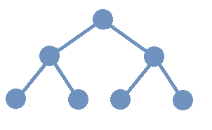 
A *complete binary tree* is a binary tree in which every internal node has exactly 2 children and all leaves are at the same level. + 
//[small]#The definition of “complete binary tree” used in the Remix matches the ones used by Rosen in  link:https://www.mheducation.com/highered/product/discrete-mathematics-applications-rosen/M9781259676512.html[_Discrete Mathematics and Its Applications,_ 8th Edition] and by Maurer in  link:https://www.routledge.com/Handbook-of-Graph-Theory/Gross-Yellen-Zhang/p/book/9781439880180?srsltid=AfmBOoopymlQNVr5rlo05ShK51PGym1Kv1vJ47zHndypkoXdteehcoYw[_Handbook of Graph Theory,_ Second Edition.] However, link:https://xlinux.nist.gov/dads/HTML/perfectBinaryTree.html[some sources call these “perfect binary trees” and other sources call these “full binary trees;”] many of those sources use “complete binary tree” to describe link:https://xlinux.nist.gov/dads/HTML/completeBinaryTree.html[something else.]# 
[small]#link:https://xlinux.nist.gov/dads/HTML/perfectBinaryTree.html[Some sources] use either “perfect binary tree” or “full binary trees” to describe this type of binary tree and use the phrase “complete binary tree” to describe link:https://xlinux.nist.gov/dads/HTML/completeBinaryTree.html[something else.]# 
// like “complete.”#
//“”
//Also note that a complete binary tree is not a complete graph. As mentioned before in the Remix, mathematicians and computer scientists recycle certain words. 
//However, link:https://xlinux.nist.gov/dads/HTML/perfectBinaryTree.html[this definition is not used universally:] Some sources call these “perfect binary trees” and other sources call these “full binary trees,” and then use “complete binary tree” to describe link:https://xlinux.nist.gov/dads/HTML/completeBinaryTree.html[something else.] + 

// MKD need to clarify what a "level" is

// MKD again, images for full and/or complete binary trees would be good here!

// MKD Aug 16 2025 
// not great code sample for nodes of a binary tree 
// https://pythontutor.com/render.html#code=class%20Node%3A%20%0A%20%20%20%20def%20__init__%28self,data%29%3A%20%0A%20%20%20%20%20%20%20%20self.data%20%3D%20data%0A%20%20%20%20%20%20%20%20self.leftChild%20%3D%20None%0A%20%20%20%20%20%20%20%20self.rightChild%20%3D%20None%20%0A%20%20%20%20%20%20%20%20%0A%20%20%20%20def%20addLeftChild%28self,%20the_Node%29%3A%0A%20%20%20%20%20%20%20%20if%20self.leftChild%20%3D%3D%20None%3A%0A%20%20%20%20%20%20%20%20%20%20%20%20self.leftChild%20%3D%20the_Node%0A%20%20%20%20%20%20%20%20else%3A%0A%20%20%20%20%20%20%20%20%20%20%20%20raise%20ValueError%28%22Left%20child%20already%20exists!%22%29%0A%0A%20%20%20%20def%20addRightChild%28self,%20the_Node%29%3A%0A%20%20%20%20%20%20%20%20if%20self.rightChild%20%3D%3D%20None%3A%0A%20%20%20%20%20%20%20%20%20%20%20%20self.rightChild%20%3D%20the_Node%0A%20%20%20%20%20%20%20%20else%3A%0A%20%20%20%20%20%20%20%20%20%20%20%20raise%20ValueError%28%22Right%20child%20already%20exists!%22%29%0A%0An1%20%3D%20Node%28%22first%22%29%0An2%20%3D%20Node%28%22second%22%29%0Ar%20%3D%20Node%28%22new_root%22%29%0Ar.addLeftChild%28n1%29%0Ar.addRightChild%28n2%29&cumulative=false&curInstr=29&heapPrimitives=false&mode=display&origin=opt-frontend.js&py=3&rawInputLstJSON=%5B%5D&textReferences=false

// MKD Nov 22 2025 
// MKD an image of a balanced binary tree would be good here 
A binary tree is called *balanced* if for every vertex $v,$ the number of vertices in the left subtree of $v$ and the number of vertices in the right subtree of $v$ differ by at most one. + 
[small]#Some sources define a binary tree of height $h$ to be balanced if each leaf is at either level $h$ or level $h − 1.$#

// MKD Nov 25 2025 inserted before Binary Trees
//== Tree Traversal Algorithms for Ordered Trees #SECTION UNDER CONSTRUCTION!# 
// MKD Nov 29 2025 moved back to section on Binary Trees
=== Tree Traversal Algorithms for Binary Trees 

In many applications of 
//ordered 
binary 
trees, it is necessary to visit every node. 
// of the ordered tree; this 
The process of visiting every node is called *tree traversal.* In this 
//section, 
subsection, you will learn about three commonly-used algorithms for tree traversal. 

//* Preorder traversal: Visit internal nodes before leaves. 
//This tree traversal algorithm is used to make copies of binary search trees.
//* Inorder traversal: Visit leftmost subtree of each node before visiting the root node. 
//of a binary search tree visits the nodes in ascending order of their key values, corresponding to a sorted list of the data in a binary tree.
//* Postorder traversal: 
//Visit the left subtree, then the right subtree, before visiting the root node.  
// Visit leaves before internal nodes. 
// is used when leaves must be explored before internal nodes. It is used for deleting a tree because all vertices below the root of a subtree will be removed before the root of the subtree. 

// MKD Dec 1 2025 revision - still need to include algorithms!
The three traversal algorithms can be described recursively as follows. 

* *Preorder traversal:* First, visit the root node. Next, visit each node in the root node's left subtree using preorder traversal. Finally, visit each node in the root node's right subtree using preorder traversal.  
* *Inorder traversal:* First, visit each node in the root node's left subtree using inorder traversal. Next, visit the root node. Finally, visit each node in the root node's right subtree using preorder traversal.  
* *Postorder traversal:* First, visit each node in the root node's left subtree using postorder traversal. Next, visit each node in the root node's right subtree using postorder traversal. visit the root node. Finally, visit the root node.

//[small]# NOTES: 
//[arabic]
//. 
For each of these three traversal algorithms, the Base Step for the recursion 
is applied to 
//is that whenever 
a binary tree has only one node 
(a root node that has empty left and right subtrees), 
and 
you visit just that one node. + 
//. 
[small]#Some sources use hyphens in the written names of these traversal algorithms, so list them as *pre-order,* *in-order,* and *post-order* traversal.#

You may find the interactive demonstration at this link:https://en.wikipedia.org/wiki/Tree_traversal#Types[Wikipedia page] useful to understanding these three traversal algorithms.
		

// MKD Nov 22 2025 new subsection
=== Binary Search Trees #SECTION UNDER CONSTRUCTION!# 

//A *binary search tree* (BST) is a binary tree where each vertex is assigned a *key,* where all the keys come from a set that has a link:./relations.html#total_ordering[total ordering.] For example, the keys may be integers, or strings that are alphabetically ordered, or any other type of data that can be totally ordered. In a binary search tree, the key assigned to vertex $v$ is greater than the key at each vertex in the left subtree of v, and is less than the key at each vertex in the right subtree of v. 

Define a *key* to be an element of a set that has a link:./relations.html#total_ordering[total ordering.] For example, keys could be integers ordered using the usual $\leq$ relation. As another example, keys could be strings ordered alphabetically. In general, keys could be any type of data that can be totally ordered. 

// MKD you really need an image here! 
A *binary search tree* (BST) is a binary tree where each vertex is assigned a key in such a way that that if key $k$ is assigned to vertex $v$ then both of the following are True. 
[arabic]
. the key $k$ is greater than each key assigned to a vertex in the left subtree of $v,$ and 
. the key $k$ is less than each key assigned to a vertex in the right subtree of $v.$ 

If you are given a list (or an array) of keys, a 
binary search tree can be used to sort the keys and then quickly search for a key. An advantage of binary search trees is that it is much easier and faster to maintain the sort order if you need to insert new keys than it would be to insert the same keys into a sorted list (or an array) of keys. 
//link:./algorithms.html#binary_search_algorithm[binary search.] 

****
.Example {counter:treeex} - Constructing a Binary Search Tree

First, let's construct a binary search tree from the list of keys 
$ \left[ 17, 3, 5, 31, 2 \right] .$ 

* The first key in the list, $17,$ is assigned to the root node. 
* The next key, $3,$ is less than the key $17$ at the root node, so $3$ is assigned to the left child of the root node. 
* The next key, $5,$ is less than the key $17$ at the root node, so $5$ must be assigned to some node in the left subtree. 
** Since $5$ is greater than the key $3$ at the left subtree's root, $5$ is assigned to the _right_ child of the left subtree's root. 
* The next key, $31,$ is greater than the key $17$ at the root node, so $31$ is assigned to the right child of the root node. 
* The last key, $2,$ is less than the key $17$ at the root node, so $2$ must be assigned to some node in the left subtree. 
** Since $2$ is greater than $3,$ $2$ is assigned to the _left_ child of of the left subtree's root. 

The following animation illustrates the construction of this binary search tree. 

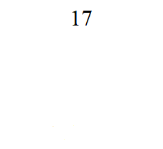 

Now, let's search for some keys. If a key is not already present, it will be inserted in the correct position. 

Consider the key $5.$ 

* $5$ is less than the key at the root node, which is $17.$ If $5$ is in this BST, it must be in the left subtree, so continue searching from there. 
* $5$ is greater than the key at the left subtree's root node, which is $3.$ If $5$ is in this BST, it must be in the right subtree of this node, so continue searching from there. 
* $5$ is equal to the key at the subtree's root node, so we have found this key!

Now consider the key $19$ which was not included in the original list. 

* $19$ is greater than the key at the root node, which is $17.$ If $19$ is in this BST, it must be in the right subtree, so continue searching from there. 
* $19$ is less than the key at the right subtree's root node, which is $31.$ If $19$ is in this BST, it must be in the left subtree of this node, so continue searching from there. 
* This subtree is empty, so insert a new root node for this subtree and assign the key $19$ to this new node. 

The following image shows the modified BST with the new key $19$ inserted in the correct position. 

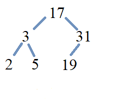 

.You Try
Locate the correct position of the new node when the key $11$ is inserted in the previously modified BST. 

[click.answer]
--

The key $11$ is assigned to the right child of the node that has the key $5.$ Click link:./imagesMKD/BinarySearchTreeAnimation/07.gif[here] to see an image of the BST with $11$ assigned to the new node.
 
--

//image::imagesMKD/BinarySearchTreeAnimation/07.gif[07,229,210,align="center"]
// 

****

// MKD Nov 30 2025 removed from previous example
////
.You Try
Consider the following list of names, which will be used as keys. \[ \left[ \text{Li, Adil, Chris, Sofia, Elias, Maya, Jun} \right] . \] Construct and draw the binary search tree for this list of keys.

[click.answer]
--

Click link:./imagesMKD/7names.png[here] to see an image of the BST.
 
--
////

Constructing a binary search trees from a list can serve two purposes.  First, as shown in the preceding example, it is quicker to search for a key in the binary search tree because, in the best case scenario when the tree is balanced, the number of keys is halved with each iteration of the search. Secondly, the original list can be sorted 
//in order 
by performing 
//a preorder 
an inorder 
traversal of the binary search tree. 

// MKD maybe use the binary search tree with 11 and 19 from the previous example here. 

// MKD Nov 29 2025 inserted new exercise
// MKD Nov 30 2025 replaced then restored exercise
****
//.Example {counter:treeex} - Traversing a Binary Search Tree
.Exercise - Traversing a Binary Search Tree

Consider the binary search tree with integer keys that 
//you may have constructed 
was the solution in the “You Try” section of the previous example. 

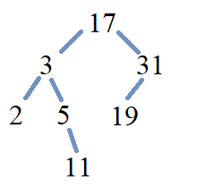 

List the keys of the binary search tree using each of preorder, inorder, and postorder traversal to visit all nodes of the binary search tree. 

[click.answer]
--

Preorder: $ \left[ 17, 3, 2, 5, 11, 31, 19 \right] .$ + 

Inorder: $ \left[ 2, 3, 5, 11, 17, 19, 31 \right] .$  + 

Preorder: $ \left[ 2, 11, 5, 3, 19, 31, 17 \right] .$ 
 
--

****
////
////

Here is another exercise for you to try. 

****
.Check Your Understanding

Consider the following list of names, which will be used as alphabetically-ordered keys. \[ \left[ \text{Jun, Li, Chris, Elias, Sofia, Adil, Maya} \right] \] 

First, construct and draw the binary search tree for this list of keys. 

[click.answer]
--

Click link:./imagesMKD/7namesAlt_v2.png[here] to see an image of the BST.
 
--

Next, write down the three lists you get by using preorder, inorder, and postorder traversals to visit all nodes of the binary search tree.

[click.answer]
--

Preorder: [ Jun, Chris, Adil, Elias, Li, Sofia, Maya ] + 

Inorder: [ Adil, Chris, Elias, Jun, Li, Maya, Sofia ] + 

Preorder: [ Adil, Elias, Chris, Maya, Sofia, Li, Jun ] 
 
-- 

****

//the keys of the binary search tree
//Preorder: $\left[ \text{Jun, Chris, Adil, Elias, Li, Sofia, Maya} \right]$ + 
//Inorder: $\left[ \text{Adil, Chris, Elias, Jun, Li, Maya, Sofia} \right]$ + 
//Preorder: $\left[ \text{Adil, Elias, Chris, Maya, Sofia, Li, Jun} \right]$ 

// MKD Nov 27 2025 new subsection
//=== Polish and Reverse Polish Notation
=== Expression Trees and Polish Notation #SECTION UNDER CONSTRUCTION!# 

// (Jan Łukasiewicz) 

//In the 1920's, the Polish logician link:https://en.wikipedia.org/wiki/Jan_%C5%81ukasiewicz[Jan Łukasiewicz] created what is called today either *Polish notation* or *prefix notation* to express link:./logic.html#wff_recursion[well-formed formulas] in a format that requires link:https://plato.stanford.edu/entries/lukasiewicz/polish-notation.html[no parentheses.] 

//In the 1920's, the Polish logician link:https://en.wikipedia.org/wiki/Jan_%C5%81ukasiewicz[Jan Łukasiewicz] created a way to write link:./logic.html#wff_recursion[logical well-formed formulas] in a format that requires link:https://plato.stanford.edu/entries/lukasiewicz/polish-notation.html[no parentheses:] Instead of placing operators like $\land$ and $\lor$ between two previously-constructed wffs, Łukasiewicz placed the operators _in front of_ those wffs, which makes the use of parentheses unnecessary. Today, Łukasiewicz's notation usually is called either *Polish notation* or *prefix notation,* and is more often applied to arithmetic formulas than to logical formulas.  

In the 1920's, the Polish logician link:https://en.wikipedia.org/wiki/Jan_%C5%81ukasiewicz[Jan Łukasiewicz] created a notational format for writing link:./logic.html#wff_recursion[logical well-formed formulas] that 
link:https://plato.stanford.edu/entries/lukasiewicz/polish-notation.html[does not use any parentheses:] 
// [does not require any parentheses.] 
// MKD Nov 29 2025 revised wording 
Instead of 
//placing 
writing logical 
operator 
//s 
symbols (like $\land$ and $\lor$) between two previously-constructed wffs, Łukasiewicz placed 
//the 
operator 
//s
symbols _in front of_ those wffs, which makes the use of parentheses  completely 
unnecessary! Today, notation that is based on Łukasiewicz's original notation is called either *Polish notation* or *prefix notation* and is most often applied to arithmetic/algebraic formulas instead of logical formulas.  

There is also *Reverse Polish notation* or *postfix notation,* where the operator symbol is placed _after_ its operands. The “usual” notation where the operand is placed _between_ the two operands is called *infix notation.* 

// MKD Nov 30 2025 new example
****
.Example {counter:treeex} - Polish and Reverse Polish notation 

Consider the following algebraic expression, written in infix notation. \[ 3 \cdot x - 5 \] 

The Polish notation (prefix notation) for the same expression is \[ - \, \cdot \, 3 \, x \, 5 \] and the Reverse Polish notation (postfix notation) for the expression is \[ 3 \, x \, \cdot \, 5 \, - \] 

****

//image::imagesMKD/ExpressionTree_3xminus5_v2.png[ExpressionTree_3xminus5_v2,264,204,float="right",align="center"] 
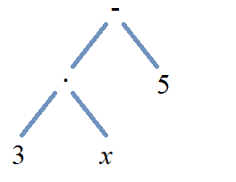 
You can use binary trees and tree traversal to make it easier to switch between these three notations. Define an *expression tree* to be a binary tree where each leaf is assigned a key that is either a numeral or a variable symbol, and where each internal node is assigned a key that is an operator symbol. The expression tree for the infix notation $3 \cdot x - 5$ is shown. Notice that the order of the symbols for the infix expression corresponds to the inorder traversal of the expression tree. It is an exercise for you to confirm that the order of the symbols in the Polish notation expression corresponds to the preorder traversal of the expression tree, and that the Reverse Polish notation expression corresponds to the postorder traversal of the expression tree. 
//, and that the usual order of operations for infix expressions corresponds to the inorder traversal of the expression tree. 
// 3 ⋅ x - 5

// MKD Nov 30 2025 need examples using computation/expression building using Polish and Reverse Polish notations

// MKD need an example here, using a binary tree. 
// construct an expression tree form an arithmetic/algebraic formula in the usual infix notation, the explain how preorder traversal will give the Polish/prefix notation, and postorder traversal will give the Reverse Polish/postfix notation.     

// MKD Nov 30 2025 new example
****
.Example {counter:treeex} - An Expression Tree #UNDER CONSTRUCTION!# 

Consider the arithmetic expression. \[ 5 + 7 \times - 3 - 8 \div 2 \] Recall that it is not correct to evaluate this left-to-right; instead you need to use the order of operations, which is equivalent to inserting parentheses as shown. \[ (5 + (7 \times (- 3))) - (8 \div 2) \]

****

// link:https://en.wikipedia.org/wiki/Polish_notation[Łukasiewicz notation,] also called *prefix notation* and *Polish notation.* In this notation, the binary operators $+,$ $-,$ $\times,$ and $\div$  
// For more on the history of Łukasiewicz's notation, see this link:https://plato.stanford.edu/entries/lukasiewicz/polish-notation.html[link.]  

// MKD Aug 16 2025 new subsection
=== Isomorphisms: Binary Trees 
//==== Nonisomorphic Binary Trees that are Isomorphic Rooted Trees

//image::imagesMKD/NonisomorphicBinaryTrees.png[NonisomorphicBinaryTrees,411,124,align="center"] 
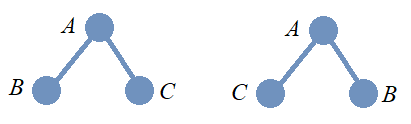 

In the image, two binary trees are shown. As binary trees are ordered trees, it should be clear that these cannot be isomorphic as _binary trees_ because the order of the left and right children of the root node in the two trees are different. 

////
Binary Search Trees
				
* Used for efficient searching of sorted data.
* Constructed where each vertex is assigned a key so that the key of a vertex is greater than the keys of all vertices in its left subtree and less than the keys of all vertices in its right subtree. 
* A binary search tree of height $h$ is *balanced* if all leaves are at levels h or h − 1. For a balanced binary search tree, locating or inserting an item requires no more than ⌈log(n + 1)⌉ comparisons, where n is the number of items.
* Rebalancing algorithms can be used to optimize a binary search tree when new items are inserted.	
////

== Additional Topics To Be Added Later
// in this chapter will include:

//#Students in CSC 230 Fall 2024 should refer to the slide decks posted in link:https://sfsu.instructure.com/[Canvas.]#
//#Students in CSC 230 Spring 2025 can refer to the slide decks (from Spring 2024 and Fall 2024) that are posted in link:https://sfsu.instructure.com/[Canvas.]#

		
** Tree Traversal Strategies

*** Algorithms for Depth- and breadth-first traversals

** Expression Trees 
// https://en.wikipedia.org/wiki/Binary_expression_tree

//*** Polish and Reverse Polish Notations (Jan Łukasiewicz) 
// link:https://en.wikipedia.org/wiki/Polish_notation[Łukasiewicz notation,] also called *prefix notation* and *Polish notation.* In this notation, the binary operators $+,$ $-,$ $\times,$ and $\div$  
// For more on the history of Łukasiewicz's notation, see this link:https://plato.stanford.edu/entries/lukasiewicz/polish-notation.html[link.]  

//* Algorithms

//*** Algorithms for Minimum spanning tree (Prim’s algorithm)

