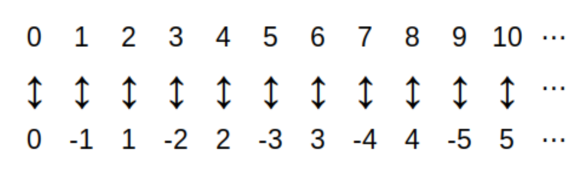

= Functions

#*CAUTION* - CHAPTER UNDER CONSTRUCTION!#

include::LinkToPrivate.adoc[] 

_This chapter was last updated on March 11, 2025._ + 
[small]#Contents locked until 11:59 p.m. Pacific Standard Time on May 23, 2025.#

// MKD start of topics
////

FUNCTIONS (GGC06)
	ACM CCECC Set/rels/funcs/congruence	
    COMP 152 Functions, Relations and Sets and DS1.
		functions including 
			injective, 
			surjective, 
			inverse, 
			composition, 
			domain, 
			co-domain, 
			range
        Functions (surjections, injections, inverses, composition)
        Pigeonhole principles ??? (MKD - Sets? Functions? Combinatorics?)
		(DS1. lists "Pigeonhole principle" in the singular)
	MKD: application -  One-to-One Correspondences and Infinite Cardinals
	2013 changes/additions:
		Surjections, injections, bijections 
		Inverses
		Composition

AUG 2024 update on topics
DS2013/Sets, Relations, and Functions	Functions: Surjections, injections, bijections
DS2013/Sets, Relations, and Functions	Functions: Inverses
DS2013/Sets, Relations, and Functions	Functions: Composition
DS2008/FunctionsRelationsAndSets	Functions (surjections, injections, inverses, composition)
ACM_CCECC_2005/Sets, relations, functions, congruences	functions including injective, surjective, inverse, composition, domain, co-domain, range
DS2008/FunctionsRelationsAndSets	Pigeonhole principle

FUNCTIONS - January 2025
DS2013/Sets, Relations, and Functions	Functions: Surjections, injections, bijections
DS2013/Sets, Relations, and Functions	Functions: Inverses
DS2013/Sets, Relations, and Functions	Functions: Composition
DS2008/FunctionsRelationsAndSets	Functions (surjections, injections, inverses, composition)
DS2008/FunctionsRelationsAndSets	Pigeonhole principle
ACM_CCECC_2005/Sets, relations, functions, congruences	functions including injective, surjective, inverse, composition, domain, co-domain, range
MSF-Discrete_2023	1. Sets, relations, functions, cardinality

(MKD: Is the following list from James Wong's slides?)
Function, domain, codomain, range
Equality of functions (same domain, codomain, and ordered pairs)
One-to-one (injective)
Onto (surjective) - NOTE this is why the codomain is part of the definition
1-1 Correspondence (bijective i.e. both one-to-one and onto)
Compostion of Functions
Inverse functions
adding and multiplying functions
sequence as a function mapping {0, 1, 2..., n} to a set
subsequence
summation notation, double summations
Pigeonhole Principle (? using function notation)
Cardinality - finite sets, infinite sets (countable, uncountable)
Examples: even naturals, integers, pairs of natural numbers, Q, reals (Cantor diagonlization)

MKD MOVED THIS FROM Intro - 
then revised to contrast reals and integers
** $f(n) = 2n+1$ where _n_ is an integer.
*** The domain is the set of integers.
*** The range is the set of odd integers: Every odd integer is of the form $q \cdt 2 + 1$ for some integer _q._ 
*** The codomain is the set of integers.
** $f(x) = 2x+1$ where _x_ is a real number.
*** The domain is the set of real number.
*** The range is the set of real numbers. 
*** The codomain is the same set as the range, that is, every real number is an output of the function because we can solve every equation of the form $2x+1 = y$ for _x_, no matter what real number _y_ stands for.
*** This is an example of a one-to-one correspondence. As stated above, we can always solve the equation $2x+1 = y$ for _x:_ If we solve for _x,_ we get $x=\frac{1}{2}(y-1)$ which tells us how to "go back" from an output to its corresponding input. We can write a formula for the *inverse function* by swapping the symbols _x_ and _y_ to get $y=\frac{1}{2}(x-1)$ and then naming a new function with the rule $g(x) = \frac{1}{2}(x-1)$ where _x_ is a real number (The inverse function is also referred to using the symbol $f^{-1}$ which will be discussed in the link:./functions.html[Functions] chapter.)
////
// MKD end of topics

//MKD start of actual content 

// MKD added following two paragraphs
//function as a rule that assigns to each input exactly one output
// March 6 2025 - more rewording

Informally, 
//a 
//As an informal definition, 
//a function _f_ is a rule that assigns to each input value exactly one output value. 
a function $f$ from set _D_ to set _C_ is a rule that assigns to each input element in _D_ exactly one output element from _C._ The set _D_ is called the domain of the function, and the set _C_ is called the codomain of the function. This informal definition 
//was introduced in the 
was given in the chapter link:introduction_discrete_math.html#informal_function_definition[ Introducing Discrete Mathematics.]
// chapter.

//This informal definition was introduced in <<introduction_discrete_math.adoc#informal_function_definition,the Introducing Discrete Mathematics>>  chapter.

//Notice that the 
The 
informal definition 
//states 
implies 
that _every_ element in the domain _D_ is 
an "input" that is 
assigned an output value in the codomain _C._ 
#The informal definition 
//#but 
*does not 
//specify whether 
imply* that 
_every_ element in the codomain _C_ is an output for some input in the domain _D._# 
//The previous highlighted sentence may seem unimportant since we usually only care about the outputs we can actually get from a function, but the following example attempts to show why it is important to be precise about what set the codomain is. 
The 
//previous, 
highlighted 
//part of the previous 
sentence may seem unimportant since 
//we 
you 
usually only care about the outputs 
//we 
you can actually get from a function, but the example presented in the next section shows why it is important to be precise about what set the codomain is. 
// added March 6 2025
//For this reason, 
//you will be given 
//a 
A 
//much more 
//precise, 
formal definition of function 
is introduced 
in this chapter 
to address this 
//concern 
need for precision.

Key terms and concepts covered in this chapter:

* Functions
** Domain
** Codomain
** Range
* Properties of functions (injectivity, surjectivity, bijectivity)
//** The (generalized) pigeonhole principle
** A bijective function is the same as a one-to-one correspondence
// Next three sub-bullets added March 6 2025
//** A function is injective if and only if for every pair of two different inputs the function assigns those inputs to two different outputs 
//** A function is surjective if and only if the function's range is equal to its codomain
** An injective function is one that assigns every pair of different inputs  to 
a pair of 
different outputs 
** A surjective function is one whose range is equal to its codomain (that is, every element of the codomain is an output assigned to one or more inputs)
** A bijective function is both injective and surjective 
* Inverse functions
* Composition of functions

////
//;_ 
//that is, some elements of _C_ may not be output values.
This may seem unimportant 
//an unimportant minor point 
at first glance, 
but the following example shows how it can make a 
//huge 
difference.  
////

// MKD made example into its own section January 15, 2025
//== Why Knowing the Codomain is Important
// MKD changed title March 6 2025
== Why Specifying the Codomain is Important

//The following example compares two implementations of what should be the "same" function but using different codomains. You will see how the different codomains effect how the functions' outputs can be used.
//The following example compares two implementations of what would seem to be the "same" function: The input values are the same, and the description of how to compute outputs seems to be the same, but the codomains are different which effects how the output values can be used.
// MKD revised March 6 2025
//The following example compares two implementations of the "same" function in different programming languages: The input values are the same, and the rule that assigns to each input its one and only output is the same, but the codomains are different which effects how output values can be used.
The following example compares two implementations, in different programming languages, of 
//what appears to be 
the "same" function: The input values are the same, and the rule that assigns to each input its one and only output is the same. 
//However, the implementations use different codomains, which effects how the output values can be used.
However, the two implementations use different codomains which effects how the output values can be used.

// MKD inserted python floor example and java floor example HERE!
:pt_code_height: 350
:pt_rawinput: false
:pt_code: import%20math%0AL%3D%5B%22Zero%3F%22,%20%22Yes!%22,%20%22Nope.%22%5D%0Ax%20%3D%201.4%0Ai%20%3D%20math.floor%28x%29%0Aprint%28L%5Bi%5D%29

:jt_code_height: 480
:jt_rawinput: false
:jt_code: import%20java.lang.Math%3B%0Apublic%20class%20LookUp%20%7B%0A%20%20%20public%20static%20void%20main%28String%5B%5D%20args%29%20%7B%0A%20%20%20%20%20%20String%5B%5D%20L%20%3D%20new%20String%5B%5D%20%7B%22Zero%3F%22,%20%22Yes!%22,%20%22Nope.%22%7D%3B%0A%20%20%20%20%20%20double%20x%20%3D%201.4%3B%0A%20%20%20%20%20%20double%20y%20%3D%20java.lang.Math.floor%28x%29%3B%0A%20%20%20%20%20%20//System.out.println%28L%5By%5D%29%3B%20//Error%3A%20incompatible%20types%3A%20possible%20lossy%20conversion%20from%20double%20to%20int%0A%20%20%20%20%20%20System.out.println%28L%5B%28int%29y%5D%29%3B%0A%20%20%20%7D%0A%7D

****
//.Example {counter:funcex:0} - Python's floor() returns an int, Java's floor() returns a double
//.Example {counter:funcex:0} - The floor() functions in Python and Java
.Example {counter:funcex} - The floor() functions in Python and Java

--
--

// MKD 
// Python: The float type in CPython uses a C double for storage.  Floating-point numbers are usually implemented using double in C. Since at least 2000, almost all machines use IEEE 754 binary floating-point arithmetic, and almost all platforms map Python floats to IEEE 754 binary64 “double precision” values.
//sources: https://docs.python.org/3/faq/design.html#why-are-floating-point-calculations-so-inaccurate and https://docs.python.org/3/library/stdtypes.html and https://docs.python.org/3/tutorial/floatingpoint.html#tut-fp-issues
// Java: The double data type is a double precision 64-bit IEEE 754 floating-point. (Note that this is the primitive type, not the Double object wrapper)
// source: https://docs.oracle.com/javase/tutorial/java/nutsandbolts/datatypes.html
// also
// Java int is 32-bit signed two's complement integer
// source: https://docs.oracle.com/javase/tutorial/java/nutsandbolts/datatypes.html
// Python int is 
// source: ??

//You may already know that, as data types 
//In computing, the implementations of integer data types is very different from the implementations of floating-point data types that are used to represent real numbers. 
//In mathematics, it is common to treat the set of integers as a subset of the set of real numbers, though at a more advanced level of mathematics the integers can also be regarded as very different from the real numbers.

In computing, integer data types are used 
//primarily 
to represent 
//integers 
//natural numbers (and their negatives) (either positive, negative, or zero) 
//such as 
loop 
counters 
//in loops 
or indices into arrays, while floating-point data types are used to represent real numbers 
(like decimals) 
//used 
in scientific or financial calculations. 
//It is important to note that the implementation, in hardware and software, of integer data types is very different from the implementation of floating-point data types. 
//Even though most 
In general, 
a number 
//numbers 
that can be stored using an integer type can also be stored using a floating-point type, 
but 
the _ways_ in which that number can be used will depend on the data type. 
The following code examples show why it is important to keep this in mind when coding. 

First, recall that the link:./introduction_discrete_math.html#informal_floor_and_ceiling_definition[floor of _x_,] written as $\lfloor x \rfloor,$ is the greatest integer less than or equal to the real number _x._ The floor() function is available in both Python and Java as an implementation of $\lfloor x \rfloor.$ In both programming languages floor() takes a double precision floating-point number as its input, but Python floor() returns a value of integer data type while Java floor() function returns a value of floating-point data type. 
//return values are of different data types. + 
//The following two code samples each implement a lookup: The floor of a floating-point number is computed then that result is used as an index into a list or an array. 

//[small]#The gory details: 
//Into the weeds: 
//[click.More.detail.about.double precision.floating-point]
//https://ieeexplore.ieee.org/document/8766229
//https://ieeexplore.ieee.org/document/9091348 
[click.More.detail.about.floating.point]
--
[small]#On most hardware, both Python's `float` data type and Java's `double` data type are implementations of 
link:https://ieeexplore.ieee.org/document/9091348[IEEE 754] double precision 64-bit floating-point numbers. For example, the decimal number 1.4 is encoded by the bitstring  \[001111111111011001100110011001100110011001100110011001100110011\] of length 64 whether you use a Python `float` with value 1.4 or a Java `double` with value 1.4. The underlying bitstring used for the encoding 1.4 is the same in both languages. + 
The link:https://docs.python.org/3/library/math.html#math.floor[floor() function in Python] takes a `float` as input and returns an `int` + 
The link:https://docs.oracle.com/javase/8/docs/api/java/lang/Math.html#floor-double-[floor() function in Java] takes a `double` as input and returns a `double.` + 
This means that the floor() functions in Python and Java have the _same_ domain and use, essentially, the _same_ rule to compute output values, but have _different_ codomains (that are represented by different data types in the two languages.)# 
--
//link:https://standards.ieee.org/ieee/754/6210/[IEEE 754] 
//On most hardware, both Python's `float` data type and Java's `double` data type are implementations of link:https://ieeexplore.ieee.org/document/8766229[IEEE 754]  double precision 64-bit floating-point numbers. The remixer is using this to justify that the floor() functions in both Python and Java use the _same_ rule and have the _same_ domain but different codomains.# 
//link:https://standards.ieee.org/ieee/754/6210/[IEEE 754] 
//For our purposes, we are treating the Python int and the Java int

Notice that in the Python code below, the return value from the floor() function is an _int_ which we can then use as an index into list L.

To step through the code, click on the "Next" button. 

include::python_tutor.adoc[]	

Now notice that in the Java code below, that the return value from the floor() function is a _double_ which we cannot use as an index into array L without error. 
//#We must first use another function to cast the _double_ to type _int_ to get the correct data type for an array index.#
#We must use a composition of functions (Java's floor() function followed by the function that casts an input of type _double_ to an output of type _int_) to get the correct data type for an array index.#

//Someone new to Java may be surprised by this since its easy to think that each int can be represented as a double, but the data type matters here.

To step through the code, click on the "Next" button. 

include::python_tutor_java.adoc[]	

****

//Notice that this informal definiton _does not specify_ whether each possible output value actually corresponds to an input value. 
//As an example, the squaring function $f(x) = x^{2}$ that takes any real number as an input value can only have nonegative real numbers as its output values, even though this function is often plotted in the _xy_-plane as if _any_ real number output is possible. For example, the squaring function is often compared to another function (e.g., a linear function that does have negative real numbers as output values) by plotting both functions.

////
// MKD squaring example begins 
As an example, the squaring function $f(x) = x^{2}$ that takes any real number as an input value can only have nonegative real numbers as its output values, even though this function is often plotted in the _xy_-plane as if _any_ real number output is possible. For example, the squaring function is often compared to another function (e.g., a linear function that does have negative real numbers as output values) by plotting both functions.
// MKD squaring example ends 
////

// MKD old java example begin
////
// JAVA (needs explicit cast to (int)) https://pythontutor.com/render.html#code=import%20java.lang.Math%3B%0A%0Apublic%20class%20LookUp%20%7B%0A%20%20%20public%20static%20void%20main%28String%5B%5D%20args%29%20%7B%0A%20%20%20%20%20%20String%5B%5D%20L%20%3D%20new%20String%5B%5D%20%7B%22Zero%3F%22,%20%22Yes!%22,%20%22Nope.%22%7D%3B%0A%20%20%20%20%20%20double%20x%20%3D%201.4%3B%0A%20%20%20%20%20%20double%20y%20%3D%20java.lang.Math.floor%28x%29%3B%0A%20%20%20%20%20%20System.out.println%28L%5By%5D%29%3B%0A%20%20%20%20%20%20//System.out.println%28L%5B%28int%29y%5D%29%3B%0A%20%20%20%7D%0A%7D&cumulative=false&heapPrimitives=nevernest&mode=edit&origin=opt-frontend.js&py=java&rawInputLstJSON=%5B%5D&textReferences=false 
// MKD again? <iframe width="800" height="500" frameborder="0" src="https://pythontutor.com/iframe-embed.html#code=import%20java.lang.Math%3B%0A%0Apublic%20class%20LookUp%20%7B%0A%20%20%20public%20static%20void%20main%28String%5B%5D%20args%29%20%7B%0A%20%20%20%20%20%20String%5B%5D%20L%20%3D%20new%20String%5B%5D%20%7B%22Zero%3F%22,%20%22Yes!%22,%20%22Nope.%22%7D%3B%0A%20%20%20%20%20%20double%20x%20%3D%201.4%3B%0A%20%20%20%20%20%20double%20y%20%3D%20java.lang.Math.floor%28x%29%3B%0A%20%20%20%20%20%20//System.out.println%28L%5By%5D%29%3B%20//Error%3A%20incompatible%20types%3A%20possible%20lossy%20conversion%20from%20double%20to%20int%0A%20%20%20%20%20%20System.out.println%28L%5B%28int%29y%5D%29%3B%0A%20%20%20%7D%0A%7D&codeDivHeight=400&codeDivWidth=350&cumulative=false&curInstr=4&heapPrimitives=nevernest&origin=opt-frontend.js&py=java&rawInputLstJSON=%5B%5D&textReferences=false"> </iframe>

// MKD Java helloworld example from https://docs.oracle.com/javase/tutorial/getStarted/cupojava/unix.html#unix-2 https://pythontutor.com/render.html#code=/**%0A%20*%20The%20HelloWorldApp%20class%20implements%20an%20application%20that%0A%20*%20simply%20prints%20%22Hello%20World!%22%20to%20standard%20output.%0A%20*/%0Apublic%20class%20HelloWorldApp%20%7B%0A%20%20%20%20public%20static%20void%20main%28String%5B%5D%20args%29%20%7B%0A%20%20%20%20%20%20%20%20System.out.println%28%22Hello%20World!%22%29%3B%20//%20Display%20the%20string.%0A%20%20%20%20%7D%0A%7D&cumulative=false&curInstr=1&heapPrimitives=nevernest&mode=display&origin=opt-frontend.js&py=java&rawInputLstJSON=%5B%5D&textReferences=false

:jt_code_height: 350
:jt_rawinput: false
:jt_code: /**%0A%20*%20The%20HelloWorldApp%20class%20implements%20an%20application%20that%0A%20*%20simply%20prints%20%22Hello%20World!%22%20to%20standard%20output.%0A%20*/%0Apublic%20class%20HelloWorldApp%20%7B%0A%20%20%20%20public%20static%20void%20main%28String%5B%5D%20args%29%20%7B%0A%20%20%20%20%20%20%20%20System.out.println%28%22Hello%20World!%22%29%3B%20//%20Display%20the%20string.%0A%20%20%20%20%7D%0A%7D
//import%20java.lang.Math%3B%0A%0Apublic%20class%20LookUp%20%7B%0A%20%20%20public%20static%20void%20main%28String%5B%5D%20args%29%20%7B%0A%20%20%20%20%20%20String%5B%5D%20L%20%3D%20new%20String%5B%5D%20%7B%22Zero%3F%22,%20%22Yes!%22,%20%22Nope.%22%7D%3B%0A%20%20%20%20%20%20double%20x%20%3D%201.4%3B%0A%20%20%20%20%20%20double%20y%20%3D%20java.lang.Math.floor%28x%29%3B%0A%20%20%20%20%20%20System.out.println%28L%5By%5D%29%3B%20//Error%3A%20incompatible%20types%3A%20possible%20lossy%20conversion%20from%20double%20to%20int%0A%20%20%20%20%20%20//System.out.println%28L%5B%28int%29y%5D%29%3B%0A%20%20%20%7D%0A%7D

****
.Example {counter:funcex} - Java's floor function returns a double

--
--

Notice in the Java code below that the return value from the `java.lang.Math.floor()` function is a `double`  - the return value _cannot_ be used as an index into array L (unless the return value is cast explicitly to an `int.`)

To step through the code, click on the "Next" button. 

include::python_tutor_java.adoc[]	
****
// MKD old java example end
////

The formal definition given in the next section will let us distinguish between two functions that use the _same_ rule and have the _same_ domain but have _different_ codomains. 
//The formal definition given in the next section will let us distinguish between two functions that use the _same_ rule and have the _same_ set of input values but _different_ sets of output values. 
//The following code examples illustrate show why this is important.

////
Key terms and concepts covered in this chapter:

* Functions
** Domain
** Co-domain and Range, and how they differ
* Properties of functions (injectivity, surjectivity, bijectivity)
** A bijective function is the same as a one-to-one correspondence
* Inverse functions
* Composition of functions
* The generalized pigeonhole principle
////

== A Formal Definition Of Function

// MKD added excessively formal definition... merci, M. N. Bourbaki! ;)
// need citation
////
ACM citation style

 For a multi-volume work (as a book):

[1] Donald E. Knuth. 1997. The Art of Computer Programming, Vol. 1: Fundamental Algorithms (3rd. ed.). Addison Wesley Longman Publishing Co., Inc.

Nicolas Bourbaki. 1970. Théorie des ensembles. Éléments de mathématique. Springer. ISBN 9783540340348.
////

//We now give a formal mathematical definition of function.

****
.Definition
// MKD: This definition is based on/adapted from the definition of «fonction» given in N. Bourbaki. 1970. Théorie des ensembles. Éléments de mathématique. Springer.
A *function $f$ from set $A$ to set $B$* is an ordered triple $(f,\, A,\, B)$ consisting of sets $f,$ $A,$ and $B$ such that 

* $f$ is a subset of the Cartesian product $A \times B$ and 
* each element of $A$ 
//is associated with a unique element of _B._ 
appears as the first coordinate of exactly one pair $( a, \, b) \in f.$ 

That is, $f \subseteq A \times B$ and for each element $a \in A$ there is exactly one $b \in B$ such that $(a,\, b) \in f$. The set $f$ of ordered pairs is called the *graph* of the function. 
//; it is referred to as the *rule* of the function, also. 
The set $A$ is called the *domain* of the function and the set $B$ is called the *codomain* of the function. + 
[small]#Note: This definition of a function as an ordered triple is based on the  Bourbaki definition in the 1970 book 
link:https://link.springer.com/book/10.1007/978-3-540-34035-5[Théorie des ensembles.]#
//https://link.springer.com/book/10.1007/978-3-540-34035-5
****

// MKD Jan 23 2025 inserted first sentence
Why would we need such a highly technical formal definition? 
#The reason why the ordered triple is used in the definition is that we need to be able to distinguish two functions that have the same graph, as a set of ordered pairs, 
//by specifying the codomain. 
but different codomains.# 
//Note that if two functions have the same graph then they must have the same domain, but they could still have different codomains.
// MKD Jan 23 2025 revision
// further rewording March 9 2025
Two functions can have different codomains even if their graphs, as sets of ordered pairs, are the same set (Notice that if two functions have the same graph then they must have the same domain.) If this is not clear, see the example "Three closely-related functions, no two of which are equal," which comes after the definitions listed below.

//MKD need example from R to R here to illustrate that the graph is what you typically plot as points in the _xy_-plane.

* We write $f : A \rightarrow B$ to state that $f$ is a function from set $A$ to set $B.$ 

* We often refer to the ordered triple as "_f_" without explicitly mentioning the other two members of the ordered triple. That is, 
we refer to the function as its set of ordered pairs $f$, 
//We often refer to a function $f : A \rightarrow B$ by only the letter $f$, 
but it is very important to remember that the actual definition includes the domain and codomain, too. 

* It is important to note that the graph of $f$ is the set of ordered pairs which we often represent by plotting points, but that plot is only a _representation_ of the graph (in the same way that "five" and "cinco" are verbal _representations_ of a number but are not the number itself.)  

* We write $f(a)=b$ instead of $(a,\, b) \in f$. The value $b = f(a)$ is called the *image of $a$* assigned by $f,$ and $a$ is called the *pre-image* of $b.$ 
//We also write $f: a \rightarrow  b$ to mean that $f(a)=b$. 

//MKD insert  f(C) = {f(a) | a \in C} where C is a subset of the domain A

* The *range* of $f$ is the set $\{ f(a) : a \in A \}$, that is, the set of all images (output values) assigned by $f.$ The range is the set of $b \in B$ such that there is _at least one_ ordered pair $( a, \, b) \in f.$ 

* Two functions are *equal* if they have the same graph, the same domain, and the same codomain. That is, the functions $(f,\, A,\, B)$ and $(g,\, S,\, T)$ are equal if they are identical as ordered triples: $f = g$ and $A = S$ and $B = T.$ 
//Two functions are *equal* (or simply "are the same function") if the ordered triples that define the two functions are equal. That is, two functions are equal if and only if they have the same set of ordered pairs for their graphs, the same domain, and the same codomain. 
We can also simply say that "$f$ and $g$ are the same function."

* Notice that the graph $f$ in the formal definition replaces the _rule_ used in the informal definition. Given the graph, which is the set of ordered pairs, we can state a rule as "given an input $a \in A,$ the output is the one $b \in B$ such that $(a,\, b) \in f.$"  
This is exactly how you would use a table of values to represent a function: Find the row with the input value then choose the value in the output column
// MKD insert image of function table.  
//without given a more precise equation, formula, or verbal description.

//MKD inserted the following
[IMPORTANT]
.The graph (i.e., the set of ordered pairs), the domain, and the codomain determine the function, NOT the formula, words, table, plot, or code  used to describe a rule for the function.
====
The graph of a function determines how to assign each input to its output.
// _NOT_ a formula, words, table, or plot used to describe how inputs are associated to outputs.   
//It does not matter _how_ the function is defined in terms of formulae, words, tables, or plots. 
//Two functions are the same (that is, are equal) if they have the same set of ordered pairs for their graphs, the same domain, and the same codomain. 
For example, the functions  
$f: \mathbb{R} \rightarrow \mathbb{R}$  and $g: \mathbb{R} \rightarrow \mathbb{R}$
defined by the formulae $f(x) = |x|$ and $g(x) = \sqrt(x^{2})$ are _equal,_ and in fact are _one and the same function,_ because $f = g$ as _sets,_ so the "two" functions have the same graph, the same domain, and the same codomain. The "two" functions are just two ways of describing the same ordered triple. 
====

////
// MKD old floatyMcFloatFloor example begins
For example, the floor function, 
$f: \mathbb{R} \rightarrow \mathbb{R}$ defined by $f(x) = \lfloor x \rfloor,$ the greatest integer less than or equal to $x,$ is treated as _a different function_ formally from the 
floor function $g: \mathbb{R} \rightarrow \mathbb{Z}$ defined by $g(x) = \lfloor x \rfloor.$ Note that the graphs of $f$ and $g$, as defined in terms of the ordered triples, are the same set of ordered pairs, 
and that the same expression defines both $f(x)$ and $g(x),$ 
but for function $g$ every element in the codomain is also in the range, while that is not true for the function $f.$ For example, $\frac{1}{2}$ is in the codomain of $f$ but is not in the range of $f.$ 
You can think of the floor function $f$ as the one whose points you plot in the _xy_-plane, and the floor function $g$ as the one implemented in Python code in the following example; notice that the `math.floor()` function takes a `float` as input but returns an `int.` 
//instead of a `float.` 
A user-defined function 
that implements $f$ 
with an explicit cast of the return value to `float` is included in the example. 

// MKD create example using this link below
//https://pythontutor.com/render.html#code=import%20math%0Ax%20%3D%203.4%0Aprint%28type%28x%29%29%0Ay%20%3D%20math.floor%28x%29%0Aprint%28type%28y%29%29&cumulative=false&curInstr=5&heapPrimitives=nevernest&mode=display&origin=opt-frontend.js&py=3&rawInputLstJSON=%5B%5D&textReferences=false
// MKD even better
//https://pythontutor.com/render.html#code=import%20math%0Adef%20floatyMcFloatFloor%28x%29%3A%0A%20%20%20%20return%20float%28math.floor%28x%29%29%0Ax%20%3D%201.4%0Aprint%28type%28x%29%29%0Ay1%20%3D%20math.floor%28x%29%0Aprint%28type%28y1%29%29%0Ay2%20%3D%20floatyMcFloatFloor%28x%29%0Aprint%28type%28y2%29%29%0AL%3D%5B%22Zero%3F%22,%20%22Yes!%22,%20%22Nope.%22%5D%0Aprint%28L%5By1%5D%29%0A%23print%28L%5By2%5D%29%20%23%20raises%20a%20TypeError&cumulative=false&curInstr=13&heapPrimitives=nevernest&mode=display&origin=opt-frontend.js&py=3&rawInputLstJSON=%5B%5D&textReferences=false

:pt_code_height: 500
:pt_rawinput: false
:pt_code: import%20math%0Adef%20floatyMcFloatFloor%28x%29%3A%0A%20%20%20%20return%20float%28math.floor%28x%29%29%0AL%3D%5B%22Zero%3F%22,%20%22Yes!%22,%20%22Nope.%22%5D%0Ax%20%3D%201.4%0Aprint%28type%28x%29%29%0Ay1%20%3D%20math.floor%28x%29%0Aprint%28type%28y1%29%29%0Aprint%28L%5By1%5D%29%0Ay2%20%3D%20floatyMcFloatFloor%28x%29%0Aprint%28type%28y2%29%29%0A%23print%28L%5By2%5D%29%20%23%20raises%20TypeError%20since%20index%20cannot%20be%20a%20float

****
//.Example {counter:funcex:0} - Codomain is important!
.Example {counter:funcex:0} - Codomain is important!

--
--

Notice in the Python code below that the return value from the `math.floor()` function is an `int` which can be used as an index into the list L, unlike the return value from the user-defined function. 

* Python's built-in `float` is a double precision floating-point type.
* The user-defined function is more like (but not exactly the same as) Java's  `Math.floor()` which returns a `double` instead of an `int`. 

To step through the code, click on the "Next" button. 

include::python_tutor.adoc[]	
****
// MKD old floatyMcFloatFloor example ends
////

////
// MKD unneeded example begins
****
.Example {counter:funcex}

Consider the function 
$(\{ (x,\,x^{2}) \mid x \in \mathbb{R} \},\, \mathbb{R},\, \mathbb{R}).$ This is the formal representation of the function 
with 
graph $f \subseteq \mathbb{R} \times \mathbb{R}$ defined by 
$f = \{ (x,\,x^{2}) \mid x \in \mathbb{R} \}, $
domain $\mathbb{R}$, and codomain $\mathbb{R}.$ 

//This function 
$(\{ (x,\,x^{2}) \mid x \in \mathbb{R} \},\, \mathbb{R},\, \mathbb{R})$  
is a formal representation of the usual squaring function defined for real number inputs by the formula $f(x)=x^{2}$. We can write $f: \mathbb{R} \rightarrow \mathbb{R}$. 
// defined by the rule $f(x)=x^{2}$. 
Notice that the codomain is $\mathbb{R}$ but the range is the non-negative real numbers 
// MKD ISO 80000-2 uses subscript not superscript, and bar (\mid gives better spacing) not colon
//$\mathbb R^{\ge 0} = \{ y \in \mathbb{R} : y \geq 0 \}$. 
$\mathbb R_{\ge 0} = \{ y \in \mathbb{R} \mid y \geq 0 \}$. 

****
// MKD unneeded example ends
////

****
//.Example {counter:funcex} -  A Function's Definition Includes The Domain And Codomain.
.Example {counter:funcex} -  Three closely-related functions, no two of which are equal.

//Let $\mathbb R^{\ge 0}$ stand for the set $\{ x \in \mathbb{R} : x \geq 0 \}$. 

Consider functions $f$, $g$, and $h$ defined as follows:

//$f \subseteq \mathbb{R} \times \mathbb{R}$ is defined by  
$f : \mathbb{R} \rightarrow \mathbb{R}$ is defined by  
$f = \{ (x,\,x^{2}) \mid x \in \mathbb{R} \}.$ 

// MKD ISO 80000-2 uses subscript not superscript, and bar (\mid gives better spacing) not colon
//$g \subseteq \mathbb{R} \times \mathbb R_{\ge 0}$ is defined by 
$g : \mathbb{R} \rightarrow \mathbb R_{\ge 0}$ is defined by 
$g = \{ (x,\,x^{2}) \mid x \in \mathbb{R} \}.$ 

//$h \subseteq \mathbb{N} \times \mathbb{N}$ is defined by 
$h : \mathbb{N} \rightarrow \mathbb{N}$ is defined by 
$h = \{ (x,\,x^{2}) \mid x \in \mathbb{N} \}.$ 

No two of these functions are equal even though they 
//are defined by the same rule "the output is the square of the input" 
can all be described by the 
//words 
rule "the output is the square of the input" 
and  
//because they are 
have 
//nearly 
identical formulas: 
$f(x) = x^{2},$ $g(x) = x^{2},$ and $h(x) = x^{2}.$ 
Each of the functions is defined for a different domain and/or codomain than the other two. In particular, $f$ and $g$ are 
//formally considered to be 
not equal because they have different codomains, even though the two functions 
//are defined by the exact same set of ordred pairs. 
have the same graph and the same domain.
****

//COMING SOON!
// MKD March 9 2025 reorganized all below

//== Injective, Surjective, Bijective, and Inverse Functions
== Properties of Functions

In this subsection you will learn about several properties of functions.

=== Injective Functions

A function $f : A \rightarrow B$ is *injective* if distinct elements of the domain $A$ are mapped to distinct elements of the range. 
// in the range is associated with a unique element from the domain $A.$ 
That is, for all $a_1$ and $a_2$ in $A,$ if $a_1 \neq a_2$ then $f(a_1) \neq f(a_2).$ 
//That is, different input elements of $A$ have different output images in $B$. 
//This means that if $f(m)=b$ and $f(n)=b$, then necessarily $m=n$. + 
Using the contrapositive, this can be stated as: For all $a_1$ and $a_2$ in $A,$ if $f(a_1) = f(a_2)$ then $a_1 = a_2.$ + 
[small]#Note: Injective functions are also called *one to one* functions.  The Remix avoids this term because it is easy to confuse "one to one function" with "one-to-one correspondence."#

****
.Example {counter:funcex} - Injective Functions

Consider the functions + 
$f : \mathbb{Z} \rightarrow \mathbb{Q}$ defined by $f(n) = 2^{n}$ + 
$g : \mathbb{Z} \rightarrow \mathbb{Z}$ defined by $g(n) = n^{2},$ and + 
$h : \mathbb{Z} \rightarrow \mathbb{Z}$ defined by $h(n) = n + 2,$ and + 
$k : \mathbb{Z} \rightarrow \mathbb{Z}$ defined by $k(n) = \frac{1}{4}((-1)^n (2n+1) - 1).$

$f$ is injective because different input values must be mapped to different output values. Notice that $f(a) = f(c)$ means that $2^{a} = 2^{c}$ from which $2^{a} / 2^{c} = 1 = 2^{a-c}$ must be True, so $a-c = 0$ must be True, that is, $a = c.$

$g$ is not injective because the input values $2$ and $-2$ are mapped to the same output value: $(2)^2 = 4$ and $(-2)^2 = 4.$

$h$ is injective because $h(a) = h(c)$ means that $a+2 = c+2,$ which means that $a=c.$ 

$k$ is not injective because the input values $-1$ and $0$ are mapped to the same output value, 0.

****

// MKD March 10 2025
// k(x) that is not injective but is surjective: 
// $k : \mathbb{Z} \rightarrow \mathbb{Z}$ defined by $k(n) = \frac{1}{4}((-1)^n (2n+1) -1).$

////
// MKD March 9 2025 - commented out
Real-valued functions, $f: \mathbb{R} \rightarrow \mathbb{R}$, that are strictly
increasing or strictly decreasing, such as exponential or logarithmic functions,  are injective.

.Theorem on real valued functions
****
A real-valued function, $f: \mathbb{R} \rightarrow \mathbb{R}$, that is strictly increasing or strictly decreasing is injective.
****

Informally a function is *injective* if different elements in the domain are mapped to different elements in the range. A function is  *not injective* if at least _two different elements_ are mapped to the _same element_
in the range.
[NOTE]
====
On a Cartesian plane, this means that _every_ horizontal line intersects
the graph _at most once_ for an injective function.  A function is not injective if _at least one_ horizontal line intersects the graph _more than once_.
//MKD ADD GRAPH SHOWING NOT INJECTIVE
====
////

=== Surjective Functions

A function $f$ from the set $A$ to the set $B$ is *surjective* if the image set of $A$ is the entire set $B$. This means than for each element $b$ in the codomain $B,$ there is some element $a \in A$ with $f(a)=b$. + 
[small]#Note: Surjective functions are also called *onto* functions.#

****
.Example {counter:funcex} - Surjective Functions

Consider the functions + 
$f : \mathbb{Z} \rightarrow \mathbb{Q}$ defined by $f(n) = 2^{n}$ + 
$g : \mathbb{Z} \rightarrow \mathbb{Z}$ defined by $g(n) = n^{2},$ and + 
$h : \mathbb{Z} \rightarrow \mathbb{Z}$ defined by $h(n) = n + 2,$ and + 
$k : \mathbb{Z} \rightarrow \mathbb{Z}$ defined by $k(n) = \frac{1}{4}((-1)^n (2n+1) - 1).$

$f$ is not surjective since it is not possible for $2^{n}$ to have a value that is less than or equal to 0.

$g$ is not surjective because is not possible for $n^{2}$ to have a value that is less than 0.

$h$ is surjective because every $b$ in the codomain $\mathbb{Z}$ is an output for some input: Notice that $h(b-2) = (b-2+2) = 2.$ 

$k$ is surjective because every $b$ in the codomain $\mathbb{Z}$ is an output for some nonnegative input - for inputs $n \geq 0,$ the outputs $k(n)$ are shown in the lower row of the image.

//image::imagesMKD/NtoZ.png[NtoZ,992,294,float="right",align="center"]

****

Notice that whether a function is surjective depends on what the function's codomain. This is, again, why the formal definition of function is needed.

////
// MKD March 9 2025 - commented out
Informally a function is *surjective* to its codomain $B$, if _every_ element in $B$
can be reached
by $f$. A function is  *not surjective*  to its codomain if at least
_one element_ in the co-domain is not in the range or in the image set of $f$.
[NOTE]
====
On a Cartesian plane,
this means that _every_ horizontal line intersects
the graph _at least once_ for a surjective function.
A function is not surjective if
_there is_ a horizontal line  that _does not intersect_ the graph.
//MKD ADD GRAPH SHOWING NOT SURJECTIVE
====
****
.Example {counter:funcex} - injective but not surjective.

Explain why the real-valued exponential function $f(x)=2^x$ is injective, but not surjective,
from $f: \mathbb{R} \rightarrow \mathbb{R}$.

.Solution

For injectivity, notice that the exponential function $f(x)=2^x$ is strictly
increasing, as can be seen from its graph.
Every horizontal line intersects the graph at most once, meaning that if $2^m =2^n$, then
necessarily $m=n$.

For surjectivity, notice that $f(x)=2^x$, is strictly positive $(0,\infty)$ so its range is not all real numbers. As a specific,
example, there is no real $x$, for which $f(x) = 2^x =-1$. The $y-$ value $y=-1$ is not reached by any
real $x$.  We conclude that $f(x)=2^x$, with
$f: \mathbb{R} \rightarrow \mathbb{R}$, is injective, but not
surjective, from $\mathbb{R} \rightarrow \mathbb{R}$.

****

****
.Example {counter:funcex}- neither injective nor surjective

Explain why the real-valued exponential function $f(x)=x^2$ is neither injective
nor surjective, from $f: \mathbb{R} \rightarrow \mathbb{R}$.

.Solution
Notice from the graph of $f(x)=x^2$, that the range is only non-negative numbers.
This means that negative numbers cannot be reached. The function $f(x)=x^2$ is
not surjective, from $f: \mathbb{R} \rightarrow \mathbb{R}$. In particular there is no real,
$x$, for which, for example, $f(x)=x^2 =-1$.

Also notice that $f(2)=4$, and $f(-2)=4$, but $2 \neq -2$, which means the function is not
injective. A horizontal line at $y=4$, meets the graph at both $x=2$, and $x=-2$.

****
////

=== Bijective Functions

A function $f$ is *bijective* if it is both injective and surjective.
// MKD state that bijective is "same as"  1-1 correspondence

////
// MKD March 9 2025 - commented out
****
.Example {counter:funcex} - A bijective function

Explain why the function $f(x)=x^3$, from $f:R\rightarrow R$, is bijective.

.Solution

We need to show that the function is both injective and surjective.
Notice from the graph of $f(x)=x^3$ that the domain and codomain are
both all real numbers, $\mathbb{R}$. Every real number $b$ can be reached because
$f(x)=x^3 =b$, has asciimath:[x=root(3)(b)]. For example $-27$ is mapped to by $-3$,
because $f(-3)=(-3)^3 = -27$, and $64$, is mapped to by $4$ because $f(4)=(4)^3 = 64$.
This may also be confirmed  from the graph of $f(x)=x^3$, by noticing that
every horizontal line meets the graph at least once.

For injectivity, notice that the graph of $f(x)=x^3$, that the function is strictly
increasing.
This means that if $a^3=b^3$, then necessarily $a=b$. In fact if $a^3=b^3=c$, then,
$a=b=$ asciimath:[ root(3)(c)], uniquely.

****
////

****
.Example {counter:funcex} - Verifying a function is bijective

Verify that the function $f\left(x\right)=3x+5$, from $f:R\rightarrow R$, is bijective.

.Solution

For injectivity, suppose $f\left(m\right)=f(n)$. We want to show $m=n$.

$f\left(m\right)=f(n)$

$3m+5=3n+5$

Subtracting 5 from both sides gives $3m=3n$, and then multiplying both sides by
$\frac{1}{3}$ gives $m=n$.

To show that $f\left(x\right)$ is surjective we need to
show that any $c\in R$ can be reached by  $f\left(x\right)$.
Specifically, to show that $f\left(x\right)$ is surjective, we need to show that for any
$c\in R$, there is a corresponding $x$ for which $f\left(x\right)=c$.  To show this
consider $f\left(x\right)=3x+5$. Equate to $c$ and solve for $x$.

$f\left(x\right)=3x+5=c$

Well,    $3x+5=c$ gives $3x=c-5$ or $ x=\frac{c-5}{3}$.  So, for any $c$, there is an $x$, namely
$x=\frac{c-5}{3}$, for which $f\left(x\right)=c$.
****

// MKD March 9 2025 - new section for Invertible functions
== Inverse Functions

Informally, a function $f$ is invertible if each $b$ in the codomain $B$ is assigned to exactly one input $a$ in the domain $A.$ 

Formally, a function $f : A \rightarrow  B$ is *invertible* if the ordered triple $(\{(b, a) \, | \, (a, b) \in f \},\, B,\, A)$ is a function. 

The set $\{(b, a) \, | \, (a, b) \in f \}$ is usually denoted by $f^{-1}$ even in cases when $f$ is not invertible.

//inverse of relation $f : A \rightarrow  B$ is from set $A$ to set $B$* is an ordered triple $(f,\, A,\, B)$ consisting of sets $f,$ $A,$ and $B$ such that 

//A function $f$ is *invertible* if the inverse of relation $f : A \rightarrow  B$ is also a function. The inverse is usually denoted $ f^{-1}$.

For example if $(a,b)$, corresponds to $f(a)=b$ , then $ f^{-1}:  B \rightarrow  A$, corresponds to $ f^{-1}(b)=a$.

The following theorem shows that invertibility of a function is equivalent to bijectivity, or a function being both injective and surjective.

.Theorem on Invertibility
****
A function $f: A \rightarrow  B$ is invertible if and only if $f$ is bijective.
****

[NOTE]
====
Being able to solve an equation, amounts to being able to invert a function.
Notationally, solving $f(x) =b$ means solving for $x$.

Using inverses $f(x) =b$ is solved $x=f^{-1}\left(b\right)$.
====

Consider, for example, $f\left(x\right)=x^3$ we know
[asciimath]
++++
 f^{\left(-1\right)}\left(x\right)=root(3)(x)
++++

Solving $f\left(x\right)=2$ means solving $x^3=2$.
To solve  $f\left(x\right)=2$, we use  $x=f^{-1}\left(8\right)$, which
in this case means,
[asciimath]
++++
 x=f^{-1}\left(8\right)=root(3)(8) = 2
++++
An easy check $ f\left(2\right)=2^3=8$ and
[asciimath]
++++
 f^{-1}\left(8\right)=root(3)(8) = 2
++++

Functions can, in many cases, be visualized graphically.
 For example when mapping from the real line $\mathbb{R}$
to the real line such maps are viewed on a Cartesian plane.

////
MKD needs to add the following
	Theorem:Let f:X→Y and g:Y→Z be functions
		• If f and g are both 1-1,then gof is 1-1
		• If f and g are both onto,then gof is onto
		• If f and g are 1-1 correspondences, then gof is a 1-1 correspondence
		• If gof is 1-1,then f is 1-1
		• If gof is onto,then g is onto
		(MKD: Challenge - 
			find functions g and f so that gof is 1-1 and g is 1-1 
			find functions g and f so that gof is 1-1 and g is NOT 1-1 
			find functions g and f so that gof is onto and f is onto 
			find functions g and f so that gof is onto and f is NOT onto 
	identity function on S, i.e. i(x) = x
	inverse function, f^{-1}
		Theorem: Let f: S →T. 
			Then f is a bijection (1-1 correspondence)
			if and only if f-1 exists.
////

//In Appendix 1, we present several standard functions and their graphs to illustrate
In link:appendix_library.html[Appendix: Library of Functions], several functions and their plots are shown to illustrate
the important concepts of functions, including domain, codomain, range, and invertibility.

//MORE TO COME!!

////
//MKD examples and compostion, etc begins
== The Ceiling, Floor, Maximum and  Minimum Functions

There are two important rounding functions, the ceiling function and the floor function. In discrete
math often we need to round a real number to a discrete integer.

=== The Ceiling Function

The ceiling, $f(x)=\lceil x\rceil$, function rounds up $x$ to the nearest integer.

The *ceiling function*, used to compute the ceiling of $x$,
denoted, $ f(x)=\lceil x \rceil $ gives the smallest integer
_greater than or equal to_ $x$.

For example,   $ \lceil 3.4 \rceil =4$ and  $ \lceil 3.7 \rceil =4$.

=== The Floor Function

The floor $ f(x)=\lfloor x \rfloor $, rounds down $x$ to the nearest integer.

The *floor function*, used to compute the floor of $x$, denoted $ f(x)=\lfloor x \rfloor $,
gives the greatest integer _less than or equal to_ $x$.

For
example,$ \lfloor 3.4 \rfloor =3$ and  $ \lfloor 3.7 \rfloor =3$.

The graphs of the ceiling ($ \lceil x\rceil$)and floor ($ \lfloor x \rfloor $)
functions are shown below.

.Graphs of the ceiling and floor functions,
[.float-group]
--
[.left.text-left]
image::images/rounding.png[geometricsequence,1000,1000]
--

****
.Example {counter:funcex}

Explain why the floor function, $ f(x)=\lfloor x \rfloor $, from the real line to the set of all integers,
is surjective but not injective.

.Solution

For surjectivity, notice that the range, and co-domain is, $\mathbb{Z}$, the set of
all real numbers. Also for
any integer, $m$, $ f(m)=\lfloor m \rfloor =m$, meaning that every integer, $m$, is reached, or
obtained by the floor function, $ f(x)=\lfloor x \rfloor $.

For injectivity, notice that multiple numbers are rounded down to the same integer.  For example,
$ f(3.4)=\lfloor 3.4 \rfloor =3 $, and $ f(3.7)=\lfloor 3.7 \rfloor =3 $, so
that $f(3.4)=f(3.7)$,
but $3.4 \neq 3.7$
****

=== The Max Function

The function $h\left(x\right)=\max{\left(f\left(x\right)\right)},\ g(x))$
is evaluated at each $x$ for which both $f(x)$ and $g(x)$ are defined
by the function

latexmath:[
h(x) =\max(f(x),g(x)) = \left\{
\begin{array}{c}
 f(x) \\
 g(x)
\end{array}
\right.
\begin{array}{c}
 \text{if } f(x)\text{  }\geq g(x) \\
 \text{if } f(x) < g(x)
\end{array}
]

So for example if $f(x) =\ \sqrt x$, and $g(x) =x^2$ then $h(x)=\max(f(x),g(x))$,
has
$h(1/4)  =\max$
$ \left(\sqrt{\frac{1}{4}},\ \left(\frac{1}{4}\right)^2\right) $
$=max\left(\frac{1}{2},\frac{1}{16}\right)=\frac{1}{2}$,
and   $h(4) =\max$ $\left(\sqrt4,\ 4^2\right)=\max(2,16)=16$.
The graph of $h(x) =\max(\sqrt x,\ x^2)$ over the interval $(0,2)$ is shown below.

****
.Graph of $h(x) =max(\sqrt x,\ x^2)$ over the interval $[0,2] $
[.float-group]
--
[.left.text-left]
image::images/max.png[geometricsequence,1000,1000]
--
****
=== The Min Function

The function $h(x) =\min(f(x),g(x))$ is evaluated at each $x$ for which both $f(x)$ and $g(x)$ are defined
and is similar to the $max$ function, but is defined by the minimum of $f(x)$, and $g(x)$ at each $x$.

latexmath:[
h(x) =\min(f(x),g(x)) = \left\{
\begin{array}{c}
 f(x) \\
 g(x)
\end{array}
\right.
\begin{array}{c}
 \text{if } f(x)\text{  }\leq g(x) \\
 \text{if } f(x) > g(x)
\end{array}
]

So for example if $f(x) =\ \sqrt x$, and $g(x) =x^2$ then $h(x)=\min(f(x),g(x))$,
has
$h(1/4)  =\min$
$ \left(\sqrt{\frac{1}{4}},\ \left(\frac{1}{4}\right)^2\right) $
$=\min\left(\frac{1}{2},\frac{1}{16}\right)=\frac{1}{16}$,
and   $h(4) =\min$ $\left(\sqrt4,\ 4^2\right)=\min(2,16)=2$.

The graph of $h(x) =min(\sqrt x,\ x^2)$ over the interval $[0,2] $, is shown below
****
.Graph of $h(x) =min(\sqrt x,\ x^2)$ over the interval $[0,2] $

[.float-group]
--
[.left.text-left]
image::images/min.png[geometricsequence,1000,1000]
--

****
////

== The Algebra of Functions

If two functions $f\left(x\right)$ and $g\left(x\right)$
have the same domain $A$ and same codomain $\mathbb{R},$ then you can combine these functions using the operations addition, subtraction, multiplication, and division.

.The Algebra of Functions
****
.. $\left(f+g\right)\left(x\right)=f\left(x\right)+g\left(x\right)$
.. $\left(f-g\right)\left(x\right)=f\left(x\right)-g\left(x\right)$
.. $\left(f\cdot\ g\right)\left(x\right)=f\left(x\right)\cdot\ g\left(x\right)$
.. $\left(\frac{f}{g}\right)\left(x\right)=\frac{f\left(x\right)}{g\left(x\right)},\ \ g\left(x\right)\neq0$

****

****
.Example {counter:funcex}

Consider $f\left(x\right)=x^2+1$ and $g\left(x\right)=\sqrt x$ defined on $f,\ g: \mathbb{R}_{\geq0} \rightarrow \mathbb{R}$. 
Find the rules for the functions $\left(f+g\right)$, $\left(f-g\right)$, $\left(f\cdot\ g\right)$,  and $\left(\frac{f}{g}\right)?$

.Solution

The common domain is $\mathbb{R}_{\geq0}$, since the square root is real valued only for $\ x\ \geq0$.

$\left(f+g\right)\left(x\right)=f\left(x\right)+g\left(x\right)=x^2+1+\sqrt x$ , for $ x  ≥  0$

$\left(f-g\right)\left(x\right)=f\left(x\right)-g\left(x\right)=x^2+1- \sqrt x$ ,  for $ x  ≥  0$

$\left(f\cdot\ g\right)\left(x\right)=f\left(x\right)\cdot\ g\left(x\right)=\left(x^2+1\right)\cdot\ \sqrt x$,
for $ x  ≥  0$

$\left(\frac{f}{g}\right)\left(x\right)=\frac{f\left(x\right)}{g\left(x\right)}=\frac{x^2+1\cdot\ }{\ \sqrt x}$,
for $ x  >  0$.

Notice that the domain of $\frac{f}{g}$ is $x>0$, because $g\left(0\right)=\sqrt0=0$,
and division by $0$ is not defined.

****

== Composition of Functions

Suppose $g:A\rightarrow B$ and $f:B\rightarrow C$,
then the functions $ f$ and $g$, can be *composed* to obtain a function
$h:A\rightarrow C$, denoted as follows,

$h\left(x\right)=\left(f\circ g\right)\left(x\right)=f\left(g\left(x\right)\right)$
provided $x\ \in\ A$ and $g\left(x\right)\in B$.

// MKD Sept 4 2024 changed second function h to k
****
.Example {counter:funcex}

Consider $f\left(x\right)=\frac{1}{x}$ and $g\left(x\right)=2x-3$,
defined on $f,g:R\rightarrow R$. Notice that $g\left(x\right)$
is defined for all real $x$ and $f\left(x\right)$ is defined for all real $x\ \neq0$. Form the compositions,
$h\left(x\right)=\left(f \circ g\right)\left(x\right)$, and
$k\left(x\right)=\left(g \circ f\right)\left(x\right)$. Also determine their respective domains.

.Solution

$h\left(x\right)=\left(f \circ g\right)\left(x\right)=f\left(g\left(x\right)\right)=f\left(2x-3\right)=\frac{1}{2x-3}$.
Here $x$ needs to be in the domain of $g\left(x\right)$,  or all real $x$,
and $g\left(x\right)$ needs to be in the domain of $f\left(x\right)$.
In particular $g\left(x\right)\neq 0$, or $2x-3\ \neq 0$,   or $x\ \neq\frac{3}{2}$.

By contrast,  $k\left(x\right)=\left(g\circ f\right)\left(x\right)=g\left(f\left(x\right)\right)=g\left(\frac{1}{x}\right)=2\left(\frac{1}{x}\right)-3=\frac{2}{x}-3$.
Here $x$ needs to be in the domain of $f\left(x\right)$, or $x\ \neq 0$, and $f\left(x\right)$
needs to be in the domain of $g\left(x\right)$, or $f\left(x\right)$ can be any real number.

****

****
.Example {counter:funcex} - composing inverse functions

Consider $f\left(x\right)=x^3+1$ and  asciimath:[g(x) =root(3)(x-1)]
defined on on $f,g:R\rightarrow R$.
Show that $\left(g \circ f\right)\left(1\right)=1, \left(g \circ f\right)\left(2\right)=2, \left(g\circ f\right)\left(3\right)=3$,
and $\left(g\circ f\right)\left(x\right)=x$

.Solution
$f\left(1\right)=1^3+1=2$

$f\left(2\right)=2^3+1=9$

$f\left(3\right)=3^3+1=28$

$f\left(x\right)=x^3+1$

Therefore,

$ \left(g\circ f\right)\left(1\right)=g\left(f\left(1\right)\right)=g\left(2\right)=$ asciimath:[ root(3)(2-1)= root(3)(1)=1]

$\left(g\circ f\right)\left(2\right)=g\left(f\left(2\right)\right)=g\left(9\right)=$ asciimath:[ root(3)(9-1)= root(3)(8)=2]

$\left(g\circ f\right)\left(3\right)=g\left(f\left(3\right)\right)=g\left(28\right)=$ asciimath:[ root(3)(28-1)= root(3)(27)=3]

$\left(g\circ f\right)\left(x\right)=g\left(f\left(x\right)\right)=g\left(x^3+1\ \right)=$asciimath:[ root(3)(x^3 +1 -1)= root(3)(x^3 )=x]
****

Notice, in the last example, that $g\left(x\right)$ undoes $f\left(x\right)$, in the following sense:

$f:1\rightarrow 2$   and  $g:2\rightarrow 1$, or the ordered pair $\left(1,2\right)$
in $f$, corresponds to $\left(2,1\right)$ for $g$.

$f:2\rightarrow 9$  and  $g:9\rightarrow 2$, or the ordered pair $\left(2,9\right)$,
in $f$, corresponds to $\left(9,2\right)$ for $g$.

$f:3\rightarrow 28$  and  $g:28\rightarrow 3$, or the ordered pair $\left(3,28\right)$,
in $f$, corresponds to $\left(28,3\right)$ for $g$.

$f:x\rightarrow x^3+1$  and  $g:x^3+1\rightarrow x$, or the ordered pair $\left(x,x^3+1\right)$,
in $f$, corresponds to $\left(x^3+1,x\right)$ for $g$.

The function asciimath:[ g(x))= root(3)(x-1) ]  is said to be the inverse of the function $f\left(x\right)=x^3+1$.
We have shown explicitly that $\left(g\circ f\right)\left(x\right)=x$.

//== The Inverse of a Function
// MKD March 9 2025 reworked this subsection
=== Inverse Functions and Composition

Notice that if you happen to have two functions $f : A \rightarrow B$ and  $g : B \rightarrow A$ such that 
$(g \circ f)(a) = g(f(a)) = a$ for every $a \in A$ and
$(f \circ g)(b) = f(g(b)) = b$ for every $b \in B,$ then $f$ and $g$ are inverse functions. 

//In view of this relation when composing functions that are inverses of each other, we provide an intuitive definition of inverse functions.

//Suppose $f\left(a\right):A\rightarrow B$ is bijective, then the *inverse* of $f\left(x\right)$, is the function denoted $f^{-1}\left(b\right):B\rightarrow A$.

//The inverse can be similarly defined for relations in general, however the bijective property is used to ensure that the inverse of a function $f$ is also a function.

//For example the following relations have inverses as given.

//$\left\{\left(-3,\ 9\right),\ \left(-2,4\right),\ \left(-1,1\right),\ \left(0,0\right),\ \left(1,\ 1\right),\ \left(2,\ 4\right),\ \left(3,9\right)\right\}$ with inverse,

//$\left \{ \left(9,-3\ \right),\ \left(4,\ -2\ \right),\ \left(1,\ -1\right),\ \left(0,0\right),\ (1,\ 1,\ \left(4,2,\right),\ (9,3)\right \}$

//Notice that the original relation can be considered a function with domain $A=\left\{-3,\ -2,\ -1,\ 0,\ 1,\ 2,\ 3,\right\}$ and co-domain $B=\left\{0,\ 1,\ 4,\ 9\right\}$.  However the inverse mapping from domain $A=\left\{0,\ 1,\ 4,\ 9\right\}$ with co-domain $B=\left\{-3,\ -2,\ -1,\ 0,\ 1,\ 2,\ 3,\right\}$, is a relation that is not a function because of the mappings $\left(-9,3\right)$, and $\left(-9,\ 3\right)$.

****
.Example {counter:funcex} - finding an inverse

Find the inverse $g\left(x\right)$ of  the bijective function
$f\left(x\right)=3x+5$ for $f,\ g:R\rightarrow R$ .  Verify the inverse and show $\left(f \circ g\right)\left(x\right)=x=\left(g \circ f\right)\left(x\right)$.

Show specifically that $f\left(2\right)=11$, and $g\left(11\right)=2$.

.Solution

If $f:x\rightarrow y$ corresponds to $(x,y)$, then the inverse  $g:y\rightarrow x$
corresponds to $(y,x)$. This means that the inverse of the relation
$y=f\left(x\right)=3x+5$, is the relation $x=f\left(y\right)=3y+5$.

Solving for $y$ in $x=f\left(y\right)$, gives $f^{-1}(x)=y$.
Solving for $y$ in  $x=f\left(y\right)=3y+5$, gives $x-5=3y$ or
$\frac{x-5}{3}=y=\ f^{-1}(x)=g(x)$.

We now verify that $\left(f\circ g\right)\left(x\right)=x=\left(g \circ f\right)\left(x\right)$.

$\left(f\circ g\right)\left(x\right)=f\left(\frac{x-5}{3}\right)=\ 3\left(\frac{x-5}{3}\right)+5=\left(x-5\right)+5=x$,

and
$\left(g \circ f\right)\left(x\right)=g\left(3x+5\right)=\ \frac{(3x+5)-5}{3}=\frac{3x+5-5}{3}=\frac{3x}{3}=x$.

Finally $f\left(x\right)=3x+5$, and $f\left(2\right)=3\left(2\right)+5=6+5=11$,
or $f:2\rightarrow 11$

and
$g\left(x\right)=\frac{x-5}{3}$  and ,  $g\left(11\right)=\frac{11-5}{3}=\frac{6}{3}=2$
or $g:11\rightarrow 2$.
****
////
//MKD examples and compostion, etc ends

//== Applications of Functions
//#MKD needs to write this section!#

////

////
	pigeonhole Principle
		If x items are placed into y bins where x > y, 
		then there is one bin which contains at least two items.
	Generalized Pigeonhole Principle: 
		If x items are placed into y bins where x > y, 
		then there is one bin which contains at least 
		x/y (note: ceiling) items.
	example slided 25-26
	Cardinality: (MKD: Can move to Remix's Set Theory chapter???)
		Finite, 
		Infinite (countably infinite, uncountable)
		countable (finite or countably infinite)
		examples slides 27-30
			Even integers is countable
			Z is countable
			Q>0 is countable
			R is uncountable (Cantor's diagonalization, just interval (0,1) )
				MKD: use binary to get at power set of N, too???
////

== Exercises

Remixer's Note: This section is taken from the original 
https://ggc-discrete-math.github.io/index.html[“Discrete Math”] book with only minor changes.
//MKD inserted missing $ after \rceil in celing function below

. What can be said about the relation $f:A\rightarrow B$, if
.. $\exists z\in B\forall x\in A,f\left(x\right)\neq z$
.. $\exists x,y \in A, \exists z\in B,\left(x\neq y\right)\bigwedge\left(f\left(x\right)=f\left(y\right)=z\right)$
.. $\forall x,y\in A, \left(f\left(x\right)=f\left(y\right)\right)\ \rightarrow\left(x=y\right)$
.. $\forall x,y\in A,\left(x\neq y\right)\rightarrow\left(f\left(x\right)\neq f\left(y\right)\right)$
.. $\forall z\in B, \exists x,f\left(x\right)=z$
.. $\exists x,y\in A,\left(f\left(x\right)=f\left(y\right)\right)\bigwedge\left(x\ \neq\ y\right)$

. Explain why exponential function $f(x)=2^x$ is not surjective from
$f: \mathbb{R} \rightarrow \mathbb{R}$, but is in fact a bijection
from $f: \mathbb{R} \rightarrow \mathbb{R}^+$.

. Use properties of logarithms to show that
$f\left(x\right)=2^x$ and $g\left(x\right)=\log_2{x}$, where $f, g: \mathbb{R} \rightarrow \mathbb{R}$,
are inverses by verifying that $f\left(g\left(x\right)\right)=g\left(f\left(x\right)\right)=x$.

. Use properties of logarithms to show that $f\left(x\right)=10^x$ and
$g\left(x\right)=\log{x}$, where $f, g: \mathbb{R} \rightarrow \mathbb{R}$, are inverses by verifying that
$f\left(g\left(x\right)\right)=g\left(f\left(x\right)\right)=x$.

. Show that the function $f\left(x\right)=5x-3$, from $f: \mathbb{R} \rightarrow \mathbb{R}$, is bijective and find its inverse.

. Show that the function $f\left(x\right)=2x^3-1$, from $f: \mathbb{R} \rightarrow \mathbb{R}$ is bijective and find its inverse.

. Consider the function $f(x) = \left \lceil x \right \rceil$ where $f:\mathbb{R}\rightarrow\mathbb{Z}$.
.. Is the function a surjection?  Explain.
.. Is the function an injection? Explain
.. Is the function a bijection? Explain
.. Is the inverse  mapping a function? Why or why not?
.. Evaluate
... $f\left(-2.1\right)$
... $f\left(-1.9\right)$
... $f\left(1.5\right)$
... $f\left(1.9\right)$
... $f\left(2\right)$
... $f\left(2.3\right) $
.. 	Suppose $g\left(x\right)=2x$, with $f\left(x\right)=\left\lceil x\right\rceil$.  Evaluate the following:
... $f\left(g\left(2.3\right)\right)$
... $g\left(f\left(2.3\right)\right)$

. Explain why ceiling function $ \left \lceil x \right \rceil$ is not surjective from $f: \mathbb{R} \rightarrow \mathbb{R}.$

. Consider the function $f(x) = \left \lfloor x \right \rfloor$ where $f:\mathbb{R}\rightarrow\mathbb{Z}$.
.. Is the function a surjection?  Explain.
.. Is the function an injection? Explain
.. Is the function a bijection? Explain
.. Is the inverse  mapping a function? Why or why not?
.. 	Evaluate
... $f\left(-5.1\right) $
... $f\left(-3.9\right)$
... $f\left(-3.2\right)$
... $f\left(5\right) $_
... $f\left(5.3\right)$
.. 	Suppose $g\left(x\right)=3x$, with $f\left(x\right)=\left\lfloor x\right\rfloor$. Evaluate the following:
... $f\left(g\left(5.3\right)\right)$
... $g\left(f\left(5.3\right)\right)$

. The absolute value function, denoted $f(x)=|x|$, where $f\left(x\right):\mathbb{R} \rightarrow \mathbb{R}$, gives the distance from $x$ to $0$.
For example, $f\left(2.5\right)=\left|2.5\right|=2.5$. And $f\left(-4.5\right)=\left|-4.5\right|=4.5$. Notice  that if $x \geq 0$, then $\left|x\right|=x$.
However if $x<0$, then  $\left|x\right|=\ -x$. We can state this using the notation for piecewise functions:
+
[asciimath]
++++
f(x) = |x|={( x,  if x  ≥ 0),(-x,if x < 0):}
++++
.. Graph $f\left(x\right)=|x|$, for -$10\ \le x\ \le10$
.. Evaluate
... $f(-5)=|-5|$,
...	$f(-2.5)=|-2.5|$,
... $f(3.5)=|3.5|$.
.. Show that $f\left(x\right)=\left|x\right|$, with $f:\mathbb{R}\rightarrow \mathbb{R}$, is not injective.
.. Show that $f\left(x\right)=\left|x\right|$, with $f:\mathbb{R}\rightarrow \mathbb{R}$, is not surjective.
.. Consider $g\left(x\right)=3x+2$, with $g:\mathbb{R}\rightarrow \mathbb{R}$, and $f\left(x\right)=|x|$. Find and simplify the following:
... $\left(g\circ f\right)\left(x\right)$
... $\left(f\circ g\right)\left(x\right)$

. A real-valued function, $f: \mathbb{R} \rightarrow \mathbb{R}$, is said to be *strictly
increasing* if whenever asciimath:[x<y], then asciimath:[f(x)<f(y)].

.. State this using logical quantifiers.
.. State a similar definition for a *strictly decreasing* function, and then translate using logical quantifiers.
