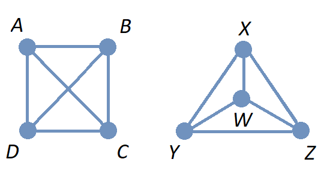

= Graphs
//= Graph Theory

#*CAUTION* - CHAPTER UNDER CONSTRUCTION!#

_This chapter was last updated on November 18, 2024._

// MKD start topics lists
////

ACM CCECC TOPICS: Graphs and trees 	11 hours 	

// MKD move trees to a separate chapter
directed graphs
undirected graphs
weighted graph
Eulerian and Hamiltonian circuits
traveling sales person
graph coloring
//
trees (binary, spanning)
expression trees
tree traversals

Learning Outcome CS. 26.
Illustrate the basic terminology and properties of graphs and trees.

Learning Outcome CS. 32.
Use graphs and trees to solve problems algorithmically

GRAPHS (MKD) based on GRAPH THEORY (GGC12)
	Graphs and trees	undirected graphs
	Graphs and trees	directed graphs
	ACTIVITY: Handshake
	Graphs and trees	weighted graphs
	Graphs and trees	Eulerian and Hamiltonian circuits
	Graphs and trees	traveling sales person
	Graphs and trees	graph coloring
	ACTIVITY: Ramsey
    COMP 152 Graphs and Trees and DS5.
        Undirected graphs
        Directed graphs        
	AL3. Fundamental computing algorithms [core] (12 hours minimum) 
		- COVER SOME, NOT ALL
		Representations of graphs (adjacency list, adjacency matrix)
		Shortest-path algorithms (Dijkstra’s and Floyd’s algorithms)
		Transitive closure (Floyd’s algorithm)
		Topological sort
	2003 changes/additions:
		[Core-Tier1]
			• Trees (MOVE TO TREES)
				o Properties (MOVE TO TREES)
				o Traversal strategies (MOVE TO TREES)
			• Undirected graphs
			• Directed graphs
			• Weighted graphs
		[Core-Tier2]
			• Spanning trees/forests (MOVE TO TREES)
			• Graph isomorphism	

AUG 2024 update on topics
Undirected graphs
Directed graphs
Weighted graphs
isomorphism
Eulerian and Hamiltonian circuits
traveling sales person
graph coloring

More topics:
Simple Graphs
Multigraphs (allows loops and multiple edges between vertices)
Modeling (how to choose simple vs multigraphs, undirected vs directed)
Terminology: 
	ADJACENT vertices (NEIGHBORS), edges are INCIDENT WITH (or CONNNECT) their ENDPOINTS, DEGREE of a vertex in a graph (and loops contribute twice), an ISOLATED vertex has degree 0 that is it is not an endpoint of any edge,
ACTIVITY: HANDSHAKE
	students experiment to arrive at the conjecture for the Handshake theorem for undirected graphs
More Terminology for Directed Graphs: 
	ADJACENT FROM/TO, INITIAL and TERMINAL vertices, IN-DEGREE and OUT-DEGREE of a vertex, 
Theorem: The sum of the in-degrees equals the sum of the out-degrees (sums taken over all vertices of the graph)
Complete Graphs
N-Cube
Bipartite Graphs (the set of vertices can be partitioned into two subsets, and each edge connects across these subsets, NO edges connect within)
Complete Bipartite Graphs

Subgraphs
Unions of Graphs

Adjacency Matrix of a Graph
Adjacency Lists of a Graph
Isomorphism ("same shape" or "equal form" -  it's easier to determine NONisomorphic graphs than to prove that two are isomorphic)

Connectivity: Path of length n, Circuit, Cycle (i.e., simple circuit - uses no edge more than once) 
Hamiltonian Cycle - contains all vertices of the graph
Euler Paths and Cycles - uses each edge exactly once (The Königsberg Bridges)
Theorem: Let G be a connected graph. G has a Eulerian circuit if and only if each vertex is even degree

connected components

An directed graph is strongly connected if there is a path from a to b and from b to a whenever a and b are vertices in the graph.

An directed graph is weakly connected if there is a path between any two vertices in the underlying undirected graph

PLanar graphs

Applications:
	shortest path (or minimal sum of weights)
	Dijkstra’s algorithm
	The Traveling Salesman Problem (discuss Big-O and approximation algorithms?)

ACTIVITY: RAMSEY
	students experiment to derive conjecture about K5 and K6

TREES - break this out to it's own chapter? They are only mentioned in exercises in the GGC book
Trees and forests
Spanning trees and spanning forests
Kruskal's algorithm for (minimal cost) spanning tree
rooted TREES
binary trees -  full binary tree, complete binary trees, balanced???
APPLICATIONS:
	counting problems
	arithmietic/algebraic expressions
Bianry tree representation
Tree traversal algorithms - preorder, inorder, postorder

MKD SECTIONS AND SUBSECTIONS
Introduction and Basic Definitions
(Undirected) Graphs
	Formal definition (set theoretic)
	Simple Example implemented in Python??? ()
	Degree
	Handshake Theorem (HANDSHAKE ACTIVITY)
	Example of Graph (application)
	REPRESENTATIONS
		drawing
		adjacency Matrix
		adjacency List
Directed Graphs 
	In- and Out-degree
	Analog to Handshake Theorem 
	Example of Directed Graph (application)
	REPRESENTATIONS
		drawing
		adjacency Matrix
		adjacency List
Weighted Graphs 
	Example of Weighted Graph (application) - minimal cost path
PATHS AND CIRCUITS
Eulerian and 
Hamiltonian circuits; 
traveling sales person; 
graph coloring; 
	vertex coloring (example - )
	edge coloring (RAMSEY ACTIVITY)

////
// MKD end topics lists

// ****  MKD content starts here  ****

Graphs are discrete mathematical structures that have many applications in a diversity of fields including chemistry, network analysis, algorithms, and social sciences.

== Introduction and Basic Definitions

//MKD rewrite of first paragraph
//A *graph* $G=\left(V,\ E\right)$ is a structure consisting of a set of objects called vertices $V$ and a set of objects called edges $E$. An *edge* $e\in\ E$ is a set of the form $e=\left\{x,y\right\}$, where $x,y\in\ V$. That is, an edge is a set of vertices. We call the vertices $x$ and $y$ the *endpoints* of the edge $E$. In the case where $x = y$, we call the edge a *loop* since the edge connects the one endpoint to itself.

A graph consists of a set of *vertices*  (also called *nodes*) and a set of *edges,* 
where each edge  
connects either two different vertices or a vertex to itself. 

* For each edge, its *endpoints* are the vertices that it connects. The edge is said to be incident with each endpoint, and to connect the endpoints.
* If an edge has only one endpoint, it is called a *loop.* 
* An *isolated vertex* is a vertex that is not an endpoint of any edge.
* If two or more edges connect the same endpoints (or endpoint if the edges are loops), the graph is called a *multigraph.*
// MKD - can a multigraph contain ANY loops???
* A *simple graph* is a graph that has no loops and does not have two or more edges that connect the same endpoints.
//If there are no loops and no two edges connect the same endpoints, the graph is called *simple.* 

// MKD add additional terms after May 24, 2024 (also add to the example): 
//		adjacent, neighbor, neighborhood, parallel edges

Graphs discussed in this textbook are assumed to be simple unless stated otherwise.

****
.Example {counter:graphex} 
//- A multigraph that contains a loop and an isolated point
//- An undirected graph.

//The graph shown has vertex set $\left\{A,\ B,\ C,\ D,\ E,\ F\right\}$ and 
//edge set $\{\{A,C\},\{D\},\{B,D\}\{B,F\},\{D,F\}\}.$ 

The graph shown has 7 vertices 
// set $\left\{A,\ B,\ C,\ D,\ E,\ F\right\}$ 
and 7 edges.
// set $\{\{A,C\},\{D\},\{B,D\}\{B,F\},\{D,F\}\}.$ 

image::imagesMKD/graphMKD1.png[]
//image::imagesMKD/graph1withAddedLoopAndComponents_MultigraphVersion.png[]
//image::imagesMKD/graph1withAddedLoopAndComponents.png[]
//image::images/graph1.png[]

This is _one graph_ that is made up of three separate _connected components_ (Connectivity will be defined in detail later in the chapter, but is introduced informally here). 

* One connected component contains the vertices $A$ and $C$ and two edges that connect them.  
* A second connected component contains the vertices $B$, $D$, $E$, and $F$ and the edges that are incident to those vertices. 
* A third connected component contains the single isolated vertex $G$ and no edges.
 
In the second connected component, 
the graph is drawn so that 
the edge with endpoints $B$ and $F$ and 
the edge with endpoints $D$ and $E$ 
cross, but the point of intersection is ignored 
because it is not a vertex. 
//We could redraw this graph with $E$ to the left of $D$ so that the two edges do not cross; 
We could redraw this graph so that the two edges do not cross; for example, we could move $E$ inside the triangle. 
However, there are some graphs which cannot be drawn in 2 dimensions without some edge crossings.

This graph is a multigraph because there are multiple edges that connect the pair of vertices $\{A,C\}$.

This graph is not simple because (1) it contains a loop and (2) it has a pair of vertices that are connected by two different edges.

****

//It is possible to write a formal definition of graphs in terms of set //theory, but it is common to use a drawing as in the preceding example when //there are small numbers of vertices and edges. 

In the next section, we will _define_ graphs in terms of set theory, 
but it is more useful to _represent_ a graph using either a drawing as in the preceding example, or a list or a matrix as described later in this chapter.

// MKD define digraphs in separate section

== Undirected Graphs

In this section, we will assume that graphs must have undirected edges, but could have loops and/or *parallel edges* (that is, multiple edges with the same endpoints.)

#NOTICE: No updates will be made to the "Undirected Graphs" section before Dec. 20, 2024.# Please skip to the next section, "Simple Graphs."

// MKD move handshake here

// MKD Nov 4 2024: Need to reinstate "Representing graphs." sections

== Simple Graphs

// MKD - probably need to keep this formal definition

Recall that in a simple graph, there are no loops and no two edges can connect the same endpoints. This means that each edge is determined by its two distinct endpoints. This allows us to give a relatively simple but formal set-theoretic definition of "simple graph". This formal definition can be useful if you need to implement a simple graph in code.

A *simple graph* $G=\left(V,\ E\right)$ is an ordered pair consisting of a set $V$ of objects called *vertices* (also called *nodes*) and a set $E$ of objects called *edges*.
An edge $e\in\ E$ is a set of the form $e=\left\{x,y\right\}$, where the vertices $x$ and $y$ are two different elements of $V$. The two vertices $x$ and $y$ in the edge $e=\left\{x,y\right\}$ are said to be *adjacent* or *connected* or *neighbors*, and $x$ and $y$ are called the *endpoints* of the edge $e$. 

//The graph in the previous example has vertex set 
//$\left\{A,\ B,\ C,\ D,\ E,\ F\right\}$ and 
//edge set
//$\{\{A,C\},\{D\},\{B,D\}\{B,F\},\{D,F\}\}.$ Note that the graph is not a //simple graph because there is a loop that has endpoint $D$.

****
.Example {counter:graphex} - a simple graph.

The graph shown has vertex set 
$\left\{A,\ B,\ C,\ D,\ E,\ F\right\}$ and 
edge set 
$ \{\{A,C\},\{A,D\},\{B,D\}\{B,F\},\{C,F\},\{D,F\},\{E,F\}\}.$

// MKD - relabel graph so that E is not both the Edge set and vertex E???

image::images/graph1.png[]

****

// MKD create a python code sample for the example; maybe replace the one introduced immediately above by the one in the earlier simple graph example. 

The *degree* of a vertex $v \in V$, denoted $d(v)$, is the number of edges in the graph $G$
containing the vertex $v$.

****
.Example {counter:graphex}

The degrees of each of the vertices in the undirected graph $G$  with vertex set
$V=\{A,B,C,D,E,F,G\}$ and edge set $E=\{\{A,C\},\{A,D\},\{B,D\}\{B,F\},\{C,F\},\{D,F\},\{F,G\}$
are,

$d\left(A\right)=2$

$d\left(B\right)=2$

$d\left(C\right)=2$

$d\left(D\right)=3$

$d\left(E\right)=0$

$d\left(F\right)=4$

$d\left(G\right)=1$

****

Notice that the sum of all the degrees
$d\left(A\right)+\ d\left(B\right)\ +\ d\left(C\right)+\ \ d\left(D\right)\ \ +d\left(E\right)+\ d\left(F\right) + d\left(G\right)=14$, which is 
is twice the number of edges, $2 \cdot \left|E\right|=7$.
In fact, this is true for any undirected graph with finitely many edges as long as any loops are counted twice. 
This result is called the Handshaking Theorem. A formal proof of the Handshaking Lemma can be written using mathematical induction on the predicate 
$P(n):$ "If graph $G$ has $n$ edges, then the sum of the degrees of the vertices of $G$ is equal to $2n.$"

.Handshaking Theorem
****
The sum of the degrees of the vertices of a graph $G=\left(V,\ E\right)$ is equal to twice the number of edges
in $G$. That is, $\displaystyle \sum_{v\in V}{d\left(v\right)=2\ \left|E\right|}$.
****

[NOTE]
====
A useful consequence of this to keep in mind is that the sum of the degrees of a graph is always even.
====

=== Simple Directed Graphs

A *directed graph* (or *digraph*) is a graph in which the edges are directed from one vertex to another vertex.

****
.Example {counter:graphex} - A directed graph.

The graph $G=(V,E)$ with vertex set 
$V=\{A,B,C,D,E,F\}$  and 
edge set
$E=\{ (A,C),(D,A),(B,D),(F,B),(C,F),(D,F),(F,E) \}$. 
The first coordinate of each edge is the initial vertex and the second coordinate is the terminal vertex.

image::images/graph2.png[]

****

=== Directed Graphs

We can give a formal set-theoretic definition of simple directed graph as well. To indicate the directed edges, ordered pairs of vertices are used instead of 2-element sets.

A *simple directed graph* $G=\left(V,\ E\right)$ is an ordered pair consisting of a set $V$ of objects called *vertices* (or *nodes*) and a set $E$ of objects called *edges*.
A *directed edge* $e\in\ E$ is an ordered pair of the form $e=\left(x,y\right)$, where the vertices $x$ and $y$ are two different elements of $V$. Vertex $x$ is the *initial vertex* of $e$ and vertex $y$  is the *terminal vertex* of edge $e$. 

//The graph in the previous example has vertex set 
//$\left\{A,\ B,\ C,\ D,\ E,\ F\right\}$ and 
//edge set
//$\{\{A,C\},\{D\},\{B,D\}\{B,F\},\{D,F\}\}.$ Note that the graph is not a //simple graph because there is a loop that has endpoint $D$.

// MKD - insert the analog of Handshake :
// sum of in-degrees = sum of out-degrees = number of directed edges

== Examples of Simple Graphs

// MKD - 
//		Complete Graph on $n$ Vertices
//		cycles, wheels, $n-$cubes
//		Bipartite Graphs and Complete Bipartite Graphs
//			mention coloring here

In this section presents several classes of graphs.

//image::imagesMKD/KompletGraphOn4Vertices.png[KompletGraphOn4Vertices,406,403,float="right",align="center"]
image::imagesMKD/KompletGraphOn4Vertices.png[KompletGraphOn4Vertices,80,80,float="right",align="center"]
The *complete graph* $K_n$ is the simple graph with $n$ vertices such that any two vertices are adjacent, that is, every pair of vertices are the endpoints of an edge. 
//Click link:https://commons.wikimedia.org/wiki/File:Complete_graph_K7.svg[here] to see an image of $K_7,$ the complete graph on $7$ vertices. 
The image shows $K_{4},$ the complete graph on 4 vertices. Click link:https://en.wikipedia.org/wiki/Complete_graph#Examples[here] to see images of $K_{n}$ for the positive integers that are less than or equal to $12.$

//image::imagesMKD/3cubev2.png[3cubev2,489,629,float="right",align="center"]
//image::imagesMKD/3cubev2.png[3cubev2,147,189,float="right",align="center"]
//image::imagesMKD/nCubesv1.png[nCubesv1,1200,660,float="right",align="center"]
//image::imagesMKD/nCubesv1.png[nCubesv1,240,132,float="right",align="center"]
image::imagesMKD/nCubesv1.png[nCubesv1,300,165,float="right",align="center"]
The *n-cube* $Q_{n}$ can be described as the graph that has vertex set consisting of the $2^{n}$ bitstrings of length $n,$ and edges such that two vertices are adjacent if and only if the bitstrings differ in exactly one bit position. The image shows the three graphs $Q_{1},$ $Q_{2},$ and $Q_{3};$ these graphs can be used as a way to represent the power sets of sets that have $1,$ $2,$ and $3$ elements, respectively. Notice that $Q_{2}$ can be drawn as a square and that $Q_{3}$ can be represented as a cube in $3$-dimensional space (or by a drawing of a cube in a $2$-dimensional plane.)
//The *n-cube* $Q_{n}$ can be described as the graph that has $2^{n}$ vertices labeled by the bitstrings of length $n$ such that two vertices are adjacent if and only if the bitstrings differ in exactly one bit position. The image shows the three graphs $Q_{1},$ $Q_{2},$ and $Q_{3};$ these graphs can be used as a way to represent the power sets of sets that have $1,$ $2,$ and $3$ elements, respectively.

A *bipartite graph* is a simple graph whose set of vertices can be partitioned into two disjoint nonempty sets 
//$V_{1}$ and $V_{2}$ 
such that every vertex is in exactly one of the two sets 
//$V_{1}$ and $V_{2},$ 
and every edge has one endpoint in each of the two sets. 
//$V_{1}$ and the other endpoint in $V_{2}.$ 
One way to think of a bipartite graph is that each vertex can be assigned one of two colors so that every edge must connect vertices of different colors.  Notice that $Q_{1},$ $Q_{2},$ and $Q_{3}$ are all examples of bipartite graphs (Question: Is $Q_{n}$ a bipartite graph for _every_ natural number $n?$ Why or why not?)

//image::imagesMKD/K32v2.png[3cubev2,314,200,float="right",align="center"]
//image::imagesMKD/K32v2.png[3cubev2,128,80,float="right",align="center"]
image::imagesMKD/K32v2.png[3cubev2,157,100,float="right",align="center"]
This image shows the graph $K_{2,3}$ and is another example of a bipartite graph. 
//There are $2$ "upper" vertices and $3$ "lower" vertices, and every edge connects one of the "upper" vertices and one of the "lower" vertices. 
Notice that $K_{2,3}$ has an additional property: _Every_ pair of vertices $\{a, b \}$ with $a$ in the set of $2$ "upper" vertices and $b$ in the set of $3$ "lower" vertices are the endpoints of an edge. A bipartite graph that has this additional property is called a *complete bipartite graph.* In general, the symbol $K_{m,n}$ represents the complete bipartite graph that has two disjoint sets of vertices, one of cardinality $|m|$ and the other of cardinality $|n|,$ such that every pair of vertices that come from the different sets are joined by an edge. Notice that $Q_{1} = K_{1,1}$ and $Q_{2} = K_{2,2}$ are complete bipartite graphs, but that $Q_{3}$ is not a complete bipartite graph because, for example, there is no edge joining $000$ and $111.$ + 
[small]#NOTE: The phrase _"complete bipartite"_ needs to be read as a single term used to indicate that a bipartite graph has all the edges it can possibly have. For example, $K_{2,3}$ is a bipartite graph such that if you tried to enlarge it by inserting an additional edge into the graph, that edge would join either the $2$ "upper" vertices, $2$ of the "lower" vertices, or $2$ vertices that are already joined; in this sense, $K_{2,3}$ is "complete" as a bipartite graph. $K_{2,3}$ is not a "complete graph" in the sense of the earlier example in this section. In fact, since a "complete graph" must contain an edge for every pair of distinct vertices, the only graph that can be both a "complete graph" and a "complete bipartite graph" is $Q_{1} = K_{2} = K_{1,1}.$ Mathematicians recycle and reuse a lot of words... .#

//with a set of $5$ vertices partitioned into two sets of cardinalities $2$ and $3$

== Representing Simple Graphs

In addition to the vertex-edge drawing, a simple graph can be represented in other ways that are more useful for computing.

First, recall that if $u$ is a vertex of a simple graph, then vertex $v$ is said to be *adjacent to $u$* if and only if $\{u, v \}$ are the endpoints of an edge of the graph.  

One way to represent a simple graph is by using an *adjacency list.* This list can be written as a table, where each row has two columns. In each row, the entry in the first column is a single vertex $v$ and the entry in the second column is a list of all vertices of the graph that are adjacent to $v.$

//=== The Adjacency Matrix
Another way to represent a simple graph is by using an *adjacency matrix.* The adjacency matrix of a simple graph 
//$\mathbf{M}$ 
represents the graph in table form, and contains an entry for each pair of vertices. 
// row and column for each vertex. 
// $v_i$. If the vertices $v_i$ and $v_j$ are 
For each vertex of the graph, there is a row and also a column. 
If vertices $u$ and $v$ are adjacent (that is, connected by some edge), then the adjacency matrix will contain a $1$ in the position that corresponds to the row for $u$ and the column for $v,$ otherwise the matrix contains a $0$ at that postion. The next example may help make this more clear.

//$i-th$ row and $j-th$ column and $0$ otherwise. Denoting by $m_{i,\ j}$ the component of the adjacency matrix in the $i-th$ row and $j-th$ column, we define the adjacency matrix for the graph $G=\left(V,E\right)$ as

//latexmath:[ m_{i,j}=\left\{
//\begin{array}{cc}
// 1 & \text{if}\text{  }\left\{v_i,v_j\right\} \text{is}\text{ }\text{in}\text{  }E\text{  } \\
// 0 & \text{otherwise}
//\end{array}
//\right.
//]

****
//.Example {counter:graphex} - adjacency matrix of a graph
//.Example {counter:graphex} - Adjacency Matrix and Adjacency List
.Example {counter:graphex} - Representing A Simple Graph

The graph with vertex set 
//$V=$
$\left\{A,\ B,\ C,\ D,\ E,\ F\right\}$ and edge set 
//$E=$ 
$\{\{A,C\},\{A,D\},\{B,D\}\{B,F\},\{C,F\},\{D,F\},\{E,F\}\}$ can be represented by 

the drawing

image::images/graph1.png[]

or the adjacency list

[cols="<1e,<4e",width=25%",align="center",options="header"]
|===
^| *Vertex*     ^| *Adjacent Vertices* 
^| A | C, D 
^| B | D, F 
^| C | A, F 
^| D | A, B, F 
^| E | F 
^| F | B, C, D, E  
|===

or the adjacency matrix

$\mathbf{M}=\left(\begin{matrix}0&0&1&1&0&0\\0&0&0&1&0&1\\1&0&0&0&0&1\\1&1&0&0&0&1\\0&0&0&0&0&1\\0&1&1&1&1&0\\\end{matrix}\right)$ + 
[small]#For example, in matrix $\mathbf{M}$ the rows, from top to bottom correspond to the vertices $A,\ B,\ C,\ D,\ E,\ F$ and the columns, from left to right, corespond to vertices $A,\ B,\ C,\ D,\ E,\ F.$ The values in row 3, which corresponds to vertex $C$, indicate whether the  vertex for that column is adjacent to $C.$ If we use the symbol $M_{r,c}$ to stand for the value in row $r$ and column $c,$ then $M_{3,5} = 0$ because there is no edge in the graph with endpoints $C$ and $E,$ and $M_{3,6} = 1$ because there is an edge in the graph with endpoints $C$ and $F$.#

****

////
//latexmath:[ \left(\begin{matrix}0&0&1&1&0&0\\0&0&0&1&1&0\\1&0&0&0&0&1\\1&1&0&0&0&1\\0&0&0&0&0&1\\0&1&1&1&1&0\\\end{matrix}\right) ]

// MKD old oddly-ordered matrix
//\begin{matrix}A&0&1&1&0&0&0\\C&1&0&0&0&1&0\\D&1&0&0&1&1&0\\B&0&0&1&0&1&0\\F&0&1&1&1&0&1\\E&0&0&0&0&1&0\\\ &A&C&D&B&F&E\\\end{matrix}

latexmath:[ 
\begin{table}[]
\centering
\begin{tabular}{ll}
Vertex & Adjacent Vertices
\hline
A &  C, D  \\
B &  D, F  \\
C &  A, F  \\
D &  A, B, F  \\
E &  F  \\
F &  B, C, E  \\
\end{tabular}
\end{table}
]

latexmath:[ 
\begin{center}
\begin{tabular}{l|l}
Vertex & Adjacent Vertices
\hline
A &  C, D  \\
B &  D, F  \\
C &  A, F  \\
D &  A, B, F  \\
E &  F  \\
F &  B, C, E  \\
\end{tabular}
\end{center}
]

[small]#For example, in this adjacency matrix, row 3 corresponds to vertex _C_ and column 6 corresponds to vertex _F_ so there is a 1 at position $M_{3,6}$ of the matrix.#

\begin{equation}
\begin{aligned}
(a+b) \left( a^{2} + 2ab + b^{2} \right) {} & = a \left( a^{2} + 2ab + b^{2} \right) + b \left( a^{2} + 2ab + b^{2} \right)  \\ 
& = a^{3} + 2a^{2} b + ab^{2} + a^{2} b + 2ab^{2} + b^{3}  \\
& = (1)a^{3} + (2+1) a^{2} b + (1+2) ab^{2} +(1) b^{3} \\ 
& = a^{3} + 3 a^{2} b + 3 ab^{2} + b^{3}
\end{aligned}
\end{equation}
////

////
// MKD old matrix to graph example begins  
****
//.Example {counter:graphex} - obtaining the graph from the adjacency matrix
.Example {counter:graphex} - Creating the drawing from the adjacency matrix

Consider the simple graph with adjacency matrix

//\begin{matrix}a&0&1&1&1\\c&1&0&1&1\\d&1&1&0&1\\b&1&1&1&0\\\ &a&c&d&b\\\end{matrix}

\begin{matrix}a&0&1&1&1\\b&1&0&1&1\\c&1&1&0&1\\d&1&1&1&0\\\ &a&b&c&d\\\end{matrix}

The entries in the matrix indicate that each vertex is adjacent to every other vertex. This means that you could represent the graph as shown below.

image::images/graph3.png[]

****
// MKD old matrix to graph example ends  
////

////
// MKD adjacency for digraphs begins 
=== The Adjacency Matrix for Directed Graphs

Undirected graphs are represented using symmetric adjacency matrices while digraphs are represented by adjacency matrices that are not symmetric.

****
.Example {counter:graphex} - adjacency matrices for an undirected graph and for a directed graph

In the figure below the first graph is undirected while the second is a digraph.

image::images/graph4.png[]

Their adjacency matrices are respectively,

latexmath:[
\left(\begin{matrix}0&1&1&0\\1&0&1&0\\1&1&0&0\\0&0&0&0\\\end{matrix}\right)
]
 and
latexmath:[
\left(\begin{matrix}0&1&0&0\\0&0&1&0\\1&0&0&0\\0&0&0&0\\\end{matrix}\right).
]

****
// MKD adjacency for digraphs ends 
////

== Weighted Graphs

In some applications, each edge of a graph has a *weight,* which is some nonnegative number. The weight could represent the physical distance between the two endpoint nodes, or could represent the cost to travel or transmit data between the endpoint nodes. 

//A *weighted graph* is one in which each edge $e$ is assigned a nonnegative number $w(e)$, called the weight of that edge. Weights are typically associated with costs, or capacities of some type like distance or speed.  

You can use an adjacency matrix to describe a weighted graph, but instead of using a $1$ to represent that there is an edge between two vertices 
//, say $v_i$, and $v_j$, we 
you place the the weight of the edge in the correct position of the adjacency matrix, as shown in the following example.

****
//.Example {counter:graphex} 
.Example {counter:graphex} - Weighted Graph

//Consider first the following weighted undirected graph

Consider the following weighted simple graph

image::images/graph5.png[]

The adjacency matrix of this weighted graph is
latexmath:[
\left(\begin{matrix}0&2&5&0\\2&0&3&0\\5&3&0&1\\0&0&1&0\\\end{matrix}\right).
]

////
By contrast, the directed weighted graph below

image::images/graph6.png[]

has adjacency matrix
latexmath:[
\left(\begin{matrix}0&2&0&0\\0&0&3&0\\5&0&0&1\\0&0&0&0\\\end{matrix}\right).
]
////

****

== Connectivity, Eulerian Graphs, and Hamiltonian Graphs
//== Paths and Circuits 

////
A *path* of length $n$ from $u$ to $v,$ where $n$ is a positive integer, in 
//an undirected graph 
a simple graph 
is a sequence of edges $e_{1}, e_{2}, \ldots , e_{n}$ of the graph such that e1 = (x0, x1), e2 = (x1, x2), ..., en = (xn-1, xn), wherex0 =uandxn =v.Wecanalsodenotethispathbyits vertex sequence x0, x1, ..., xn
////

//In this section you will study the ways you can move from node to node along the edges of a graph. 

A *walk* on a graph $G=\left(V,E\right)$ is a finite, non-empty, alternating sequence of vertices and edges of the form, $v_0e_1v_1e_2\ldots e_nv_n$, with vertices $v_i\in V$ and edges $e_i\in E$. 

We will focus on simple graphs. For simple graphs, there is at most one edge joining adjacent vertices, so we can omit the edges from the sequence and instead write $v_0v_1\ldots v_n.$

* A *trail* is a walk that does not repeat an edge. That is, all edges in a trail are distinct.

* A *path* is a trail that does not repeat a vertex.

* The *distance* between two vertices, $u$ and $v$, denoted $d(u,v)$, is the number of edges in a shortest path connecting them.

* A *cycle* is a non-empty trail in which the only repeating vertices are the beginning and ending vertices, $v_0=v_n$.

****
.Example {counter:graphex} - Trails, Paths, and Cycles

In the graphs below the first shows a trail $CFDBFE$.
It is not a path since the vertex $F$ is repeated.
The second shows a path $CADFB$, and the third a cycle $CADFC$. Also note the following
distances, $d(A,D)=1$, while $d(A,F)=2$, and $d(A,E)=3$.

image::images/graph9.png[]

****

A graph is *connected* if there is a path from each vertex to every other vertex.

****
.Example {counter:graphex} - A graph that is not connected

The graph $G$ below is not connected since, as just one example, there is no path from vertex $a$ to vertex $e.$

image::images/graph10.png[]

$G$ has adjacency matrix

latexmath:[
\left(\begin{matrix}0&1&1&0&0\\1&0&1&0&0\\1&1&0&0&0\\0&0&0&0&1\\0&0&0&1&0\\\end{matrix}\right).
]
****

//=== Eulerian paths and circuits

=== Eulerian Graphs

//Informally an  *Eulerian graph* is one in which there is a closed (beginning and ending with the same vertex) trail that includes all edges. To define this precisely, we use the idea of an Eulerian trail.

An *Euler path* on a graph is a path that uses each edge of the graph exactly once. 

An *Euler circuit* (also called an *Eulerian trail*) is a closed trail containing each edge of the graph $G$ exactly once and returning to the start vertex. A graph with an Euler circuit is considered *Eulerian* or is said to be an *Eulerian graph*.

In the following, the first graph is Eulerian. The sequence of edges $e_1 e_2 e_3 e_4 e_5 e_6 e_7$ describes an Euler circuit. 
The second graph is not an Eulerian graph. Convince yourself of this fact by  looking at all necessary trails or closed trails.

//image::images/graph11.png[]
image::imagesMKD/graph11_MKD.png[]

The following are useful
characterizations of graphs with Euler circuits and Euler paths and are due to Leonhard Euler

.Theorem on Euler Circuits and Euler Paths

****
.. A finite connected graph has an Euler circuit if and only if each vertex has even degree.
.. A finite connected graph has an Euler path if and only if it has at most two vertices with odd degree.
****

//=== Hamiltonian paths and circuits

=== Hamiltonian Graphs

A cycle in a graph $G$, is said to be a *Hamiltonian cycle* if every vertex,
except for the starting and ending vertex, is visited exactly once.

A graph is *Hamiltonian*, or said to be a *Hamiltonian graph*, if it contains a Hamiltonian cycle.

The following graph is Hamiltonian and shows a Hamiltonian cycle $ABCDA$, highlighted, while
the second graph is not Hamiltonian.

image::images/graph12.png[]

While we have the Euler Theorem to tell us which graphs are Eulerian or not, there are no comparable simple criteria to determine if graphs are Hamiltonian or not. We do have the following sufficient
criterion due to Paul Dirac.

.Theorem (Dirac) on Hamiltonian graphs
****
A simple graph, with $n≥3$ vertices, is Hamiltonian if every vertex $v$ has degree $d(v)\geq \frac{n}{2}$.

****

// MKD new section Nov 17 2024
== Creating New Graphs From Old Graphs

Given a set of one or more graphs, there are several ways to create new graphs using the graphs in the set. 

//== Subgraphs
=== Subgraphs

//A graph $H=(V_1,E_1)$ is said to be a *subgraph* of the graph $G=(V,\ E)$ if $V_1\subseteq V$ and $E_1\subseteq E$. 
// MKD Nov 17 2024
Given a simple graph $G,$ you can form a *subgraph* $H$ by choosing a subset of the vertices of $G$ along with a subset of the edges of $G$ such that each edge has endpoints in the set of vertices you chose. That is, $H$ is a subgraph of $G$ if $H$ is a graph such that every vertex of $H$ is a vertex of $G$ and every edge of $H$ is a vertex of $G.$ + 
[small]#More formally, $H = (V_{H}, E_{H})$ is a subgraph of $G = (V,E)$ if and only if all three of the following statements are True: $V_{H} \subseteq V,$ $E_{H} \subseteq E,$ and for every edge $e \in E_{H}$ the endpoints of $e$ are in $V_{H}.$#

//If the vertex $v\in V$ belongs to the graph  $G=(V,E)$, 
If $v$ is a vertex of $G,$
we denote by *$G-v$*,
the subgraph obtained from $G$ by removing the vertex $v$ along with all edges in $E$ that have $v$ as an endpoint.
//adjacent to the vertex $v$.

The image shows 
//Below is shown 
a graph $G$, and the subgraph $G-d$ formed by removing the vertex $d$.

image::images/graph7.png[]

//A natural generalization of the subgraph obtained by removing a 
//single 
//vertex and its associated edges 
//is the 
In the same way, you can obtain 
//subgraph obtained 
a subgraph by removing multiple vertices along with the edges associated with the removed vertices. The subgraph obtained 
is called the subgraph *induced* by removing those vertices.

****
.Example {counter:graphex}
Below is a graph $G(V,E)$ and the subgraph obtained by $V-\{a,d\}$, called the induced subgraph
$G-\{a,d\}$, with a slight abuse of notation

image::images/graph8.png[]
****

=== Unions and Intersections Of Graphs 

Given two simple graphs $G_{1}$ and $G_{2}$, you can form the *union* of the graphs by taking the union of the two sets of vertices to get a new set of vertices, and taking the union of the two sets of edges to get a new set of edges. Notice that any edge that is in both graphs will only appear once in the new graph because you took the union of the sets of edges, that is, you can't create parallel edges by forming the union. 

In the same way, you can form the *intersection* of two simple graphs by taking the intersection of the two sets of vertices to get a new set of vertices, and taking the intersection of the two sets of edges to get a new set of edges. 

== Graph Isomorphism

//As you have seen before, 
Recall that a graph is determined by its set of vertices and how those vertices are connected by edges, but [underline]#not# the drawing you use to represent the graph. 

****
.Example {counter:graphex} - The Same Graph Can Be Drawn In More Than One Way 

Consider the two graphs shown in the image. 

//image::imagesMKD/Isomorphism2av2.png[Isomorphism2av2,550,290,float="right",align="center"]
image::imagesMKD/Isomorphism2av2.png[Isomorphism2av2,440,232,align="center"]

Notice that these two graphs are 
//really just two 
different-looking drawings of the _same graph_ that has vertex set $\{ A, B, C, D\}$ and edge set $\{\{A,B\},\{A,C\},\{A,D\}\{B,C\},\{B,D\},\{C,D\}\}.$ Also, notice that the drawing on the left appeared earlier in the chapter, but with unlabeled vertices: This is a drawing of $K_{4},$ the complete graph on $4$ vertices.  

//That these really are the same graph is seen more easily by representing  the graph 

Notice that using either the adjacency list 
//The image shows two of the ways that the graph $K_{4}$ can be drawn. 

[cols="<1e,<4e",width=25%",align="center",options="header"]
|===
^| *Vertex*     ^| *Adjacent Vertices* 
^| A | B, C, D 
^| B | A, C, D
^| C | A, B, D 
^| D | A, B, C 
|===

or the adajcency matrix \[\left(\begin{matrix}0&1&1&1\\1&0&1&1\\1&1&0&1\\1&1&1&0\\\end{matrix}\right)\] makes it easier to see that the two drawings represent the exact same graph. 

You can imagine the graph on the right being the result of dragging the vertex $C$ inside the "triangle" with vertices $A,$ $B,$ and $D.$

****

Sometimes, different graphs may be essentially the same graph, as in the next example.

****
.Example {counter:graphex} - Two Graphs That Are Essentially The Same Graph

Consider the two graphs, each with $4$ vertices and $6$ edges, shown in the image. 

//image::imagesMKD/Isomorphism2av3.png[Isomorphism2av3,550,290,float="right",align="center"]
 

These graphs are not equal since the graph on the left has vertex set $\{ A, B, C, D\}$ and the graph on the right has vertex set $\{ W, X, Y, Z\}.$ However, by comparing the graph on the right to the one on the right in the previous example, you can see that there is a one-to-one correspondence between the two sets of vertices 
that preserves adjacency (that is, if two vertices in the upper row are endpoints of an edge of the graph on the left, then the corresponding vertices in the lower row are endpoints of an edge of the graph on the right.) 

image::imagesMKD/K4Isomporphismv1.png[K4Isomporphismv1,186,149,align="center"] 

****

//$\mathbf{M}=\left(\begin{matrix}0&0&1&1&0&0\\0&0&0&1&0&1\\1&0&0&0&0&1\\1&1&0&0&0&1\\0&0&0&0&0&1\\0&1&1&1&1&0\\\end{matrix}\right)$ + 
//Notice that this one-to-one correspondence has the additional property that edges are mapped to corresponding edges. That is, the function $f:\{ A, B, C, D\} \rightarrow \{ W, X, Y, Z\}$ represented in the table has the property that the edge with endpoints $u$ and $v$ is mapped to the edge with endpoints $f(u)$ and $f(v).$ A one-to-one correspondence with this property is called a *graph isomorphism* and the two graphs are said to be *isomorphic.* Informally, you can think of a pair of graphs as isomporphic if one graph can be relabeled and/or reshaped to obtain the other graph.

A one-to-one correspondence between the set of vertices of two simple graphs that preserves adjacency is called a *graph isomorphism,* and the two graphs are said to be *isomorphic.* Informally, you can think of two isomorphic graphs as a pair of graphs where one graph can be relabeled and/or reshaped to obtain the other graph (That is, the two graphs are the _same graph_ but have drawings that are labeled and/or shaped differently.)

****
.Example {counter:graphex} - Using Graph Isomorphism

Using graph isomorphisms can help identify properties of a graph. 
 
//image::imagesMKD/Isomorphism1av2.png[Isomorphism1av2,1380,600,float="right",align="center"]
image::imagesMKD/Isomorphism1av2.png[Isomorphism1av2,690,300,align="center"] 
The three graphs in the image are isomorphic; it is an exercise for you to write out the one-to-one correspondences. 

.You Try
Write out the one-to-one correspondences between the sets of vertices that define the graph isomorphisms.

Once you have shown that the three graphs are isomorphic, you can use the fact that they are different representations of the _same_ graph. For example, 

* It is not immediately clear that the graphs on the left and right are bipartite, but the arrangement of the vertices in the middle graph into "upper" and "lower" rows makes this easy to see.

* Also, it is not immediately clear that the graph in the middle or the graph on the right is *planar* (that is, the graph can be redrawn in a $2$-dimension plane so that no edges cross) but this is obvious for the graph on the left. + 
[small]#Note: This textbook does not discuss planar graphs in detail, but it is worth mentioning that it can be proven that neither $K_{5}$ nor $K_{3,3}$ is planar. If you'd like to learn more about planar graphs, one source is the section "Planar Graphs" in link:https://discrete.openmathbooks.org/dmoi3.html[Oscar Levin's _Discrete Mathematics: An Open Introduction,_ 3rd edition.]#

[env.challenge]
--
Write out the adjacency matrix for each of the three graphs, using alphabetical order of the vertex labels, then identify a connection between the three adjacency matrices.
--

[click.hint]
--
Look for rows and columns in the different matrices that are identical. The order of the rows and columns would change if you use non-alphabetical reorderings of vertices that correspond to the graph isomorphisms you wrote for the "You try" exercise above. 
--

****

//It is immediately clear by looking at the graph (drawing) on the left that the graph consists of a single cycle, and by looking at the graph (drawing) in the middle that the graph is bipartite; neither of these properties is immediately obvious if you only had the graph (drawing) on the right. 

== Finding A Shortest Path: Dijkstra's Algorithm

COMING SOON!

=== Traveling Salesperson Problem (TSP)

COMING SOON!

////
Application: The Traveling Salesman Problem
• The traveling salesman problem is one of the classical problems in computer science.
A traveling salesman wants to visit a number of cities and then return to his starting point. Of course he wants to save time and energy, so he wants to determine the shortest path for his trip.
We can represent the cities and the distances between them by a weighted, complete, undirected graph.
The problem then is to find a cycle of minimum total weight that visits each vertex exactly one.
29
   •
Example: What path would the traveling salesman take to visit
•
Solution: The shortest path is Boston, New York, Chicago, Toronto, Boston (2,000 miles).
Question: Given n vertices, how many different cycles (with all n vertices) can we form by connecting these vertices with edges?
the following cities?
Chicago
Toronto 650 700 550
700 600
Boston 200
New York
30

Solution: We first choose a starting point. Then we have (n – 1) choices for the second vertex in the cycle, (n – 2) for the third one, and so on, so there are (n – 1)! choices for the whole cycle.
However, this number includes identical cycles that were constructed in opposite directions. Therefore, the actual number of different cycles is (n – 1)!/2.
• Unfortunately, no algorithm solving the traveling salesman problem with polynomial worst-case time complexity has been devised yet.
• This means that for large numbers of vertices, solving the traveling salesman problem is impractical.
• In these cases, we can use efficient approximation algorithms that determine a path whose length may be slightly larger than the traveling salesman’s path, but
////

== Additional topics will be added to this chapter soon!

//* Graph Coloring

* Traveling Salesperson Problem (TSP)

* Algorithms for Graphs
* Shortest-path algorithms (Dijkstra’s and Floyd’s algorithms)
* Transitive closure (Floyd’s algorithm)
* Topological sort

MORE TO COME!
////

== Exercises

. For each of the following graphs, find their
	.. Adjacency matrices
	.. Adjacency lists
+
image::images/graphex1.png[GGC,1000,1000]

. For each of the following digraphs, find their
	.. Adjacency matrices
	.. Adjacency lists
+
image::images/graphex2.png[GGC,750,750]

. Draw, with labeled edges and vertices, the graphs given by the following
adjacency matrices.

	.. $ $
latexmath:[
\left(
\begin{matrix}0&1&0&1&1\\1&0&1&1&0\\0&1&0&0&0\\1&1&0&0&0\\1&0&0&0&0\\\end{matrix}
\right)
]

	..  $  $
latexmath:[
\left(
\begin{matrix}0&1&1&0&1\\1&0&0&0&0\\1&0&0&0&0\\0&0&0&0&1\\1&0&0&1&0\\\end{matrix}
\right)
]

	..  $  $
latexmath:[
\left(
\begin{matrix}0&0&0&1&0&0\\0&0&1&0&0&1\\0&1&0&0&1&1\\1&0&0&0&0&0\\0&0&1&0&0&0\\0&1&1&0&0&0\\\end{matrix}
\right)
]

	..  $  $
latexmath:[
\left(
\begin{matrix}0&1&0&0&1&1\\1&0&0&0&1&1\\0&0&0&0&0&0\\0&0&0&0&1&1\\1&1&0&1&0&0\\1&1&0&1&0&0\\\end{matrix}
\right)
]

. Draw, with labeled edges and vertices, the digraphs given by the following
adjacency matrices

	.. $ $
latexmath:[
\left(
\begin{matrix}0&1&1&0&0\\0&0&0&0&1\\0&1&0&0&0\\1&0&1&0&1\\0&1&0&0&0\\\end{matrix}
\right)
]

	..  $  $
latexmath:[
\left(
\begin{matrix}0&1&1&0&1\\1&0&0&0&0\\1&0&0&0&0\\0&0&0&0&1\\1&0&0&1&0\\\end{matrix}
\right)
]

. Draw, with labeled edges and vertices, the weighted graphs (or digraphs) given by the following
adjacency matrices.

	.. $ $
latexmath:[
\left(
\begin{matrix}0&10&3&0&5\\10&0&2&3&0\\3&2&0&7&4\\0&3&7&0&1\\5&0&4&1&0\\\end{matrix}
\right)
]

	..  $  $
latexmath:[
\left(
\begin{matrix}0&2&3&4\\0&0&5&7\\0&0&0&6\\5&8&8&0\\\end{matrix}
\right)
]

	..  $  $
latexmath:[
\left(
\begin{matrix}0&0&0&1&0&0\\0&0&1&0&0&1\\0&1&0&0&1&1\\1&0&0&0&0&0\\0&0&1&0&0&0\\0&1&1&0&0&0\\\end{matrix}
\right)
]

	..  $  $
latexmath:[
\left(
\begin{matrix}0&5&3&2&5\\0&0&0&0&0\\8&2&0&5&4\\0&1&0&0&1\\0&0&0&1&0\\\end{matrix}
\right)
]

. The *complete graph* $K_n$ is the graph with $n$ vertices and
edges joining every pair of vertices. Draw the complete graphs $K_2,\ K_3,\ K_4,\ K_5,$ and $K_6$
and give their adjacency matrices.

. The *path graphs* $P_n$ are connected graphs with $n$ vertices (vertex set $V={v_1,v_2,\ldots,\ v_n}$) and with $n-1$ edges
(edge set $E=\{\{v_1,v_2\},\{v_2,v_3\},\{v_3,v_4\},...,\{v_{n-1},v_n\} \}$). Draw the  path graphs
$P_2,\ P_3,\ P_4,\ P_5,$ and $P_6$ and give their adjacency matrices.

. 	*Regular graphs* are graphs in which all the vertices have the same degree.
A graph in which all vertices have degree $k$ is called a $k-$regular graph.
	.. Describe all $0-$regular,  $1-$regular, and $2-$regular graphs.
	.. Explain using the handshaking lemma why all $3-$regular graphs must
	have an even number of vertices.
	.. Explain why all the complete graphs $K_n$ are regular.
	.. Draw a $3-$regular graph with 8 vertices and give its adjacency matrix.

. A graph $G=G(V,E)$ is said to be *bipartite* if its vertex set, $V$,
can be partitioned into two disjoint sets $M$ and $N$, with $V=M\cup N$,
so that every edge $e\in E$ joins two vertices, with one vertex in $M$ and
the other in $N$. One way to think of bipartite graphs is to partition
the vertices by two colors, say black and white, and every edge connects a
black vertex with a white vertex (never connecting two vertices of the same color).

	.. Show that the following are bipartite graphs by explicitly partitioning them using a coloring scheme to partition
	the vertices.
+
image::images/graphex5.png[GGC,1000,1000]
	.. Explain why the following are not bipartite graphs.
+
image::images/graphex4.png[GGC,1000,1000]

. A *tree* is a connected graph with no cycles. It can be shown, using mathematical induction,
that  a tree with $n$ vertices must have exactly $n-1$ edges. Determine which of  following graphs are trees and which are not. Explain your reasoning.
+
image::images/graphex6.png[GGC,1000,1000]

. Use the Euler Theorem to determine which of the following graphs are Eulerian (have Euler circuits). For those graphs
that are Eulerian, give an Eulerian circuit.
+
image::images/graphex7.png[GGC,1000,1000]

. Use the Euler Theorem to explain why the following graphs do not have Eulerian circuits but do have
Eulerian paths. Give an  Eulerian path for each graph.
+
image::images/graphex8.png[GGC,1000,1000]

. Use the Dirac Theorem to explain why the following graphs are Hamiltonian (have Hamiltonian circuits).
Provide a Hamiltonian circuit for each graph.
+
image::images/graphex9.png[GGC,1000,1000]

. A *spanning tree* on a graph $G$ with $n$ vertices is a subgraph of
$G$ with $n-1$ edges that form a tree. For a weighted graph, the *minimum spanning
tree* is a spanning tree with minimum total edge weights. *Kruskal’s algorithm* is a
procedure that finds the minimum spanning tree for a weighted graph. It sorts the
edges in nondecreasing order by weight and then builds the minimum spanning tree,
beginning just with the vertices (technically called a forest), and then successively
adding edges of nondecreasing weights that do not form cycles.
Formally the Kruskal
algorithm is,
+
(1) Choose an edge with minimum weight and add it to the tree provided it does not
	create a cycle.
+
(2) Choose an edge with minimum weight and add it to the tree provided it does not
	create a cycle.
+
(3) Repeat step (2) until $n-1$ edges are added to create a spanning tree of $n-1$ edges.
+
Apply Kruskal's algorithm to the following graphs.
+
image::images/graphex3.png[GGC,500,500]
////
