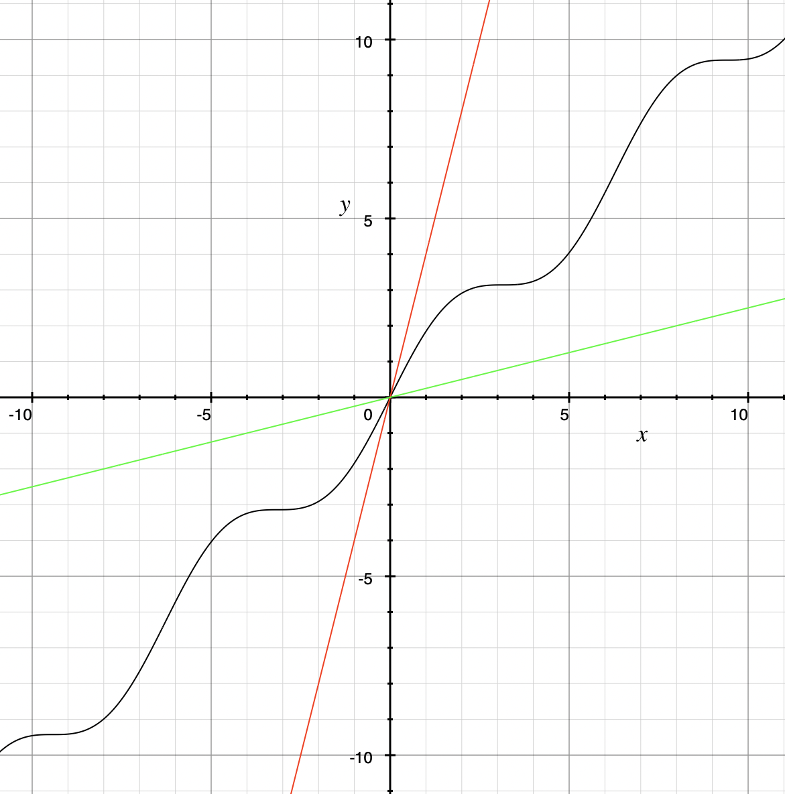

= Rates of Growth of Functions
//= Growth of Functions
//= Analysis of Algorithms

#*CAUTION* - CHAPTER UNDER CONSTRUCTION!#

_This chapter was last updated on April 14, 2025._ + 
[small]#Contents locked until 11:59 p.m. Pacific Standard Time on May 23, 2025.#

// MKD see https://en.wikipedia.org/wiki/Big_O_notation#Matters_of_notation

// MKD start of topics
////
Definition of algorithm
example - find maximum element of a finite list
ACTIVITY: Algorithms And Functions
	Binary search, Linear search (NOTE: can require recurrence relations)
Complexity - time, space
Complexity Functions and Growth of functions
big-O notation

“Popular” functions g(n) are : 1, log n, n, n log n, n2, n3, 2n , n!
(above are listed from slowest to fastest growth)
• A problem that can be solved with polynomial worst- case complexity is called tractable.
• Problems of higher complexity are called intractable.
• Problems that no algorithm can solve are called
unsolvable. (more on this later...

Big-O rules for sums and products

Complexity examples:
	Find max difference between elements of a list (nested loops) - O(n^2)
	Find max difference between elements of a list (single loop) - O(n)

A little bit of computability theory (informal intro.)
• A decision problem is a question with a “yes” or “no” answer, depending on the values of some input parameters. Example: Given two numbers x and y, does x < y?"
• A decision problem which can be solved (or decided) by an algorithm, is called decidable, i.e. the algorithm always returns “yes” or “no”
• A decision problem is undecidable (or unsolvable) if it is impossible to construct an algorithm that leads to a “yes” or “no” answer
• The Halting Problem: Given an algorithm A and an input string I, will A ultimately halt on A or will it run on forever?
i.e. Is there a program H takes input (A,I) and returns “yes” if A halts on input I and “no” if A runs for ever on input I

Theorem: The Halting Problem is undecidable Proof (informal) by contradiction:
Assume H(A, I) existed. Let define the following algorithm K(A): input: A Output: see comment below
if (H(A,A) == “no”) return “yes”
else
for(;;){}
// if A(A) runs for ever, return “yes”
// If A(A) halts // loop forever and never return
Note: K(A) halts if and only if H(A,A) returns “no” if and only if A(A) does not halt
Now, call the algorithm K with input K, i.e. K(K) Then, K(K)halts ifandonlyifH(K,K)returns“no”
if and only if K(K) does not halt This is a contradiction!

NUMBER THEORY - Most of this should 
EITHER be its own chapter 
OR some of this can go in the Intro chapter and the rest in a "just-in-time"/refresher index:
divisibility, (factors, multiples)
prime numbers (and composite numbers)
THE DIVISION ALGORITHM (Euclid's algorithm)
relatively prime integers (?) and pairwise relatively primes
greatest common divisors, 
least common multiples, and 
	Theorem: a⋅b = gcd(a,b)⋅lcm(a,b)
modular arithmetic (a mod m as remainder in a=qm+r), congruences

Eulcidean Algorithm - program correctness via induction

FROM HAGGARD, SCHLIPF, AND WHITESIDES:
The expression "F asymptotically dominates G" is usually not written out in full. It is far more common to write "G \in O(F)."The expression "O(F)" is pronounced "big-Oh of F,"or order of F. (With abuse of notation, people sometimes write "G is O(F),"or even
"G =O(F)*" However, "O(G) = F" is never considered to be acceptable.)

////
// MKD end of topics

//MKD intends to make MANY changes to this chapter after the Spring 2024 semester.

//// 
//July 15 2024 - current plan for content
//	write a new intro
//	"Introducing Big O"
//		need to fix some images
//			replace if not sure of license
//		may want some of the material in Library Of Functions instead??
//	split into new section material determining big-O (with algebra only)
//	insert L'Hôpital rule (calculus) method
//	"Properties of Big O notation"	
//		keep what's there, maybe add a bit more
//	MKD new section on Big Theta?????
// MKD continue with complexity here:
//  The Linear Search Algorithm is O(n)
//	The Bubble Sort and Insertion Sort Algorithms are O(n2)
//	The Binary Search Algorithm is O(logn)
// MKD insert (perhaps before Linear Search is O(n)
//	Long Division is O(log n)
//	Euclidean Algorithm is O(log n) - connect to Fibonacci Numbers
////

// MKD content starts here!!

//MKD introductory section rewritten Apr 14 2025

You have seen that some tasks can be completed by more than one algorithm. Two questions to ask are 

. "How do you choose which algorithm to use?"  
. "Why is is it important to make such a choice?" 

This chapter will discuss tools you can use to help answer these questions. In particular, ways of comparing the _rates of growth_ of functions will allow us to compare how two algorithms perform as the size of their input increase with no upper bound.
// (theoretically, since it's very likely that there are only a finite amount of computing resources available in the universe.)

Key terms and concepts covered in this chapter:

* Complexity
* Big-$\Theta$ notation
* Big-$O$ notation

== Complexity of Algorithms

In order to implement an algorithm, there are issues of the space needed to do the work and the time needed to complete all the steps. 

// MKD Apr 14 2025 reworded 
For example, imagine that you are asked to complete a few Algebra homework exercises by hand, and each exercise involves solving linear equations by hand using paper and pencil. Now suppose that "few" means "one hundred" and that each linear equation involves multiple steps to solve 
//, for example, an equation 
like the one below. \[ \text{Exercise 1. Solve for } x \text{:    } 40(x+6)-9(3x+5) = 65(x+7)-(7x+132)\] 
It is not _difficult_ to solve linear equations like this one because it is clear what steps you need to use... but it is tedious and will likely require a lot of paper! That is, it will consume a lot of time and space to solve even the first one of these equations, and you'll have only ninety-nine more to do after that!

In this textbook, the focus will be on time complexity and *asymptotics,* that is, the comparison of the time needed by the algorithms as the size of the input becomes larger and larger without any bound. 

== The Order of a Function and Big Theta Notation
//== The Order of a Function and Big Θ Notation

In this section, we will define a relation that describes what it means to say that "two functions grow at the same rate." More precisely, "two functions grow at the same rate, asymptotically, as the input variable grows without an upper bound." We will also introduce big $\Theta$ notation. +  
//($\Theta$ is the uppercase Greek letter "theta.")  
[small]#Note: $\Theta$ is the uppercase Greek letter "Theta."# 

// MKD Knuth's definition is 
//	\Theta(f(n)) denotes the set of all g(n) such that there exist positive constants C, C' , and nO with Cf(n) < g(n) < C'f(n) for all n >= nO and 
// 	Θ(f(n)) can be read as as "order exactly f(n) "
// https://dl.acm.org/doi/pdf/10.1145/1008328.1008329
////
Donald E. Knuth. 1976. Big Omicron and Big Omega and Big Theta _ACM SIGACT News_ 8, 2 (April-June 1976), 18-24. DOI: https://dl.acm.org/doi/10.1145/1008328.1008329
////
// MKD could use "is of the same order as"
****
.Definition
Suppose that $f$ and $g$ are two functions, both having domain $\mathbb{R}$ and codomain $\mathbb{R}$. 
//Define the relation "has the exact same order as" on pairs of such functions as follows. 
Define the relation 
*_f_ has the exact same order as _g_* 
//means 
to mean that 
******
There exist positive real number constants $A,$ $B,$ and $x_{0}$ so that \[ A|g(x)| \leq |f(x)| \leq B|g(x)| \text{ for all } x  > x_{0}.\]  
******
The constants $A,$ $B,$ and $x_{0}$ are called *witnesses:* The constants confirm the "has the exact same order as" relationship between the two functions. + 
[small]#The Remix's definition of "has the exact same order as" is based on notations and descriptions proposed by Donald Knuth in the 1976 letter "Big Omicron and Big Omega and Big Theta" published in link:https://dl.acm.org/doi/10.1145/1008328.1008329[_ACM SIGACT News_.]#

******
.Illustration: Two functions that have the exact same order
--
--

Consider the functions $f$ and $g,$ each with domain $\mathbb{R}$ and codomain $\mathbb{R},$ described by the rules \[ f(x) = x + \sin(x), \, g(x) = x.\] The function _g_ is linear and the function _f_ is not, but _f_ can be thought of as _asymptotically linear_ in the sense that its growth is _more_ like that shown in a straight line plot of a linear function than, say, a parabolic plot for a quadratic function or a square root function. This is what we are describing with the relation "has the exact same order as."

Let's plot the graphs of _f_ and two constant multiples of _g_ to illustrate what the relation "has the exact same order as" means.

//image::imagesMKD/BigThetaLinear010.png[BigThetaLinear010,1180,1090,float="right",align="center"]
image::imagesMKD/BigThetaLinear010.png[BigThetaLinear010,354,327,align="center"]
The preceding image shows the plots of the graphs of the functions $f,$ $0.9g,$ and $1.1g.$ Notice that for _x_ between -10 and 10, the corresponding _y_ output for _f_ is sometimes between the two straight lines, sometimes above both lines, and sometimes below both lines.

//image::imagesMKD/BigThetaLinear300.png[BigThetaLinear010,1129,1096,float="right",align="center"]
image::imagesMKD/BigThetaLinear300.png[BigThetaLinear010,339,330,align="center"]
However, if we zoom out, it appears that the plotted graph of $f$ lies between the two straight lines for all values of the input _x_ that have a large absolute value. In fact, the image seems to indicate that \[ 0.9g(x) \leq f(x) \leq 1.1g(x) \text{ for all } x \geq 100.\] 
That is, the image suggests that _f_ has the exact same order as _g._ 
Notice that we could prove, more rigorously, that the inequality is true, by using some algebra and the fact that the sine function's outputs are in the interval $[-1, \, 1]$, so the functions have the exact same order. The two functions $f$ and $g$ grow at the same rate, asymptotically, as the input variable grows without an upper bound. + 
//Also, we could state informally that "_f_ is of linear order" since _g_ is a linear function. + 
[small]#It appears from the zoomed-out plot that we could choose a value less than 100 for the bound $x_{0},$ but the definition of "has the exact same order as" does not require us to find optimal values of any of the constants $A,$ $B,$ and $x_{0}.$ In fact, if there exists at least one ordered triple $( A, \, B, \, x_{0})$ that witnesses the "has the exact same order as" relation between two functions, then there must be infinitely many other ordered triples that witness the same relationship. As an example, we've used the ordered triple $( 0.9, \, 1.1, \, 100)$ for the two multipliers and the lower bound for inputs, but we could use the same two multipliers and _any_ value greater than 100 for $x_{0}$ instead. Also, the triple $( \frac{1}{4}, \, 4, \, 0)$ witnesses the same relationship since \[ \frac{1}{4}g(x) \leq f(x) \leq 4g(x) \text{ for all } x \geq 0.\]# 

******

****

// MKD Apr 9 2025
//We have the following theorem about this relation.
We have the following theorem about the "has the exact same order as" relation.

.Theorem
****
//The following statements are true for the "has the exact same order as" relationship.
For any functions $f,$ $g,$ and $h$ with domain $\mathbb{R}$ and codomain $\mathbb{R},$ 

(1) $f$ has the exact same order as $f,$ + 
(2) if $f$ has the exact same order as $g,$ then $g$ has the exact same order as $f,$ + 
(3) if $f$ has the exact same order as $g,$ and $g$ has the exact same order as $h,$ then $f$ has the exact same order as $h.$  

[click.Proof]
--
For statement (1), choose any value $x_{0}$ that is in the domain of $f$ and $A = 1$ and $B = 1$ as witnesses. Since \[1 \cdot |f(x)| \leq |f(x)| \leq 1 \cdot |f(x)| \text{ for all } x \geq x_0\] must be True, $f$ has the exact same order as $f.$ Notice that we could have used other values for the witnesses $A$ and $B$ such as $A = 0.99$ and $B = 1.01.$ + 
 + 
For statement (2), assume that $f$ has the exact same order as $g,$ so there are positive real number constants $A,$ $B,$ and $x_{0}$ such that \[A|g(x)| \leq |f(x)| \leq B|g(x)| \text{ for all } x  > x_{0}.\] Notice that the extended inequality above can be broken into the two inequalities \[A|g(x)| \leq |f(x)| \text{ and } |f(x)| \leq B|g(x)|\] which are both True for all $x  > x_{0}.$ The two inequalities can be rewritten as \[|g(x)| \leq \frac{1}{A}|f(x)| \text{ and } \frac{1}{B}|f(x)| \leq |g(x)|\] which shows that \[\frac{1}{B}|f(x)| \leq |g(x)| \leq \frac{1}{A}|f(x)| \text{ for all } x  > x_{0}.\] The last extended inequality above shows that $g$ has the exact same order as $f.$ + 
 + 
For statement (3), assume both that $f$ has the exact same order as $g$ and that $g$ has the exact same order as $h.$ This means that there are positive real number constants $A,$ $B,$ and $x_{0}$ such that \[A|g(x)| \leq |f(x)| \leq B|g(x)| \text{ for all } x  > x_{0}\] and also positive real number constants $C,$ $D,$ and $x_{1}$ such that \[C|h(x)| \leq |g(x)| \leq D|h(x)| \text{ for all } x  > x_{1}.\] By breaking up the extended inequalities, then doing some algebra and recombining inequalities, you can get 
\[AC|h(x)| \leq A|g(x)| \leq |f(x)| \text{ and } |f(x)| \leq B|g(x)| \leq BD|h(x)|\] which are True for all $x > max(x_{0}, x_{1}).$ So \[AC|h(x)| \leq |f(x)| \leq BD|h(x)| \text{ for all } x > max(x_{0}, x_{1})\] which shows that $f$ has the exact same order as $h,$ witnessed by the constants $AC,$ $BD,$ and $max(x_{0}, x_{1}).$

--

****

These three properties let you conclude that the "has the exact same order as" 
//relationship 
relation is an equivalence relation, so 
the relation 
partitions the set $S = \{ f \, | \, f \text{ is a function with domain and codomain } \mathbb{R} \}$ into disjoint sets. 
// MKD Apr 14 2025 rewrite
//That is, if we define 
For each function $g \in S$ we can define $\Theta(g)$ to be the equivalence class \[ \Theta(g) = \{ f \, | \, f \text{ has the exact same order as } g \} \] 
//(that is, $\Theta(g)$ is the equivalence class of $g$ for this relation) then every 
Every function with domain and codomain $\mathbb{R}$ is an element of at least one of the $\Theta(g)$ 
// (since $g$ is an element of $\Theta(g)$), 
and for any two functions $g$ and $h,$ the sets $\Theta(g)$ and $\Theta(h)$ must either be equal or have empty intersection. 
//Two functions $f$ and $h$ are of the exact same order if and only if the equivalence classes $\Theta(f)$ and $\Theta(h)$ are the same set. 
For example, the earlier example shows that $\Theta(x + \sin x)$ and $\Theta(x)$ are the same set, so we can say that the function $f(x) = x + \sin x$ is of linear order.

////
// MKD uncomment and replace above after Dec 20 2024 - ABANDONED Apr 14 2025

.Theorem
****
The binary relation "has the exact same order as" is an equivalence relation.

[click.Proof]
--
This is an exercise for you, dear reader! + 
Show that  + 

(1) "$f$ has the exact same order as $f$" + 

(2) If "$f$ has the exact same order as $g$" then "$g$ has the exact same order as $f$." + 
Hint: Break up the extended equality with $|f(x)|$ in the middle into two shorter inequalities, rewrite those two inequalties then combine them into one extended inequality with $|g(x)|$ in the middle. + 

(3) If "$f$ has the exact same order as $g$" and "$g$ has the exact same order as $h$," then "$f$ has the exact same order as $h$."  

--
****

Recall from the link:./relations.html[Relations] chapter that an equivalence relation on a set $S$ corresponds to a partitioning of the set $S$ into one or more disjoint subsets called equivalence classes. This means that "has the exact same order as" partitions the set $\{ f \, | \, f \text{ is a function with domain and codomain } \mathbb{R} \}$ into equivalence classes. 
//Based on Knuth's 1976 letter mentioned earlier in this chapter, we will use the notation 
Let $\Theta(g)$ be the equivalence class of _g_ for the "has the exact same order as" relation. That is, \[ \Theta(g) = \{ f \, | \, f \text{ has the exact same order as } g \} \]  
////

CAUTION: Mathematicians and computer scientists are very different beasts...  well, they are all _human_ but they have developed different _cultures_ so they often use the same symbols in different ways. + 
 + 
A mathematician, like the author of the Remix, would write the very formal $f \in \Theta(g)$ and state "_f_ is an element of Theta _g_" to mean that "_f_ has the exact same order as _g._" In the earlier example, a mathematician could abbreviate this a little bit and write "$x + \sin(x)$ is in $\Theta(x).$" +  
 + 
Computer scientists have traditionally written this relation as $f(x) = \Theta(g(x))$ and state "$f(x)$ is big Theta of $g(x)$." In the earlier example, a computer scientist could write "$x + \sin(x) = \Theta(x)$."  As a mathematician, I need to point out that the function _f_ is not equal, in the mathematical sense, to the equivalence class containing _g_ because it's just one of the infinitely many functions in that equivalence class. + 
 + 
I believe that both mathematicians and computer scientists agree that [line-through]#Θ(_g_(_x_)) = _f_(_x_)# is just too hideous a notation to use... so please do not ever, ever use it!

//®(f(n)) denotes the set of all g(n) such that there exist positive constants C, C' , and nO with Cf(n) < g(n) < C'f(n) for all n ~ nO 

////
// MKD old big theta begins
=== Big-$\Theta$ notation

//As noted earlier, "$f(x)$ is $O(g(x))$" does not imply that "$g(x)$ is $O(f(x)),$" but it is a common error to assume that the implication holds. 

//The statement "$f(x)$ is $O(g(x))$" means that "_f_ grows at the same rate as or at a slower rate than _g_ as _x_ increases without bound," but the implication is only true if _f_ and _g_ grow at the _same_ rate, asymptotically. 

//For this reason, We can define a relation on the set of functions with domain and codomain  $\mathbb{R}$ that describes what it means for  "_f_ grows at the same rate as _g_ as _x_ increases without bound."

.Big-$\Theta$ notation
****
Suppose $f:\mathbb{R}→\mathbb{R}$ and $g:\mathbb{R}→\mathbb{R}$ are functions. 
We say $f(x)$ is *Big-$\Theta$* of $g(x)$, written 
"$f(x) \in \Theta(g(x))$" or "$f(x)$ is $\Theta(g(x))$", if there exists 
//positive real numbers _A,_ _B,_ and _n_ so that $ A|g(x)| \leq |f(x)| \leq B|g(x)|$ whenever $x  > n$.
positive integers _A,_ _B,_ and _n_ so that $ |g(x)| \leq A|f(x)| \leq B|g(x)|$ whenever $x  > n$.

The symbol $\Theta$ is the uppercase Greek letter "Theta."
****

//You can probably see that this definition is equivalent to 
As an exercise, prove, \[ f(x) \in \Theta(g(x)) \rightarrow g(x) \in \Theta(f(x)) \] and, \[ f(x) \in \Theta(g(x)) \leftrightarrow ( f(x) \in O(g(x) \land g(x) \in O(f(x) ) \]
//MKD need some more here?
// MKD old big theta ends
////

== Big _O_ notation

Traditionally, computer scientists are much more interested in the idea that "_f_ grows at most at the rate of _g_". This corresponds to the second part of the inequality used to define big Theta in the previous section.

****
.Definition
*_f_ is of order at most _g_* means that there exist positive real number constants $B$ and $x_{0}$ so that \[ |f(x)| \leq B|g(x)| \text{ for all } x  > x_{0}.\] This is usually stated (by computer scientists) as "$f(x)$ is Big _O_  of $g(x)$" and written as $f(x) = O(g(x)).$
****

//image::imagesMKD/BigOmegaXPlusSinX.png[BigOmegaXPlusSinX,1178,1062,float="right",align="center"]
image::imagesMKD/BigOmegaXPlusSinX.png[BigOmegaXPlusSinX,354,319,float="right",align="center"]
Note that Big _O_  only gives an upper bound on the growth rate of functions. That is, the function $f(x) = x + \sin(x)$ with domain and range $\mathbb{R},$ used in an earlier example, is $O(x)$ but also is $O(x^{2})$ and is $O(2^{x}).$ 

////
Computer programmers  are often concerned with two questions:

a) How much time does an algorithm need to complete?

b) How much memory does an algorithm need for its computation?

Big _O_  notation is a standard way mathematicians and computer scientists use to describe how much time and how much memory is required for an algorithm to run
////

Big _O_  is typically used to analyze the worst case complexity of an algorithm.
//If, for example, $n$ is the size of the input data, then big _O_ really only cares about what happens when your input data size $n$ becomes arbitrarily large and not quite as interested in when the input is small.  Mathematically, we want to speak of complexity in the asymptotic sense, when $n$ is arbitrarily large. In this asymptotic sense of large $n$, we may ignore constants.
// MKD Apr 14 2025 
If, for example, $n$ is the size of the input, then big _O_ really only cares about what happens in the "worst-case" when $n$ becomes arbitrarily large.  Mathematically, we want to consider time complexity in this asymptotic sense, when $n$ is arbitrarily large, so may ignore constants.
// MKD added the following sentence.
That we can ignore constants will make sense after discussing how 
//L'hôpital's Rule 
limits, borrowed from continuous mathematics (that is, calculus), can be used to compare the rates of growth of two different functions. 

=== Common Complexities To Consider

//The size of the input complexities ordered from smallest to largest: 
// MKD this may need to be Big-$\Theta$

// MKD Apr 14 2025
The size of the input complexities most commonly used, ordered from smallest to largest, are as follows. 

* Constant Complexity: $O(1)$
* Logarithmic Complexity: $O(\log (n))$,
* Radical complexity : $O(\sqrt{n})$
* Linear Complexity: $O(n)$
* Linearithmic Complexity: $O(n\log (n))$,
// MKD NOTE via http://www.catb.org/jargon/html/L/linearithmic.html
//linearithmic: adj. Of an algorithm, having running time that is O(N log N). Coined as a portmanteau of 'linear' and 'logarithmic' in Algorithms In C by Robert Sedgewick (Addison-Wesley 1990, ISBN 0-201-51425-7).
// Also see https://en.wikipedia.org/wiki/Time_complexity#Quasilinear_time
* Quadratic complexity: $O(n^2)$
* Cubic complexity: $O(n^3)$,
* Exponential complexity: $O(b^n)$, $ b > 1$
* Factorial complexity: $ O(n!)$

// MKD notes June 11-15 2024
// move/include definitions in the appendix "library of functions"
//	constant function
//	linear function
//	ceiling and floor functions (if not covered elsewhere)
//	power functions (or polynomial functions) 
//	radical functions
//	exponential functions and logarithmic functions
//		REMEMBER - Do "number bases" sometime before "Big-O"
//	python math.gamma(x+1) (Generalization of the factorial)
//
// also add to "just in time" appendix
//	finding equations of linear functions
//	logarithms, including changing bases
//
//	also add as PROOF or INDUCTION examples (IF induction comes before this)
//		kn<n^2 for all positive integers n>k
//		klog_base_b(n)<n for all positive integers n>?
//			(same as n^k < b^n)
//		k times (log_base_b(n))^r < n for all positive integers n>?
//			(also k^(1/r) log_base_b(n) < rth root of n)
//		kn^2<n^3 for all positive integers n>k
//			and generalize to kn^a<n^b (b>a) for n>k
//		likewise k times cuberoot(n)<sqrt(n)
//		likewise k times sqrt(n) < n (same as k^2 n < n^2)
//		kn^r < b^n for positive integers n >?
//		kb^n < n! for positive integers n > ?
//
// 	https://www.quora.com/How-can-I-construct-a-square-with-an-area-of-a-2-square-meter
// https://www.reddit.com/r/CasualMath/comments/125mww6/nested_squares/

//MKD added following lines.
To understand the sizes of input complexities, we will look at the graphs of functions; it is  easier to consider these functions as ones that are defined for any _real value_ input instead of just the natural numbers. This will also allow us to use continuous mathematics (that is, calculus) to analyze and compare the growth of different functions. 

Radical growth is larger than logarithmic growth:
[.float-group]
--
[.left.text-left]
image::images/radicalgrowth.png[geometricsequence,500,500]
--
//MKD added following lines.
NOTE: In the preceding graph, we've used $\text{Log}[x]$ to label the graph of a logarithmic function without stating the base for the logarithm: Is this the function $y = log_{2}(x)$, $y = log_{10}(x)$, $y = ln(x) =  log_{e}(x)$, or a logarithm to some other base? For the purposes of studying growth of functions, it does not matter which of these logarithms we use: You may recall that one of the properties of logarithms states that for two different positive constant bases $a$ and $b$ we must have $log_{a}(x) = log_{a}(b) \cdot log_{b}(x)$, where $log_{a}(b)$ is also a constant. As stated earlier, we may ignore constants when considering the growth of functions.

Polynomial growth is larger than radical  growth:
[.float-group]
--
[.left.text-left]
image::images/polynomialgrowth.png[geometricsequence,500,500]
--
Exponential growth is larger than polynomial growth:
[.float-group]
--
[.left.text-left]
image::images/exponentialgrowth.png[geometricsequence,500,500]
--

Factorial growth is larger than exponential growth:
[.float-group]
--
[.left.text-left]
image::images/factorialgrowth.png[geometricsequence,500,500]
--
//MKD added following lines.
NOTE: In the preceding graph, we've used $x!$ 
to label the graph of the function $y = \Gamma(x+1)$
//the factorial $x!$ is represented by the function $\Gamma(x+1)$
, where $\Gamma$ is the _Gamma function_ which is 
defined and continuous for all nonnegative real numbers. 
That is, $n! = \Gamma(n+1)$ for every $n \in \mathbb{N}$. 
// That is, the outputs for the factorial function 
//which is 
// defined _for only natural number inputs_ matches the outputs of the function // $\Gamma(x+1)$ which is defined and continuous for all nonnegative real 
// numbers, so that $n! = \Gamma(n+1)$ for every $n \in \mathbb{N}$. 
Further study of the Gamma function is beyond the scope of this textbook. 

Using the graphical analysis of the growth of typical functions
we have the following growth ordering, also presented graphically on a logarithmic scale graph.

.Ordering of Basic Functions by Growth
****
// MKD need to address all x! below

[asciimath]
++++
1,\log \ ⁡n, root(3)(n),  sqrt n , n, n^2, n^3,2^n,3^n,n!, n^n
++++

[.float-group]
--
[.left.text-left]
image::images/growthorder.png[geometricsequence,500,500]
--
****

The asymptotic behavior for large $n$ should be determined by the most dominant term in the function for large $n$. For example, $f(x)=x^{3} + 2x^{2}-2x$ for large $x$, is dominated by the term $x^3$. In this case we want to state that 
// MKD Apr 14 2025 bis
//$O(f(x))=x^3$. 
$f(x)=O(x^3)$. 
For example $f(1000) =1.001998×10^9≈ 1×10^9 =1000^3$. For large $x$, $f(x) ≈x^3$  or asymptotically, $f(x)$ behaves as $x^3$ for large $x$. 
// MKD Apr 14 2025 bis
//We say 
We write $f(x)=O(x^3),$ 
//for $f(x)=x^3 +2x^2-2x$ 
that is, $x^3 +2x^2-2x=O(x^3).$

Likewise we want to say that if $c$ is a constant that $c \cdot f(x)$, and $f(x)$ have the same asymptotic behavior for large $n$, or $O(c \cdot f(x))=O(f(x))$.

////
// MKD Apr 14 2025 begin commenting out
Motivated by these we formally define the _Big O_ notation.

// MKD inserted the double quotation marks below 

._Big_ $O$ notation
****
Suppose $f$ and $g$ are real valued functions from $f(x):\mathbb{R}→\mathbb{R}$,
we say $f(x)$ is *Big $O$* of $g(x)$, written 
"$f(x)$ is $O(g(x))$", if there exists
positive integers $A$ and $n$, so that $|f(x)| \leq A|g(x)|$ whenever $x  > n$.
****

To determine if a function $f(x)$ is $O(g(x))$ amounts to
identifying the positive constants $A$ and $n$, (sometimes called witnesses).
That is, we must find the factor $ A$  and the point $ k $ for which $ f(x)  \leq A g(x)$, whenever $ x > k.$
// MKD Apr 14 2025 end commenting out
////

****
.Example {counter:growex}
Show that $f\left(x\right)=2x^2 +4x$ is $O(x^2)$

.Solution
While intuitively we may understand that
the dominant term for large $x$ is $x^2$ so that $f(x) = O\left(x^2\right)$,
we show this formally by producing as witnesses $A=3$ and $n =4$ with
reference to the following graph.

[.float-group]
--
[.left.text-left]
image::images/witnessexample.png[geometricsequence,750,750]
--
****

****
.Example {counter:growex}
Show that $f(x) =2x^3 +3x$ is $O(x^3)$, with $A=3$ and $n=2$. Support
your answer graphically.

.Solution
Notice that $ x^3 > 3x$ when $ x  \geq 2$. This means $2x^3 +x^3 >  2x^3 +3x $ when $x >2 $.
In other words $ 3x^3 > 2x^3 +3x$ whenever $ x>2$, confirming $A=3$ and $n=2$ as witnesses, and supported by the
following graph.
[.float-group]
--
[.left.text-left]
image::images/cubic_big_o_example.png[geometricsequence,750,750]
--

****

To show that a function $ f(x)$ is not $O(g(x))$, means that no $A$ can scale
$g(x)$ so that $ Ag(x)  \geq  f(x)$ for $x$ large enough as in the following example.

****
.Example {counter:growex}
Show that $ f(x) = x^2$ is not $  O( \sqrt{x})$.

.Solution
Consider the graphs of $ \sqrt{x}$, $ 2 \sqrt{x}$, $ 3\sqrt{x}$, and the graph of $x^2$.
Notice that eventually, or for $x$ large enough, $x^2$ is larger than any $A \sqrt{x}$
as in the figure below

[.float-group]
--
[.left.text-left]
image::images/not_big_o.png[geometricsequence,750,750]
--
Suppose $A>1$ is  given and pass:q[<u>fixed</u>],
then if $ f(x) = x^2$ is
$ O(g(x))=O( \sqrt{x})$ ,  there is a corresponding $n$, also
pass:q[<u>fixed</u>],
for which $A  \sqrt{x}  \geq x^2$ whenever $x>n$.

We solve the inequality $A  \sqrt{x}  ≥ x^2$ by dividing both sides by $\sqrt{x}  =x^{1/2}$, to obtain, $A  \sqrt{x}  ≥ x^{3/2}$.

But $A$ is fixed and cannot be greater than all  arbitrarily large $ x^{3/2}$. Hence no such $n$
can
exist for a given fixed $A$.

For example, consider $g(x)=A  \sqrt{x}$ and $ f(x) =x^2 $,
when $ x= A^2$ we obtain $ g(A^2) = A  \sqrt{(A^2)}= A^2$ and $ f(A^2) = {\left ( {A}^2 \right )}^2$ and
$ f(A^2)= A^4 > A^2 = g(A^2) $ when $A>1$.

****

//MKD want an example with non-integer witnesses and ask learner to justify that they can be replaced with integral witnesses

== Properties of _Big O_ notation.
Suppose $f(x)$ is $O(F(x))$ and $g(x)$ is $O(G(x))$.

.Properties of _Big O_ Notation
****
. $c \cdot f(x)$ is $O(F(x))$
. $ f (x )+g(x)$ is $O(\max \left ( F(x), G(x) \right )$
. $ f (x ) \cdot g(x))$ is $O(F(x) \cdot G(x))$
****
We can use these properties to show for instance $ 2x^2$ is  $O\left(x^2\right)$. Likewise
if $f(x) =2x^2$ and $g(x) =4x$, then $ 2x^2$ is $O(x^2)$ and $ 4x$ is $O(x)$,
and the maximum gives that $2x^2+4x$ is $ O(\max(x^2, x)) =O(x^2)$.

It is true in general that if a polynomial $f(x)$ has degree $n$ then $f(x)$ is $O(x^n)$.

._Big O_ for Polynomials
****
$p(x)=a_nx^n +a_{n-1}x^{n-1} +a_{n-2}x^{n-2}+\ldots +a_2x^2 +a_1x^1+a_0$ is $O(x^n)$
****

For example, if $f(x)= x^3+1$ being $ O(x^3)$, and $g(x)=x^2-x$ being $O(x^2)$, then
$f(x) \cdot g(x)$ is $O(x^3 \cdot x^2) =O(x^5)$.  This is verified explicitly by multiplying
$f(x) \cdot g(x)= (x^3+1) \cdot (x^2-x)= x^5 -x^4+x^2-x  $ which clearly is $O(x^5)$

****
.Example {counter:growex} - ordering by growth 
// MKD need to address all x! below 
Order the following functions by growth:
$n⋅\log_2⁡ n$  , $n^2$, $n^{4/3}$

.Solution
Recall the ordering,

$\log_2⁡ n$, $n^{1/3}$, and $n$,

which is ordered by logarithmic, then radical, and then
polynomial (or linear) growth.

Notice also, that multiplying each by $n$, preserves the order.

$n⋅\log_{2⁡}n=n\times \log_{2⁡}n$

$n^{4/3} =n \times n^{1/3}$

$n^2=n \times n$

The using the original ordering, $\log{n}$, $n^{1/3}$, $n$, we obtain
also the following ordering
$n⋅\log n$, $n^{4/3}$,  $n^2$.

****

// MKD needs to fix the factorial notation below... 
//	either use Gamma or change x to n (an integer variable)
As a final example we consider ordering three functions by
growth using the basic properties for Big O and the basic orderings.
****

.Example {counter:growex}

Find the Big O of each of the following and then rank by _Big_ $O$ growth:

$f\left(x\right)=\left({3x}^3+x\right)2^x+\left(x+x!\right)x^4$

$g\left(x\right)=x^x(2^x+x^2)$

$h\left(x\right)=5x!+4x^3\log{x}$

.Solution

First consider $f\left(x\right)$ and using the polynomial
property observe that $\left({3x}^3+x\right)$ is $O(x^3)$.
Using the multiplicative property, conclude that
$\left({3x}^3+x\right)2^x$ is $O(x^32^x)$.  Likewise using
the sum property, $\left(x+x!\right)$ is
$O\left(\max{\left(x,x!\right)}\right)= O (x!)$. Then using the
multiplicative property, $\left(x+x!\right)x^4$  is  $O (x^4x!)$.
Then  $f\left(x\right)=\left({3x}^3+x\right)2^x+\left(x+x!\right)x^4$ is
$O\left(\max{\left(x^32^x,x^4x!\right)}\right)=O\left(x^4x!\right)$.

For $g(x)$, notice using the maximum property for the sum, that
$2^x+x^2$ is $O(2^x)$. Then using the multiplicative property,
$x^x(2^x+x^2)$ is $O(2^xx^x)$.

For $h\left(x\right)$, we want
$O\left(\max{\left(x!,\ x^3\log{x}\right)}\right)=O(x!)$.
Notice here, that $4x^3\log{x}$ is $O(x^4)$,  and $x^4$ has smaller
asymptotic growth than $x!$. In fact, $x^4$ is $O(x!)$.

So,  $f(x)$ is $O\left(x^4x!\right)$,  and $g(x)$ is
$O\left(2^xx^x\right)$.  Also, $h(x)$ is, $O\left(x!\right)$.

We conclude that from an ordering perspective,
we have by increasing growth order, $h(x)$, $f(x)$, and $g(x)$.
To convince yourself that $g(x)$ grows faster than $f(x)$, use the
facts that $2^x$ grows faster than $x^4$, and $x^x$ grows faster than $x!$.

****

//MKD inserted this section on L'hôpital's rule.
== Using Limits to Compare the Growth of Two Functions (CALCULUS I REQUIRED!)

In general, the Remix avoids using calculus methods because calculus is part of _continuous mathematics,_ not discrete mathematics. However, it can be useful to use calculus to compare the growth of two functions $f(x)$ and $g(x)$ that are defined for real numbers $x$, are differentiable functions
//and have only nonnegative values 
on the interval $(0,\, \infty)$, 
//.
and 
//Suppose that functions $f$ and $g$ are such functions and that 
satisfy 
$\lim_{x \to \infty} f(x) = \lim_{x \to \infty} g(x) = \infty$. 
// MKD added Oct 16 2024
To avoid needing to use the absolute value, we can assume that $0 < f(x)$ and $0 < g(x)$ for all $x \geq 0$ (This assumption is safe to make since both functions go to infinity as $x$ increases without bound, which means that both functions are positive for all $x$ values greater than or equal to some number $x_{0}$... we are just assuming that $x_{0}=0$ which is the equivalent of shifting the plots of $f$ and $g$ to the left by $x_0$ units.)

If $f(x)$ and $g(x)$ are such functions and  
//If 
$\lim_{x \to \infty} \frac{f(x)}{g(x)} = L$, 
// where $L$ is a nonnegative number (that is, $L$ is not infinity), 
where $0 \leq L < \infty$, 
then $f(x)$ is $O(g(x)),$ 
// MKD added Oct 16 2024
and if $0 < L < \infty$ then $f(x)$ is $\Theta(g(x)).$

To see this, recall that $\lim_{x \to \infty} \frac{f(x)}{g(x)} = L$ 
means that we can make the value of $\frac{f(x)}{g(x)}$ be as close 
to $L$ as we want by choosing $x$ values that are sufficiently large. 
In particular, 
//between $L - \epsilon$ and $L + \epsilon$ for any positive $\epsilon$ by //choosing $x$ sufficiently large, say, larger than a number $A_{\epsilon}$. 
we can make $L-\frac{L}{2} < \frac{f(x)}{g(x)} < L+\frac{L}{2}$ be true for all $x$ greater than some real number $x_{0}$. 
Now we can use the earlier stated assumption that $0 \leq g(x)$ to rewrite the inequality as  
$(L-\frac{L}{2}) \cdot g(x) < f(x) < (L+\frac{L}{2}) \cdot g(x)$, which is true for all $x >x_{0}$. 
//In this case, we can take as our witnesses $A$ equal to the ceiling of $L + \epsilon$ and $n$ equal to the ceiling of $A_{\epsilon}$ so that 
//We can choose for our witnesses $A = \lceil (L + \frac{L}{2}) \rceil$, the  least integer that is greater than or equal to $L + \frac{L}{2}$, and  $n = \lceil x_{0} \rceil$, the  least integer that is greater than or equal to $r$. 
We can choose for our witnesses $B = L + \frac{L}{2}$ and $x_{0}.$ 
This means that $f(x) < B \cdot g(x)$ whenever $x > x_{0},$ which 
shows that $f(x)$ is $O(g(x))$. 
// MKD added Oct 16 2024
Furthermore, if $L>0$ we can choose $A =  L - \frac{L}{2}$ as a witness for the lower bound, too, which means that $ A \cdot g(x) < f(x) < B \cdot g(x)$ whenever $x > x_{0},$ so $f(x)$ is $\Theta(g(x))$. 

Note that using this method does not 
focus on determining the actual numerical values of $A$ and $n$ but just guarantees that the witnesses exist, which is all that is needed to show that $f(x)$ is $O(g(x))$. 
//Furthermore, if the limit $L$ is a positive number, then $f(x)$ is $\Theta(g(x)).$

//In such a case, we get an _indeterminate form_ for the limit $\lim_{x \to \infty} \frac{f(x)}{g(x)} = \frac{\infty}{\infty}$. We can often correctly evaluate such an indeterminate form using _L'Hôpital's rule_, which states that $\lim_{x \to \infty} \frac{f(x)}{g(x)} = \frac{f'(x)}{g'(x)}$. 

//MKD needs an example here, using L'Hôpital's rule.

// simpler: 100n + n \cdot log n is O(n \cdot log n)
****

.Example {counter:growex} 

Show that  $100,000 n + n \cdot log (n)$ is $O(n \cdot log (n))$.

.Solution
Notice that the expressions 
$100,000 x + x \cdot log (x)$ and 
$x \cdot log (x)$ 
can be used to define differentiable functions on the interval 
$(0,\, \infty)$. We changed the variable from $x$ to $n$ to stress 
that we are treating the variable as a real number in this example. 
Also, we will assume that $log (x)$ is the natural logarithm; as mentioned earlier, any other base for the logarithm results in a constant multiple of the natural logarithm and will not effect the Big-$O$ computations.

Let $f(x) = 100,000 x + x \cdot log (x)$ and 
$g(x) = x \cdot log (x)$. It is easy to see that 
$\lim_{x \to \infty} f(x) = \lim_{x \to \infty} g(x) = \infty$.

Now let's compute $\lim_{x \to \infty} \frac{f(x)}{g(x)}$, that is, 
$\lim_{x \to \infty} \frac{100,000 x + x \cdot log(x)}{x \cdot log (x)}$. 
Direct computation gives the indeterminate form $\frac{\infty}{\infty}$, so we can use L'Hôpital's rule to write 
$\lim_{x \to \infty} \frac{100,000 x + x \cdot log(x)}{x \cdot log(x)} = \lim_{x \to \infty} \frac{100,000 + (1 \cdot log (x) + x \cdot \frac{1}{x})}{1 \cdot log(x) + x \cdot \frac{1}{x}} = \lim_{x \to \infty} \frac{100,000 + log (x) + 1}{log(x) + 1}$. This limit still gives us an indeterminate form if we try to directly find the limits of the numerator and denominator separately without some simplification, but we can divide both numerator and denominator by $log (x)$ to rewrite the last limit as the equivalent limit 
$\lim_{x \to \infty} \frac{\frac{100,001}{log (x)} + 1}{1 + \frac{1}{log(x)}} = \frac{0+1}{1+0} = 1$. Since the limit is a positive finite number, $100,000 x + x \cdot log (x)$ is  
$\Theta(x \cdot log (x))$ which means that is also $O(x \cdot log (x)).$  
As mentioned above, we do not need to find the actual values of the witnesses when using this limit method.

****

// MKD start complicated big O example
////
****

.Example {counter:growex} 

Show that 
$\frac{ 500n + n^{2} \cdot \log_2⁡ n}{ n + \log_2⁡ n }$ is 
$O(n \cdot \log_2⁡ n)$.

.Solution
Notice that the expressions 
$\frac{500x + x^{2} \cdot \log_2⁡ x}{x + \log_2⁡ x}$ and 
$x \cdot \log_2⁡ x$ 
can be used to define differentiable functions on the interval 
$(0,\, \infty)$. We changed the variable from $x$ to $n$ to stress 
that we are treating the variable as a real number in this example. 

We could compute the very messy limit 
$\lim_{x \to \infty} \frac{ \frac{500x + x^{2} \cdot \log_2⁡ x}{x + \log_2⁡ x}} { x \cdot \log_2⁡ x }$ to show that we get a nonnegative limit, but this would be unnecessarily complicated. 

Instead, we will show that $f(x) = 500x + x^{2} \cdot \log_2⁡ x$ is 
$O(g(x)$ where $g(x) = (x + \log_2⁡ x)(x \cdot \log_2⁡ x))$; 
this statement is equivalent to what we want to show.

In such a case, we get an _indeterminate form_ for the limit $\lim_{x \to \infty} \frac{f(x)}{g(x)} = \frac{\infty}{\infty}$. We can evaluate this 
limit by applying _L'Hôpital's rule_, which states that 
$\lim_{x \to \infty} \frac{f(x)}{g(x)} = \lim_{x \to \infty} \frac{f'(x)}{g'(x)}$. 

****
////
// MKD end complicated big O example

== Exercises
// MKD need to address all x! below

. Give _Big O_ estimates for
.. $f\left(x\right)=4$
.. $f\left(x\right)=3x-2$
.. $f\left(x\right)=5x^6-4x^3+1$
.. $f\left(x\right)=2\ \ \sqrt x+5$
.. $f\left(x\right)=x^5+4^x$
.. $f\left(x\right)=x\log{x}+3x^2$
.. $f\left(x\right)=5{x^2e}^x+4x!$
.. $f\left(x\right)=\displaystyle \frac{x^6}{x^2+1}$	*(Hint: Use long division.)*

. Give _Big O_ estimates for
..	$f\left(x\right)=2^5$
..	$f\left(x\right)=5x-2$
..	$f\left(x\right)=5x^8-4x^6+x^3$
..	$f\left(x\right)=$ asciimath:[4 root(3)(x)+3]
..	$f\left(x\right)=3^x+4^x$
..	$f\left(x\right)=x^2\log{x}+5x^3$
..	$f\left(x\right)=5{x^610}^x+4x!$
..	$f\left(x\right)=\displaystyle \frac{x^5+2x^4-x+2}{x+2}$	*(Hint: Use long division.)*

. Show, using the definition, that
$f\left(x\right)=3x^2+5x$  is $O(x^2)$ with $A=4$ and $n=5$. Support your answer graphically.

. Show, using the definition, that
$f\left(x\right)=x^2+6x+2$  is $O(x^2)$ with $A=3$ and $n=6$. Support your answer graphically.

. Show, using the definition, that $f\left(x\right)=2x^3+6x^2+3$  is $O(x^2)$.
State witnesses $A$ and $n$, and support your answer graphically.

. Show, using the definition, that $f\left(x\right)=\ {3x}^3+10x^2+1000$ is $O(x^2)$.
State the witnesses $A$ and $n$, and support your answer graphically.

. Show that $f\left(x\right)=\sqrt x$ is $O\left(x^3\right)$, but $g\left(x\right)=x^3$
is not$\ O(\ \sqrt x)$.

. Show that $f\left(x\right)=  x^2$ is $O\left(x^3\right)$, but $g\left(x\right)=x^3$
is not$\ O(  x^2)$.

. Show that $f\left(x\right)=\sqrt x$ is $O\left(x\right)$, but $g\left(x\right)=x$ is not$\ O(\ \sqrt x)$.

. Show that $f\left(x\right)=$  asciimath:[root(3)(x)] is $O\left(x^2\right)$, but $g\left(x\right)=x^2$
 is not  asciimath:[O( root(3)(x))]

. Show that $f\left(x\right)=$  asciimath:[root(3)(x)] is $O\left(x\right)$, but $g\left(x\right)=x$ is
not    asciimath:[root(3)(x)].

. Order the following functions by growth
$x^\frac{7}{3},\ e^x,\ 2^x,\ x^5,\ 5x+3,\ 10x^2+5x+2,\ x^3,\log{x,\ x^3\log{x}}$

. Order the following functions by growth from slowest to fastest.
$\ 3x!,\ {10}^x,\ x\cdot\log{x},\ \log{x\cdot\log{x,\ \ }2x^2+5x+1,\ \pi^x,x^\frac{3}{2}\ },\ 4^5,\ \ \sqrt{x\ }\cdot\log{x}$

. Consider the functions $f\left(x\right)=2^x+2x^3+e^x\log{x}$ and
$g\left(x\right)=\sqrt x+x\log{x}$. Find the best big $O$ estimates of
.. $(f+g)(x)$
.. $(f\cdot\ g)(x)$

. Consider the functions  $f\left(x\right)=2x+3x^3+5\log{x}$ and
$g\left(x\right)=\sqrt x+x^2\log{x}$. Find the best big $O$ estimates of
.. $(f+g)(x)$
.. $(f\cdot\ g)(x)$

. State the definition of "$ f(x)$ is $ O(g(x))$"" using logical quantifiers and witnesses $A$ and $n$.

. Negate the definition of "$ f(x)$ is $ O(g(x))$" using logical quantifiers, and then state in
words what it means that $ f(x)$ is [.underline]#not# $ O(g(x))$.

