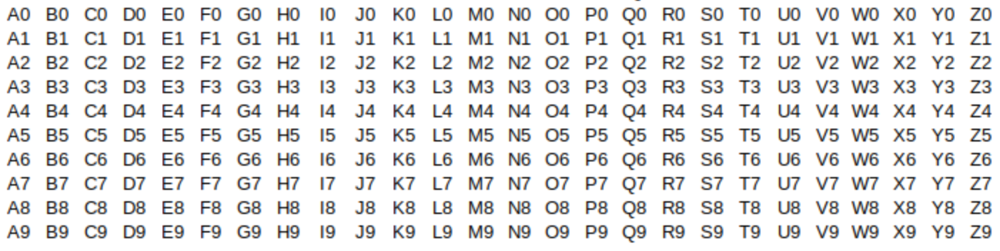

= Introducing Discrete Mathematics

_This chapter was last updated on August 25, 2024._

// MKD various sources
//	https://cacm.acm.org/opinion/lets-not-dumb-down-the-history-of-computer-science/ 
// Two Thousand Years Of Combinatorics by Donald Knuth https://api.pageplace.de/preview/DT0400.9780191630620_A23590107/preview-9780191630620_A23590107.pdf

//MKD added blurb

Welcome to the Remix! I hope this textbook provides you an opportunity for a stimulating and intellectually enjoyable learning experience. 

// MKD musing to helg students understand our approach: 
Mathematics is one of human civilization's greatest tools: It involves pattern noticing, collecting, counting, generalizing, formalizing, and abstracting. The development of mathematics is a continuing work that spans at least 5,000 years and many different peoples and cultures. This development will continue long after you and I are gone - never forget that we are living during an era that will be someone else's Ancient History!

// MKD trying to define Discrete Mathematics 
//	see also https://philsci-archive.pitt.edu/16561/1/Discrete%20and%20Continuous.pdf and https://www.google.com/search?q=defintion+of+discrete+mathematics+site%3A.edu
== What is "Discrete Mathematics"? 

There seems to be no universally agreed-upon definition of "discrete mathematics," but I, the remixer, will try to explain what it is. 

//MKD old attempt
//Discrete mathematics is used to study and understand structures built out of individual objects that are naturally separate from other objects in the same structure; such objects can placed into categories and counted. For example, a structure built from individual objects for which questions like "What is the next object in the structure?" or "Which other objects are the closest to this object?" (where "closest" could refer to physical distance or could mean most similar in color or size) or "How many objects in the structure have a certain property?" are the kind of questions that discrete mathematics can address. If this seems vague, think about the following examples.
// MKD old wall example 
//A wall made of stone and brick is a structure, and we can use this as an example of a discrete structure. The objects in the discrete structure are the stones and bricks. You can tell individual objects apart, and can classify the objects by type (either stone or brick) or by color or by the how close to the top of the wall the objects are. You can try to count the total number of objects, and you can count the number of objects that are next to any one of the objects you choose. 

Discrete mathematics is the mathematics people use to study and understand structures built from individual objects in a way that the individual objects can still be treated as separate from one another within the structure. In such a structure, the individual objects can put into categories and counted; it makes sense to ask questions like "What is the next object in the structure after this one?" or "Which other objects are the closest to this one?" (where "closest" could refer to physical distance or could mean most similar in color or size) or "How many objects in the structure have a certain property?" Discrete mathematics is a collection of tools that can be used to answer these kind of questions. 

//image::imagesMKD/vintage-stone-and-brick-wall.jpg[Vintage Stone And Brick Wall,480,307,float="right",align="center"]
image::imagesMKD/vintage-stone-and-brick-wall.jpg[Vintage Stone And Brick Wall,320,205,float="right",align="center"]
//[small]#Image credit: link:https://www.publicdomainpictures.net/en/view-image.php?image=87806&picture=vintage-stone-and-brick-wall["Vintage Stone And Brick Wall"] by Paul Brennan. The image is dedicated to the public domain under link:http://creativecommons.org/publicdomain/zero/1.0/[CC0].#
//image::imagesMKD/vintage-stone-and-brick-wall.jpg[Vintage Stone And Brick Wall,1920,1227,float="right",align="center"]
//image::imagesMKD/vintage-stone-and-brick-wall.jpg[Vintage Stone And Brick Wall,240,154,float="right",align="center",title="link:https://www.publicdomainpictures.net/en/view-image.php?image=87806&picture=vintage-stone-and-brick-wall[Vintage Stone And Brick Wall] by Paul Brennan. The image is dedicated to the public domain under link:http://creativecommons.org/publicdomain/zero/1.0/[CC0]."]
//image::imagesMKD/vintage-stone-and-brick-wall.jpg[Vintage Stone And Brick Wall,240,154,float="right",align="center"]
As an example, consider a wall, a structure built from individual stones and bricks, part of which is shown in the image to the right. The objects in the structure [underline]#_are_# the stones and bricks. You can still identify individual objects even though they were combined to build the larger structure, and can classify individual objects by type (either stone or brick) or by color or by the how close to the top of the wall the objects are. You can try to count the total number of individual objects, and you can count the number of individual objects that are next to any one object you choose. The wall is a (non-mathematical) example of a *discrete structure.* + 
[small]#Image credit: link:https://www.publicdomainpictures.net/en/view-image.php?image=87806&picture=vintage-stone-and-brick-wall["Vintage Stone And Brick Wall"] by Paul Brennan. The image is dedicated to the public domain under link:http://creativecommons.org/publicdomain/zero/1.0/[CC0].#

//If this seems vague, think about the following examples.
Here are two more examples of discrete structures.

* The set of humans in a family can be treated as a discrete structure. + 
We tend to perceive humans as individuals who can be separated from one another, and questions like "Which humans are siblings of this human?" and "Which humans are parents of this human?" and "How many children does this human have?" make sense. 
* The set of integers, in the usual order, as represented on a number line is a discrete structure. + 
It makes sense to ask questions like "What is the next integer after -2?" or "What are the integers that are closest to -2?" for this structure. 

On the other hand, continuous mathematics involves quantities that often are densely distributed throughout a structure, for which measurement is more appropriate than counting. 

* The set of real numbers, in the usual order, as represented on a number line is NOT a discrete structure. + 
It does NOT makes sense to ask about "the next real number after $\pi$ on the number line" because if we think _c_ is the _"best candidate"_ for "the next real number after $\pi$ on the number line" then the number $c_{1} = \frac{c+\pi}{2},$ which is the midpoint of the interval with endpoints _c_ and $\pi,$ is closer to $\pi$ than is _c,_ so $c_{1}$ is a _better candidate than the "best candidate"_ for "the next real number after $\pi$ on the number line"... that is, the concept "the next real number after $\pi$ on the number line" does not make sense for this structure as such a number cannot exist! Likewise, "the real numbers that are closest to $\pi$" do not exist. + 
 + 
Instead, "the real numbers that differ from $\pi$ by less than $\epsilon$" makes sense for any positive number $\epsilon$ (The symbol $\epsilon$ is  the Greek letter "epsilon".) By choosing $\epsilon$ as small as we like, we can describe the real numbers that are as close to $\pi$ as needed to use as approximations to $\pi.$ This is why (and how) limits are defined and used in courses like precalculus and calculus, subjects that involve the real number line. + 
[small]#Note 1: The set of real numbers is called *the continuum* in advanced mathematics courses. + 
Note 2: The technique used to justify that "the next real number after $\pi$ on the number line" does not exist is called *proof by contradiction* and will be discussed along with other techniques in the link:./proofs.html[Proofs: Basic Techniques] chapter of this textbook.#

//For example, the set of integers is discrete but the set of real numbers on the number line is not. 
//* If we have an integer, say 0, we can ask "Which of the integers that are distinct from 0 are closest to 0?" The answer to this question, for the integers, is "-1 and 1 the integers that are distinct from 0 are closest to 0." 
//* If instead we have the real number 0, the question  "Which of the real numbers on the number line that are distinct from 0 are closest to 0?" has no answer! If we think we have a number, _c,_  that is distinct from 0 and  is (one of the) closest to 0, we can always take one-half of _c_ to get a number that is _even closer_ to 0.

//MKD avoid talking about the rationals (with the usual order) - this IS NOT a discrete structure, but the fact that the set of rationals is countable causes some authors to treat the structure as discrete.
//	https://mathworld.wolfram.com/RationalNumber.html says Q is continuous 
//	https://cs.fit.edu/~wds/classes/adm/Handouts/Numbers.pdf argues  using the Stern-Brocot tree that Q is discrete

// MKD notes
// MKD: Added a new section on basic content; this should be Chapter 0 to emphasize that the basis of induction is 0 :), but I haven't figured out how to force that numbering :(
// natural numbers, trees, collections, statements (expressions, words, etc)
// number theory - properties of the natural numbers
// logic - how to reason about truth and falsity
// graphs and trees - how to describe networks of connections
// combinatorics - how to count fast
// JUST-IN-TIME appendices: Python, Algebra

// MKD: new section on basic content
// add (possible) additional content after May 24, 2024
//		mention "partition of a set"? Maybe better for Set Theory chapter
//		Sequences (both finite and infinite, mention recursion/recurrence relations)
//		divisibility of integers: primes, divisors (or factors), gcd
//		ceiling and floor functions as examples of functions
//		EDIT infinite cardinals discussion - for most studnets at this 	
//			level, |N|=|Q| would not be surprising since they'd likely
//			think that there is only one infinity; |Q|<|R| is surprising!
//		Code for one-to-one correspondence of N to Z below 
//		(may be better for functions chapter?)
//			...,  3,  1, 0, 2, 4, .....
//			..., -2, -1, 0, 1, 2, .....
//
// MKD July 10 2024
//	most topics included here are in Common Core grades K-8 so are REVIEW
//	inverse function is from Common Core Algebra I
//	relations is not in Common Core but learners will have seen examples
//	bitstrings is not in Common Core
//	vertex-edge graphs is not in Common Core

== To The Student: Some Things To Know Before You Begin

// MKD this paragraph is much too rough right now....
////
#Think of learning the content of this textbook as learning a language you will use to talk about mathematics and computer science as you continue along your professional path. 
//Orient yourself towards learning new ideas and combining them with old ideas to form a new language. 
In the same way that you couldn't learn some words or grammar 
//about present tense of verbs 
in the first few weeks of a language course and then "forget" that content later 
//like you will never need it again
but still succeed both in the course and in using the language beyond the course, you should assume that everything you learn in this discrete math textbook will apply later in the textbook and later learning. One of the goals of this textbook is to help you build a broad and rich vocabulary in discrete mathematics and a way of thinking that will apply to your future work.#
////

Here are some things to orient you.

=== How To Use This textbook

The textbook is designed to build on your previous knowledge, and then build new knowledge and understanding by visiting the topics over and over again. In the next subsection, the basis of foundational mathematical ideas  are discussed. You are encouraged to read through [underline]#_all_# of those foundational topics and to work through the Questions and Challenges. 

There are two analogies that I, the remixer, like to use here:

* Think of the course presented in the Remix as a language course. + 
You will use this language to talk about mathematics and computer science as you continue along your professional path. You cannot master a new language by learning some words or grammar in the first few weeks of a language course and then "forgetting" that content later, but still succeed in the course and master the language to use beyond the course. You need to  assume that everything you learn in this textbook will apply later in the textbook and in your later learning. One of the goals of this textbook is to help you build a broad and rich vocabulary in discrete mathematics and a way of thinking that will apply to your future work.

* Think of the course presented in the Remix as exercising at a gym. + 
You will build your strength and awareness about your abilities by working out. It may be tempting to watch others "demonstrate" how to do certain exercises and then choose not to do them yourself, but you are selling yourself short. A physical trainer usually knows already what they are capable of doing, so no compliment is being paid if you tell them "Wow, you're really strong"... the trainer's goal is to get you to say "Wow, [underline]#*I'm*# starting to get really strong!"

=== Foundations 

Learning discrete mathematics requires putting together old ideas in new ways and adding new ideas to the mix. This subsection highlights some of the old ideas you will need to get the most out of this textbook. Also, you'll find opportunities here to practice with the built-in tools that are part of the textbook.

//Here is an informal introduction to some foundational mathematical ideas that will be used throughout the textbook. 
Some of these ideas may be old for you, but some others will probably be new. To use this textbook effectively, you'll need to be able to work with these ideas with relative ease. If a few of these ideas are brand new to you, that is fine: All of these ideas will be discussed again, much more formally and in greater detail, later in the textbook.

// MKD sets begins
* A *set* is an unordered collection of zero or more objects. 
You can think of a set as a list of the names of the objects included, but we do not care about the order of the names in the list and we do not care if the list contains duplicate names. + 
 + 
//MKD consider using image "Figure 3.6. RGB colour wheel by RMIT, licensed under CC BY-NC 4.0." found at https://rmit.pressbooks.pub/colourtheory1/chapter/additive-and-subtractive-colours-on-the-colour-wheel/
An example is the set of the names of the additive primary colors of light which can be written as \[\{ \text{"red"},\,\text{"green"},\,\text{"blue"},\,\text{"red"} \}\] 
which contains exactly three elements: "blue", "green", and "red." It does not matter that "red" appears twice, and it does not matter that the order of the colors in the list "blue", "green", and "red" is different from the order used in the previous set notation. We could define the _same_ set with any other list that contains the same three elements, for example, $\{ \text{"green"},\,\text{"red"},\,\text{"blue"} \}.$ + 
 + 
As you will see in the link:./set_theory.html[Set Theory] chapter, it is common practice to use uppercase English letters to stand for sets; this is similar to how lowercase letters are used as variables or constants in algebra. For example, you could write \[P = \{ \text{"red"},\,\text{"green"},\,\text{"blue"},\,\text{"red"} \}\] which allows you to refer to the set as _P_ instead of needing to read the list of elements every time you want to talk about the set. This is like using the Greek letter π instead of needing to read off the first few digits of the non-repeating decimal expansion 3.14159265359…. 
** NOTE 1: 
In mathematics, a set like 
_P_, that is, $\{ \text{"red"},\,\text{"green"},\,\text{"blue"},\,\text{"red"} \}$ 
is treated as a _constant,_ so you cannot remove elements or insert new elements once a set has been defined and described. 
As an example, if you wanted to insert 
//the names of the additive secondary colors "yellow", "cyan", and "magenta" 
the name "white" into the set, you would need to define 
//[.underline]#cannot# be inserted into the old set 
//$\{ \text{"red"},\,\text{"green"},\,\text{"blue"},\,\text{"red"} \}$ 
//defined above, but we [.underline]#can# define  
a _new_ set \[ C = \{ \text{"red"},\,\text{"green"},\,\text{"blue"},\,\text{"red"},\,\text{"white"} \}\] 
// ,\,\text{"cyan"},\,\text{"magenta"} \}\] that contains six elements by appending "yellow", "cyan", and "magenta" to the list used to define the old set _P._ 
that contains four elements by appending "white" to the list used to define the old set _P._ 
** NOTE 2: 
//*** In the previous note, $C$ is called the the *union* of the two sets $P = \{ \text{"red"},\,\text{"green"},\,\text{"blue"},\,\text{"red"} \}$ and $S = \{ \text{"yellow"},\,\text{"cyan"},\,\text{"magenta"} \}.$ The union of two sets is formed by _joining_ the sets. +  
*** One way of creating a new set from two other sets is to form the *union* of the two sets. The union of two sets is formed by "joining" the sets. + 
For example, If $P = \{ \text{"red"},\,\text{"green"},\,\text{"blue"},\,\text{"red"} \}$ and $T = \{ \text{"yellow"},\,\text{"red"},\,\text{"blue"} \}$, then the union of the two sets is $\{  \text{"red"},\,\text{"green"},\,\text{"blue"},\,\text{"red"}, \, \text{"yellow"},\,\text{"red"},\,\text{"blue"} \},$ the set that contains the colors that are in at least one of the sets $P$ and $T.$ +  
*** Another way of creating a new set from two other sets is to form the *intersection* of the two sets. The intersection is the _meeting_ of the two sets. + 
For example, If $P = \{ \text{"red"},\,\text{"green"},\,\text{"blue"},\,\text{"red"} \}$ and $T = \{ \text{"yellow"},\,\text{"red"},\,\text{"blue"} \}$, then the intersection of the two sets is $\{ \text{"red"},\,\text{"blue"} \},$ the set that contains the colors that are in both of the sets $P$ and $T.$ + 
Likewise, if $S = \{ \text{"yellow"},\,\text{"cyan"},\,\text{"magenta"} \},$ the set of additive secondary colors, then the intersection of $P$ and $S$ is the set $\{  \},$ the set that contains zero elements. We call the set $\{  \}$ the *empty set.* 
** NOTE 3: We can define a *subset* of any set by selecting zero or more of the members of the set. For example, $\{ \text{"green"},\,\text{"blue"} \}$ and $\{ \text{"green"} \}$ are subsets of 
$\{ \text{"red"},\,\text{"green"},\,\text{"blue"},\,\text{"red"} \},$ 
and so is $\{  \},$ the empty set. 
** NOTE 4: A set can also be defined by a property instead of a list. This will be explained in the link:./set_theory.html[Set Theory] chapter.
// For example, $\{  | \}$
// MKD see incomplete set example in BAK file
// MKD sets ends

// MKD one-to-one correspondence begins
* A *one-to-one correspondence* between two sets _A_ and _B_ pairs each member of the set _A_ with exactly one member of set _B_, and  each member of set _B_ with exactly one member of set _A._ + 
//For example, the pairing of each uppercase English letter to its corresponding lowercase English letter is a one-to-one correspondence between the set of uppercase English letters and the set of lowercase English letters. 
****
.Examples - One-To-One Correspondences 

As a first example, the one-to-one correspondence between 
the set of uppercase English letters and the set of lowercase English letters is represented in the following image. 

//image::imagesMKD/UpperLowerOneToOneCorrepsondence.PNG[align="center"]
//image::imagesMKD/UpperLowerOneToOneCorrV2.png[align="center"]
image::imagesMKD/UpperLowerOneToOneCorrV3.png[align="center"]
// MKD see BAK file for Python one-to-one correspondence example 

Notice that the arrows in the previous image point in both directions. 
You can choose any uppercase letter then follow the arrow down to its corresponding lowercase letter, or 
//and then back to the uppercase letter; 
you can choose any lowercase letter then follow the arrow up to its corresponding uppercase letter. + 
 + 
////
As a second example, consider the game "Rock-Paper-Scissors."

// image should show function mapping 
//	Rock -> Scissors 
//	Paper -> Rock
//	Scissors -> Paper
// a second image could show hand gestures and the "cyclic" arrows

#MKD NEEDS TO ADD THIS CONTENT ALONG WITH A CORRECT IMAGE!#
// May want to ONLY use Rock-Paper-Scissors and keep the upper-to-lower in text above example, or as a later code example 
// Also lay groundwork for Graph Theory with 
// Rock-Paper-Scissors-Lizard-Spock 
// (from The Big Bang Theory via Sam Kass) 
// https://www.samkass.com/theories/RPSSL.html
////

// MKD possible third example is ROT13 on the English letters.
// MKD possible third example is complementary colors from above.
****
// MKD one-to-one correspondence ends

// MKD bitstring begins
* A *bitstring* is a finite sequence of _bits,_ that is, the binary digits 1 and 0. Bitstrings can be used to represent a sequence of answers to "Yes-No" or "True-False" questions. Bitstrings can also be used to represent numbers in binary notation,_ which will be discussed in the link:./number_bases.html[Number Bases] chapter. 
//as in the example "There are 10 kinds of people in this world — those who understand binary and those who don’t."
//MKD maybe say a bit more about binary notation vs. decimal notation? No, put in Number Bases chapter.
// MKD bitstring ends

// MKD natural numbers begins
// MKD NOTE: Both "Rosen" and "Haggard, Schlipf, and Whitesides" define the natural numbers as $\{ 0,\,1,\,2,\,3,\,\ldots \}$ 
// MKD ISO 80000-2 ALSO DEFINES NATURAL NUMBERS TO INCLUDE 0
// "ISO" is the International Organization for Standardization
* #A *natural number* is one of the _nonnegative integers_.# 
The letter $\mathbb{N}$ denotes the set of natural numbers, that is, \[\mathbb{N} = \{ 0,\,1,\,2,\,3,\,\ldots \}\] where the three dots are used because we cannot write down the infinitely-long list of natural numbers. 
** NOTE: We almost always use the base-ten (decimal) place-value system to represent natural numbers, but later in this textbook you will see that there are 
//link:./number_bases.html[many other ways to represent numbers,] such as the base-two (binary) place-value system that are useful in some contexts. 
link:./number_bases.html[other number base systems] such as the base-two (binary) place-value system, that are useful in some contexts. 
** WARNING: The definition of natural numbers used in this textbook is an  link:https://www.iso.org/obp/ui/#iso:std:iso:80000:-2:ed-2:v2:en[ISO standard,] but be aware that other textbooks and sources may use the  "nonstandard" definition that the natural numbers are the positive integers. In this textbook, the set of natural numbers ALWAYS include zero as well as the positive integers, which is the standard definition.  
////
[qanda]
Is this really the "standard" definition::
        Yes, this definition is given in  
https://www.iso.org/obp/ui/#iso:std:iso:80000:-2:ed-2:v2:en[item no. 2-7.1 of 
_ISO 80000-2:2019(en) Quantities and units — Part 2: Mathematics_] published by ISO, the International Organization for Standardization. + 
////
// https://cdn.standards.iteh.ai/samples/64973/329519100abd447ea0d49747258d1094/ISO-80000-2-2019.pdf#page=10

:pt_code_height: 350
:pt_rawinput: false
//:pt_code: %23%20L%20is%20a%20Python%20list%20object%20containing%202%20items%0AL%20%3D%20%5B%22Discrete%22,%20%22Mathematics%22%5D%0Aprint%28L%5B0%5D%29%0Aprint%28L%5B1%5D%29%0Aprint%28L.index%28%22Discrete%22%29%29%0A
:pt_code: %23%20L%20is%20a%20Python%20list%20object%20with%202%20items.%20Both%20items%20are%20str%20objects%20%28that%20is,%20strings%29.%0AL%20%3D%20%5B%22Discrete%22,%20%22Mathematics%22%5D%0Aprint%28L%5B1%5D%29%0A%23%20Oops!%20We%20skipped%20%22Discrete%22!%0Aprint%28L.index%28%22Discrete%22%29%29%0Aprint%28L%5B0%5D%29%0A
****
//.Example {counter:introdm:0} - Counting From 0
.Example - Starting at 0
// is "Natural" in Computer Science
--
--

Welcome to your first opportunity to use PythonTutor in this textbook!

//The idea that it is "natural" to start counting from 0 may be familiar to you from using arrays or lists in Java or Python. In both languages, arrays and lists are indexed starting at 0.
The idea that it is "natural" to start counting from 0 may be familiar to you from coding: Both Java arrays and Python lists are indexed starting at 0.

Notice in the Python code below that the initial item in list L is the string "Discrete" at index 0, not index 1.

To step through the code, click on the "Next" button. 

include::python_tutor.adoc[]	
****
// MKD natural numbers ends

// MKD multiplication principle begins
//* Are you surprised that counting is a topic in a university-level course? You probably learned to count by putting physical objects into a one-to-one correspondence with number words such as "one, two, three, ..." when you were a young child. The techniques discussed in the   link:./counting_arithmetic.html[Counting] chapter allow you to count the number of elements in large sets quickly.  
* Are you surprised to see link:./counting_arithmetic.html[Counting] as a topic in a university-level mathematics course? You probably learned to count by putting physical objects (like fingers) into a one-to-one correspondence with number words such as "one, two, three, ..." when you were a young child. That way of counting is fine for small sets, but the counting techniques discussed in this textbook let you count the number of elements in very large sets quickly.  
****
//.Example {counter:introdm} - The Multiplication Principle
.Example - The Multiplication Principle
--
--
The *multiplication principle,* also called the *product rule,* is the following statement. 
//is a basic counting technique. 
[verse]
Suppose that we have a procedure that consists of completing two steps, that there are _k_ possible ways to complete the first step, and for each possible way of completing the first step, there are _m_ possible ways to complete the second step. Then there are _k⋅m_ ways to complete the procedure. 

As an example, the number of possible strings of 2 characters 
//two-character string 
with the first character being one of the 26 uppercase English letters and  second character being one of the 10 Hindu-Arabic numerals is 260 = 26⋅10. 
//$260 = 26 \cdot 10.$

//image::imagesMKD/MultRuleExampleCropped.png[MultRuleExampleCropped,1402,353,float="right",align="center"]
//image::imagesMKD/MultRuleExampleCropped.png[MultRuleExampleCropped,600,150,align="center"]

In this case, you can list all the possibilities as shown in the preceding table because 26 and 10 are small integers. What is important to notice is that this same technique (multiplying _k_ and _m_) will work for much larger values of _k_ and _m,_ when creating such a table may be either not  helpful or impossible.

// MKD insert Questions and Challenges here
// 	E.g. California vehicle license plates from https://en.wikipedia.org/wiki/Vehicle_registration_plates_of_California#1963_to_present

[env.challenge]
--
Suppose that a U. S. state uses passenger vehicle license plate numbers that are 7 characters long, where the first character is one of the 9 nonzero  Hindu-Arabic numerals, the second, third, and fourth characters are uppercase English letters, and the fifth, sixth, and seventh characters are  Hindu-Arabic numerals. How many different possible passenger vehicle license plate numbers can the state create?
--

[click.hint]
--
You can apply the multiplication rule more than once if the procedure you are trying to complete requires more than two steps.
--

[click.Another.Challenge]
--
The previous challenge was a bit simplified. In fact, the state places additional restrictions on the characters. To avoid confusing "0" with "O" or "Q", and "1" with "I", the state does not allow "O", "Q", and "I" as the second or fourth character on the license plate. With that change, how many different possible passenger vehicle license plate numbers can the state create?
--

[click.hint]
--
You can still apply the multiplication rule more than once to answer this challenge question.
--

[click.One.Last.Challenge]
--
Both of the previous challenges were simplified. In fact, in addition to the restrictions on "O", "Q", and "I," the state does not use 
1SWD000 through 1TZZ999, 
1WAA000 through 1YZZ999,  
strings whose first four characters are 1UAA through 1VZZ, 
1ZZA through 1ZZZ, or 3ZZA through 3ZZG 
for its passenger vehicle license plate numbers. +  
With these additional restrictions, how many different possible passenger vehicle license plate numbers can the state create?
--

[click.hint]
--
You may want to use some addition and/or subtraction as well as the multiplication rule.
--

****
//, where _k_ and _m_ are both positive integers. 
//such as the number of bitstrings of length 64 that begin with 0 and do not contain the substring 011. Here are just two counting principles; others will be discussed in the link:./counting_arithmetic.html[Counting: Arithmetic Techniques] and link:./counting_binomial.html[Counting: Permutations and Combinations] chapters. 
// MKD not likely known already - perhaps move to Counting?
// MKD multiplication principle ends

// MKD pigeonhole principle begins
// MKD July 8 2024 - removed pigeonhole principle from intro chapter - it is easy to understand, but it is not expected that students would have seen this before.
// MKD reinstated Aug 13, 2024
// MKD need a picture of pigeons in pigeonholes - maybe cropped to show only 4 pigeons in 3 pigeonholes.
// MKD need a function picture with 4 arrows into 3 outputs
// MOVE TO FUNCTIONS AND/OR COUNTING
** The *Pigeonhole Principle* states that if $n$ is a positive integer and $n+1$ objects are going to be assigned to $n$ categories then one of the categories must be assigned at least 2 of the objects. Click https://en.wikipedia.org/wiki/Pigeonhole_principle#/media/File:TooManyPigeons.jpg[here] to see a _popular photoshopped image_ that illustrates this principle.
// MKD could also use a picture here of the standard blobs-and-arrow function representation, with one set having four objects and the other three.
// MKD pigeonhole principle ends

// MKD functions begins
// MKD add ceiling, floor
//		possibly max, min, abs() functions here? or Library?
// add HERE: "action" level understanding of composition?
//	also power functions? or put in "Library of Functions" appendix
// MKD this content is based on the Common Core idea that at the end of Grade 8 "students grasp the concept of a function as a rule that assigns to each input exactly one output." A more sophisticated view of function is developed in the Functions chapter

[[informal_function_definition]]
* A *function from set _D_ to set _C_* 
is a rule that assigns to each element in _D_ (that is, to each input value) exactly one output value from _C._ We also say each input value is *mapped* to the output value. A much more formal definition will be given in the link:./functions.html[Functions] chapter of the textbook, but for now it is enough to understand functions in this way.
//[arabic,start=0]
//. The rule may be represented by a formula, a table, a verbal description, a graph, … or code 😎! 
** The rule may be represented by a mathematical equation, a verbal description, a table of paired values, a plot of points, … or even code 😎! 
** The set _D_ of all input values is called the *domain* of the function.
** The set _C_ that contains the output values is called the *codomain* of the function. 
** The *range* of the function is the set that contains _only_ the output values and no other elements. The range is always a subset of the codomain _C,_ but may not contain every element of _C_. That is, some elements of _C_ may not be outputs for the function. It is often important to distinguish the range from the codomain; this is discussed in detail in the link:./functions.html[Functions] chapter.

****
.Examples - Functions

Here are some examples of functions with their rules, domains, codomains, and ranges.

// MKD Python cast from type to type https://pythontutor.com/render.html#code=n%20%3D%204%0Aprint%28n,%22is%20of%20type%22,type%28n%29%29%0Ax%20%3D%20float%28n%29%0Aprint%28x,%22is%20of%20type%22,type%28x%29%29%0As%20%3D%20str%28n%29%0Aprint%28s,%22is%20of%20type%22,type%28s%29%29%0Ai%20%3D%20int%28s%29%0Aprint%28i,%22is%20of%20type%22,type%28i%29%29&cumulative=false&curInstr=8&heapPrimitives=nevernest&mode=display&origin=opt-frontend.js&py=3&rawInputLstJSON=%5B%5D&textReferences=false

// MKD example one-to-one correspondence and inverse function begins
* Any one-to-one correspondence between two sets _A_ and _B_ 
can be viewed as a function $f$ from _A_ to _B_.
** The rule for $f$ is given by the pairing of elements in _A_ with elements in _B._
** The domain of $f$ is the set _A._ 
** The codomain of $f$ is the set _B._ 
** The range of $f$ is the set _B,_ too, because every element in _B_ is paired with an element in _A_ by the one-to-one correspondence. + 
 + 
Notice also that the one-to-one correspondence can be viewed as a function _g_ from _B_ to _A_ with domain _B,_ codomain _A,_ range _A,_ and rule given by the pairing of elements in _B_ with elements in _A._ The two functions $f$ and _g_ are called *inverse functions* because $f$ and _g_ "invert" or "undo" each other. Inverse functions will be discussed in more detail in the link:./functions.html[Functions] chapter. 
// MKD example one-to-one correspondence and inverse function ends

////
// MKD example x -> 2x+1 on R and composition of functions begins
// MKD move this example to Functions chapter and add inverse, too
* The function $f(x)= 2x + 1$ from the set of real numbers to the set of real numbers.
** The rule is given by the formula above, that is, the output value _y_ that is assigned to input value _x_ is computed as $y = 2x+1.$
** The domain and codomain are both equal to the set of real numbers. 
** The range of $f$ is the set of real numbers. To see this, notice that for any real number _c_ you can solve the equation $2x+1=c$ for _x_ to get the input value $x=\frac{1}{2}(c-1)$ that the function $f$ maps to the output value _c._ 
** Notice that $f$ can be treated as a *composition* of two simpler functions: 
*** $d(x)= 2x$ from the set of real numbers to the set of real numbers, the function that multiplies its input by 2.
*** $s(x)= x + 1$ from the set of real numbers to the set of real numbers, the function that adds 1 to its input.
*** $f(x) = s(d(x))$ is the function from the set of real numbers to the set of real numbers that first multiplies its input by 2 and then adds 1 to the result.
** Also notice that the algebra used to show that the range includes every real number shows that $f$ is an invertible function, and that the function 
 $g(x)= \frac{1}{2}(x-1)$ from the set of real numbers to the set of real numbers is the *inverse function of _f._*
// MKD example x -> 2x+1 on R and composition of functions ends
////

 
////
// MKD example x -> 2x+1 on Z and composition of functions begins
// n -> 2n+1 on Z and composition of functions
** The function $f(n)= 2\cdot n + 1$ from the set of integers to the set of integers.
*** The domain and codomain are both equal to the set of integers. 
*** The range of _g_ is the set of odd integers. 
// division algorithm needed before this??
*** Notice that _g_ can be treated as a *composition* of two simpler functions: 
**** $d(n)= 2\cdot n$ from the set of integers to the set of integers, the function that multiplies its input by 2.
**** $s(n)= n + 1$ from the set of integers to the set of integers, the function that adds 1 to its input.
**** In this example, $g(n) = s(d(n)$ is the function from the set of integers to the set of integers that first multiplies the imput by 2 and then adds 1 to that result.
// MKD example x -> 2x+1 on Z and composition of functions ends
//// 

// MKD example floor and ceiling begins
* The *floor of _x_,* $\lfloor x \rfloor,$ and the *ceiling of _x_,* $\lceil x \rceil,$ are two functions defined for all real numbers as follows: 
** $\lfloor x \rfloor$ is the greatest integer less than or equal to _x._ 
For example, $\lfloor -1.5 \rfloor = -2$ and $\lfloor 6.3 \rfloor = 6$ 
** $\lceil x \rceil$ is the least integer less than or equal to _x._ 
For example, $\lceil -1.5 \rceil = -1$  and $\lceil 6.3 \rceil = 7$ 
** The domain of both the floor and ceiling functions is the set of all real numbers, $\mathbb{R}.$ 
** The range of both the floor and ceiling functions is the set of all integers, $\mathbb{Z}$ (NOTE: The German word for "numbers" is _Zahlen,_ which is why the letter $\mathbb{Z}$ is used for the integers.)
** The codomain of these two functions can be chosen depending on the context.  If we only need to consider output values we could choose the codomain to be the same set as the range, $\mathbb{Z},$ but if we want to plot these two functions in the _xy_ coordinate plane we would choose the codomain to be the set of real numbers, $\mathbb{R}.$ This is discussed in the link:./functions.html[Functions] chapter. + 
// MKD Compare this to a function declaration in Java, for example?
 + 
The floor and ceiling functions are discussed in more detail in  link:./appendix_library.html#_appendix_library_of_functions[Appendix: Library of Functions.]
// MKD example floor and ceiling ends

//image::imagesMKD/ListAsFunction.png[align="center"]
//.A Python list viewed as a function.
image::imagesMKD/ListAsFunction.png[ListAsFunction,256,144,float="right",align="center"]
* In Python, a list can be used to represent a function with inputs the valid integer indices for the list and outputs the values stored in the list. 
In an earlier example, we defined list L to be ["Discrete", "Mathematics"] and then evaluated L[0] and L[1] to access the strings stored in the list. + 
[small]#Note for programmers: In reality, the items in the list are _references_ to objects that implement the two strings. That is, the list items are neither the strings nor the objects that implement strings but references to those objects, which are located elsewhere in memory.# 
// In reality, of course, the items in the list are _references_ to objects that implement the two strings, that is, the list items are neither strings nor objects that implement strings but references to objects located elsewhere in memory that implement the strings.

* The rule "Return the first character of the input Unicode string." 
** The domain is the set of all strings of length greater than or equal to 1 that contain Unicode characters. 
** The range is the set of all Unicode characters. 
** We would need to decide what the codomain should be in this context: It could be the same as the range, or we could use the larger set of all strings that contain Unicode characters (including the empty string "".)
// MKD example floor and ceiling ends

* $f(x) = x^{2}$ from the set of real numbers to the set of real numbers.
** The domain and codomain are both the set of real numbers.
** The range is the set of nonnegative real numbers. 
//** $f(n) = n^{2}$ where _n_ is an integer.
//*** The domain is the set of integers.
//*** The range is the set of squared integers.

* $g(x,\,y) = xy + y$ where _x_ and _y_ are real numbers.
** The domain is the set of ordered pairs of real numbers.
** The range is the set of all real numbers. The codomain is the same as the range.
//** $h(z) = 2z+1$ where _z_ is a real number. 
//*** The domain and range are both equal to the set of all real numbers.
//** "Return the concatenation of 'Hello, ' and the input string."  
//*** The domain is the set of all strings.
//*** The range is the set of all strings that start with 'Hello, '. 
//greater, and the codomain is the set of all strings.

* See the link:./appendix_library.html#_appendix_library_of_functions[Appendix: Library of Functions] for other functions you should be familiar with.

****

//MKD may use this: code=def%20firstChar%28%29%3A%0A%20%20%20%20print%28%22Hello!%20What's%20your%20name%3F%22%29%0A%20%20%20%20X%3Dinput%28%29%0A%20%20%20%20print%28X%5B0%5D%29%0AfirstChar%28%29
//MKD may use this instead: def%20getFirstChar%28%29%3A%0A%20%20%20%20print%28%22Hello!%20What's%20your%20name%3F%22%29%0A%20%20%20%20return%28input%28%29%5B0%5D%29%0Aprint%28getFirstChar%28%29%29

// MKD ALTERNATE CODE FOR EXAMPLE: def%20getFirstChar%28theString%29%3A%0A%20%20%20%20if%20len%28theString%29%3E%200%3A%0A%20%20%20%20%20%20%20%20return%20theString%5B0%5D%0A%20%20%20%20else%3A%20%0A%20%20%20%20%20%20%20%20%23%20We%20should%20handle%20an%20IndexError%20here%20%0A%20%20%20%20%20%20%20%20%23%20but%20for%20now,%20just%20return%20theString.%0A%20%20%20%20%20%20%20%20return%20theString%0Adef%20squareMe%28theNumber%29%3A%0A%20%20%20%20return%20theNumber**2%0Aprint%28getFirstChar%28%22This%20is%20a%20string.%22%29%29%0Aprint%28getFirstChar%28%22%22%29%29%0Aprint%28squareMe%289%29%29%0A
// MKD ANOTHER ALTERNATIVE ef%20getFirstChar%28theString%29%3A%0A%20%20%20%20%23%20BAD%20CODER!%20You%20need%20to%20check%0A%20%20%20%20%23%20%20%20for%20the%20empty%20string!%0A%20%20%20%20return%20theString%5B0%5D%0Adef%20squareMe%28theNumber%29%3A%0A%20%20%20%20return%20theNumber**2%0Aprint%28getFirstChar%28%22This%20is%20a%20string.%22%29%29%0Aprint%28squareMe%289%29%29%0A

:pt_code_height: 400
:pt_rawinput: false
:pt_code: def%20getFirstChar%28theString%29%3A%0A%20%20%20%20if%20len%28theString%29%3E0%3A%0A%20%20%20%20%20%20%20%20return%20theString%5B0%5D%0A%20%20%20%20else%3A%0A%20%20%20%20%20%20%20%20return%20%22%22%0Adef%20squareMe%28theNumber%29%3A%0A%20%20%20%20return%20theNumber**2%0Aprint%28getFirstChar%28%22This%20is%20a%20string.%22%29%29%0Aprint%28squareMe%289%29%29%0A 
//def%20getFirstChar%28theString%29%3A%0A%20%20%20%20%23%20BAD%20CODE!%20Throws%20an%20IndexError%20%0A%20%20%20%20%23%20%20%20when%20theString%20is%20%22%22%0A%20%20%20%20return%20theString%5B0%5D%0Adef%20squareMe%28theNumber%29%3A%0A%20%20%20%20return%20theNumber**2%0Aprint%28getFirstChar%28%22This%20is%20a%20string.%22%29%29%0Aprint%28squareMe%289%29%29%0A

****
//.Example {counter:introdm} - Functions
.Example - Functions
--
--
The code below shows two functions that are user-defined in Python.

Click on the "Next" button to step through the code.
include::python_tutor.adoc[]
****

// MKD alt code for above example: https://pythontutor.com/render.html#code=def%20getFirstChar%28theString%29%3A%0A%20%20%20%20if%20len%28theString%29%3E0%3A%0A%20%20%20%20%20%20%20%20return%20theString%5B0%5D%0A%20%20%20%20else%3A%0A%20%20%20%20%20%20%20%20return%20%22%22%0Adef%20squareMe%28theNumber%29%3A%0A%20%20%20%20return%20theNumber**2%0Aprint%28getFirstChar%28%22This%20is%20a%20string.%22%29%29%0Aprint%28squareMe%289%29%29&cumulative=false&curInstr=11&heapPrimitives=nevernest&mode=display&origin=opt-frontend.js&py=3&rawInputLstJSON=%5B%5D&textReferences=false

Here is another example.

//MKD consider using only this function example:
:pt_code_height: 400
:pt_rawinput: false
:pt_code: def%20mePlusMe%28x%29%3A%0A%20%20%20%20return%20x%2Bx%0Aprint%28mePlusMe%285%29%29%0Aprint%28mePlusMe%28%225%22%29%29%0Aprint%28mePlusMe%28%5B5%5D%29%29%0Aprint%28mePlusMe%285.0%29%29%0A

****
//.Example {counter:introdm} - Functions
.Example - Functions and Data Types
--
--
What do you get when you "add" a Python object to itself? 

Note that the answer depends on the object's data type.

Click on the "Next" button to step through the code.
include::python_tutor.adoc[]
****
// MKD functions ends

// MKD sequences begins
* A *sequence* is a function from the natural numbers, or a 
//finite 
subset of the natural numbers, into another set (e.g., the natural numbers, or the real numbers, or a nonnumerical set.) 
// like the set of power functions or a set of statements.) 
//For example, we can define a sequence by the rule \[a_{i} = 2i+1 \text{ for every } i \in \mathbb{N}\] 
For example, we can define a sequence by the rule \[a_{i} = 2i+1 \text{ for every natural number } i \] which describes the sequence of positive odd integers $a_{0} = 1,$ $a_{1} = 3,$ $a_{2} = 5,$ and so on.    
** NOTE 1: It is common to use _i_ as a variable in sequence notation because _i_ is the initial letter of the word _index._ This 
//use of 
_i_ has nothing to do with the complex number $\sqrt{-1}.$ Mathematicians recycle and reuse letters!
** NOTE 2: It is traditional to write the input variable for a sequence as a subscript instead of putting it between parentheses. In the preceding example, $a_{i} = 2i+1$ has the same meaning as $a(i) = 2i+1$.
** NOTE 3: The output values of a sequence are called *terms.* For example, the 0th term of the sequence is $a_{0} = 1,$ the 1st term of the sequence is $a_{1} = 3,$ and so on. 
//** NOTE 4: A sequence is often written as $\{a_{i}\}_{i=0}^{\infty}.$ 
// MKD sequences ends

// MKD summation notation begins
* *Summation notation* is used to abbreviate a _finite_ sum of numbers that contains a large number of addends. As an example, the sum $1+3+5+7+9+11+13+15+17+19$ can be abbreviated as $\sum\limits_{i=0}^{9}(2i+1)$. Likewise, 
the sum of the first $500$ positive odd integers,  
$1+3+5+\ldots+995+997+999$, can be abbreviated as  $\sum\limits_{i=0}^{499}(2i+1)$. 
//** NOTE 1: The variable $i$ is commonly used in summation notation and is called the _index of summation._ We substitute each integer value for $i$, starting with the lower limit and stopping at the upper limit, into the algebraic expression or function written to the right of the capital Greek letter $\sum$, which is called "sigma". This index of summation $i$ has nothing to do with the complex number constant $i$ - Mathematicians recycle and reuse letters!
** NOTE 1: The variable _i_ used in 
//the preceding 
summation notation 
//examples 
is called the _index of summation_. We substitute each integer value for _i,_ starting with the lower limit and stopping at the upper limit, into the algebraic expression or function written to the right of the capital Greek letter $\sum$, 
//which is called 
"sigma". 
//This index of summation $i$ has nothing to do with the complex number constant $i$ - Mathematicians recycle and reuse letters!
** NOTE 2: "Infinite sums," more properly called _infinite series,_ are not discussed in this discrete mathematics textbook. Each infinite series is defined as the limit of its sequence of partial (finite) sums, and "limits" is a topic from continuous mathematics, not discrete mathematics.
// MKD summation notation ends

// MKD recursion begins
* *Recursion* is a process that defines an object, or computes a value, or describes the construction of an object or set of objects, using steps that refer to one or more previously completed steps.

// MKD may want another non-recurrence relation example, like wff but simpler. 

// MKD code for Recursively-Defined Function example 
:pt_code_height: 500
:pt_rawinput: false
:pt_code: def%20power_of_five%28n%29%3A%20%0A%20%20%20%20if%20type%28n%29%20!%3D%20int%3A%0A%20%20%20%20%20%20%20%20raise%20TypeError%28%22positive%20integer%20exponent%20n%20expected.%22%29%0A%20%20%20%20elif%20n%20%3C%200%3A%0A%20%20%20%20%20%20%20%20raise%20ValueError%28%22positive%20integer%20exponent%20n%20expected.%22%29%0A%20%20%20%20elif%20n%20%3D%3D%200%3A%0A%20%20%20%20%20%20%20%20return%201%0A%20%20%20%20else%3A%0A%20%20%20%20%20%20%20%20return%205*power_of_five%28n-1%29%0A%20%20%20%20%0Aprint%28power_of_five%283%29%29

****
//.Example {counter:introdm} - A Recursively-Defined Function
.Example - A Recursively-Defined Function
--
--
In this example, a Python function is defined recursively. The function takes any natural number input _n_ (represented as an `int` in Python) and returns a value that we claim is $5^n$. 

Click on the "Next" button to step through the code.

Notice that each time the loop executes, a new instance of the function is created.

include::python_tutor.adoc[]

Later in the textbook, you will be able to _prove_ that the `power_of_5`  function must return $5^n$ for every natural number input _n_ using a proof technique called link:./induction.html[*mathematical induction.*] 

****

* *Recurrence relations* consist of one or more equations that define a sequence or a function with domain $\mathbb{N}.$ 

****
//.Example {counter:introdm} - Recurrence Relations
.Examples - Recurrence Relations
--
--
// MKD recursion example?
//	Two recursively-defined sequences
The following examples show how to define a sequence from $\mathbb{N}$ to $\mathbb{N}$ using recursion. Notice that for each of the sequences we can compute the output value corresponding to any input value by repeatedly using the recurrence that relates a term to its preceding term in the sequence.

* $b_{0} = 3$ and $b_{i+1} = b_{i} + 2$ for all natural numbers _i._

* $c_{0} = 3$ and $c_{i+1} = 2 c_{i}$ for all natural numbers _i._

As an example, we can use the recurrence relations to compute  $b_{1}$ and $c_{1}$ as follows. 
\[b_{1} = b_{0} + 2 = 3 + 2 = 5\] 
\[c_{1} = 2 c_{0} = 2 \cdot 3 = 6\]

//[small]#The two examples are called _first-order_ recurrence relations.#

//[env.computation]
//--
//Make a table of values for each of the sequences $b_{i}$ and $c_{i}$ for the natural number indices _i_ that are less than or equal to 8. 
//--

//[env.comment]
//--
// A *closed form* for a sequence is a formula that lets you find the value of each term by computing directly with the index _i._ In an earlier example, a sequence was defined as 
//\[a_{i} = 2i+1 \text{ for every } i \in \mathbb{N}.\] 
//Notice that we can compute _any_ term of the sequence by directly substituting a natural number for _i:_ For example, $a_{8} = 2 \cdot 8+1 = 17.$ A closed form is preferred since the values can be computed directly from the input _i._
//--

[env.challenge]
--

A *closed form* for a sequence is a formula that lets you find the value of any term of the sequence by computing directly with the index _i._ In an earlier example, we had a sequence defined by the closed form $a_{i} = 2i+1$ for every natural number _i:_ You can compute any term of the sequence by substituting directly a natural number value for the index _i_ into the closed form, for example, $a_{8} = 2 \cdot 8+1 = 17.$ + 
 + 
The challenge is to find closed forms for the two sequences in this example. + 
 + 
Use the following steps. + 
 + 
First, make a table of values that shows the value $i_,$ $b_{i},$ and $c_{i},$ for each natural number _i_ that is less than or equal to 8. + 
 + 
Secondly, make a conjecture (that is, a guess based on the values in the table) for the closed forms of the two sequences. + 
 + 
Thirdly, verify that the conjectured closed forms give the correct results for each of the natural numbers _i_ that is less than or equal to 8. Notice that this does not show that the closed forms are correct for much larger natural number values for _i_ such as 100 or 1,000,000. A method for validating the closed form for _all_ natural numbers _i_ will be introduced in the link:./induction.html[Proofs: Mathematical Induction] chapter.
--

[click.hint]
--
Look for patterns in the numbers in the table of values you made. 
--

[click.help!]
--
You may want to review arithmetic sequences and geometric sequences link:./appendix_math.html[here.] 
--
****
// [small]#A *conjecture* is a statement that seems to be true based on evidence but that has not been proven to be true.#

// MKD recursion ends

// MKD random NOTE 
// https://en.wikipedia.org/wiki/Graham%27s_number

//The code below implements integer division for _positive_ integers _a_ and _b._ 

// MKD sentence_and_proposition begin 
* In English, there are four types of sentences, depending on what is being communicated: statements (or declarative sentences), commands, exclamations, and questions. 
A *proposition* is a statement that declares a fact that is either True or False (but not both!) 
In mathematics, we are usually most interested in analyzing and verifying propositions.
// MKD sentence_and_proposition end 

// MKD statement begin
////
// MKD not likely known already - should this be here?
// MKD consider using an example here that is smilar to the first one in the Logic chapter (distinguishing the 4 types of sentences, and propositions from other declarative statements)
* A *statement* is a finite 
//number 
sequence 
of words, symbols, etc., that express human communication. For example, "The previous sentence contained more than three words" is a statement. Other examples of statements are "$2 + 2 = 5$" and "Some positive integers are prime." 
Two statements are *equivalent* if the first must be true when the second one is true AND the second must be true when the first one is true. 
////
// MKD statement end

// MKD predicate begin
// MKD not likely known already - should this be here?
* A *predicate* is an incomplete proposition that contains one or more variables that need to be filled in to complete the proposition. 
One example of a predicate is "My major is $\rule{12mm}{.5pt}$." Notice that this becomes a proposition once the blank, which represents the variable in this case, has been filled in. + 
Another example of a predicate is "The positive integers _m_ and _n_ are  prime numbers." Again, this becomes a proposition once values are substituted for the two variables. + 
In this textbook, predicates will often be written in a way similar to functions: \[ P(m, n) = \text{"The positive integers } m \text{ and } n \text{ are prime numbers."} \]
Notice that the output of the predicate is a _statement_ but the output does not tell us whether the statement is True or False - think of this like a programmer: The return value is a string, not a Boolean. + 
Two predicates are *equivalent* if for every possible substitution for the variables, the statement produced by the first predicate is true if and only if the statement produced by the second predicate is true. 
//AND the second must be true when the first one is true. 
// MKD predicate end

// MKD - Algorithm begins
* An *algorithm* is a finite sequence of 
commands and statements that describe a process for completing a task. + 
One example is the following (correct but inefficient) algorithm for division of positive integers. 
// MKD: Need to also set this up as a traditional long division problem, 
// 	either LaTeX or images, and explaining how when done by hand 
//	we group by multiples of ten or a power of ten, etc.
//	E.g., the "step" 205 = 20*7 + 65 looks like "20 - 14" 
//		because we've shifted so that the rightmost column is tens
** Task: Given two positive integers _a_ and _b,_ 
//with $a \geq b$, 
compute the quotient _q_ and remainder _r_ so that + 
$a = q \cdot b + r$ and $0 \leq r < b.$
** Input: Two positive integers _a_ and _b_ 
//with $a \geq b$
** Steps:  
. Set _r_ equal to _a_ and set _q_ equal to 0.
. If _r_ is greater than or equal to _b_ 
[lowerroman]
.. set _r_ equal to _r - b_
.. add 1 to _q_
. If _r_ is greater than or equal to _b_ then repeat step 2
//** Output: Integers _q_ and _r_ where
** Output: Integers _q_ and _r_ such that both $a = q \cdot b + r$ and $0 \leq r < b.$
//*** _q_ is the quotient, that is, the number of times step 1 was executed. 
//*** _r_ is the remainder, that is, the result of the last execution of step 1.
*** _q_ is the quotient, that is, the number of times step 2 was executed. 
*** _r_ is the remainder, that is, the result of the last execution of step 2, so $r = a - q \cdot b.$
// (so $0 \leq r < b$).
//keeping count of the number of times _a_ has been subtracted, until you get a number _r_ that satisfies $b > r >= 0$. The number of times _a_ was subtracted from _a_ is _q_.
//** Output: Positive integer quotient _q_ and natural number remainder _r_. 

:pt_code_height: 500
:pt_rawinput: false
:pt_code: a%20%3D%2013%0Ab%20%3D%203%0A%23%20Initialize%20output%20variables%20and%20run%20the%20loop%0Aq%20%3D%200%0Ar%20%3D%20a%0Aprint%28a,%22%3D%22,q,%22*%22,b,%22%2B%22,r%29%0Awhile%20not%20%28%20b%3Er%20and%20r%3E%3D0%20%29%3A%0A%20%20%20%20q%20%3D%20q%20%2B%201%0A%20%20%20%20r%20%3D%20r%20-%20b%0A%20%20%20%20print%28a,%22%3D%22,q,%22*%22,b,%22%2B%22,r%29%20%23%20intermediate%20result%0Aprint%28%22Dividing%22,a,%22by%22,b,%22gives%20quotient%22,q,%22and%20remainder%22,str%28r%29%2B'.'%29%0A
//%23%20Choose%20positive%20integers%20a%20and%20b%20with%20a%3Eb%0Aa%20%3D%2013%0Ab%20%3D%203%0A%23%20Initialize%20loop%20variables%20and%20run%20the%20loop%0Aq%20%3D%200%0Ar%20%3D%20a%0Awhile%20not%20%28%20b%3Er%20and%20r%3E%3D0%20%29%3A%0A%20%20%20%20print%28a,%22%3D%22,q,%22*%22,b,%22%2B%22,r%29%0A%20%20%20%20q%20%3D%20q%20%2B%201%0A%20%20%20%20r%20%3D%20r%20-%20b%0Aprint%28a,%22%3D%22,q,%22*%22,b,%22%2B%22,r%29%0A

// alt code: https://pythontutor.com/visualize.html#code=%23%20Choose%20positive%20integers%20a%20and%20b%20with%20a%3Eb%0Aa%20%3D%2013%0Ab%20%3D%203%0A%23%20Now%20run%20the%20loop%0Aq%20%3D%200%0Ar%20%3D%20a%0Awhile%20not%20%28%20abs%28b%29%3Er%20and%20r%3E%3D0%20%29%3A%0A%20%20%20%20%23print%28a,%22%3D%22,q,%22*%22,b,%22%2B%22,r%29%0A%20%20%20%20q%20%3D%20q%20%2B%201%0A%20%20%20%20r%20%3D%20r%20-%20b%0Aprint%28a,%22%3D%22,q,%22*%22,b,%22%2B%22,r%29%0A%23%20The%20efficient%20way%20is%20to%20compute%20q%20and%20r...%0A%23q,%20r%20%3D%20divmod%28a,%20b%29&cumulative=false&heapPrimitives=nevernest&mode=edit&origin=opt-frontend.js&py=3&rawInputLstJSON=%5B%5D&textReferences=false

// MKD same as code used, but different comments https://pythontutor.com/render.html#code=a%20%3D%2013%0Ab%20%3D%203%0A%23%20Initialize%20output%20variables%20and%20run%20the%20loop%0Aq%20%3D%200%0Ar%20%3D%20a%0Aprint%28a,%22%3D%22,q,%22*%22,b,%22%2B%22,r%29%0Awhile%20not%20%28%20b%3Er%20and%20r%3E%3D0%20%29%3A%0A%20%20%20%20r%20%3D%20r%20-%20b%20%23%20take%20away%20a%20group%20of%20size%20b%20from%20remainder%0A%20%20%20%20q%20%3D%20q%20%2B%201%20%23%20increase%20number%20of%20groups%20by%201%20taken%20away%0A%20%20%20%20print%28a,%22%3D%22,q,%22*%22,b,%22%2B%22,r%29%0Aprint%28%22Dividing%22,a,%22by%22,b,%22gives%20quotient%22,q,%22and%20remainder%22,str%28r%29%2B'.'%29&cumulative=false&curInstr=23&heapPrimitives=nevernest&mode=display&origin=opt-frontend.js&py=3&rawInputLstJSON=%5B%5D&textReferences=false

****
//.Example {counter:introdm} - Long Division
//.Example - An Algorithm for Division of Integers
.Example - Division of Integers by Repeated Subtraction
--
--
The code below implements integer division for _positive_ integers _a_ and _b._ 

Click on the "Next" button to step through the code.

Notice that each time the loop executes, 
the code prints an equation that shows that _a_ is the sum of a whole number times _b_ and a remainder _r._ The loop terminates when we compute a value for the remainder _r_ that is both less than _b_ and greater than or equal to 0.

include::python_tutor.adoc[]

// MKD the following questions are designed to get the learner thinking about the properties of algorithms (listed in Rosen's text as "input, output, definiteness, correctness, finiteness, effectiveness, and generality") and the idea of analysis of an algorithms worst-case scenario in terms of the size of the input.

[env.question]
--
In the code, $a = 13$ and $b=3.$ How many times does the block of code within the loop execute?
--

[click.hint]
--
You can answer this by stepping through the code using the "Next" button. 
--

[env.question]
--
How many times does the block of code within the loop execute if $a = 13$ and $b=6?$ If $a = 13$ and $b=9?$
--

[click.hint]
--
You can answer this by editing the code, changing the value of _b,_ and stepping through the code using the "Next" button. 
--

[env.question]
--
In the code suppose that $a = 13$ and that $b$ can be assigned _any_ positive integer value that is less than or equal to 13. 
Let's say that the *worst-case behavior* for inputs of the form $(13, \, b)$ is the maximum number of executions of the block of code within the loop that occurs for one of these inputs. What value(s) of _b_ correspond to the worst-case behavior, that is, what value(s) of _b_ correspond to the maximum number of executions of the block of code within the loop for all inputs of the form $(13, \, b)$ where _b_ is a positive integer value that is less than or equal to 13? 
--

[click.hint]
--
You could answer this by editing the code, changing the value of _b_ to values other than 3, and stepping through the code using the "Next" button. BUT, it may be faster if you use reasoning about the value(s) of _b_ instead. 
--

[env.question]
--
How many times does the block of code within the loop execute if $a = 130$ and $b=3?$ If $a = 299$ and $b=3?$
--

[click.hint]
--
You can answer this by editing the code, changing the value of _a,_ and stepping through the code using the "Next" button. BUT, it may be faster if you use reasoning about the value(s) of _a_ instead. 
--

[env.challenge]
--
Now suppose that, in the code, the ordered pair $(a, \, b)$ of variables can be assigned _any ordered pair of positive integer values_ with _a_ greater than or equal to _b._ Find a formula for a *worst-case complexity function* $W(a)$ that assigns to each positive integer input _a_ the output that is the maximum number of executions of the block of code within the loop for _all_ positive integer pairs $(a, \, b).$
--

[click.hint]
--
Try to form a conjecture by editing the code, changing the value of _a_ and then holding _a_ constant while using various values of _b_ that are less than or equal to _a,_ then stepping through the code using the "Next" button. Refer back to your answers to the previous questions, too.
--

[env.challenge]
--
The algorithm implemented in the code is correct but not very efficient. You probably learned how to do division by hand in elementary or middle school. Use your knowledge of how to do division by hand to (1) change the Python code to be more efficient (and still correct!) then (2) determine the worst-case behavior as the maximum number of times the block of code within the loop will execute, in terms of the variables _a_ and/or _b_ with _a_ greater than or equal to _b._
--

//[click.hint]
//--
//We shift digits to the left when we do "long division" - how can that be implemented in code? 
//--

[env.challenge]
--
For _any_ integer _a_ and any positive integer _b,_ we can compute integers _q_ and _r_ so that both $a = q \cdot b + r$ and $0 \leq r < b.$ 
What changes are needed to the algorithm to compute _q_ and _r_ correctly if  _a_ is zero or negative?
--

[click.hint]
--
Consider what changes are needed to the loop condition and the computations within the loop. Use the print statements to help you see what changes are needed. 
--

****

//MKD unused or deleted snippets from the algorithm complexity example
// 130 divided by 3 requires 43 loops or 7 with base-ten shift
// 299 divided by 3 requires 99 loops or 18 with base-ten shift
//We'll say that the *worst-case scenario* corresponds to the value of $b$ that results in the maximum number of executions of the block of code within the loop, where the maximum is taken over all possible positive integer values of _b_ less than 13. What value(s) of _b_ correspond to the worst-case scenario? 
//By the worst-case performance of an algorithm, we mean the largest num- ber of operations needed to solve the given problem using this algorithm on input of specified size. Worst-case analysis tells us how many operations an algorithm requires to guarantee that it will produce a solution.
//Now suppose that, in the code, the ordered pair $(a, \, b)$ of variables can be assigned _any ordered pair of positive integer values._ What is the worst-case behavior, that is, the maximum number of times the block of code within the loop will execute for the pair $(a, \, b)$, in terms of _a_ and/or _b?_
//which is the maximum number of times the block of code within the loop will execute, for the pair $(a, \, b)$, in terms of the variables _a_ and/or _b?_
//various pairs of positive integers where both integers are less than 1,000, 

//[env.challenge]
//--
//The algorithm shown here is less efficient than the standard "long division" algorithm that is taught in middle school (or sometimes, in elementary school.)  What changes are needed to the algorithm to implement the standard "long division" algorithm?
//--

// MKD code for sped-up long division, first try 
//https://pythontutor.com/render.html#code=a%20%3D%20427%0Ab%20%3D%2013%0A%23%20Initialize%20output%20variables%20and%20run%20the%20loop%0Aq%20%3D%200%0Ar%20%3D%20a%0Aprint%28a,%22%3D%22,q,%22*%22,b,%22%2B%22,r%29%0Astep_size%3D1%0Awhile%20not%20%28%20b%3Er%20and%20r%3E%3D0%20%29%3A%0A%20%20%20%20while%28r%3Estep_size*b%29%3A%0A%20%20%20%20%20%20%20%20step_size%20%3D%2010*step_size%0A%20%20%20%20step_size%20%3D%20step_size//10%0A%20%20%20%20q%20%3D%20q%20%2B%20step_size%0A%20%20%20%20r%20%3D%20r%20-%20step_size*b%0A%20%20%20%20print%28a,%22%3D%22,q,%22*%22,b,%22%2B%22,r%29%20%23%20intermediate%20result%0Aprint%28%22Dividing%22,a,%22by%22,b,%22gives%20quotient%22,q,%22and%20remainder%22,str%28r%29%2B'.'%29&cumulative=false&curInstr=48&heapPrimitives=nevernest&mode=display&origin=opt-frontend.js&py=3&rawInputLstJSON=%5B%5D&textReferences=false

//What is the maximum number of times the block of code within the loop can execute for the values of $b$ that are less than 13? That is, what is the *worst-case scenario* for the number of times the block of code within the loop will execute when $a=13$ and $b$ is some integer less than 13?

//What is the maximum number of times, in terms of the variables _a_ and/or _b,_ that the block of code within the loop can execute?

// MKD - Algorithm ends

* Based on the case $b=2$ in the division algorithm discussed above (and the Challenge), every integer _a_ can be written in the form $a = q \cdot 2 + r$ where _q_ is an integer and $0 \leq r < 2.$ The integer _a_ is *even* if $r=0$ and is *odd* if $r=1.$ So we have a precise formal way of understanding and discussing odd and even integers - this may seem unnecessary (or even completely silly), but as you continue reading this textbook you will see that precise formal definitions and descriptions are useful when you need either to justify that certain statements are true or to validate that certain processes always produce correct and expected results. 

//MKD Move discussion of divisors and primes to later Chapter or Appendix?
* Suppose that $a$ and $b$ are integers, which could be positive or negative or zero. The integer _b_ is called a *factor* of _a_ (or *divisor* of _a_), and _a_ is called a *multiple* of _b_ if 
//both $b \neq 0$ and 
$a = q \cdot b$ for some integer _q._ 
For example, 2 is a factor of 10, and 10 is a multiple of 2, 
because $10 = 5 \cdot 2.$ As another example, $-2$ is a factor of 10, and 10 is a multiple of $-2$ because $10 = (-5) \cdot (-2).$ 
//** NOTE:  
//** NOTE: For ANY two integers _a_ and _b_ such that 
//$b \neq 0$, 
//$b > 0$ we can always write an equation of the form 
//$a = q \cdot b + r$ where 
//$0 \leq r < b.$
// MKD: Exercise for the student - figure out how to modify the code example under Algorithms to compute _q_ and _r_ for ANY integers _a_ and _b_ such that $b > 0.$

* A positive integer _n_ that is greater than 1 is called *prime* if the only positive integer factors of _n_ are 1 and _n_ itself, and is called *composite* otherwise. For example, 2 is prime since its set of positive integer factors is $\{ 1,\,2 \}$, but 6 is composite since its set of positive integer factors is $\{ 1,\,2,\,3,\,6 \}$. 
** NOTE: #The integer 1 is considered neither prime nor composite.# The reason for this is beyond the scope of this textbook but would be discussed in a more advanced math course in _ring theory_.

// MKD relation begin
//MKD maybe add Relations here with divisibility as example?
//	also something about modular arithmetic?????
* A *relation* on the sets _A_ and _B_ is an association between elements from set _A_ and set _B_; _A_ and _B_ are often the same set. Relations will be defined much more formally and precisely in the link:./relations.html[Relations] chapter of the textbook. + 
Here are some examples of relations: 

** The ordering relation "is less than," $x < y,$ for real numbers _x_ and _y._ So $3 < 4$ but $5 \nless 4.$ The slash through the "<" symbol means that "5 is not related to 4" in the way we want. + 
//Related examples use the orderings $>$, $\geq$, and $\leq$ instead of $<$. 
The orderings $>$, $\geq$, and $\leq$ are also examples of relations. 
** The equality relation $s=t$ for any elements _s_ and _t_ of the same set _A._ + 
A related example is inequality, $s \neq t.$
** The divisibility relation _"a_ is a divisor of _b"_ (or "_a_ divides _b_") for integers _a_ and _b;_ this is sometimes written as $a \mid b.$ So for example, $2 \mid 4$ but $3 \nmid 4.$ 
// MKD $2 \mathrel{|} 4$ but $2 \not\mathrel{|} 4.$ does not look as good
** For two integers _a_ and _b,_ we say that _"a_ has the same parity as _b"_ if either both _a_ and _b_ are odd or both _a_ and _b_ are even. 
// So 2 has  
** Any function $f$ with domain _A_ and codomain _B_ is a relation since the function associates each element _a_ in _A_ with exactly one element _b_ of _B_, namely $b = f(a)$.
** A relation can also involve more than two sets. As an example, imagine a database of records that has three fields: a student's name, a student's college identification number, and the student's major. The database can be viewed as a set _R_ of ordered triples. So, for example, if a student named Chris Garcia has identification number 900123001 and is a Computer Science major, the set _R_ would contain as an element the ordered triple ("Chris Garcia", 900123001, "Computer Science").
// MKD relation end

////
// MKD multiplication principle begin
// MKD not likely known already - perhaps move to Counting?
* The *multiplication principle* (also called the *product rule*) is a basic counting technique. Suppose that we have a procedure that consists of completing two steps, that there are $k$ possible ways to complete the first step, and for each possible way of completing the first step, there are $m$ possible ways to complete the second step, then there are $k \cdot m$ ways to complete the two steps. As an example, the number of ways to construct a two-character string whose first character is one of the 26 uppercase letters from the English alphabet and whose second character is one of the 10 Hindu-Arabic numerals is $26 \cdot 10$ or $260$.
// MKD multiplication principle end
////

// MKD vertex-edge graph begins

//image::imagesMKD/GraphWithSixNodes.png[GraphWithSixNodes,419,232,float="right",align="center"]
* [[vertex-edge-graphs]] A *graph* is a mathematical object that consists of *vertices* (also called *nodes*) that are connected by *edges.* Graphs are often represented by a drawing like the ones shown in the following examples, but you can also represent a graph in other ways that are easier to use in code; this will be discussed in the link:./graphs.html[Graphs]chapter. It is very important to remember that a graph is NOT the same as a drawing of the graph; in fact, a graph can usually be drawn in many different ways that may look very different. What is important is not the drawing, but the connections between the vertices that are represented by the edges.
//The drawing is just an easy way to represent the graph. 
//Edges connect vertices that are related in some way. 
// that there is some sort of connection between the objects represented by the endpoint vertices, for example, cities that are directly connected by an airline's scheduled flights, or people who are connected through a social network.  + 
// The edge simply represents a connection between two vertices. 
// In the example, there are 6 vertices and 7 edges. 
 + 
Notice that the drawing of a graph is not treated like a geometric polygon: The only two points "on an edge" are the edge's endpoints! Edges are just connectors between vertices and the points along an edge are ignored. Also, in a drawing of a graph, the lengths of the edges and the straightness or curvedness of the edges are not important, just the connections between the edges' endpoints. 

NOTE: Some high school-level textbooks use the term *vertex-edge graph* to distinguish this type of graph from graphs of equations, functions, or statistical data. 

****
//.Example {counter:introdm} - A Network Of Students
.Example - A Network Of Students

A graph can represent relationships between pairs of people. 

//image::imagesMKD/GraphWithSixNodes.png[GraphWithSixNodes,838,464,float="right",align="center"]

//In this drawing, the graph represents whether pairs of students are enrolled in at least one class together. There are 6 students, represented by the vertices, and 7 edges such that each edge connects a pair of students who are enrolled in a class together. 
Here is a graph that represents whether pairs of students are enrolled in at least one class together. Each of the 6 vertices represents a student, and each of the 7 edges represents a pair of students who are enrolled in a class together. 
//The graph indicates that Adil and Maya are _not_ enrolled in a class together, that Elias and Adil _are_ enrolled in a class together, so that Elias and Maya must be enrolled in _another_ class together. + 
The graph indicates that Adil and Elias are enrolled in at least one class together and that Elias and Maya are enrolled in at least one class together. + 

[env.question]
--
Are all three of the students Adil, Elias, and Maya enrolled in at least one class together?
--

[click.hint]
--
Two students are enrolled in at least one class together if and only if there is an edge connecting the vertices labeled by the two students' names.
--

[env.question]
--
Are all three of the students Sofia, Elias, and Jun enrolled in at least one class together?
--

[click.hint]
--
Can you imagine two different scenarios, one where the answer is "Yes" and another where the answer is "No"?
--

****
//Can you imagine two different scenarios, one where the answer is "Yes" and another where the answer is "No"?

****
//.Examples {counter:introdm} - Complete Graphs and Star Graphs
.Examples - Complete Graphs and Star Graphs

Here are some other examples of graphs.

//image::imagesMKD/KompletGraphOn4Vertices.png[KompletGraphOn4Vertices,406,403,float="right",align="center"]
image::imagesMKD/KompletGraphOn4Vertices.png[KompletGraphOn4Vertices,81,81,float="right",align="center"]
A *complete graph* is a graph in which every pair of distinct vertices are the endpoints of exactly one edge. The image shows the complete graph on 4 vertices. Notice that two edges appear to "intersect" but there is no vertex drawn where the edges cross, so these edges do not have any points in common - as stated above, an edge contains only its endpoints. 

//image::imagesMKD/StarGraphOn6Vertices.png[StarGraphOn6Vertices,462,441,float="right",align="center"]
image::imagesMKD/StarGraphOn6Vertices.png[StarGraphOn6Vertices,92,88,float="right",align="center"]
A *star graph* is a graph that has one central vertex that is one of the  endpoints of every edge in the graph. The image shows the star graph on 6 vertices. The star graph is one example of a *tree,* a graph in which for every pair of distinct vertices there is exactly one path of edges that can be used to connect the vertices. Some of the many applications of trees in computer science will be discussed in the link:./trees.html[Trees] chapter.

****

// MKD NEEDS MORE ARTWORK HERE.
// maybe https://eng.libretexts.org/@api/deki/files/42793/clipboard_e2c0029f031ce8d39860aa77e76b909cf.png?revision=1&size=bestfit&width=321&height=151 from https://eng.libretexts.org/Bookshelves/Computer_Science/Programming_and_Computation_Fundamentals/Mathematics_for_Computer_Science_%28Lehman_Leighton_and_Meyer%29/02%3A_Structures/11%3A_Simple_Graphs/11.01%3A_Vertex_Adjacency_and_Degrees (MIT Courseware, so should be CC BY-NC)
//MKD also want to define the complete graph on n vertices, and the star graph on n vertices here... This lays some groundwork for the Math Induction Task so that it can be done before formally introducing graph theory. Consider graphic at https://www.researchgate.net/figure/a-A-complete-graph-with-5-nodes-b-A-star-graph-with-9-nodes_fig1_368473539, but we may need to create our own graphics for these to maintain SA NC 4.0 status.

// MKD vertex-edge graph ends

// MKD tree begins - NOW IN Graphs and Trees example above
//* A *tree* is a graph in which there is exactly one path through the graph between any two vertices.
// MKD tree ends

// MKD added Probability here
// MKD REMOVED it on August 2, 2024 as this content is not part of the 2023 Joint Task Force standards
//* The *probability _p_* of an event is a real number such that $0 \leq p \leq 1$ that represents the likelihood that the event will occur; $p = 0$ corresponds to an event that should never occur, and $p = 1$ corresponds to an event that should always occur. 
// MKD needs example - maybe a coin with p = 0.5 for each face.
// MKD - should explain probability 0 for an infinite sample space?

The design of this book is to introduce each concept informally, as was done for the preceding foundational ideas, then notice properties and patterns, generalize from what has been noticed, and formalize the ideas to prepare for even deeper analysis.

And congratulations if you read through _all_ of those foundational mathematical ideas in this subsection and worked through _all_ the Questions and Challenges! If you compare the list of ideas to the Table of Contents, you will see that you have touched on _every one of the topics_ that will be discussed in this textbook! 

//== Just-In-Time Appendices
=== On-Demand Math Resources and Library Of Functions Appendices

Two appendices to this textbook contain additional mathematics that you may need to review as you work your way through the textbook. 

//In addition, this book contains code snippets written in Python that are designed to aid your understanding of the mathematical concepts. One of the appendices introduces some (but not all) basic concepts from the Python programming language - the goal is to learn _"just enough Python"_ to be able to examine, run, and alter the existing code snippets. You are NOT expected to know the Python programming language before you start this course, and it is NOT one of the goals for you to master Python during this course.

=== Do I Need To Know How To Program In Python?

You are NOT expected to know the Python programming language before you start this course. 

As you've seen above, this textbook contains Python code snippets that are designed to aid your understanding of the mathematical concepts. 
It is NOT one of the goals of this textbook to teach you Python, but instead  _"just enough Python"_ to be able to examine, run, and alter the existing code snippets. 

The appendices 
"An Introduction to Python" and "Python Syntax Examples" cover most of the  basic concepts you will need from the Python programming language. 
//If you would like to learn Python, there are free, open source textbooks available. One such book is Allen B. Downey's https://allendowney.github.io/ThinkPython/[Think Python, 3rd edition.]

 

//MKD: NEED TO EDIT ALL ORIGINAL TEXT BELOW.

== Applications of Discrete Mathematics

Remixer's Note: This section is taken from the original https://ggc-discrete-math.github.io/index.html[“Discrete Math”] book, with only a few minor edits.

Discrete mathematics is applied in many areas including the physical, engineering, and increasingly,
the social sciences.

=== Applications to Applied Mathematics

Most  problems that involve computational methods,
need to be solved using computers.  Rather than solve for the
temperature map of an entire planar region, we solve for
the temperature using a discrete set of mesh or grid of points on a
representative subset of the planar region.

.Continuous temperature profile versus discrete meshed representation on computer

image::images/temperature_distribution.png[]

=== Applications to Information Technology and Computer Science

Discrete mathematics is needed for computer science as
information and data is  stored digitally. Digitally
represented data is inherently discrete and is processed
using discrete methods.  For example a course grid discrete
representation of the 2-d temperature distribution from the plate above
could be:

latexmath:[
\left(\begin{matrix}1&1&1\\2&4&8\\3&9&27\\4&16&64\\5&25&125\\\end{matrix}\right)
]

A voter registry may have voters in a database accessible from a list:

latexmath:[
\left(\begin{matrix}John\ Smith\\Raheem\ Johnson\\.\\.\\.\\Sarah\ Muller\\\end{matrix}\right)
]

Which may need to be accessed and sorted, say geographically or alphabetically.

=== Applications to Data Science

Data science solutions to many problems use machine learning algorithms that
are inherently discrete in nature. The information that needs processing is discrete,
as are
the basic problems in data science such as classification or clustering problems. In particular

* Information consisting of data sets is represented using various data
structures including graphical structures such as trees.
Data science methods and algorithms involve procedures that
manipulate these graphical structures to, for example, networks,
classification trees, and decision trees.

* Classification problems are discrete in nature.
Classifying tumors as malignant or as benign involves trying to predict
if a variable $Y$ that we can think of as taking on two values either $0$ or $1$
either malignant or benign. There are various
algorithms used in  classification problems, such as the binary tumor
classification, including methods from probability.

.Binary classification algorithm ("1" malignant, "0" benign)

image::images/classification.png[]

=== Applications to Engineering

Digital signal processing involves taking a video,
audio, or other signal like temperature, pressure,
position and velocity, which is continuous, digitizing it and then
processing the digital signal mathematically.

.Continous vs discrete time signal
image::images/signal_processing.png[]

=== Applications of Combinatorics

*Combinatorics* involves in part the study of counting the number
of objects, satisfying a specified condition, from sets of
variable size. Enumeration and combinatorics is important in many
areas and examples including:

* Calculating the number of steps an algorithm needs to
process a data set of variable size $𝑛$. This problem is called the
computational cost  of the algorithm as a function of $𝑛$.
* Calculating the possible number of codes in a cryptographic code system

=== Applications of Graph Theory

*Graph theory*, which is the study of structures constructed with nodes
and the edges joining them, has applications in many fields including,

* _Chemistry_ -
representing molecular bonding and structure

.Graph theory and molecular bonding

image::images/molecular_bonding.png[]

* _Information technology and computer science_ - ranking pages on the internet,
with pages considered as nodes and page links as edges.

.Page ranks using a graph theory model.

image::images/page_ranking.png[]

* _Industrial engineering and network optimization_

** Traffic routes (computer, internet, air, highway, subway systems)
can be represented with stations as nodes and connections as edges.

** Often we are interested in finding an optimal path in a network such as in the following example,
finding the shortest tour over a series of towns on a map.

An example of the shortest tour problem, is shown below,
using a software solution.

.Using software like Mathematica to solve a network optimization problem such as finding the shortest tour.

image::images/shortest_tour.png[]

=== Applications of Probability and Statistics
Many probability assignments are based on counting and combinatorial methods.

* If we assume that the likelihood of rain is the same on any day
in the month of September, we might be interested in the probability that
it rains on $0$ days, it rains on exactly $1$ day, exactly $2$ days, etc.
Such probability assignments are called discrete distributions,
by contrast with continuous distributions like the bell curve.

* Also probability and statistical techniques are often used in data science.
The binary classification problem, of say classifying a tumor as
malignant or benign, uses a statistical modeling technique, called
regression, specifically logistic regression to determine the strength
of the relationship between the independent variable, and dependent
heterogeneity variable. In the tumor grading example the independent
variable would be $(x_1,x_2 )$ (elastic heterogeneity, nonlinear elasticity),
and the dependent variable would be $Y$, classified as $0$, or $1$,
 (malignant or benign).

=== Applications to Social Sciences

Discrete mathematical techniques are important in understanding  and
analyzing social networks including social media networks.

The mathematics of voting is a
thriving area of study, including mathematically analyzing
the gerrymandering of congressional districts to favor and/or
disfavor competing political parties.  The following example illustrates some of
the fundamental ideas related to gerrymandering.

****
.Example--Mathematics and Voting

Consider a fictitious state made up of $10$ congressional districts
with $7$ thousand voters in each district. To win a district a party
(Green or Blue) needs to win $4$ thousand or more votes.
Consider the following two districting map scenarios.
In each scenario, the blue party earns $28$ thousand votes, and
the green party earns $42$ thousand votes. In scenario $A$, the blue party
wins $2$ out of $10$ districts, but in scenario $B$ it wins $7$  out of $10$ districts.

.Gerrymandering example with two equivalent votes

image::images/gerrymandering.png[]

****

////
//MKD This subsection has MAJOR issues... Maybe omit???
== Understanding Continuous and Discrete Sets

Sets of objects are *discrete* if there is a _gap_ between each of the elements.
Informally we mean that the elements are _not
connected continuously_ so that there the values of the set elements do not
fall on a continuum.  Practically speaking, sets are discrete if they can be
counted.

[NOTE]
====
A finite set is always discrete, since it can be counted.
====

=== Examples of discrete sets

There are various types of discrete sets.

****

.Example--The discrete set of all real integers

The set of all real numbers is a continuous set, and cannot be counted (said to be uncountable).

By contrast the set of integers, both negative and positive,
$..., -6, -5, -4, -3, -2, -1, 0, 1, 2, 3, 4, 5, 6,...$, is countable and discrete.

.The set of real integers

image::images/set_integers.png[]

****

//MKD - may omit the "The discrete set of rational numbers" example
// since per https://mathworld.wolfram.com/RationalNumber.html (need to get original ref), "It is always possible to find another rational number between any two members of the set of rationals. Therefore, rather counterintuitively, the rational numbers are a continuous set, but at the same time countable."
//****
//
//.Example--The discrete set of rational numbers
//
//The set of all fractions or rational numbers in
the interval $[0,1]$ is countable, by contrast, with the set of
all real numbers in the continuous interval, $[0,1]$, which is uncountable and also not
discrete.
//
//.The set of rational numbers in the interval, $[0,1]$.
//
//image::images/set_rationals.png[]
//
//****

****

.Example--All finite sets are discrete

As noted, any finite set is discrete. Examples include

.. The set of US states, $\{Alabama,Alaska,\ldots, Wyoming\}$

.. People, including the set $\{ \ all\ human\ beings\ on\ planet\ Earth \}$

.. Physical objects

****

****

.Example--Relations from one finite set to another

The set of all relations from one finite set to another finite set, is also finite and
discrete.

For example the set of all relations from the set $\{A, B \}$ to the set
$\{0, 1\}$, is the set $F$, of $9$ relations,

$F=\{R_1, R_2, R_3, R_4, R_5, R_6, R_7, R_8, R_9\}$:

.. $R_1=\{ (A,0), (B,0)\}$,
.. $R_2=\{ (A,0), (B,1)\}$,
.. $R_3=\{ (A,0), (B,0), (B,1)\}$,
.. $R_4=\{ (A,1), (B,0),  \}$,
.. $R_5=\{ (A,1),  (B,1)\}$,
.. $R_6=\{ (A,1),(B,0),  (B,1)\}$,
.. $R_7=\{ (A,0),(A,1),  (B,0)\}$,
.. $R_8=\{ (A,0),(A,1),  (B,1)\}$,
.. $R_9=\{ (A,0),(A,1),  (B,0), (B,1)\}$,
****

== Exercises
. Give the set of all relations from the set $\{A, B \}$ to the set,
$\{0, 1, 2\}$, and explain why the set is discrete.

. Consider rolling a six-sided die twice.  The possible outcomes are of the form $(2, 3)$, corresponding to rolling
a $2$, followed by rolling a $3$, or $(3,2)$, corresponding to rolling a $3$, followed by a $2$.
.. List all possible outcomes.
.. Explain why the set of all possible outcomes is a discrete set.
// MKD major issues
////