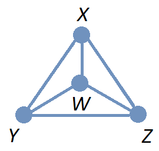

= Proofs: Basic Techniques

#*CAUTION* - CHAPTER UNDER CONSTRUCTION!#

_This chapter was last updated on February 25, 2025_ + 
[small]#Contents locked until 11:59 p.m. Pacific Standard Time on May 23, 2025.#

//MKD: Need to add info on Rules of Inference
// and definition of proof, theorem (lemma, corollary), axiom (postulate), conjecture 
// and methods (with examples): direct proof, proof by contraposition, proof by contradiction, counterexamples (to refute a conjecture)
// ALSO SEE ROSEN EXAMPLE 5 PAGE 84 (vacuous proof of an implication)
// ALSO FALLACIES:
// SEE ROSEN EXAMPLE 16 PAGE 89 (fallacy "denying the hypothesis")
// also converse error, inverse error
// Methods: proof by cases (and "Proof by exhaustion")
//"without loss of generality"
//Exixtence proofs (constructive, nonconstructive)
//Uniquesness proofs
//Open Problems: The 3x + 1 Conjecture ROSEN PAGE 107 (Collatz Problem)
//

////
PROOFS: BASIC TECHNIQUES (MKD) - new chapter
	ACTIVITY: Logic
	ACM CCECC Other proof techniques	
    COMP 152 Basic Logic and DS2.
    COMP 152 Proof Techniques and DS3.
        Modus ponens and modus tollens
        Notions of implication, converse, inverse, contrapositive, negation, and contradiction (MKD - may already cover in Logic_)
		direct proof
        Direct proofs
		proofs by counter example, contrapositive, and contradiction
        Proof by counterexample
        Proof by contradiction
		Proof by contraposition
		logical equivalence and circles of implication
        The structure of mathematical proofs/The structure of formal proofs
	2013 changes/additions        
		[Core-Tier1]
			Notions of implication, equivalence, converse, inverse, contrapositive, negation, and contradiction
			The structure of mathematical proofs
			Direct proofs
			Disproving by counterexample
			Proof by contradiction
THE REST MOVE TO OTHER CHAPTERS	
			Induction over natural numbers
			Structural induction
			Weak and strong induction (i.e., First and Second Principle of Induction)
			Recursive mathematical definitions
	[Core-Tier2]
			Well orderings

MKD examples:
	direct	if integers a and b are divisible by c, then so is ma+nb for any integers m and n.
	contraposition 	NEED; maybe if n^2 is even (odd) then n is even (odd)
	contradiction	sqrt(2) is irrational (i.e., NOT of form a/b for integers a and b; requires assuming unique prime factorization which we can prove by strong induction later in the book)
	counterexample 	NEED
	
AUG 2024 update on topics
DS2013/Basic Logic	Propositional inference rules (concepts of modus ponens and modus tollens)
DS2008/BasicLogic	Modus ponens and modus tollens
--
MKD: These are introduced in Logic chapter and expanded on here
	DS2013/Proof Techniques	Notions of implication, equivalence, converse, inverse, contrapositive, negation, and contradiction
	DS2008/ProofTechniques	Notions of implication, converse, inverse, contrapositive, negation, and contradiction
--
DS2013/Proof Techniques	The structure of mathematical proofs
DS2008/ProofTechniques	The structure of mathematical proofs
DS2013/Proof Techniques	Direct proofs
DS2008/ProofTechniques	Direct proofs
ACM_CCECC_2005/Other proof techniques	direct proof
DS2013/Proof Techniques	Disproving by counterexample
DS2008/ProofTechniques	Proof by counterexample
DS2001/Proof techniques	Proof by contraposition
DS2013/Proof Techniques	Proof by contradiction
DS2008/ProofTechniques	Proof by contradiction
ACM_CCECC_2005/Other proof techniques	proofs by counter example, contrapositive, and contradiction
ACM_CCECC_2005/Other proof techniques	logical equivalence and circles of implication

PROOF TECHNIQUES - January 2025
DS2013/Proof Techniques	Notions of implication, equivalence, converse, inverse, contrapositive, negation, and contradiction
DS2013/Proof Techniques	The structure of mathematical proofs
DS2013/Proof Techniques	Direct proofs
DS2013/Proof Techniques	Disproving by counterexample
DS2013/Proof Techniques	Proof by contradiction
DS2008/ProofTechniques	Notions of implication, converse, inverse, contrapositive, negation, and contradiction
DS2008/ProofTechniques	The structure of mathematical proofs
DS2008/ProofTechniques	Direct proofs
DS2008/ProofTechniques	Proof by counterexample
DS2001/Proof techniques	Proof by contraposition
DS2008/ProofTechniques	Proof by contradiction
MSF-Discrete_2023	3. Proof techniques (induction, proof by contradiction)
MSF-Discrete_2023	6. Logic: truth tables, connectives (operators), inference rules, formulas, normal forms, simple predicate logic
ACM_CCECC_2005/Other proof techniques	direct proof
ACM_CCECC_2005/Other proof techniques	proofs by counter example, contrapositive, and contradiction
ACM_CCECC_2005/Other proof techniques	logical equivalence and circles of implication

Also see 	Proof Templates (slides 10-12) and (Jose Ortiz sets slides 35-40)
		these are in chapter 1 of Haggard,Schlipf, and Whitesides

--

////

//how is formal logic related to empirical analysis
//	formal logic is "a priori", that is, from cause to effect
//		this is "synthetic" in that we build from that which is 
//		know before experience to justify conclusions
//	empirical analysis is "a posteriori", that is from effect to cause
//		in the sense that we have observed or experienced an effect 
//		and ask "what could have caused this effect?"
//		This is how the sciences work, and 
//		how most computer programs are verified!! 

//MKD needs to add intro blurb "Proof is used to validate arguments and processess"

Recall from the link:./logic.html[Logic] chapter that an *argument* is a finite sequence of statements that ends with a final statement, the *conclusion,* that is based on inferences made from the earlier statements, called *premises* or *hypotheses.*

An argument is *valid* if it is of a form such that if all premises are True then the conclusion must be True, too. An argument is not valid just because it exists! 
//Compare this situation to a proposition, which is a single statement that may be either True or False (but not both); an argument is a finite sequence of statements that may be either valid or invalid.
// MKD Feb 22 2025
Just as a proposition is a single statement that may be either True or False (but not both), an argument is a finite sequence of statements that may be either valid or invalid (ut not both.)

A *proof* is a valid argument made up of propositions. In a proof, some premises may be *axioms* or *postulates,* which are propositions that we simply ASSUME to be True. Other premises used in a proof may be previously-proven propositions called *theorems.* There are many other terms used for theorems depending on the context, such as *lemma* (a minor theorem needed to prove a more important major theorem) and *corollary* (a theorem that is a conclusion based on a premise that is a more important theorem), 
//etc., 
but each of these specialized terms describes a theorem.

Key terms and concepts covered in this chapter:

* Propositional inference rules (concepts of modus ponens and modus tollens)
** Notions of implication, equivalence, converse, inverse, contrapositive, negation, and contradiction
* The structure of mathematical proofs
* Proof techniques 
// (induction, proof by contradiction)
** Direct proofs
** Proof by counterexample (Disproving by counterexample)
** Proof by contraposition (proof by contrapositive)
** Proof by contradiction
* To be added to this chapter after May 23, 2025:
** logical equivalence and circles of implication

//You will see later in this chapter that in many proofs, we ASSUME that some premises are True and may prove other premises along the way before reaching the final conclusion.

////
//MKD use non-looping example here 
:pt_code_height: 350
:pt_rawinput: false
:pt_code: def%20negation%28p%29%3A%0A%20%20%20%20return%20not%20p%0A%0Aprint%28%22p%20%20%20%20%C2%ACp%22%29%0Afor%20p%20in%20%5BTrue,%20False%5D%3A%0A%20%20%20%20print%28p,%20negation%28p%29%29

****
.Example {counter:proofexample} - Justify that this code works
--
--
The code below prints the sum of the first $n$ odd positive numbers for a chosen value of $n$. How do we know that the code does what it claims to do?

Try to predict the variable names, values, and data types at different steps in the execution. Use the _Next_ button to check your answers.
include::python_tutor.adoc[]
****
//MKD use non-looping example here
////

// MKD combine this and "Rules Of Inference for Quantified Statements" after Dec. 20, 2024
//== Rules Of Inference
== Rules of Inference for Propositions

//MKD need to define an argument somewhere (or already in Logic chapter?)
//MKD - can recycle the Sarah and Daniel example from Logic chapter, but write in the form 
// $p$
// $p \rightarrow q$
// vertical line
// \therefore q

//In order to make a valid argument, we must 
To create a proof, we must 
//allow ourselves to 
proceed from True propositions to other True propositions without introducing False propositions into the argument. 
//using invalid reasoning. 
//To this end, 
To do this, we use *rules of inference,* which are ways to draw a True conclusion from one or more premises that are already known to be True (or assumed to be True). That is, a *rule of inference* is an argument form that corresponds to a tautology, and so is valid. 
//This is most easily explained by example.

//One source of rules of inference are tautologies as discussed in the chapter on Logic.

//MKD Modus Ponens, Modus Tollens, Hypothetical Syllogism
//MKD get list of rules of inference from the the TWTask "Logic" and have students verify using truth tables.
//MKD Also see table of rules of inference in Rosen, p 68
//MKD Also see table of rules of inference with quantifiers in Rosen, p 76

// MKD begin slide "Logically valid inferences"
****
.Example {counter:proofexample} - Notation For A Rule Of Inference

A rule of inference can be represented as 
follows.
// an argument of the form

[no-bullet]
* $p_{1}$
* $p_{2}$
* $\vdots$
* $p_{n}$
//* $____$
* $\therefore q$

The propositional variables $p_{1},\,p_{2},\,\ldots,\,p_{n}$ represent the premises of the argument, and $q$ represents the conclusion of the argument. The symbol $\therefore$ is read as "therefore".

This rule of inference is interpreted to mean that if all of the propositions $p_{1},\,p_{2},\,\ldots,\,p_{n}$ are True then the proposition $q$ MUST be True.
//, too.
//Each 
//That is, this 
The rule of inference 
in this example 
corresponds to 
//an established 
the tautology 
//of the form 
$(p_{1} \land p_{2} \land \ldots \land p_{n})\rightarrow q$.
//These rules of inference can be used in any mathematical argument and do not require any proof.

Note that the conclusion $q$ must be the last proposition, but 
//that, technically, 
the order in which the premises  $p_{1},\,p_{2},\,\ldots,\,p_{n}$ are listed in the argument does not matter since we use the conjunction of all premises to prove the conclusion. 
The premises $p_{1},\,p_{2},\,\ldots,\,p_{n}$ are usually presented in an order that follows the flow of thought.  

****

// MKD end slide

//That is, a *rule of inference* is an argument form that is valid, and corresponds to a tautology. This is most easily explained by example.

****
.Example {counter:proofexample} - Valid and Invalid Arguments
//MKD inserted this example 2/17/24; refers back to Logic chapter

Consider the following three arguments.

.A Valid Argument

The following argument was used as an example in the link:./logic.html[Logic] chapter. 

[no-bullet]
* Sarah earned a B.S. in Computer Science.
//* Anyone who earned a B.S. in Computer Science earned a C or better in Discrete Math.
* Anyone who earned a B.S. in Computer Science must have earned a C or better in Discrete Math.
* Therefore, Sarah earned a C or better in Discrete Math.

//This 
The argument is of the form

//[no-bullet]
//* Individual X is a member of category A
//* Any individual that is a member of category A must also be a member of category B.
//* Therefore, individual X is a member of category B

//or 

[no-bullet]
* _p_
* if _p_ then _q_
* $\therefore$ _q_ 

This argument form is named *_modus ponens_* which is translated roughly from Latin as "method of affirming". 
_Modus ponens_ is a 
//*valid* 
valid 
argument form because it corresponds to the tautology $(p \land (p \rightarrow q)) \rightarrow q$. 

[width=50%",align="center",options="header"]
|====
| $p$ | $q$ | $p \rightarrow q$ | $p \land (p \rightarrow q)$ | $q$ | $(p \land (p \rightarrow q)) \rightarrow q$
| T | T | T | T | T | T
| T | F | F | F | F | T
| F | T | T | F | T | T
| F | F | T | F | F | T
|====

//Such an arugment form is called a *rule of inference*.
That is, _modus ponens_ is a rule of inference.

.An Invalid Argument
//Compare the above argument to the following one.
Consider this second argument.

[no-bullet]
* Arya earned a C or better in Discrete Math.
//* Anyone who earned a B.S. in Computer Science earned a C or better in Discrete Math.
* Anyone who earned a B.S. in Computer Science must have earned a C or better in Discrete Math.
* Therefore, Arya earned a B.S. in Computer Science.

//Hopefully, it does not surprise you that this 
This argument is NOT valid. 
//If we know that Arya earned a C or better in Discrete Math, 
If we assume that 
//all premises, which are 
the first two propositions
//, 
are True, we do not have enough information to reach the conclusion 
that Arya earned a B.S. in Computer Science: 
// that Arya earned a B.S. in Computer Science: Arya 
Arya _may_ have earned that degree, or _may_ still be working towards the degree, or _may_ have changed majors and 
//graduated after earning 
earned a degree in the new major, or perhaps there is some other possibility -  we cannot determine 
//the truth value of 
whether the conclusion 
is True or False 
//by assuming that 
based on the assumption that 
the two premises are True.

The argument 
//about Arya 
//is invalid because it 
corresponds to the 
//invalid 
argument form

[no-bullet]
* _q_
* if _p_ then _q_
* $\therefore$ _p_ 

This argument form is an example of a *fallacy* or *_non sequitur_,* which is Latin for "it does not follow". 
//This 
The argument form is *invalid* 
//and is  
//called a *fallacy* (or *non sequitur*, Latin for "it does not follow").
//. The argument form 
//because it 
//is invalid - 
because it 
//does NOT 
corresponds to a 
proposition that is NOT a 
tautology, 
as can be seen in the truth table for the compound proposition 
$(q \land (p \rightarrow q)) \rightarrow p$. 

[width=50%",align="center",options="header"]
|====
| $p$ | $q$ | $p \rightarrow q$ | $q \land (p \rightarrow q)$ | $p$ | $(q \land (p \rightarrow q)) \rightarrow p$
| T | T | T | T | T | T
| T | F | F | F | T | T
| #F# | #T# | #T# | #T# | #F# | #F#
| F | F | T | F | F | T
|====

//That is, we can not infer $p$ from $q \land (p \rightarrow q)$ because both

Notice that there is at least one row of the truth table in which both $q$ and $p \rightarrow q$ are True but $p$ is False! This means that we can NOT infer that $p$ is True whenever $(q \land (p \rightarrow q))$ is True. The argument form is *invalid* because $(q \land (p \rightarrow q)) \rightarrow p$ is not a tautology. 

This particular fallacy is used 
by people 
so often that it has its own name: The *converse error,* or *fallacy of the converse.*

.A Third Argument - You Try
//Compare the above argument to the following one.

Write the argument form for the following argument. 
// MKD Feb 24 2025 - changed Ping to Jing

[no-bullet]
* Jing did not earn a B.S. in Computer Science.
//* Anyone who earned a B.S. in Computer Science earned a C or better in Discrete Math.
* Anyone who earned a B.S. in Computer Science must have earned a C or better in Discrete Math.
* Therefore, Jing did not earn a C or better in Discrete Math.

Find a compound proposition that corresponds to the argument form you wrote, and write the truth table for that compound proposition.

[env.question]
--
Is the argument valid? 
--

[click.hint]
--
The argument is valid if and only if the compound proposition is a tautology.
--

[click.answer]
--
No. The argument is invalid and is an example of the *inverse error* or *fallacy of the inverse.* + 
 + 
[small]#Another way to see that this argument is invalid is to consider a case where Jing did earn a C or better in Discrete Math even though the two premises are True; for example, Jing could have earned a B.S. in Mathematics instead of Computer Science and also earned a C or better in Discrete Math.#
--

****

// MKD consider adding "extraneous solution" example here
//	if x + 1 = \sqrt(x+7) then x^{2}+x-6 = 0 is True
//	if x^{2}+x-6 = 0 then x + 1 = \sqrt(x+7) is False 

In the following subsections we will discuss some of the more common rules of inference.

=== Transitivity Of The Conditional

The following rule of inference is called *pure hypothetical syllogism,* but we will use the less formal name *transitivity.* It is the basis of conditional proof in mathematics.

.Transitivity (Pure Hypothetical Syllogism)
****
[no-bullet]
* $p \rightarrow q$
* $q \rightarrow r$
* $\therefore p \rightarrow r$ 

This rule of inference corresponds to the tautology 
$((p \rightarrow q) \land (q \rightarrow r)) \rightarrow (p \rightarrow r)$.
****

By applying transitivity multiple times, you can build a finite chain of implications of any length you want: 
[no-bullet]
* $p \rightarrow p_{1}$
* $p_{1} \rightarrow p_{2}$
* $p_{2} \rightarrow p_{3}$
* $\vdots$
* $p_{k-1} \rightarrow p_{k}$
* $p_{k} \rightarrow r$
* $\therefore p \rightarrow r$ 

//=== More on Modus Ponens, et al.
=== Rules Of Inference And Fallacies Arising From The Conditional

Recall that if you have propositions $p$ and $q,$ you can form the conditional with 
//*hypothesis* $p$ and *consequent* $q,$ written as 
hypothesis $p$ and consequent $q,$ which is written as 
$p \rightarrow q$, as well as three other related 
//compound propositions that are also 
conditionals.

* $p \rightarrow q$, the conditional
* $q \rightarrow p$, the converse of $p \rightarrow q$  
* $\neg q \rightarrow \neg p$, the contrapositive of $p \rightarrow q$
* $\neg p \rightarrow \neg q$, the inverse of $p \rightarrow q$ 

Also, recall that $(p \rightarrow q) \equiv (\neg q \rightarrow \neg p)$. That is, $(p \rightarrow q) \leftrightarrow (\neg q \rightarrow \neg p)$ is a tautology. This means that the conditional is logically equivalent to its contrapositive. The conditional is NOT logically equivalent to either its converse or its inverse, as was shown using truth tables in the link:./logic.html[Logic]chapter.

From the four conditionals you can get two rules of inference and two fallacies. 
Together, these four argument forms are referred to as the 
*mixed hypothetical syllogisms.*
//, a term unlikely to be used again in this textbook.
//, but mentioned here so that you can say honestly "I remember seeing that somewhere once!"

First, here are the two rules of inference.

.Modus Ponens ("Method Of Affirming")
****
[no-bullet]
* $p \rightarrow q$
* $p$
* $\therefore q$ 

This rule of inference corresponds to the tautology 
$((p \rightarrow q) \land p) \rightarrow q$.
//, a valid use of the conditional $p \rightarrow q$.
****

.Modus Tollens ("Method Of Denying")
****
[no-bullet]
* $p \rightarrow q$
* $\neg q$
* $\therefore \neg p$ 

This rule of inference corresponds to the tautology 
$((p \rightarrow q) \land \neg q) \rightarrow \neg p$. 

[small]#This rule of inference corresponds to replacing the conditional 
$p \rightarrow q$ by its logically equivalent contrapositive $\neg q \rightarrow \neg p$ in the tautology, which gives $((\neg q \rightarrow \neg p) \land \neg q) \rightarrow \neg p,$ then applying _modus ponens_ to this new tautology.#

****

Next, here are the two fallacies. They are included because they are very common errors to be aware of and to avoid. 
[WARNING]
//[CAUTION]
====
//These are NOT rules of inference: They don't work!
//DO NOT USE THESE FOR INFERENCE - THEY DON'T WORK!!!

.Inverse Error
// - Do Not Use!
// For Inference
****
[no-bullet]
* $p \rightarrow q$
* $\neg p$
//* [line-through]#$\therefore \neg q$# 
* [line-through]#∴¬_q_#

This fallacy arises by mistakenly treating the inverse $\neg p \rightarrow \neg q$ as if it were logically equivalent to $p \rightarrow q$. It is also called the "fallacy of the inverse" and "fallacy of denying the hypothesis". 
****
====
[WARNING]
//[CAUTION]
====

.Converse Error
// - Do Not Use!
// For Inference
****
[no-bullet]
* $p \rightarrow q$
* $q$
//* $\therefore p$
* [line-through]#∴_p_#

This fallacy arises by mistakenly treating the converse $q \rightarrow p$ as if it were logically equivalent to $p \rightarrow q$. It is also called the "fallacy of the converse" and the "fallacy of affirming the consequent".
****
====

The following image uses an *Euler diagram* of two sets $A \subseteq B$ to explain why the converse error is a fallacy. The image can also be used to explain why the inverse error is a fallacy.
//If $x \in B$, then we cannot determine whether $x \in A$ or $x \notin A$.

image::imagesMKD/ConverseErrorForSets.png[]

Suppose you were told that $c$ is an element of $B$ in the preceding image. Can you determine whether $c$ is an element of $A$, too?

=== Other Common Rules Of Inference

Any tautology of the form $p \rightarrow q$
//$(p_{1} \land p_{2} \land \ldots \land p_{n})\rightarrow q$ 
can be used to define a rule of inference. 
In particular, we can define a rule of inference corresponding to the tautology $(p_{1} \land p_{2} \land \ldots \land p_{n})\rightarrow p_{1}$ for each integer $n \geq 1$.  
//In the Logic chapter, an algorithm was described that lets you rewrite any compound proposition as a logically equivalent disjunctive normal form (DNF). Given a conditional of the form $p \rightarrow q$, $p$ can be replaced by a logically equivalent DNF. 
//In the discussion above about transitivity, it was stated that .
This means that there are at least as many possible tautologies as there are natural numbers! How do we deal with infinitely many tautologies?

In general, there is a small number of rules of inference that are used in most proofs. Proofs often are built up to a large size by applying just a few rules of inference multiple times.

Here are some of the more commonly-used rules of inference. In the remix author's opinion, it's better to practice _using_ these rules of inference rather than to focus on memorizing them as formal rules with special names.

.Proof by Cases
****
[no-bullet]
* $p \rightarrow r$
* $q \rightarrow r$
* $p \lor q$
* $\therefore r$
//(p \lor q) \rightarrow r$ 

This rule of inference corresponds to the tautology 
$((p \rightarrow q) \land (q \rightarrow r) \land (p \lor q)) \rightarrow r$.
****

.Elimination (Disjunctive Syllogism)
****
[no-bullet]
* $p \lor q$
* $\neg q$
* $\therefore p$ 

This rule of inference corresponds to the tautology 
$((p \lor q) \land \neg q) \rightarrow p$.
****

.Resolution
****
[no-bullet]
* $p \rightarrow q$
* $\neg p \rightarrow r$
* $\therefore q \lor r$ 

This rule of inference corresponds to the tautology 
$((p \rightarrow q) \land (\neg p \rightarrow r)) \rightarrow (q \lor r)$. 

[small]#Notice that this rule of inference can also be written as# + 
[small]#$\neg p \lor q$# + 
[small]#$p \lor r$# + 
[small]#$\therefore q \lor r$# + 
[small]#This form of resolution is important to  link:https://dl.acm.org/doi/10.1145/321250.321253[automated theorem-proving.]# 

****

.Contradiction Rule
****
[no-bullet]
* $\neg p \rightarrow (q \land \neg q)$
* $\therefore p$ 

This rule of inference corresponds to the tautology 
$(\neg p \rightarrow (q \land \neg q)) \rightarrow p$.

Note that this tautology is 
//logically equivalent to 
often written in the alternate form 
$((\neg p \rightarrow q) \land (\neg p \rightarrow \neg q)) \rightarrow p$, which 
//is sometimes 
can be more useful in some contexts.
****

//MKD get list of rules of inference from the the TWTask "Logic" and have students verify using truth tables.
//MKD Also see table of rules of inference in Rosen, p 68
//MKD Also see table of rules of inference with quantifiers in Rosen, p 76

There are [underline]#many# more rules of inference we could 
//(but won't) 
write down and give names to. Instead, we'll just list a few tautologies.
//.. As an exercise, try to figure out 

****
.You Try
For each of the tautologies shown, write the argument form for the corresponding rule of inference. If needed, refer to Example 2 in this chapter to see how the argument, argument form, and tautology are related.

* $(p \land q) \rightarrow p$
* $p \rightarrow (p \lor q)$
* $p \rightarrow (q \rightarrow (p \land q))$

****

////
=== TESTING

[env.question]
--
What is the speed of light?
--

[click.answer]
--
300,000 km/sec
--
////

// MKD combine this and "Rules of Inference for Propositions" after Dec. 20, 2024
== Rules Of Inference for Quantified Statements

//In this section, four rules of inference that apply to predicates that have been quantified are discussed. We assume that the values of the variable(s) are restricted to a universal set $U.$ 
In this section, four rules of inference that apply to quantified predicates  are presented. In all of these rules of inference, the values of the variable(s) are assumed to be restricted to a universal set $U.$

=== Rules of Inference for Universally-Quantified Predicates

//Universal instantiation states that, from the premise $\forall x P(x)$ where  
//and the premise $c \in U,$ where $c$ is an arbitrarily-chosen element, you can conclude that $P(c)$ must also be true. 
Universal instantiation states that, from the premise that $\forall x P(x)$ is True, where $x$ ranges over all elements of the universal set $U,$ you can conclude that $P(c)$ must also be True, where $c \in U$ is any arbitrarily-chosen element of $U.$ 

.Universal Instantiation (Universal Specification)
****
[no-bullet]
* $\forall x P(x)$
* $\therefore P(c) \text{ for any } c \in U$ 

//This rule of inference corresponds to the tautology 
//$(((\forall x \in U) P(x)) \land (c \in U)) \rightarrow (P(c)).$
****

Universal generalization states that, from the premise that $P(x)$ is True for every arbitrarily-chosen value of $x$ that is an element of the universal set $U,$ you can conclude $\forall x P(x)$ must also be True, where $x$ ranges over all elements of the universal set $U.$ 

.Universal Generalization
****
[no-bullet]
* $P(c) \text{ for every } c \in U$
* $\therefore \forall x P(x)$ 

//This rule of inference corresponds to the tautology 
//$(P(c) \text{ for every } c \in U) \rightarrow (\forall x \in U) P(x).$ 
****

You will see later in the textbook that universal generalization is applied in _every_ proof that uses the link:./induction.html[mathematical induction] proof technique.

=== Rules of Inference for Existentially-Quantified Predicates

Existential instantiation states that, from the premise $\exists x P(x),$ you can conclude that there must be at least one $c \in U$ such that $P(c)$ is true. This allows you to pick a "constant" $c$ that makes the predicate $P(x)$ True instead of needing to refer repeatedly to the existential quantifier.

.Existential Instantiation (Existential Elimination)
****
[no-bullet]
* $\exists x P(x)$
* $\therefore P(c) \text{ for some element } c \in U$ 

//This rule of inference corresponds to the tautology 
//$((\exists x \in U) P(x)) \rightarrow (P(c)).$
****

Existential generalization states that, from the premise that $P(c)$ is True for at least one $c \in U,$ you can conclude that $\exists x P(x)$ must also be True. 

.Existential Generalization
****
[no-bullet]
* $P(c) \text{ for some element } c \in U$
* $\therefore \exists x P(x)$ 

//This rule of inference corresponds to the tautology 
//$(P(c) \text{ for every } c \in U) \rightarrow (\forall x \in U) P(x).$ 
****

//== Proof Techniques - SECTION IN PROGRESS
== Proof Techniques

In this section several examples of formal mathematical proofs are given to illustrate different proof techniques. 
// MKD added Sept 13, 2024 
Many of the techniques correspond to certain rules of inference that were discussed earlier in this chapter. 

Each proof starts by stating a *conjecture,* which is a proposition with undetermined truth value. The goal of each proof is to determine the truth value of the relevant conjecture.

To simplify the description of the proof techniques, we'll only consider the case where the proof has a _single premise_ $p$, that is, we'll always assume that our proof  
//is of the _modus ponens_ form $(p \land (p \rightarrow q)) \rightarrow q$. 
involves a single conditional $p \rightarrow q$. This may seem like an oversimplification, but it is not: We are simply renaming the conjunction $(p_{1} \land p_{2} \land \ldots \land p_{n})$ of all of the actual premises by using the single propositional variable $p$, that is we are _defining_ $p$ by the logical equivalence $p \equiv (p_{1} \land p_{2} \land \ldots \land p_{n})$

//MKD added July 15 2024... may not need in final version
Here we'll present examples of proofs using several different techniques. 
// MKD Sept 12 2024
Most of these proofs establish an arithmetic fact that you probably have always known (or assumed) is True; instead, you can focus on the _form_ of the proof: Note the steps that are used, and how the argument flows. 

Another important proof technique, *mathematical induction,* will be discussed in a link:./induction.html[later chapter.] 
// link:./induction.html[Proofs: Mathematical Induction ]

// MKD Feb 24 2025 - classic "Why we need induction example."
//https://oeis.org/A005846 or 
//https://oeis.org/search?q=43%2c47%2c53%2c61%20id:5846 

****
.Example {counter:proofexample} - Why do we need proofs at all? 

//Can't we just check a lot of cases?

Consider the following proposition: "For all natural numbers $n,$ the value of $n^{2} + n + 41$ is a prime integer."

For each of the natural numbers 0, 1, ..., 10, the predicate $P(n)$: "$n^{2} + n + 41$ is a prime integer." evaluates to a proposition that is True. In fact, $P(n)$ evaluates to a proposition that is True for each of the natural numbers $n$ that is less than or equal to 40. 

It may seem that we have "checked enough cases" to conclude that $P(n)$ will evaluate to a proposition that is True for every possible natural number value of $n.$ However, $P(41)$ is the proposition "$41^{2} + 41 + 41 \text{is a prime integer}$," which is False - notice that $41^{2} + 41 + 41 = 41 \cdot (41 + 1 + 1) = 41 \cdot 43$ is a composite number.

This example shows that it is not enough to verify that a proposition or predicate is True for just a few cases, unless those cases happen to cover _every_ possibility. 

****

=== Direct Proof

//In a direct proof, we make an argument that $p \rightarrow q$ must be True. This means that we can assume that the premise $p$ is True and apply _modus ponens_ to prove that $q$ must be True, too. 
In a direct proof, we make an argument that a conditional statement $p \rightarrow q$ must be True. This means that we can assume that the premise $p$ is True and apply _modus ponens_ to prove that $q$ must be True, too. 

//	direct	if integers a and b are divisible by c, then so is ma+nb for any integers m and n. 
.Theorem
****
If $a,$ $b,$ and $c$ are integers such that both $a$ and $b$ are divisible by $c,$ then for any integers $m$ and $n$ the integer $ma+nb$ must be  divisible by $c.$ + 
[small]#This statement can be rephrased as "If the integers $a$ and $b$ are multiples of the integer $c$, then any sum of integer multiples of $a$ and $b$ must also be a multiple of $c."$#

.Proof 

Before starting the formal proof, let's look at a specific example. The integers 10, 6, and 2 are such that both 10 and 6 are divisible by 2. Suppose we have a pair of integers that we will use as multipliers, say 11 and 7, to form a new number $(11)(10)+(7)(6).$ Is the new number also divisible by 2? The answer is obviously "Yes" since we can just simplify the sum and divide by 2, but how can we _justify_ this for every choice of the pair of multipliers? Notice that we can factor 2 out of 10 and 6 in the sum that defines our new number: \[ (11)(10) + (7)(6) = (11)(5)(2) + (7)(3)(2) = [(11)(5)+(7)(3)](2) \] We can find the common factor of 2 and "factor it out" as if it were a variable. This appears to work no matter what values are chosen for the first three integers and the pair of multipliers, so should be generalizable to a formal proof.

For the formal proof, start by supposing that $a,$ $b,$ and $c$ are integers such that both $a$ and $b$ are divisible by $c.$ This means that there are integers $q$ and $t$ such that \[ a=qc \text{ and } b=tc \]

For any integers $m$ and $n$, we can rewrite the expression $ma+nb$ as \[ ma+nb = m(qc)+n(tc) = (mq)c + (nt)c = (mq+nt)c \] 

The last part of the extended equality shows that $ma+nb$ is a multiple of $c,$ that is, $ma+nb$ is divisible by $c.$ 

//This shows that the statement of the theorem is a valid conclusion.
This shows that the statement of the theorem is a True proposition.

Q.E.D.

.You Try

Write a proof of the following statement: If $a,$ $b,$ and $c$ are integers such that $a$ is divisible by $b$ and $b$ is divisible by $c,$ then $a$ must be divisible by $c.$
 
****

// also do a "proof by cases", "exhaustive proof"
// MKD maybe do proof of 1-1 corr between N and Z here?
// MKD Feb 15 2025 - need to insert proof by cases (K4 coloring example?)
//	or the remainder when n^2 is divided by 4 must be either 0 or 1

		
=== Proof By Contraposition

// In a proof by contraposition, we make an argument that $\neg q \rightarrow \neg p$ must be True. This means that the logically equivalent conditional $p \rightarrow q$ must be True, so we can assume that the premise $p$ is True and apply _modus ponens_ to prove that $q$ must be True, too. 
//In a proof by contraposition, we make an argument that $\neg q \rightarrow \neg p$ must be True. We can assume that the premise $\neg q$ is True and apply _modus tollens_ to prove that $\neg p$ must be True, too. 
//In a proof by contraposition, we make an argument that $\neg q \rightarrow \neg p$ must be True. Since  $p \rightarrow q$ is logically equivalent to $\neg q \rightarrow \neg p,$ we can assume that the premise $p$ is True and apply _modus ponens_ to prove that $q$ must be True, too. 
In a proof by contraposition, we make an argument that $p \rightarrow q$ is True by instead first arguing that its contrapositive $\neg q \rightarrow \neg p$ is True and secondly applying the logical equivalence of the conditional and its contrapositive. Start by assuming that the premise $\neg q$ is True and apply _modus ponens_ to prove that $\neq p$ must be True, too, then apply logical equivalence.

//	NEED; maybe if n^2 is even (odd) then n is even (odd)
.Theorem
****

Let $n$ represent an integer. 

//(1) If $n^{2}$ is even, then the integer $n$ is even. 

//(2) If $n^{2}$ is odd, then the integer $n$ is odd. 

If $n^{2}$ is even, then the integer $n$ is even. 

.Proof 

//We'll only prove statement (1), by first proving its contrapositive, which is a logically equivalent statement. The proof of statement (2) is left as a "you try" exercise.

It is easier to prove "if it's not the case that the integer $n$ is even, then it's not the case that $n^{2}$ is even," so start by supposing that it's not the case that the integer $n$ is even. 

This means that $n$ must be odd, so there is an integer $q$ such that \[ n = 2q + 1\] 

// \[ n = q \cdot 2 + 1\] 

This in turn means that \[ n^{2} = (2q + 1)^{2} = 4q^{2} + 4q + 1 = 2(2q^{2} + 2q) + 1\] 

// \[ n^{2} = (2q \cdot 2 + 1)^{2} = 4q^{2} + 4q + 1 = (2q^{2} + 2q) \cdot 2 + 1\] 

The last part of the extended equality shows that $n^{2}$ is odd: When $n^{2}$ is divided by 2, the remainder is 1. That is, $n^2$ is not even. 

//This shows that the contrapositive of the statement of the theorem is a valid conclusion, that is "if the integer $n$ is not even, then $n^{2}$ is not even." Since the statement and its contrapositive are logically equivalent, the statement of the theorem is a valid conclusion as well. 
This shows that the contrapositive of the statement of the theorem, "if the integer $n$ is not even, then $n^{2}$ is not even" is a True proposition. Since every conditional and its contrapositive are logically equivalent, this argument proves that "If $n^{2}$ is even, then the integer $n$ is even" is a True proposition.

Q.E.D.

.You try

//Prove statment (2) - the form of the proof is the same as for statement (1), you'll only need to interchange "even" and "odd" throughout.

Prove the following statement: If $n^{2}$ is odd, then the integer $n$ is odd.

****

//(1) If $n$ is an integer and $n^{2}$ is even, then the integer $n$ is even. 

//(2) If $n$ is an integer and $n^{2}$ is even, then the integer $n$ is even. 

=== Proof By Counterexample

//In a proof by counterexample, we make an argument that ...
In a proof by counterexample, we *disprove* a proposition of the form $(\forall x \in D) P(x)$ by arguing that there is at least one value $c \in D$ such that $\neg P(c)$ is True.

// 	counterexample 	NEED

.Conjecture
****

For every natural number $n,$ there are natural numbers $a,$ $b,$ and $c$ such that $n = a^{2} + b^{2} + c^{2}.$ 

.Disproof of Conjecture

In this case, we can simply compute values of the expression $a^{2} + b^{2} + c^{2}$ until we find a "gap." \[ 0^{2} + 0^{2} + 0^{2} = 0 \] \[ 1^{2} + 0^{2} + 0^{2} = 1 \] \[ 1^{2} + 1^{2} + 0^{2} = 2 \] \[ 1^{2} + 1^{2} + 1^{2} = 3 \] \[ 2^{2} + 0^{2} + 0^{2} = 4 \] \[ 2^{2} + 1^{2} + 0^{2} = 5 \] \[ 2^{2} + 1^{2} + 1^{2} = 6 \]  \[ 2^{2} + 2^{2} + 0^{2} = 8 \]  \[ 2^{2} + 2^{2} + 1^{2} = 9 \] \[ 3^{2} + 0^{2} + 0^{2} = 9 \] Notice that you cannot write 7 as a sum of three squares of natural numbers (There may be other numbers that cannot be written in this form, too, but 7 is the least such number and we only need to find _one_ counterexample.) 

This proves the negation of the Claim, namely 

====
.Theorem  
There exists at least one natural number $n,$ such that for all natural numbers $a,$ $b,$ and $c,$ $n \neq a^{2} + b^{2} + c^{2}.$ 
====

[small]#This may seem like a strange conjecture to consider until you find out that link:https://en.wikipedia.org/wiki/Lagrange%27s_four-square_theorem[every natural number $n$ can be written as $n = a^{2} + b^{2} + c^{2} + d^{2}$ for some natural numbers $a,$ $b,$ $c,$ and $d,$] and that this may have been known link:https://en.wikipedia.org/wiki/Arithmetica[about 1,800 years ago.]# 

//Lagrange's four-square theorem

****

        
=== Proof by Contradiction

// MKD this needs a rewrite
//In a proof by contradiction, we assume $p,$ a proposition we know to be True, and also $\neg q$ and make an argument that $(p \land \neg q) \rightarrow q$ must be True. This means that we assume both premises $p$ and $\neg q$ and apply _modus ponens_ to prove that $q$ must be True, too, but then we have proven the proposition $(p \land \neg q) \rightarrow (q \land \neg q).$ Since $(q \land \neg q)$ MUST be False, this means that the premise $(p \land \neg q)$ must be False as well, but we know $p$ is True, so $\neg q$ must be False.
//In a proof by contradiction, we prove proposition $p$ by making an argument that $\neg p \rightarrow (q \land \neg q)$ must be True for some proposition $q$ and apply the Contradiction Rule to conclude that $p$ must be True. 
In a proof by contradiction, we disprove the proposition $\neg p$ by making an argument that the conditional $\neg p \rightarrow (q \land \neg q)$ must be True for some proposition $q$ and apply the Contradiction Rule to conclude that $p$ must be True. + 
//[small]#Note: Often, we argue that the conditional $((\neg p \rightarrow q) \land (\neg p \rightarrow \neg q)) \rightarrow p$ must be True, and use the fact that this conditional is logically equivalent to $\neg p \rightarrow (q \land \neg q).$# 
[small]#Note: Sometimes, we argue instead that the proposition $((\neg p \rightarrow q) \land (\neg p \rightarrow \neg q))$ must be True, and use the fact that this proposition is logically equivalent to $\neg p \rightarrow (q \land \neg q)$ and apply the Contradiction Rule.#

// MKD have students verify that $(\neg p \land \neg q) \rightarrow q$ and $\neg \rightarrow (q \land \neg q)$ are logically equivalent

// 	sqrt(2) is irrational (i.e., NOT of form a/b for integers a and b; requires assuming unique prime factorization which we can prove by strong induction later in the book) 
//.Theorem ($\sqrt(2)$ is an irrational number)
.Theorem 
****
There are no positive integers $a$ and $b$ such that $\displaystyle{ \left( \frac{a}{b} \right)^{2} } = 2.$ 

.Proof 

It may be helpful to write the proposition out in symbols: \[ \neg (\exists a \in \mathbb{Z}) (\exists b \in \mathbb{Z})  \left( a > 0 \land b>0 \land  \left( \frac{a}{b} \right)^{2} = 2 \right) \] 
// \left( \left( \frac{a}{b} \right)^{2} } = \right) \]

//We must negate the proposition that we want to prove. 
To prove this proposition by contradiction, we ASSUME that its negation is True, that is we use the premise \[ \text{ Premise: } \neg \neg (\exists a \in \mathbb{Z}) (\exists b \in \mathbb{Z})  \left( a > 0 \land b>0 \land  \left( \frac{a}{b} \right)^{2} = 2 \right) \] 
// \left( \left( \frac{a}{b} \right)^{2} } = \right) \]
In words, we assume: 
// the premise: 
There are integers $a$ and $b$ such that $a > 0,$ $b > 0,$ and $\displaystyle{ \left( \frac{a}{b} \right)^{2} } = 2.$
// \[ \left( \frac{a}{b} \right)^{2} = 2. \] 

//We will also assume that we have already reduced the fraction so that $a$ and $b$ have no common prime factors (You probably know how to do this - just divide both numerator and denominator by their greatest common divisor. We will _prove_ that this can be done in the mathematical induction chapter later in the textbook.) 
We know that we can reduce the fraction so that $a$ and $b$ have no common prime factors (You know how to do this - just divide both numerator and denominator by their greatest common divisor. In fact, we will _prove_ that this can be done in the mathematical induction chapter later in the textbook, but for now just treat it like a "known fact".)

//We can rewrite the equation as \[  a^{2} = 2 b^{2} \] 
To eliminate the fraction we can rewrite the equation as \[  a^{2} = 2 b^{2} \]

From this new equation, $a^{2}$ must be divisible by 2. 
//We can now use 
Use the theorem we proved earlier in this section to conclude that $a$ must be divisible by 2, too. This means that there is an integer $q$ such that $a = 2q.$ Substitute the last expression for $a$ in the equation to get  \[  (2q)^{2} = 2 b^{2} \] which we can rewrite as \[  4 q^{2} = 2 b^{2} \] or  \[  2 q^{2} = b^{2} \] From this equation, $b^{2}$ is divisible by 2, and we can conclude that $b$ is divisible by 2, too. 

//But... we now have that both $a$ and $b$ are divisible by 2, even though we assumed that we had already reduced the fraction so that $a$ and $b$ have no common prime factors. We have arrived at a contradiction. 

So... we have positive integers $a$ and $b$ that have no common prime factors, and we have proven that $a$ and $b$ have a common prime factor, namely 2. We have arrived at a contradiction.

//We know (well, we will prove later) that we CAN always reduce the fraction, so it must be a False proposition that \[ \left( \frac{a}{b} \right^{2} = 2. \] 

Apply the Contradiction Rule to infer that the premise must be False. 
//This proves that it is False that there are no positive integers $a$ and $b$ such that \[ \left( \frac{a}{b} \right)^{2} = 2 \] so $\sqrt(2)$ is not a rational number. 

We have proven the following theorem. 

====
.Theorem  
There are no positive integers $a$ and $b$ such that $\displaystyle{ \left( \frac{a}{b} \right)^{2} } = 2.$ + 
 + 
That is, the square root of 2 is not a rational number.
==== 

****
//There are no positive integers $a$ and $b$ such that $\displaystyle{ \left( \frac{a}{b} \right)^{2} } = 2.$
//There do not exist positive integers $a$ and $b$ such that $\displaystyle{ \left( \frac{a}{b} \right)^{2} } = 2.$

Here is another example of proof by contradiction.

.Theorem - Generalized Pigeonhole Principle
****
Suppose that $n$ and $k$ are positive integers. If each of $n$ objects is assigned to one of $k$ categories, then at least one category contains at least $\displaystyle{\left\lceil \frac{n}{k} \right\rceil}$ objects.

.Proof 

First, recall that $\lceil x \rceil$ is the ceiling function whose output is the least integer that is greater than or equal to $x$ (that is, $\lceil x \rceil$ rounds a real number $x$ up to the next greatest integer.) The graph of the function is shown in section 3 of link:./appendix_library.html[this appendix.]

Next, before starting a formal proof, let's look at a specific example to understand what we need to prove. Suppose we want to assign 13 people to the 3 categories "high school student," "post-secondary student," and "other". It's not hard to see that when we assign people to the categories, the sum of the numbers in the categories has to be 13, so at least one of the categories has at least $5 = \displaystyle{\left\lceil \frac{13}{3} \right\rceil}$ people. That is, if each category had at most $4 = \displaystyle{\left\lceil \frac{13}{3} \right\rceil - 1}$ people, then the sum of those numbers would be at most $(3)(4) = 12,$ but we know that the sum should be equal to 13 - this is a contradiction. You can formalize this argument to use $n$ and $k$ instead of the specific values 13 and 3, which will provide a formal proof using the "proof by contradiction" technique.

Now, to prove this proposition by contradiction, suppose that the conditional is False. That is, we assume that 

* It is True that $n$ and $k$ are positive integers. 
* It is true that each of $n$ objects has been assigned to one of $k$ categories. 
* It is False that "At least one category contains at least $\displaystyle{\left\lceil \frac{n}{k} \right\rceil}$ objects." 

So we are assuming that the negation of the last bulleted statement must be True, that is "Every category contains fewer than $\displaystyle{\left\lceil \frac{n}{k} \right\rceil}$ objects" is True. [small]#You should verify that this is the correct negation by using  De Morgan's laws for quantifiers.#

Label the categories with the integers $1, 2, \ldots k$ and let the integers $c_1, c_2, \ldots, c_k$ be the counts of objects in each of the categories, that is, assume that the number of objects assigned to category $i$ is $c_i.$ From the assumption, every $c_i$ is less than or equal to $\displaystyle{\left\lceil \frac{n}{k} \right\rceil} - 1.$ The total number of objects assigned to categories is therefore \[ c_1 + c_2 + \cdots + c_k \leq k \left( \displaystyle{\left\lceil \frac{n}{k} \right\rceil} - 1 \right) \]

//Now, using the division algorithm you can write $n = q \cdot k + r$ where $q$ and $r$ are natural numbers and $0 \leq r < k.$ In particular, \[ \displaystyle{\frac{n}{k}} \leq \displaystyle{\frac{n}{k}}\]

//If $r = 0$ then $\displaystyle{\frac{n}{k}} = q,$ and if $q <r < k$ then $\displaystyle{\frac{n}{k}} = q + 1.$ But in either case,  so $\displaystyle{\left\lceil \frac{n}{k} \right\rceil} = q,$ too. 

For any real number $x,$ it is true by definition of the ceiling function that $\displaystyle{x \leq \left\lceil x \right\rceil < x+1}$

// $\displaystyle{\frac{n}{k}} \leq \displaystyle{\frac{n}{k}}\]

This means that  \[ c_1 + c_2 + \cdots + c_k \leq k \left( \displaystyle{\left\lceil \frac{n}{k} \right\rceil} - 1 \right) < k \left( \displaystyle{\left( \frac{n}{k} + 1 \right)} - 1 \right) \] and the expression on the right simplifies to $n.$ 

So the number of objects assigned to the categories must be strictly less than $n,$ but we also have as a premise that all $n$ objects were assigned. This is a contradiction.

Apply the Contradiction Rule to infer that it is False that the last bulleted statement is False, that is, conclude that the conditional statement of the theorem must be True. 

We have proven the theorem. 

====
.Theorem  
Suppose that $n$ and $k$ are positive integers. 
 
If each of $n$ objects is assigned to one of $k$ categories, then at least one category contains at least $\displaystyle{\left\lceil \frac{n}{k} \right\rceil}$ objects.
==== 

****

//==== Proof By Exhaustion (Proof By Cases)
=== Proof By Exhaustion (Proof By Cases)

Sometimes it is convenient to break a proof into a finite number of cases. 
//that cover all possible hypotheses. 
For example, it may be easier to prove a statement that involves an integer by considering a first case where the integer is odd and a separate second case where the integer is even, then combining the two separate cases to create a single proof for all integers $n.$

In a general proof by cases, you make an argument that a conditional statement $(p_{1} \lor \cdots \lor p_{n}) \rightarrow r$ must be True. This means that 
//we can assume that 
if any one of the "cases" $p_{i},$ where $i \in \{ 1, 2, \ldots , n \},$ is True, you can apply the tautology $p_{i} \rightarrow (p_{1} \lor \cdots \lor p_{n})$ and the _transitivity_ rule of inference 
//and _modus ponens_ 
to prove that $r$ must be True, too. 

//A proof by exhaustion is a special kind of proof by cases where we know that $(p_{1} \lor \cdots \lor p_{n})$ must be True. That is, the propositions $p_{1},$ $p_{2},$… $p_{n}$ "exhaust" all the possible cases for the premise.
A proof by exhaustion is a special kind of proof by cases where the premise is of the form $(p_{1} \lor \cdots \lor p_{n} \lor \neg (p_{1} \lor \cdots \lor p_{n}) ).$ Notice that this premise must be True since if all of $p_{1},$ $p_{2},$… $p_{n}$ are False then $\neg (p_{1} \lor \cdots \lor p_{n})$ is True.
//For example, we can prove that "if $n$ is an integer, then $n(n+1)$ is an even integer" by rewriting the premise as "if ($n$ is an even integer or $n$ is an odd integer), then $n(n+1)$ is an even integer" - and we know that one of the cases "$n$ is an even integer" or "$n$ is an odd integer" must be True (though we don't know _which one_ is True unless we've chosen a specific value of $n,$ which we cannot do if we want to make a general proof.)

If there are two cases, proof by exhaustion corresponds to using the "proof by cases" rule of inference discussed above in the section "Other Common Rules Of Inference." The tautology can be rewritten in the simpler form $((p \rightarrow r) \land (\neg p \rightarrow r)) \rightarrow r$ because $p \lor \neg p$ must always be True.

//If there are two cases, proof by exhaustion corresponds to using "proof by cases" rule of inference in the form  where the tautology can be written in the simpler form $((p \rightarrow q) \land (\neg p \rightarrow r)) \rightarrow r$ because $p \lor \neg p$ must always be True.

If there are more than two cases, this corresponds to using the tautology 
$((p_{1} \rightarrow r) \land ... \land (p_{n} \rightarrow r) \land (\neg (p_{1} \lor \cdots \lor p_{n}) \rightarrow r)) \rightarrow r$.

//$((p \rightarrow q) \land (q \rightarrow r) \land (p \lor q)) \rightarrow r$.

//rule of inference

//.Theorem
****
.Example {counter:proofexample} - Working with multiple cases

Let's prove the following theorem: \[ \text{If $n$ is an integer, then $n(n+1)$ is an even integer.} \]

.Proof 

Consider the following two cases: 

* Case 1: $n$ is an odd integer. + 
In this case, $n+1$ must be an even integer, and $n(n+1)$ is the product of an odd integer and an even integer so must be even. (Note that this could be made more formal by stating that there is some integer $j$ such that $n+1 = 2j$ so that $n(n+1) = n(2j) = (2j)n = 2(jn).$)

* Case 2: $n$ is an even integer. + 
In this case, $n+1$ must be an odd integer, and $n(n+1)$ is the product of an even integer and an odd integer so must be even. (Note again that this could be made more formal by stating that there is some integer $k$ such that $n = 2k$ so that $n(n+1) = (2k)(n+1) = 2((k)(n+1)).$)

Since the statement "$n$ is an odd integer or $n$ is an even integer" 
//of the two cases must apply to 
must be True no matter what value the integer $n$ has, this shows that the statement of the theorem is a True proposition.

Q.E.D.

****

// \[ c_1 + c_2 + \cdots + c_n \leq k \left( \displaystyle{ \frac{n}{k} } - 1 \right) \leq  \] 

//which means that $\displaystyle{\frac{n}{k}} = q + \displaystyle{\frac{r}{k}} < q + 1.$ Since $q+1$ is an integer, \[ \displaystyle{\left\lceil \frac{n}{k} \right\rceil} \leq q+1 \]

//Combining the inequalities gives \[ c_1 + c_2 + \cdots + c_n \leq k \left( \displaystyle{\left\lceil \frac{n}{k} \right\rceil} - 1 \right) \leq k ( (q + 1) - 1) \leq kq \]

//This proves that it is False that there are no positive integers $a$ and $b$ such that \[ \left( \frac{a}{b} \right)^{2} = 2 \] so $\sqrt(2)$ is not a rational number. 

// MKD also 
//	"The structure of mathematical proofs/The structure of formal proofs"
// MKD NEEDS TO ADD --> logical equivalence and circles of implication#
// MKD an example of a "circle of implication" is A -> B -> C -> A

////
 ALSo 		Deductive Proof Method (see slides 20-21)
			axiom, theorem (and lemma and corollary), conjecture
			a theorem often has two parts 
				Conditions (hypotheses) and a conclusion
		Logically valid inferences
			rule of inference
				modus ponens, modus tollens (see slide 26)
			argument, valid argument (see slide 28)
////

// MKD add more after Dec. 20 2024
//MORE TO COME!!

////
The phrase *"without loss of generality"* is often used in a proof in order to take a shortcut. For example, suppose we want to prove a conjecture involving a positive rational number of the form $\frac{a}{b}$ where $a$ and $b$ are nonzero integers. It may be convenient to assume that the fraction has been reduced so that $a$ and $b$ have no common prime factors, but that may not be one of the premises. However, we know from experience that we have a method for finding a greatest common divisor for $a$ and $b$ that would allow us to replacing those numbers in the fraction with ones that have no common prime factors... so instead of proving that we can reduce the fraction we just state "without loss of generality, assume that $a$ and $b$ have no common prime factor".

=== Direct Proof

In a direct proof, we start 
//with one or more premises and use inference to arrive at the conclusion.
by assuming the premise $p$ and prove that $p \rightarrow q$, from which we can conclude $q$.

****
.Example {counter:proofexample} - Direct Proof

*Theorem:* For all integers $k$ and $m$, if $k$ or $m$ is even, then $km$ is even.

*Proof:* The formalization of the statement is 
\[(\forall k \in \mathbb{Z})(\forall m \in \mathbb{Z})( ((2 \text{ is a divisor of } k) \lor (2 \text{ is a divisor of } m)) \rightarrow (2 \text{ is a divisor of } km)  )\]

****

*Theorem:* For all integers $k$ and $m$, if both $k$ and $m$ are odd then $km$ is odd.

=== Proofs Using Multiple Cases

In some cases, it is convenient to break 
// one of the premises 
the single premise $p$ up into a new logically equivalent disjunction $r_{1} \lor r_{2} \lor \ldots \lor r_{n}$, then prove 
//the same conclusion $q$ using each of the $r_{k}$ propositions. That is, //we find $p_{1} \lor $p_{2} \lor \ldots \lor $p_{n} \equiv p$ then prove 
each of $r_{1} \rightarrow q$, $r_{2} \rightarrow q$, ..., $r_{n} \rightarrow q$, and apply the "proof by cases" rule of inference multiple times to infer that $p \rightarrow q$,  

*Theorem:* For all integers $n$, $n(n+1)$ is even.

*Proof:* Consider the cases "n is odd" and "n is even" separately

=== Proof By Contraposition (Indirect Proof)

In a proof by contraposition, we use the logical equivalence $(\neg q \rightarrow \neg p) \equiv (p \rightarrow q)$ to make the proof easier.

*Theorem:* For all integers $n$, if $n^{2}$ is odd, then $n$ is odd.

*Theorem:* For all integers $n$, if $n^{2}$ is even, then $n$ is even.

=== Proof By Contradiction

In a proof by contradiction, we prove that assuming the negation of the conclusion of the argument leads to a contradiction, that is we prove 
$(p_{1} \land p_{2} \land \ldots \land p_{n}) \land \neg q \rightarrow (r \land \neg r)$ for some proposition $r$, which implies that $(p_{1} \land p_{2} \land \ldots \land p_{n}) \land \neg q$ is False, which in turn implies $(p_{1} \land p_{2} \land \ldots \land p_{n}) \rightarrow q$.

*Theorem:* $\sqrt(2)$ is an irrational number.

*Proof:* Assume that $\sqrt(2)$ is rational and obtain a contradiction.

=== Refuting A Conjecture With A Counterexample

If we suspect that a conjecture is False, we can try to find a *counterexample* to disprove the conjecture.

*Conjecture:* Every natural number is the sum of three perfect square natural numbers.

This conjecture is a proposition that can be written more explicitly as "For all natural numbers $n$, there exist natural numbers $a$, $b$, and $c$ such that $n = a^{2} + b^{2} + c^{2}$" or in formal symbolism as 
$(\forall n \in \mathbb{N})(\exists a \in \mathbb{N})(\exists b \in \mathbb{N})(\exists c \in \mathbb{N})(n = a^{2} + b^{2} + c^{2})$. Let us try to refute this conjecture by showing that its negation is True. 
The negation is $(\exists n \in \mathbb{N})(\forall a \in \mathbb{N})(\forall b \in \mathbb{N})(\forall c \in \mathbb{N})(n \neq a^{2} + b^{2} + c^{2})$. We can now do an exhaustive search for our counterexample. Without loss of generality, we can assume $a \geq b \geq c$ since we could always reorder and rename the three numbers that wil be squared.
\[0 = 0^{2} + 0^{2} + 0^{2}\]
\[1 = 1^{2} + 0^{2} + 0^{2}\]
\[2 = 1^{2} + 1^{2} + 0^{2}\]
\[3 = 1^{2} + 1^{2} + 1^{2}\]
\[4 = 2^{2} + 0^{2} + 0^{2}\]
\[5 = 2^{2} + 1^{2} + 0^{2}\]
\[6 = 2^{2} + 1^{2} + 1^{2}\]
\[8 = 2^{2} + 2^{2} + 0^{2}\]

Notice that we cannot write $7$ as a sum of three perfect square natural numbers: After $6 = 2^{2} + 1^{2} + 1^{2}$, the least sum of three perfect square natural numbers we can write is $8 = 2^{2} + 2^{2} + 0^{2}$. 
Therefore, there exists at least one $n \in \mathbb{N}$, namely 7, such that for all choices of natural numbers $a$, $b$, and $c$, $n \neq a^{2} + b^{2} + c^{2}$. This refutes the conjecture and proves its negation.

*Theorem:* There exists a natural number that is not equal to the sum of three perfect square natural numbers.

You may be surprised to learn that the proposition "every natural number is the sum of [underline]#four# perfect square natural numbers" is True! This proposition is called _Lagrange's four-square theorem_, and its proof is  beyond the scope of this textbook.

=== An Infinitely Long Proof?

// MKD Use the 2*i - 1 code here?
// Can we justify that this works for EVERY value of n? Say ,
$n = 2^{65{\small,}536},$ an integer that has $19{\small,}729$ decimal digits.

//MKD: 
// and methods (with examples): direct proof, proof by contraposition, proof by contradiction, counterexamples (to refute a conjecture)
// ALSO SEE ROSEN EXAMPLE 5 PAGE 84 (vacuous proof of an implication)
// ALSO FALLACIES:
// SEE ROSEN EXAMPLE 16 PAGE 89 (fallacy "denying the hypothesis")
// also converse error, inverse error
// Methods: proof by cases (and "Proof by exhaustion")
//"without loss of generality"
//Exixtence proofs (constructive, nonconstructive)
//Uniquesness proofs
//Open Problems: The 3x + 1 Conjecture ROSEN PAGE 107 (Collatz Problem)
//
////

// MKD Second proof by cases example, Feb 16 2025 (unfinished)
////
//.Theorem
****
.Example {counter:proofexample} - Working with multiple cases

Consider the graph shown. 

//image::imagesMKD/k4_planar.png[K4_planar,270,257,float="right",align="center"] 
 
//If each edge will be assigned one of the colors red or black, and all three edges that have $W$ as an endpoint are assigned the same color, then at least one of the triangles $WXY,$ $WXZ,$ $WYZ,$ or $XYZ$ will have all three edges assigned the same color.
Each edge will be assigned one of the colors red or black. + 
Suppose that all three edges that have $W$ as an endpoint are assigned the same color. Show that for at least one of the triangles $WXY,$ $WXZ,$ $WYZ,$ or $XYZ,$ all three edges of the triangle will be assigned the same color.

.Proof 

//MKD NEEDS TO FINISH THIS. 
#To be written!#
We can consider two cases: 
[arabic]
. At least one of the "outer" edges (the ones that do not have $W$ as an endpoint) will be assigned the same color as the three edges that do have $W$ as an endpoint. 
. None of the "outer" edges (the ones that do not have $W$ as an endpoint) will be assigned the same color as the three edges that do have $W$ as an endpoint. 

This shows that the statement of the theorem is a True proposition.

Q.E.D.

.You Try

Write a proof of the following statement: If $n$ is a natural number, then $n(n+1)$ is an even natural number.

[click.hint]
--
Consider two cases: (1) $n$ is an even natural number, and (2) $n$ is an odd natural number.
--

****
////