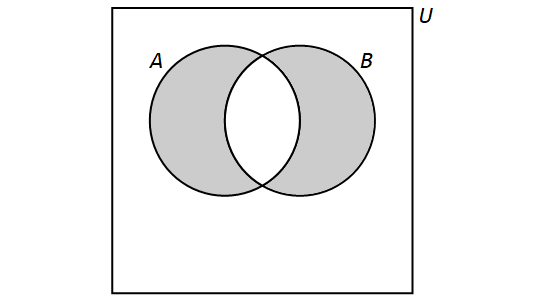

= Set Theory
== Sets

//MKD NEED 
//	symmetric difference of sets 
//	De Morgan Laws
//	Other identifies (e.g., Distriutive Law)
//	immutability of math sets vs Python Sets
//	ACTIVITY: Given Venn diagram of 3 sets with parts shaded, write at least TWO different expressions for the shaded set. THEH write the shaded set as a union of the smallest intersections (i.e., there are 8 regions defined in the Venn Diagram - write the union of the shaded parts (DNF))
//	On sets of sets: Consider set C given as a roster of students in this section of Discrete Math, and a second roster D listing all sections of Discrete Math this semester. Is a student who is an element of C also and element of D? Is C a subset of D? Is C and element of D? 

//MKD changed A to S throughtout following paragraph since A will be used in the Python WARNING
A *set* is an unordered collection of objects, called *elements* or *members*. A set is said to *contain* its elements. If $x$ is an element of the set $S,$ then we write $x \in S$. If $x$ is not an element of the set $S$, then we write $x \not\in S$.

For example, if $S$ is the set of states in the United States, then New York is an element of $S$ and Ontario is not an element of $S.$ If $E$ is the set of even integers, then $2 \in E$ and $3 \not\in E.$

There are several different ways to describe a set. One way of describing a set is known as the *roster method*. This is where we list all the elements of a set between curly braces. 
//MKD changed the example to match the Python WARNING 
//For example, $\{a,b,c\}$ is the set whose elements are $a,$ $b,$ and $c.$
For example, $A = \{1,-2,0,1,-3\}$ is the set whose elements are $-3$, $-2$, $0$, and $1$. Set $A$ contains $4$ members, even though the element $1$ appears twice in the list. Also, the order of the elements in the list does not matter.

//MKD ADDED NOTE FOR PYTHON HEADS
//[WARNING]
//====
WARNING: *A WARNING ABOUT THE PYTHON EXAMPLES INVOLVING SETS*: The mathematical set $A = \{1,-2,0,1,-3\}$ is a constant - you cannot change the set by removing elements or inserting new elements. BUT... In Python, objects of type _set_ are mutable so it is possible to remove elements or insert new elements, as shown in the following code example . #The correct implementation of mathematical sets in Python uses objects of type _frozenset_# because objects of type _frozenset_ are immutable, just like mathematical sets. But there are advantages to using type _set_ instead: The roster method notation that is used to define a mathematical set can be used to initialize or print a Python _set_, but cannot be used with a Python _frozenset_. In particular, we must call the _frozenset_ constructor to create and initialize a _frozenset_. 
//we can use the same roster method notation to define a Python object of type _set_ or a mathematical set. 
//we cannot use the roster method to define a Python object of type _frozenset_ but we can use the roster method to define either a Python _set_ or a mathematical set. 
The authors of the original https://ggc-discrete-math.github.io/index.html[“Discrete Math”] chose to use Python _sets_ instead of _frozensets_ in the code examples; the author of this remix made the same choice.
//It is important to remember that this is [.underline]#NOT# how mathematical sets work. 
//Mathematical sets are immutable - that is, once a set has been defined, you cannot add or delete members from the set but must instead explicitly define a new set that includes or excludes the members. This means that a mathematical set is better represented by the type _frozenset_ in Python, but we use the type _set_ in this textbook since we can define a Python set by listing the elements between the braces $\{$ and $\}$.
//====

//MKD ALT code A%20%3D%20%7B1,-2,0,1,-3,0%7D%20%23%20A%20is%20mutable%0AF%20%3D%20frozenset%28A%29%20%23%20F%20is%20immutable%0AA.add%288%29%20%20%20%20%20%20%20%20%20%23%20F.add%288%29%20raises%20an%20AttributeError%0AA.remove%281%29%20%20%20%20%20%20%23%20F.remove%281%29%20raises%20an%20AttributeError%0Aprint%28A%29%20%20%20%20%20%20%20%20%20%23%20A%20has%20been%20changed%0Aprint%28F%29%20%20%20%20%20%20%20%20%20%23%20F%20cannot%20be%20changed

:pt_code_height: 400
:pt_rawinput: false
:pt_code: A%20%3D%20%7B1,-2,0,1,-3%7D%20%23%20A%20is%20mutable%0AF%20%3D%20frozenset%28A%29%20%23%20F%20is%20immutable%0Aprint%28'A%20%3D',A%29%0AA.add%288%29%20%20%20%20%20%20%20%20%20%0AA.remove%281%29%20%20%20%20%20%20%0Aprint%28'A%20%3D',A%29%20%20%20%23%20A%20has%20been%20changed%0A%23%20F.add%288%29%20%20%20%20%20%20%20%23%20raises%20an%20AttributeError%0A%23%20F.remove%281%29%20%20%20%20%23%20raises%20an%20AttributeError%0Aprint%28'F%20%3D',F%29%20%20%20%23%20F%20cannot%20be%20changed
//MKD ALT code A%20%3D%20%7B1,-2,0,1,-3%7D%20%23%20A%20is%20mutable%0AB%20%3D%20frozenset%28A%29%20%23%20B%20is%20immutable%0AA.add%288%29%20%20%20%20%20%20%20%20%20%23%20B.add%288%29%20raises%20an%20AttributeError%0AA.remove%281%29%20%20%20%20%20%20%23%20B.remove%281%29%20raises%20an%20AttributeError%0Aprint%28A%29%20%20%20%20%20%20%20%20%20%23%20A%20has%20been%20changed%0Aprint%28B%29%20%20%20%20%20%20%20%20%20%23%20B%20cannot%20be%20changed

****
//.Example {counter:setex} - WARNING: Python Sets Are Mutable
.WARNING: Python Sets Are Mutable
--
--
The [.underline]#mathematical# set $A$ does not allow removals or insertions, but the [.underline]#Python# set $A$ does. The frozenset $F$ is a more faithful implementation of the mathematical set $A$, but notice that the symbolism for Python sets more closely matches the symbolism used for mathematical sets. 
//$F$ requires an explicit call to the constructor.

include::python_tutor.adoc[]
****

//MKD REPLACED THE FOLLOWING PARAGRAPH
//In addition to _int_ (integer), _float_ and _string_, mentioned in the section on <<Data Types>>, one can build sets in Python using curly braces. Set data types are unordered and ignore duplicate elements.

//MKD As shown in the Warning, we can build sets in Python using the roster method. Set data types are unordered and ignore duplicate elements.

:pt_code_height: 350
:pt_rawinput: false
:pt_code: A%20%3D%20%7B1,-2,0,1,-3%7D%0Aprint%285%20in%20A%29%0Aprint%280%20in%20A%29
//MKD POSSIBLE ALTERNATE :pt_code: A%20%3D%20%7B1,-2,0,1,-3%7D%0AB%20%3D%20%7B0,1,4,-2,1,0,0,4%7D%0Aprint%285%20in%20A%29%0Aprint%280%20in%20A%29%0Aprint%28A%20%3D%3D%20B%29%0Aprint%28B,%22contains%22,len%28A%29,%22elements.%22%29%0Afor%20x%20in%20A%3A%0A%20%20%20%20print%28x,%22is%20an%20element%20of%22,str%28A%29%2B'.'%29%0Aprint%28type%28A%29%29%0Aprint%28type%28B%29%29
//MKD also note that Python set is mutable but frozenset is immutatble and so is more appropriate for demonstrating abstract mathematical sets
****
.Example {counter:setex} - Checking Set Membership in Python
--
--
The code below checks to see if $5$ and $0$ are elements of the set $A = \{1,-2,0,1,-3\}.$ Since $5 \not\in A$ and $0 \in A,$ the code prints False followed by True.
include::python_tutor.adoc[]
****

:pt_code_height: 350
:pt_rawinput: false
:pt_code: A%20%3D%20%7B1,-2,0,1,-3%7D%0Afor%20x%20in%20A%3A%0A%20%20%20%20print%28x,%20%22is%20an%20element%20of%20the%20set%22%29

****
.Example {counter:setex} - Listing the Elements of a Set in Python
--
--
The code below lists all of the elements of the set $A = \{1,-2,0,1,-3\}.$
include::python_tutor.adoc[]
****

Another way of describing a set is the use of *set builder* notation. We write a set as \[\{x \in D : P(x)\}.\] This is the set of all elements $x$ from a domain $D$ that satisfy the predicate $P(x).$
//MKD ADDED FOLLOWING
We can use either the colon $:$ or the vertical bar $|$ as the separator in this notation. For example, $\{ x \in \mathbb{Q} | x^{2} \geq 2 \text{ and } x > 0 \}$ is the set of positive rational numbers that are greater than $\sqrt{2}$.

// MKD ADDED FOLLOWING 
Yet another way of describing a set is to use a function or an algebraic expression, as in \[\{ f(x) : x \in D \}.\]This is the set of all values $f(x)$ for $x$ in the domain $D$. For example, $\{ 2n : n \in \mathbb{N} \}$ is the set of the even natural numbers. Again, we can use either the colon $:$ or the vertical bar $|$ as the separator.

We make frequent use of special sets and these are denoted with special symbols.

//MKD edited this list of Special sets of numbers and moved it before the Switching between representations example. Changed vertical bar to colon in  C definition (cannot make it work for Q)
.Special sets of numbers
****
* $\mathbb{N} = \{0, 1, 2, 3,...\}$, the set of natural numbers +
* $\mathbb{Z} = \{...,-2, -1, 0, 1, 2,...\}$ , the set of integers +
* $\mathbb{Z}^+ = \{1, 2, 3,...\}$, the set of positive integers +
//* $\mathbb{Q} = \left\{\left.\frac{a}{b}\right|a\in \mathbb{Z},b\in \mathbb{Z},b\neq 0\right\}$, the set of rational numbers of the form $\frac{a}{b}$  +
* $\mathbb{Q} = \left\{\left.\frac{a}{b}\right|a\in \mathbb{Z},b\in \mathbb{Z},b\neq 0\right\}$, the set of rational numbers  +
* $\mathbb{Q}^+$, the set of positive rational numbers +
* $\mathbb{R}$, the set of real numbers +
* $\mathbb{R}^+$, the set of positive real numbers +
* $\mathbb{C} = \{a+bi : a\in \mathbb{R},b\in \mathbb{R},b\neq 0,i^{2}=-1\}$, the set of complex numbers. +

****

Other special sets will be defined as needed.

****
.Example {counter:setex} - Switching between representations

Consider the following set: \[\{x \in \mathbb{Z} : -2 \leq x < 4\}.\] This is the set of all integers $x$ such that $-2$ is less than or equal $x$ and $x$ is less than 4. Using the roster method, this set can be written as \[\{-2,-1,0,1,2,3\}.\]

.You Try

Match each set described using set builder notation in parts (a) through (f) with the same set described using the roster method in parts (A) through (F).

a. $\{x \in \mathbb{Z} : x^2 = 1\}$
b. $\{x \in \mathbb{Z} : x^3 = 1\}$
c. $\{x \in \mathbb{Z} : |x| \leq 2\}$
d. $\{x \in \mathbb{Z} : x^2 < 4\}$
e. $\{x \in \mathbb{Z} : x < |x|\}$
f. $\{x \in \mathbb{Z} : (x + 1)^2 = x^2 + 2x + 1\}$

//

A. $\{-1,0,1\}$
B. $\{\dots, -3,-2,-1,0,1,2,3,\dots\}$
C. $\{1\}$
D. $\{\dots, -3,-2,-1\}$
E. $\{-1,1\}$
F. $\{-2,-1,0,1,2\}$
****

[NOTE]
====
When there are too many elements in a set for us to be able to list each one, we often use ellipses ($\dots$) when the pattern is obvious. For example, we have \[\mathbb{Z} = \{\dots,-3,-2,-1,0,1,2,3,\dots\}.\]
====

:pt_code_height: 350
:pt_rawinput: false
:pt_code: A%20%3D%20%7B1,-2,0,1,-3%7D%0AB%20%3D%20%7Bx%20for%20x%20in%20A%20if%20x%20%3E%200%7D%0Aprint%28B%29

****
.Example {counter:setex} - Set Builder Notation in Python
--
--
The set $\{x \in D: P(x)\}$ can be expressed in Python as {for x in D if P(x)}. For example, the code below defines the set $B$ as the set of positive elements of the set $A = \{1,-2,0,1,-3\}.$
include::python_tutor.adoc[]
****

=== Empty Set
Consider the following set described using set builder notation: \[\{x \in \mathbb{Z} : x^2 = 2\}.\]This is the set of all integers whose square is equal to 2. However, no such integers exist. Therefore, using the roster method to describe it, this is the set $\{ \}.$

We call the set $\{ \}$ the *empty set* and denote this set by $\emptyset.$ The empty set has no elements.

:pt_code_height: 350
:pt_rawinput: false
:pt_code: def%20Elements%28A%29%3A%0A%20%20%20%20if%20A%20%3D%3D%20set%28%29%3A%0A%20%20%20%20%20%20%20%20print%28%22the%20set%20is%20empty%22%29%0A%20%20%20%20else%3A%0A%20%20%20%20%20%20%20%20for%20x%20in%20A%3A%0A%20%20%20%20%20%20%20%20%20%20%20%20print%28x,%20%22is%20an%20element%20of%20the%20set%22%29
****
.Example {counter:setex} - Listing the Elements of a Nonempty Set
--
--
To define the empty set in Python, we must call the constructor set(). 
Python interprets the empty curly braces {} as an empty object of type _dict_, called a dictionary, that is used to represent mappings of key:value pairs. 

The function in the code below checks to see if a set is empty. If the set is nonempty, its elements are listed.
include::python_tutor.adoc[]
****

//MKD UNUSED EXAMPLE - NOT VERY GOOD SINCE set() IS NOT HASHABLE :( //https://pythontutor.com/render.html#code=def%20describeCardinality%28A%29%3A%0A%20%20%20%20if%20A%20%3D%3D%20set%28%29%3A%0A%20%20%20%20%20%20%20%20print%28%22Set%22,A,%22is%20empty.%22%29%0A%20%20%20%20else%3A%0A%20%20%20%20%20%20%20%20print%28%22Set%22,A,%22contains%22,len%28A%29,%22elements.%22%29%0AS0%20%3D%20set%28%29%0AdescribeCardinality%28S0%29%0AS1%20%3D%20%7B%20frozenset%28S0%29%20%7D%0Aprint%28S1%29%0AdescribeCardinality%28S1%29&cumulative=false&curInstr=14&heapPrimitives=false&mode=display&origin=opt-frontend.js&py=3&rawInputLstJSON=%5B%5D&textReferences=false

[NOTE]
====
It is important to note that $\{\}$ and $\emptyset$ are both ways to write the empty set. However, the mathematical set $\{ \emptyset \}$ is not the empty set because it contains one element, namely the empty set. In general, the set $A$ is not the same as the set $\{ A \}.$
====

[TIP]
====
Python Tip: The mathematical set $\{ \emptyset \}$ [.underline]#must# be implemented as $\{ \text{frozenset()} \}$, which is the Python _set_ that contains the empty _frozenset_. In general, anytime we want to implement a mathematical set $B$ as an element of another mathematical set $A$ in Python, we need to implement $B$ as a _frozenset_ in order to be used as an element of the Python set $A$. This is due to the fact that elements of Python _sets_ must be _hashable_; further explanation is beyond the scope of this textbook.

//, we [.underline]#cannot# implement 
====

=== Cardinality

Suppose that a set $A$ contains a finite number of distinct elements. We refer to the number of elements of $A$ as the *cardinality* of $A$ and denote this by $|A|$. In this case, we also say that $A$ is a *finite set*.

If $A$ contains an infinite number of distinct elements, we say that $A$ has infinite cardinality and that $A$ is an *infinite set*.
//MKD: Omitted "and we write $|A| = \infty.$" and inserted the following sentence.

[NOTE]
====
The infinity symbol $\infty$ isn't used for the cardinality of an infinite set because 
//it would be misleading to do so:  
//The cardinalities of infinite sets are more complicated than it may seem //at first glance, 
//so while it is tempting to use $\infty$ for the number of elements in an //infinite set. In fact, 
//There 
there are [.underline]#many# different _infinite cardinal numbers_ that correspond to the sizes of different infinite sets.    
It is beyond the scope of this textbook to discuss these infinite cardinal numbers in detail, but as just two examples (1) $|\mathbb{Q}|$ must be strictly less than $|\mathbb{R}|$, even though both $\mathbb{Q}$ and $\mathbb{R}$ are infinite sets, and (2) perhaps more surprisingly, $|\mathbb{N}|$ and $|\mathbb{Q}|$ _must be equal_ even though $\mathbb{N}$ would appear to be a much smaller set than $\mathbb{Q}$.
====

Thus, we see that $|\{0,1,2\}| = 3$, $|\emptyset| = 0$, and $|\mathbb{Z}|$ is an infinite cardinal number.

:pt_code_height: 350
:pt_rawinput: false
:pt_code: A%20%3D%20%7B2,3,5,8%7D%0AB%20%3D%20set%28%29%0AC%20%3D%20%7B0%7D%0Aprint%28len%28A%29%29%0Aprint%28len%28B%29%29%0Aprint%28len%28C%29%29%0A

****
.Example {counter:setex} - Cardinality in Python
--
--
The cardinality of a finite set $A$ can be computed in Python as follows:

len(A)
include::python_tutor.adoc[]
****

=== Equality

We say that two sets are *equal* if and only if they contain the same elements. 
//MKD COMMENTED THIS OUT SINCE SET THEORY NOW COMES BEFORE LOGIC In other words, $A$ and $B$ are equal sets if and only if \[\forall x (x \in A \iff x \in B).\]
When $A$ and $B$ are equal sets, we write $A = B$. When $A$ and $B$ are not equal sets, we write $A \neq B$.

The sets $\{2,3,5\}$ and $\{5,2,3\}$ are equal sets, since they contain the same elements. 
//MKD added the next sentence.
In fact, $\{2,3,5\}$ and $\{5,2,3\}$ are really just two different descriptions of the _same_ set, in the same way that 
$2 + 2$ and $5 - 1$ are two different descriptions of the _same_ number. 
So we can write $\{2,3,5\} = \{5,2,3\}$ for the same reason we 
can write $2 + 2 = 5 - 1$.

//The order in which the elements of a set are listed does not matter. Additionally, it does not matter whether elements are repeated. Thus, the sets $\{a,b,c\}$ and $\{b,b,a,c,b,a,c,c,c\}$ are equal sets as well.

//MKD maybe move all the subset section up to right after the basic definition of sets?
=== Subsets

We say that a set $A$ is a *subset* of a set $B$ if and only if every element of $A$ is an element of $B.$ 
//MKD COMMENTED THIS OUT SINCE SET THEORY NOW COMES BEFORE LOGIC In other words, $A$ is a subset of $B$ if and only if \[\forall x (x \in A \implies x \in B).\]
When $A$ is a subset of $B,$ we write $A \subseteq B$. When $A$ is not a subset of $B,$ we write $A \not\subseteq B$.

In order to show that $A$ is a subset of $B,$ we must show that, whenever $x \in A,$ it is also the case that $x \in B.$ In order to show that $A$ is not a subset of $B,$ we must find a single $x$ such that $x \in A$ but $x \not \in B.$

****
.Example {counter:setex}
If we let $S = \{1,5\}$ and $T = \{1,3,5\},$ then $S \subseteq T,$ since each element of $S$ is an element of $T,$ but $T \not\subseteq S,$ since $3$ is an element of $T$ that is not an element of $S.$

If we let $A$ be the set of professional athletes and let $F$ be the set of professional football players, we have $F \subseteq A,$ since every professional football player is a professional athlete, but $A \not\subseteq F,$ since not every professional athlete is a professional football player.
****

Note that, for any set $A,$ it is always the case that $\emptyset \subseteq A$ and $A \subseteq A.$ For any sets $A$ and $B,$ if $A \subseteq B$ and $B \subseteq A,$ then $A = B.$

If $A \subseteq B$ and $B$ contains at least one element that is not in A, then we say $A$ is a *proper subset* of $B$, denoted $A \subset B$.

:pt_code_height: 350
:pt_rawinput: false
:pt_code: A%20%3D%20%7B2,4,6,8,10,12%7D%0AB%20%3D%20%7B4,8,12%7D%0Aprint%28A.issubset%28B%29%29%0Aprint%28B%20%3C%3D%20A%29%0A

****
.Example {counter:setex} - Subsets in Python
--
--
In Python, we can check whether a set $A$ is a subset of a set $B$ in one of the following ways:

A.issubset(B) +
A \<= B.
include::python_tutor.adoc[]
****

=== Power Set

Given a set $A,$ we refer to the *power set* of $A$ as the set of all subsets of $A.$ The power set of $A$ is denoted by $\mathcal{P}(A).$

[NOTE]
====
$\mathcal{P}(A)$ is a set whose elements are all sets.
====

If we let $A = \{a,b,c\},$ we see that \[\mathcal{P}(A) = \{\emptyset, \{ a \}, \{ b \}, \{ c \}, \{a,b\}, \{a,c\}, \{b,c\}, \{a,b,c\}\}.\] The empty set only has the empty set as a subset. Thus, we see that \[\mathcal{P}(\emptyset) = \{\emptyset\}.\]We can also take the power set of a power set. For example, we have the following:

[env.equationalign]
--
\mathcal{P}(\{ 1 \}) &= \{\emptyset, \{ 1 \}\},\\
\mathcal{P}(\mathcal{P}(\{ 1 \}) &= \mathcal{P}(\{\emptyset, \{ 1 \})\\
&= \{\emptyset, \{\emptyset\}, \{ \{ 1 \} \}, \{\emptyset, \{ 1 \}\}\}.
--

.Cardinality of Power Set
****
If $A$ is a finite set such that $|A| = n,$ then $\left|\mathcal{P}(A)\right| = 2^n.$
****
//MKD: Maybe add short exercise here?

== Set Operations

We can obtain new sets by performing operations on other sets. When performing set operations, it is often helpful to consider all of our sets as subsets of a *universal set* $U.$ We can think of the universal set as the set of all of the objects under consideration.

We can represent set operations visually using *Venn diagrams*, named after the English mathematician John Venn. A Venn diagram will consist of a rectangle, which represents the universal set, and one or more circles, which represent the sets under consideration. We will then shade in the regions of the diagram that correspond to one or more set operations.

=== Union

The *union* of the sets $A$ and $B$ is the set containing those elements that are in $A$ or $B$ or both, and is denoted by $A \cup B$. 
//MKD REWROTE More formally, \[A \cup B = \{x \in U : x \in A \lor x \in B\}.\]
More formally, \[A \cup B = \{x \in U : x \in A \text{ or } x \in B\}.\]

//MKD ADDED NEXT SENTENCE
Note that "or" is read here as the "inclusive or".
We have the following Venn Diagram for $A \cup B$:

image::images/Union.png[]

Note that, for any sets $A$ and $B,$ \[A \cup B = B \cup A.\]

****
.Example {counter:setex}
If we let $A = \{1,2,3,4,5,6\}$ and $B = \{1,3,5,7,9\},$ then \[A \cup B = \{1,2,3,4,5,6,7,9\}.\]
****

:pt_code_height: 350
:pt_rawinput: false
:pt_code: A%20%3D%20%7B-3,-1,2,5%7D%0AB%20%3D%20%7B-1,%200,%202%7D%0A%0Aprint%28A.union%28B%29%29%0Aprint%28A%20%7C%20B%29
****
.Example {counter:setex} - Union in Python
--
--
In Python, we can compute the union of sets $A$ and $B$ in one of the following ways:

A.union(B) +
A | B
include::python_tutor.adoc[]
****

=== Intersection

The *intersection* of the sets $A$ and $B$ is the set containing those elements that are in $A$ and $B$ and is denoted by $A \cap B$. 
//MKD REWROTE More formally, \[A \cap B = \{x \in U : x \in A \land x \in B\}.\]
More formally, \[A \cap B = \{x \in U : x \in A \text{ and } x \in B\}.\]

We have the following Venn Diagram for $A \cap B$:

image::images/Intersection.png[]

Note that, for any sets $A$ and $B,$ \[A \cap B = B \cap A.\] If it is the case that $A \cap B = \emptyset,$ then we say that $A$ and $B$ are *disjoint*. In other words, two sets are disjoint if and only if they contain no elements in common.

****
.Example {counter:setex}
If we let $A = \{1,2,3,4,5,6\}$ and $B = \{1,3,5,7,9\},$ then \[A \cap B = \{1,3,5\}.\]
****

:pt_code_height: 350
:pt_rawinput: false
:pt_code: A%20%3D%20%7B-3,-1,2,5%7D%0AB%20%3D%20%7B-1,%200,%202%7D%0A%0Aprint%28A.intersection%28B%29%29%0Aprint%28A%20%26%20B%29
****
.Example {counter:setex} - Intersection in Python
--
--
In Python, we can compute the intersection of sets $A$ and $B$ in one of the following ways:

A.intersection(B) +
A & B
include::python_tutor.adoc[]
****

=== Complement

The *complement* of a set $A$ is the set of all elements in the universal set $U$ which are not elements of $A$ and is denoted by $\overline{A}.$ More formally, \[\overline{A} = \{x \in U: x \not\in A\}.\] 
//MKD ADDED NEXT sentence
Note that other textbooks and internet sources may use different notation for the complement of $A$, such as $A'$ and $A^{c}$, but these all stand for the same set, so that $\overline{A} = A' = A^{c}$.

We have the following Venn Diagram for $\overline{A}$:

image::images/ComplementA.png[]

//MKD replaced next line
//For any set $A,$ \[\overline{A} = U \setminus A.\]
For any set $A,$ 
\[ \overline{\overline{A}} = A \]
\[ \overline{A} \cup A = U \] 
\[ \overline{A} \cap A = \emptyset. \]

****
.Example {counter:setex}
Suppose that our universal set is $U = \{0,1,2,3,4,5,6,7,8,9\},$ the set of all decimal digits. If we let $A = \{1,2,3,4,5,6\}$ and $B = \{1,3,5,7,9\},$ then \[\overline{A} = \{0,7,8,9\}\] and \[\overline{B} = \{0,2,4,6,8\}.\]

.Example {counter:setex}
Suppose that our universal set is $\mathbb{Z}.$ If we let $E$ be the set of all even integers, then $\overline{E}$ is the set of all odd integers.
****

=== Difference

The *difference* of the sets $A$ and $B$ is the set containing those elements that are in $A$ but not in $B$ and is denoted by $A \setminus B$. Set difference is also denoted by $A - B$. 
//MKD REWROTE More formally, \[A \setminus B = \{x \in U: x \in A \land x \not\in B\}.\]
More formally, \[A \setminus B = \{x \in U: x \in A \text{ and } x \not\in B\}.\]

We have the following Venn Diagram for $A \setminus B$:

image::images/A Subtract B.png[]

//MKD REARRANGED THE FOLLOWING PARAGRAPH
Note that, for any sets $A$ and $B$, if $A \neq B,$ then \[A \setminus B \neq B \setminus A.\]
However, if $A = B,$ then $A\setminus B = B \setminus A = \emptyset$. 

****
.Example {counter:setex}
If we let $A = \{1,2,3,4,5,6\}$ and $B = \{1,3,5,7,9\},$ then \[A \setminus B = \{2,4,6\}\] and \[B \setminus A = \{7,9\}.\]
****

:pt_code_height: 350
:pt_rawinput: false
:pt_code: A%20%3D%20%7B-3,-1,2,5%7D%0AB%20%3D%20%7B-1,%200,%202%7D%0A%0Aprint%28A.difference%28B%29%29%0Aprint%28B%20-%20A%29
****
.Example {counter:setex} - Difference in Python
--
--
In Python, we can compute the difference of sets $A$ and $B$ in one of the following ways:

A.difference(B) +
A - B
include::python_tutor.adoc[]
****

=== Symmetric Difference

//MKD NOTE ON NOTATION: Both "Rosen" and "Haggard, Schlipf, and Whitesides" use the notation $A \oplus B$ for symmetric difference, 

The *symmetric difference* of the sets $A$ and $B$ is the set containing those elements that are in $A$ or $B$ but not both $A$ and $B$. It is denoted by $A \oplus B$ in this textbook, 
//but it appears that there is no standardized notation so 
but other books and sources may use different notation such as $A \Delta B$. 
//MKD REWROTE More formally, \[A \setminus B = \{x \in U: x \in A \land x \not\in B\}.\]
More formally, \[A \oplus B = \{x \in U: (x \in A \text{ and } x \not\in B) \text{ or } (x \in B \text{ and } x \not\in A)\}.\]

We have the following Venn Diagram for $A \oplus B$:

//MKD needs to credit image to original authors
// derived from images/A Subtract B.png

Note that, for any sets $A$ and $B,$ \[A \oplus B = B \oplus A.\]

 

****
.Example {counter:setex}
If we let $A = \{1,2,3,4,5,6\}$ and $B = \{1,3,5,7,9\},$ then \[A \oplus B = \{2,4,6,7,9\}.\]
****

:pt_code_height: 350
:pt_rawinput: false
:pt_code: A%20%3D%20%7B-3,-1,2,5%7D%0AB%20%3D%20%7B-1,%200,%202%7D%0A%0Aprint%28A.symmetric_difference%28B%29%29%0Aprint%28B%20^%20A%29
****
.Example {counter:setex} - Symmetric Difference in Python
--
--
In Python, we can compute the difference of sets $A$ and $B$ in one of the following ways:

A.symmetric_difference(B) +
A ^ B
include::python_tutor.adoc[]
****

=== Multiple Set Operations

We can also perform more than one set operation on a collection of sets. For example, let $A,$ $B,$ and $C$ be sets and consider the following set: \[(A \setminus B) \cup (C \setminus B).\]This is the set that is obtained by taking the union of the sets $A \setminus B$ and $C \setminus B.$ We have \[(A \setminus B) \cup (B \setminus A) = \{x \in U: (x \in A \text{ and } x \not\in B) \text{ or } (x \in C \text{ and } x \not\in B)\}.\]

We have the following Venn Diagram for $(A \setminus B) \cup (C \setminus B)$:

image::images/AminusBunionCminusB.png[]

Note that the Venn Diagram also represents $(A \cup C ) \setminus B$. In general, there are multiple ways to describe the result of multiple set operations.

*Video Examples*

The following two video examples feature 
Dr. Katherine Pinzon, Professor of Mathematics at Georgia Gwinnett College.

*Video Example 1*

++++
<iframe id="kaltura_player" src="https://cdnapisec.kaltura.com/p/2022371/sp/202237100/embedIframeJs/uiconf_id/31860982/partner_id/2022371?iframeembed=true&playerId=kaltura_player&entry_id=0_vmm8v9kh&flashvars[streamerType]=auto&amp;flashvars[localizationCode]=en&amp;flashvars[leadWithHTML5]=true&amp;flashvars[sideBarContainer.plugin]=true&amp;flashvars[sideBarContainer.position]=left&amp;flashvars[sideBarContainer.clickToClose]=true&amp;flashvars[chapters.plugin]=true&amp;flashvars[chapters.layout]=vertical&amp;flashvars[chapters.thumbnailRotator]=false&amp;flashvars[streamSelector.plugin]=true&amp;flashvars[EmbedPlayer.SpinnerTarget]=videoHolder&amp;flashvars[dualScreen.plugin]=true&amp;flashvars[Kaltura.addCrossoriginToIframe]=true&amp;&wid=1_cwiqknv4" width="700" height="500" allowfullscreen webkitallowfullscreen mozAllowFullScreen allow="autoplay *; fullscreen *; encrypted-media *" sandbox="allow-forms allow-same-origin allow-scripts allow-top-navigation allow-pointer-lock allow-popups allow-modals allow-orientation-lock allow-popups-to-escape-sandbox allow-presentation allow-top-navigation-by-user-activation" frameborder="0" title="Kaltura Player"></iframe>
++++

*Video Example 2*

++++
<iframe id="kaltura_player" src="https://cdnapisec.kaltura.com/p/2022371/sp/202237100/embedIframeJs/uiconf_id/31860982/partner_id/2022371?iframeembed=true&playerId=kaltura_player&entry_id=0_9p3m4lin&flashvars[streamerType]=auto&amp;flashvars[localizationCode]=en&amp;flashvars[leadWithHTML5]=true&amp;flashvars[sideBarContainer.plugin]=true&amp;flashvars[sideBarContainer.position]=left&amp;flashvars[sideBarContainer.clickToClose]=true&amp;flashvars[chapters.plugin]=true&amp;flashvars[chapters.layout]=vertical&amp;flashvars[chapters.thumbnailRotator]=false&amp;flashvars[streamSelector.plugin]=true&amp;flashvars[EmbedPlayer.SpinnerTarget]=videoHolder&amp;flashvars[dualScreen.plugin]=true&amp;flashvars[Kaltura.addCrossoriginToIframe]=true&amp;&wid=1_pcesgshn" width="700" height="500" allowfullscreen webkitallowfullscreen mozAllowFullScreen allow="autoplay *; fullscreen *; encrypted-media *" sandbox="allow-forms allow-same-origin allow-scripts allow-top-navigation allow-pointer-lock allow-popups allow-modals allow-orientation-lock allow-popups-to-escape-sandbox allow-presentation allow-top-navigation-by-user-activation" frameborder="0" title="Kaltura Player"></iframe>
++++

****
.You Try

Draw Venn Diagrams for each of these combinations of the sets $A$, $B$, and $C$.

1. $A \cap (B \cup C)$
2. $(A \cap B) \cup C$
3. $(\overline{A} \cap \overline{C}) \cup B$
4. $(B \cup C) \setminus A$
****

=== The Cartesian Product

The *Cartesian product* of two sets $A$ and $B$ is the set of _ordered pairs_
defined by,

//MKD $  A\times B=\{(a,b)|a\in A\wedge b\in B)\}$,
$  A\times B=\{(a,b)|a\in A \text{ and } b\in B)\}$,

****
.Example {counter:setex}

Consider the sets, $B=\{0,1\}$, $T=\{0,1,2\}$, and, $C=\{a,\ b,\ c, d\}$.
Determine the Cartesian products, and their cardinalities.

.. $B\ \times\ C$
.. $C\times B$
.. $B\ \times\ T$
.. $B\ \times\ B$
.. $B\ \times\ B\times B$

.Solution

For the set, $ B\ \times C $, notice that
this will be all ordered pairs of the form,
$(a,b)$, with $a \in B$, and $b \in C$, giving,

$B\ \times\ C=\{(0,a), (0,b), (0,c), (0,d),(1,a), (1,b), (1,c), (1,d))\}$,
which has $2 × 4=8$, elements.

For $C\ \times\ B$, switch the ordering, for $B\ \times\ C$, to obtain the set with $8$,
elements,

$C\ \times  B=\{(a,0), (b,0), (c,0),(d,0),(a,1), (b,1), (c,1), (d,1)\}$,

The set $B \times T$,
will be all ordered pairs of the form,
$(a,b)$, with $a \in B$, and $b \in T$, giving, the set with $2 × 3=6$, elements,

$B \times T=\{(0,0),(0,1),(0,2),(1,0),(1,1),(1,2)\}$,

The set $B \times B$,
will be all order pairs  of the form,
$(a,b)$, with $a, b \in B$, giving the set with  $2 × 2=4$, elements,

$B \times T=\{(0,0),(0,1),(1,0),(1,1)\}$,

Finally the set $B \times B \times B$, will be the set of all
ordered triples of the form,
$(a,b,c)$, with $a, b, c \in B$, giving the set with  $2 × 2 × 2=8$, elements,

$B \times B \times B=\{(0,0,0),(0,0,1),(0,1,0),(0,1,1),(1,0,0),(1,0,1),(1,1,0),(1,1,1)\}$,
****

//MKD REWROTE THE FOLLOWING
[NOTE]
====
// Because Cartesian products are created using ordered pairs, $B \times C$, is, in general, different from $C \times   B$.
Cartesian products are created using _ordered_ pairs, so if $A$ and $B$ are different sets, then $A \times B$ is different from $B \times A$.
====

//MKD REWROTE THE FOLLOWING
[NOTE]
====
// If the cardinality of set $|A|=a$, and the cardinality of set $|B|=b$, then the cardinality of the Cartesian product is $|A × B|=ab$
If $A$ and $B$ are finite sets, then the cardinality of the Cartesian product $A × B$ is $|A × B|=|A| \cdot |B|$.
====

[NOTE]
====
The Cartesian coordinate systems are natural sets that are naturally Cartesian products.
The two-dimensional plane, and the three-dimensional space are represented by the following
Cartesian product sets,

$\mathbb{R}^2=\mathbb{R}\times \mathbb{R}=\{(x,y)|x,y\in \mathbb{R}\}$, and,

$\mathbb{R}^3=\mathbb{R}\times \mathbb{R}\times \mathbb{R}=\{(x,y,z)|x,y,z\in \mathbb{R}\}$
====

== Set Identities

Here is a collection of additional properties of the operations on sets. Each of these can be verified by drawing two Venn diagrams, one that represents the left-hand side of the equation and another that represents the right-hand side of the equation and showing that the resulting shadings of the Venn diagrams are the same.

Note that it is traditional to focus on complement, union, and intersection as the three primary set operations because the other operations such as difference and symmetric difference can be written in terms of those three primary operations, for example, 
$A \setminus B = A \cap \overline{B}$ and 
$A \oplus B = (A \cap \overline{B}) \cup (\overline{A} \cap B)$.

//4. Complementation law 		(A’)’ =  A

//5. Commutative laws		A ∪ B = B ∪ A, 
//						A ∩ B = B ∩ A

Associative laws:	
\[ A ∪ (B ∪ C) = (A ∪ B) ∪ C \]
\[ A ∩ (B ∩ C) = (A ∩ B) ∩ C \]

Distributive laws:
\[ A ∪ (B ∩ C) = (A ∪ B) ∩(A ∪ C) \]
\[ A ∩ (B ∪ C) = (A ∩ B) ∪ (A ∩ C) \]

De Morgan’s laws:
\[ \overline{A \cup B} = \overline{A} \cap \overline{B} \]
\[ \overline{A \cap B} = \overline{A} \cup \overline{B} \]

//Identity laws			A ∪ ∅ = A, A ∩ U = A (Note: U is the universe)

//2. Domination laws		A ∪ U = U, A ∩ ∅ = ∅ 
//3. Idempotent laws		A ∪ A = A, A ∩ A = A 

//7. More properties :      	A ⊆ A ∪ B, B ⊆ A ∪ B, 
//                                         	A ∩ B ⊆ A, A ∩ B ⊆ B

=== Operator Precedence (Order Of Operations)

To ensure that we can properly interpret an expression involving multiple set operations, we can either use parentheses or rely on _operator precedence_. 

When an expression for sets involves parentheses, complementation, intersection, and union, we start by evaluating all expressions enclosed in parentheses from left to right, then all complementations from left to right, then all intersections from left to right, and finally all unions from left to right. (Set difference and symmetric difference were left out of this discussion because there does not seem to be a standard definition for where they fit in! But, as shown earlier, those two operations can be rewritten in terms of complementation, union, and intersection.)

For example, the expression $\overline{A} \cup B \cap C$ represents the same set as $(\overline{A}) \cup (B \cap C)$. Parentheses must be used if you want to represent a different set such as $(\overline{A} \cup B) \cap C$.

This is the same way arithmetic expressions like $-3 + 5 \cdot 2$ are evaluated: The value of $-3 + 5 \cdot 2$ is $(-3) + (5 \cdot 2) = 7$, *not* $(-3 + 5) \cdot 2 = 4$. 

== Venn Diagrams, Partitions, and Bitstrings

A *partition* of a set $U$ is a set of subsets of $U$ such that each element $x \in U$ is a member of exactly one of the subsets in the partition. You already know at least one example of such a partition -  the partitoning of the integers $\mathbb{Z}$ by its 2 subsets in $\Pi = \{ \text{the set of even integers}, \text{the set of odd integers} \}$; every integer belongs to exactly one of the two elements of the set $\Pi$.

In fact, for any chosen subset $A \subseteq U$ we have a partition of $U$ into the 2 sets that are elements of $\{ A,\,\overline{A} \}$. Note that each element of $U$ must be in exactly one of the subsets $A$ and $\overline{A}$.

For two subsets $A$ and $B$ of a universal set $U$, consider the Venn diagram of $A$ and $B$. By considering all possible intersections of these two sets and their complements, $U$ is partitioned into 4 subsets, namely, the 4 elements of $\{ \overline{A} \cap \overline{B},\, \overline{A} \cap B,\,A \cap \overline{B},\,A \cap B \}$. We can refer to each of these 4 subsets by using bitstrings of length 2 as follows: 

* The leftmost bit is 1 if an element of the subset is an element of $A$, and is 0 if an element of the subset is not an element of $A$.

* The rightmost bit is 1 if an element of the subset is an element of $B$, and is 0 if an element of the subset is not an element of $B$.

For example, in the following Venn diagram, the subset $A \setminus B$ is labeled with the bitstring $10$ because an element of $A \setminus B$ is an element of $A$ and not an element of $B$.

//MKD needs to credit image to original authors
// derived from images/A Subtract B.png
//image::imagesMKD/A Union B bitstrings.jpg[]
image::imagesMKD/ABbitstrings.png[]

If we had instead three sets $A$, $B$, and $C$, we could partition the universe $U$ into 8 subsets. In detail, if we have an element $x \in U$, either $x \in A$ or $x \not\in A$, and for each of those possibilities, either $x \in B$ or $x \not\in B$, and for each of those possibilities, either $x \in C$ or $x \not\in C$. We can apply (twice) the _multiplication principle_ that was first mentioned in chapter 2 to show that there are $2 \cdot 2 \cdot 2$ possible subsets determined by the Venn diagrams of the 3 sets $A$, $B$, and $C$. Using bitstrings of length 3, we can label these 8 subsets as shown.

//MKD needs to credit image to original authors
// derived from images/AminusBunionCminusB.png
image::imagesMKD/ABCbitstrings.png[]

 
For an integer $n > 3$, the Venn diagram is less useful for representing the partitioning of the universe created by $n$ subsets, but we can still reason that there ought to be $2^{n}$ subsets in the partition, where each of the subsets can be described by a unique bitstring of length $n$ (We will be able give a formal mathematical proof of this for every positive integer $n$ later in the textbook after we've discussed mathematical induction.)

=== Disjunctive Normal Form (Set Version)

Suppose we have three sets $A$, $B$, and $C$, and have partitioned the universe $U$ into the 8 subsets as discussed above. Then a set that corresponds to any shading of the Venn diagram can be 
written as a union of intersections of three sets, with one set chosen from each of the pairs $\{ A,\,\overline{A} \}$, $\{ B,\,\overline{B} \}$, and $\{ C,\,\overline{C} \}$. For example, the set shown in the figure below is equal to 
$(\overline{A} \cap \overline{B} \cap \overline{C}) \cup (A \cap \overline{B} \cap \overline{C}) \cup (\overline{A} \cap B \cap \overline{C}) \cup (\overline{A} \cap B \cap C)$.
 

//MKD needs to credit image to original authors
// derived from images/AminusBunionCminusB.png
image::imagesMKD/ABC_DNF_EXAMPLE.png[]

This type of expression is called a *disjunctive normal form* (or DNF) for the set that it represents. We will see an analog of these in a different context in the chapter on Logic.

//MKD: Add conjunctive normal form - additional text to be revealed after May 24, 2024 (end of Spring '24 semester)
//We can also find an expression in *conjunctive normal form* (or CNF) for the set that corresponds to the shading of the Venn diagram; this expression will be written as an intersection of unions of three sets, with one set chosen from each of the pairs $\{ A,\,\overline{A} \}$, $\{ B,\,\overline{B} \}$, and $\{ C,\,\overline{C} \}$. One way to do this is to start with a DNF expression for the complement of the shaded set, and then apply De Morgan's laws to obtain the CNF. In our example, the union of the 4 _unshaded_ regions 
//MKD REMOVE THIS LINE represent the complement of the set we care about, and the union of the unshaded regions 
//is $(A \cap B \cap \overline{C}) \cup (A \cap B \cap C) \cup (A \cap \overline{B} \cap C) \cup (\overline{A} \cap \overline{B} \cap C)$. This means that $\overline{(A \cap B \cap \overline{C}) \cup (A \cap B \cap C) \cup (A \cap \overline{B} \cap C) \cup (\overline{A} \cap \overline{B} \cap C)}$ represents the union of the _shaded_ regions. We now apply De Morgan's laws multiple times to rewrite the previous expression in CNF: $\overline{(A \cap B \cap \overline{C}) \cup (A \cap B \cap C) \cup (A \cap \overline{B} \cap C) \cup (\overline{A} \cap \overline{B} \cap C)}$ $\overline{(A \cap B \cap \overline{C})} \cap \overline{(A \cap B \cap C)} \cap \overline{(A \cap \overline{B} \cap C)} \cap \overline{(\overline{A} \cap \overline{B} \cap C)}$ $(\overline{A} \cup \overline{B} \cup \overline{\overline{C}}) \cap (\overline{A} \cup \overline{B} \cup \overline{C}) \cap (\overline{A} \cup \overline{\overline{B}} \cup \overline{C}) \cap (\overline{\overline{A}} \cup \overline{\overline{B}} \cup \overline{C})$ $(\overline{A} \cup \overline{B} \cup C) \cap (\overline{A} \cup \overline{B} \cup \overline{C}) \cap (\overline{A} \cup B \cup \overline{C}) \cap (A \cup B \cup \overline{C})$

== The Principle Of Inclusion-Exclusion (PIE)

In certain application problems, we want to compute the cardinality $|A \cup B|$ of the union of two given finite sets $A$ and $B$. It is tempting to simply add $|A|$ and $|B|$, but as the Venn diagram below shows, each element of the intersection $|A \cap B|$ will be counted _twice_, once for each bit that is $1$, if we do so. 

//MKD needs to credit image to original authors
// derived from images/A Subtract B.png
//image::imagesMKD/A Union B bitstrings.jpg[]
image::imagesMKD/ABbitstrings.png[]

The correct relationship between $|A \cup B|$, $|A|$, and $|B|$ is given by \[ |A \cup B| = |A| + |B| -  |A \cap B|. \]

Another way to see that this is the correct relationship is to use the partition 
$\{ \overline{A} \cap \overline{B},\, \overline{A} \cap B,\,A \cap \overline{B},\,A \cap B \}$ to write 

$| A | = | A \cap \overline{B} | + | A \cap B |$,  + 
$| B | = | \overline{A} \cap B | + | A \cap B |$, and + 
$| A \cup B | = | A \cap \overline{B} | + | A \cap B | + | \overline{A} \cap B |$, so +

$| A | + | B | = | A \cap \overline{B} | + | A \cap B | + | \overline{A} \cap B | + | A \cap B | = | A \cup B | + | A \cap B |$.

//[env.equationalign]
//--
//| A | = | A \cap \overline{B} | + | A \cap B |\\
//| B | = | \overline{A} \cap B | + | A \cap B |\\
//| A \cup B | = | \overline{A} \cap B | + | A \cap B | + | \overline{A} //\cap B |\\
//so $| A | + | B | = | A \cap \overline{B} | + | A \cap B | + | //\overline{A} \cap B | + | A \cap B | = | A \cup B | + | A \cap B |.
//--

****
.Example {counter:setex}

Consider the set $U = \{ n \in \mathbb{N} : 1 \leq n \leq 60 \}$. How many elements of $U$ are divisible by either 2 or 3 or both? How many elements of $U$ are divisible by neither 2 nor 3?

Let $A$ stand for the subset of $U$ that consists of multiples of 2, and 
let $B$ stand for the subset of $U$ that consists of multiples of 3.
It's not too difficult to see that 
$|A| = \frac{60}{2} = 30$ and $|B| = \frac{60}{3} = 20$.  
Also, $A \cap B$ must be the subset of $U$ that consists of multiples of 6, so $| A \cap B | = \frac{60}{6} = 10$. 
(If these computations don't make sense to you, just start counting off the pattern $1,\,2,\,3,\,4,\,5,\,6,\,\ldots$ and notice that every 2nd number is divisible by 2, every 3rd number is divisible by 3, and every 6th number is divisible by both 2 and 3.)
Now apply the Principle Of Inclusion-Exclusion to find the number of integers in $U$ that are divisible by either 2 or 3 or both: 
$|A \cup B| = |A| + |B| -  |A \cap B| = 30 + 20 - 10 = 40$. 
There are 40 integers in $U$ that are divisible by either 2 or 3 or both, 
so there are $60 - 40 = 20$ integers in $U$ that are divisible by neither 2 nor 3. 

****

If we want to compute the cardinality $|A \cup B \cup C|$ of the union of three given finite sets $A$, $B$, and $C$, we can again look at the Venn diagram of the partition of $U$ into 8 sets to see that some of the intersections  will be counted _one_, _two_, or _three_ times, once for each bit that is $1$. 

//MKD needs to credit image to original authors
// derived from images/AminusBunionCminusB.png
image::imagesMKD/ABCbitstrings.png[]

We can derive the following formula in much that same way that we did above; in fact, we can just apply the formula we found for two sets to $| A \cup (B \cup C) |$ and use some of the set identities to help simplify the formula. CSC 230 Spring '24 students at SFSU can see the full derivation in the slide deck _Sets part 2 Spring '24_.
\[ |A \cup B \cup C| = |A| + |B| + |C| - |A \cap B| - |A \cap C| - |B \cap C| + |A \cap B \cap C|. \]

****
.Example {counter:setex}

Consider the set $U = \{ n \in \mathbb{N} : 1 \leq n \leq 60 \}$ as in the previous example. How many elements of $U$ are divisible by at lest one of 2, 3, or 5?? How many elements of $U$ are divisible by none of 2, 3, or 5?

As in the previous example, 
let $A$ stand for the subset of $U$ that consists of multiples of 2,  
let $B$ stand for the subset of $U$ that consists of multiples of 3, and 
now let $C$ stand for the subset of $U$ that consists of multiples of 5. 

We have  
$|A| = \frac{60}{2} = 30$, 
$|B| = \frac{60}{3} = 20$, 
$|C| = \frac{60}{5} = 12$,  
$|A \cap B| = \frac{60}{6} = 10$, 
$|A \cap C| = \frac{60}{10} = 6$,   
$|B \cap C| = \frac{60}{15} = 4$, 
and   
$|A \cap B \cap C| = \frac{60}{30} = 2$.

Apply Principle Of Inclusion-Exclusion to find the number of integers in $U$ that are divisible by at least one of 2, 3, or 5:

$|A \cup B \cup C| = |A| + |B| + |C| - |A \cap B| - |A \cap C| - |B \cap C| + |A \cap B \cap C|$

$|A \cup B \cup C| = 30 + 20 + 12 - 10 - 6 - 4 + 1 = 44$
 

There are 44 integers in $U$ that are divisible by at least one of 2, 3, or 5, and there are $60 - 44 = 16$ integers in $U$ that are divisible by none of 2, 3, or 5. 

****

// MKD - start of unneeded section?
== Representing Sets as Lists

Remixer's Note: This section was omitted from the remix since sets can be represented using the types _set_ and _frozenset_ in Python 3.

////
We can represent sets in Python using lists. The empty set $\{ \}$ is represented by the empty list []. Several different lists may represent the same set. For example, the lists [2, 0, 1] and [1, 2, 2, 0, 1, 0, 1] both represent the set $\{0,1,2\}.$

It can be helpful for us to remove duplicate elements from a list. For example, this will be necesssary when computing the cardinality of a set.

:pt_code_height: 450
:pt_rawinput: false
:pt_code: def%20RemoveDuplicates%28A%29%3A%0A%20%20%20%20B%20%3D%20%5B%5D%0A%20%20%20%20for%20x%20in%20A%3A%0A%20%20%20%20%20%20%20%20if%20x%20not%20in%20B%3A%0A%20%20%20%20%20%20%20%20%20%20%20%20B%20%2B%3D%20%5Bx%5D%0A%20%20%20%20return%20B%0A%0Adef%20Cardinality%28A%29%3A%0A%20%20%20%20AA%20%3D%20RemoveDuplicates%28A%29%0A%20%20%20%20return%20len%28AA%29
****
.Example {counter:setex} - Remove Duplicates and Cardinality in Python
--
--
The following code contains a function that removes duplicate elements from a set and another that computes the cardinality of a set.

include::python_tutor.adoc[]
****

For the rest of the section, we will assume that none of our lists have duplicate elements. Otherwise, we can add one or more lines to each program given below to remove duplicated elements.

We can test whether two sets are equal by testing whether the first is a subset of the second and whether the second is a subset of the first.

:pt_code_height: 450
:pt_rawinput: false
:pt_code: def%20Subset%28A,B%29%3A%0A%20%20%20%20for%20x%20in%20A%3A%0A%20%20%20%20%20%20%20%20if%20x%20not%20in%20B%3A%0A%20%20%20%20%20%20%20%20%20%20%20%20return%20False%0A%20%20%20%20return%20True%0A%0Adef%20Equal%28A,B%29%3A%0A%20%20%20%20if%20Subset%28A,B%29%20and%20Subset%28B,A%29%3A%0A%20%20%20%20%20%20%20%20return%20True%0A%20%20%20%20else%3A%0A%20%20%20%20%20%20%20%20return%20False%0A
****
.Example {counter:setex} - Subset and Equal in Python
--
--
The followwing code contains a function that checks whether one set is a subset of another and a function that checks whether two sets are equal.

include::python_tutor.adoc[]
****

One benefit to using lists instead of sets is that Python does not allow the elements of a set to be sets, but the elements of a list can be lists. This allows us to represent the power set of a set as a list. For example, the power set of [1, 2] is

[.text-center]
[[], [1], [2], [1,2]].

We can also represent the union, intersection, and difference of two sets.

:pt_code_height: 450
:pt_rawinput: false
:pt_code: def%20Union%28A,B%29%3A%0A%20%20%20%20C%20%3D%20%5B%5D%0A%20%20%20%20for%20x%20in%20A%3A%0A%20%20%20%20%20%20%20%20if%20x%20not%20in%20C%3A%0A%20%20%20%20%20%20%20%20%20%20%20%20C%20%2B%3D%20%5Bx%5D%0A%20%20%20%20for%20x%20in%20B%3A%0A%20%20%20%20%20%20%20%20if%20x%20not%20in%20C%3A%0A%20%20%20%20%20%20%20%20%20%20%20%20C%20%2B%3D%20%5Bx%5D%0A%20%20%20%20return%20C
****
.Example {counter:setex} - Union in Python
--
--
The following code contains a function that finds the union of two sets.

include::python_tutor.adoc[]
****

:pt_code_height: 450
:pt_rawinput: false
:pt_code: def%20Intersection%28A,B%29%3A%0A%20%20%20%20C%20%3D%20%5B%5D%0A%20%20%20%20for%20x%20in%20A%3A%0A%20%20%20%20%20%20%20%20if%20x%20in%20B%3A%0A%20%20%20%20%20%20%20%20%20%20%20%20if%20x%20not%20in%20C%3A%0A%20%20%20%20%20%20%20%20%20%20%20%20%20%20%20%20C%20%2B%3D%20%5Bx%5D%0A%20%20%20%20return%20C
****
.Example {counter:setex} - Intersection in Python
--
--
The following code contains a function that finds the intersection of two sets.

include::python_tutor.adoc[]
****

:pt_code_height: 450
:pt_rawinput: false
:pt_code: def%20Difference%28A,B%29%3A%0A%20%20%20%20C%20%3D%20%5B%5D%0A%20%20%20%20for%20x%20in%20A%3A%0A%20%20%20%20%20%20%20%20if%20x%20not%20in%20B%3A%0A%20%20%20%20%20%20%20%20%20%20%20%20if%20x%20not%20in%20C%3A%0A%20%20%20%20%20%20%20%20%20%20%20%20%20%20%20%20C%20%2B%3D%20%5Bx%5D%0A%20%20%20%20return%20C%0A
****
.Example {counter:setex} - Difference in Python
--
--
The following code contains a function that finds the difference of two sets.

include::python_tutor.adoc[]
****
////
//MKD - end of unneeded section

== Exercises

Remixer's Note: This section is taken from the original 
https://ggc-discrete-math.github.io/index.html[“Discrete Math”] book with no changes.

. Consider as universal set, the set of all $26$, lowercase letters of the English alphabet,
$U=\{a,b,c,…,v,w,x,y,z\}$, and the sets $A=\{a,b,c,d,e,f,g,h\}$, $B=\{f,g,h,i,j,k\}$, and $C=\{x,y,z\}$. For the sets given below:
.. List the sets below using roster form, and
.. Draw Venn Diagrams for each of the sets

... $A\cup B$
... $A\cap B$
... $A\cup C$
... $A\cap C$
... $A \setminus B$
... $B \setminus A$
... $A \setminus C$
... $C \setminus A$
... $A\cup C$
... $A\cap C$
... $\overline{A}$
... $\overline{B}$
... $\overline{C}$
... $\overline{B} \cap \overline{C}$
... $ (\overline{A} \cap \overline{B}) \cup (\overline{B} \cap \overline{C})$

. Using Venn Diagrams, determine which of the following are equivalent
.. $A \setminus (A \setminus B)),$
+
$A\cup B,$ and
+
$A\cap B$

.. $A\cup  \overline{A},$
+
$A\cap  \overline{A},$
+
$U,$ and
+
$\emptyset$

..   $\overline{A}\cap  \overline{B}, $
+
$\overline{A\cap B},$
+
$\overline{A}\cup  \overline{B},$ and
+
$\overline{A\cup B}$

.. $A\cup (B\cap C),$
+
$A\cap (B\cup C),$
+
$(A\cap B)\cup (A\cap C),$ and
+
$(A\cup B)\cap (A\cup C),$

.. $\overline{\overline{A}\cup(C \setminus B) }),$
+
$A\cap (B \cup \overline{C}),$ and
+
$A \setminus (C \setminus B)$

. Write each of the following sets using set builder notation

.. $\{\ldots, -9, -7, -5, -3, -2, -1, 1, 3, 5, 7, 9, \ldots \}$
.. $\{\ldots, -8, -6, -4, -2, 0, 2, 4, 6, 8, 10,\ \ldots \}$
.. $\{ 1, 2, 3, 4, 5,  6, 7, 8, 9, 10 \}$
.. $\left\{ 1,\frac{1}{2},\frac{1}{3},\frac{1}{4},\frac{1}{5},\ldots \right\}$
.. $\{0, 1, 4, 9, 16, 25, 36, 49, \ldots \}$
.. $\{\ldots,-10,-6, -2, 2, 6, 10, 14, 18, 22, \ldots \}$
.. $\{ 3, 9, 27, 81, 243,\ldots\}$
.. $\{ 1, 9, 25, 49, 81, \ldots \}$

. Write each of the following sets in roster form

.. $\{x \in \mathbb{R} : |2x+5|=7\}$
.. $\{10n : n \in \mathbb{N}\}$
.. $\{10n : n \in \mathbb{Z}\}$
.. $\left\{2^n : n \in \mathbb{N}\right\}$
.. $\left\{2^n : n \in \mathbb{Z}\right\}$
.. $\left\{x \in \mathbb{R} : x^2=4\right\}$
.. $\left\{x \in \mathbb{R} : x^3=64\right\}$
.. $\left\{x \in \mathbb{Z} : x^2=5\right\}$
.. $\left\{x \in \mathbb{R} : x^2= -4\right\}$
.. $\left\{x \in \mathbb{Z} : |x-5|=3\right\}$
.. $\left\{3n+4 : n \in \mathbb{N}\right\}$
.. $\left\{3n+4 : n \in \mathbb{Z}\right\}$
.. $\left\{i^n : n \in\mathbb{N}\right\}$, where $i$ is such that $i^2=-1$ (the imaginary unit).

. Consider the  sets $A=\{1, 3, 5, 7, 9, 11, 13, 15, 17\}$, $B=\{2, 5, 7, 11\}$, and $C=\{1, 2, 3\}$,
.. Determine the cardinalities of following sets,
... $|A|$
... $|A\cup B|$
... $|A\cap C|$
... $|\mathcal{P}(A)|$
... $|\mathcal{P}(B)|$
... $|\mathcal{P}(C)|$

.. Give the following power sets,
... $\mathcal{P}(B)$
... $\mathcal{P}(C)$

. Determine the cardinalities of following sets,
.. $\{n \in \mathbb{Z} : |n|\leq 10\}$
.. $\{A,B, \emptyset,\{2,5,6\}\}$
.. $\{\{A,B\},\{\},\{\{2,5,6\}\},\{\{2,5,6\},C\},\{A,B,C\}\}$
.. $\{\{\{A,B\},\emptyset,\{\{2,5,6\},C\},\{A,B,C\}\}\}$

. Consider the sets, $B=\{0, 1\}$, $ S=\{spring, summer, fall, winter\}$, and
$C=\{ a, b, c, d,e\}$. For each of the following sets:
.. Determine the following Cartesian products.
.. Calculate the cardinality of each Cartesian product.
... $B \times S$
... $S \times B$
... $B \times C$
... $C \times B$
... $B \times B \times B \times B$
... $S  \times B \times B$

. Determine the following power sets,
.. $\mathcal{P}(\{Alabama, Georgia, Florida, Louisiana\} )$
.. $\mathcal{P}(\emptyset )$
.. $\mathcal{P}(\{\emptyset\} )$
.. $\mathcal{P}(\{Alabama \} )$
.. $\mathcal{P}(\{Alabama, Georgia, Florida \} )$
.. $\mathcal{P}(\{\{Alabama, Georgia \}, \{Florida \} \} )$

. Write the shaded regions in each of the following Venn diagrams using set notation.
+
image::images/venn_exercises.png[GGC,1000,1000]

. Determine if each of the following are true or false. Explain your reasoning.
.. $\{7,4,6,2,11,3,5\}\subseteq \{1,2,3,4,5,6,7,8,9,10,11,12,13\}$
.. $\{1,2,3,4,5,6,7,8,9,10,11,12,13\}\subseteq \{7,4,6,2,11,3,5\}$
.. $\{7,4,6,2,11,3,5\}\subseteq \{7,4,6,2,11,3,5\}$
.. $\{3,8\}\nsubseteq \{7,4,6,2,11,3,5\}$
.. $ \{3n+4 : n \in \mathbb{N}\} \nsubseteq \mathbb{Z}$
.. $\mathbb{N}\subseteq \mathbb{Z}\subseteq \mathbb{Q}\subseteq \mathbb{R}$
.. $\{x \in \mathbb{R} : |x|<3\}\subseteq \{x \in \mathbb{R}||x|<5\}$
.. $\{x \in \mathbb{R} : |x|>3\}\subseteq \{x \in \mathbb{R}||x|>5\}$
