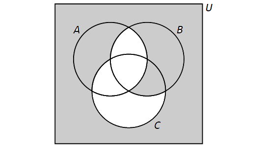
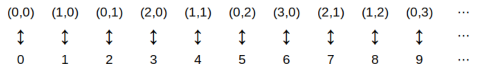

= Set Theory

//#*CAUTION* - CHAPTER UNDER CONSTRUCTION!#

_This chapter was last updated on February 10, 2025._ + 
//_Split section on Cardinality into two sections (one for finite sets and one for infinite sets), moved section on Venn diagrams after section on Finite Sets, and moved section on infinite sets closer to the end of the chapter._
[small]#Contents locked until 11:59 p.m. Pacific Standard Time on May 23, 2025.#

// MKD intro blurb needs editing
Set theory, along with logic, is [underline]#the# foundation of mathematics in our time. In earlier eras, people tried to use arithmetic (e.g., counting and whole numbers) and geometry (e.g., measurement of lengths, areas, and volumes along with geometric constructions) as the foundations of all mathematics. However, over the last two centuries, mathematicians gained new understandings of issues with these traditional foundations which led them to seek a new, firmer foundation. For now, that firmer foundation uses set theory: The study of collections of objects and how those collections can be combined, associated, and themselves added to other collections. + 
[small]#NOTE: If you want to dig much more deeply into what the issues with using arithmetic or geometry as the foundation of mathematics are, you can start with this  link:https://en.wikipedia.org/wiki/Foundations_of_mathematics&num;Foundational_crisis[Wikipedia page] which includes a a brief description of the "foundational crisis of mathematics."#
//[small]#NOTE: If you are curious about what the issues with the traditional foundations of arithmetic and geometry were, this link:https://en.wikipedia.org/wiki/Foundations_of_mathematics&num;Foundational_crisis[Wikipedia page] includes a a brief description of the "foundational crisis of mathematics."#

//#Foundational_crisis

////
SET THEORY (GGC05)
	ACM CCECC Set/rels/funcs/congruence	and
    COMP 152 Functions, Relations and Sets and DS1.
			Venn diagrams, 
			complements, 
			power sets, 
			operations, 
			DeMorgan’s laws
	       	Cartesian products, 
 -->    Cardinality and countability (MKD: Here or in Functions?)
 	ACTIVITY if time - Hauk et al. "Getting To Know Your Classmates" Venn Diagram Activity
	2013 changes/additions:
		Venn diagrams
		Union, intersection, complement
		Cartesian product
		Power sets
		Cardinality of finite sets
		
AUG 2024 update on topics
DS2013/Sets, Relations, and Functions	Sets: Venn diagrams
DS2013/Sets, Relations, and Functions	Sets: Union, intersection, complement
DS2013/Sets, Relations, and Functions	Sets: Cartesian product
DS2013/Sets, Relations, and Functions	Sets: Power sets
DS2013/Sets, Relations, and Functions	Sets: Cardinality of finite sets
DS2008/FunctionsRelationsAndSets	Sets (Venn diagrams, complements, Cartesian products, power sets)
DS2008/FunctionsRelationsAndSets	Cardinality and countability
ACM_CCECC_2005/Sets, relations, functions, congruences	sets including Venn diagrams, complements, power sets, operations, DeMorgan’s laws

SET THEORY - January 2025
DS2013/Sets, Relations, and Functions	Sets: Venn diagrams
DS2013/Sets, Relations, and Functions	Sets: Union, intersection, complement
DS2013/Sets, Relations, and Functions	Sets: Cartesian product
DS2013/Sets, Relations, and Functions	Sets: Power sets
DS2013/Sets, Relations, and Functions	Sets: Cardinality of finite sets
DS2013/Basics of Counting	Counting arguments: Set cardinality and counting
DS2013/Basics of Counting	Counting arguments: Sum and product rule
DS2013/Basics of Counting	Counting arguments: Inclusion-exclusion principle
DS2008/FunctionsRelationsAndSets	Sets (Venn diagrams, complements, Cartesian products, power sets)
DS2008/FunctionsRelationsAndSets	Cardinality and countability
ACM_CCECC_2005/Sets, relations, functions, congruences	sets including Venn diagrams, complements, power sets, operations, DeMorgan’s laws
MSF-Discrete_2023	1. Sets, relations, functions, cardinality
////

Key terms and concepts covered in this chapter:

* Sets
** Subsets of a set 
** The empty set
** The power set of a set
** Cartesian products
* Venn diagrams
* Cardinality and countability of finite and infinite sets
** Set cardinality and counting
* Operations with sets: Union, intersection, complement, and others
** DeMorgan’s laws
** Inclusion-exclusion principle

== Sets

//MKD NEED 
//	symmetric difference of sets 
//	De Morgan Laws
//	Other identifies (e.g., Distriutive Law)
//	immutability of math sets vs Python Sets
//	Application of Partitions: Number of integers from 1 to 100, inclusive, 
//		divislble by 2, 5, etc.
//	ACTIVITY: Given Venn diagram of 3 sets with parts shaded, write at least TWO different expressions for the shaded set. THEH write the shaded set as a union of the smallest intersections (i.e., there are 8 regions defined in the Venn Diagram - write the union of the shaded parts (DNF))
//	On sets of sets: Consider set C given as a roster of students in this section of Discrete Math, and a second roster D listing all sections of Discrete Math this semester. Is a student who is an element of C also and element of D? Is C a subset of D? Is C and element of D? 

// MKD - need to add this to set theory chapter after May 24, 2024:
// say more about the basic partition formed by a single subset - compare to odds and evens for the integers Z
// The one-to-one correspondence on power set that maps A to its complement.

//MKD changed A to S throughtout following paragraph since A will be used in the Python WARNING
A *set* is an unordered collection of objects, called *elements* or *members*. A set is said to *contain* its elements. 

If $x$ is an element of the set $S,$ then we write $x \in S$. If $x$ is not an element of the set $S$, then we write $x \not\in S$. For example, if $S$ is the set of names of states in the United States of America, then “New York” is an element of $S$ and “Ontario” is not an element of $S,$ that is \[ \text{“New York”} \in S \text{ and } \text{“Ontario”} \not\in S. \] As another example, if $E$ is the set of even integers, then $2 \in E$ and $3 \not\in E.$

// MKD new subsection Sept 5 2024
//=== Ways To Describe A Set
=== Describing A Set: The Roster Method 

One way of describing a set is the *roster method:* List all the elements of the set between curly braces. 
//MKD changed the example to match the Python WARNING 
//For example, $\{a,b,c\}$ is the set whose elements are $a,$ $b,$ and $c.$
For example, \[A = \{1,-2,0,1,-3\} \] is the set whose elements are $-3,$ $-2,$ $0,$ and $1.$ 

* Notice that the set $A$ contains exactly $4$ elements, even though the element $1$ appears twice in the roster - duplicate entries do not matter. 
* Also, the order of the elements in the list does not matter. That is, $\{-3,-2,0,1 \}$ and $\{0, 1,-2,-3\}$ are two more ways of describing the same set $A.$

//MKD REPLACED THE FOLLOWING PARAGRAPH
//In addition to _int_ (integer), _float_ and _string_, mentioned in the section on <<Data Types>>, one can build sets in Python using curly braces. Set data types are unordered and ignore duplicate elements.

//MKD As shown in the Warning, we can build sets in Python using the roster method. Set data types are unordered and ignore duplicate elements.

:pt_code_height: 350
:pt_rawinput: false
:pt_code: A%20%3D%20%7B1,-2,0,1,-3%7D%0Aprint%285%20in%20A%29%0Aprint%280%20in%20A%29
//MKD POSSIBLE ALTERNATE :pt_code: A%20%3D%20%7B1,-2,0,1,-3%7D%0AB%20%3D%20%7B0,1,4,-2,1,0,0,4%7D%0Aprint%285%20in%20A%29%0Aprint%280%20in%20A%29%0Aprint%28A%20%3D%3D%20B%29%0Aprint%28B,%22contains%22,len%28A%29,%22elements.%22%29%0Afor%20x%20in%20A%3A%0A%20%20%20%20print%28x,%22is%20an%20element%20of%22,str%28A%29%2B'.'%29%0Aprint%28type%28A%29%29%0Aprint%28type%28B%29%29
//MKD also note that Python set is mutable but frozenset is immutatble and so is more appropriate for demonstrating abstract mathematical sets
****
.Example {counter:setex} - Checking Set Membership in Python
--
--
The code below checks to see if $5$ and $0$ are elements of the set $A = \{1,-2,0,1,-3\}.$ Since $5 \not\in A$ and $0 \in A,$ the code prints False followed by True.
include::python_tutor.adoc[]
****

:pt_code_height: 350
:pt_rawinput: false
:pt_code: A%20%3D%20%7B1,-2,0,1,-3%7D%0Afor%20x%20in%20A%3A%0A%20%20%20%20print%28x,%20%22is%20an%20element%20of%20the%20set%22%29

****
.Example {counter:setex} - Listing the Elements of a Set in Python
--
--
The code below lists all of the elements of the set $A = \{1,-2,0,1,-3\}.$ 

Notice that 1 appears in the set once even though it appears in the roster twice.

include::python_tutor.adoc[]
****

// MKD Python Set Warning begins 

//MKD ADDED NOTE FOR PYTHON HEADS
//MKD ALT code A%20%3D%20%7B1,-2,0,1,-3,0%7D%20%23%20A%20is%20mutable%0AF%20%3D%20frozenset%28A%29%20%23%20F%20is%20immutable%0AA.add%288%29%20%20%20%20%20%20%20%20%20%23%20F.add%288%29%20raises%20an%20AttributeError%0AA.remove%281%29%20%20%20%20%20%20%23%20F.remove%281%29%20raises%20an%20AttributeError%0Aprint%28A%29%20%20%20%20%20%20%20%20%20%23%20A%20has%20been%20changed%0Aprint%28F%29%20%20%20%20%20%20%20%20%20%23%20F%20cannot%20be%20changed

:pt_code_height: 400
:pt_rawinput: false
:pt_code: A%20%3D%20%7B1,-2,0,1,-3%7D%20%23%20A%20is%20mutable%0AF%20%3D%20frozenset%28A%29%20%23%20F%20is%20immutable%0Aprint%28'A%20%3D',A%29%0AA.add%288%29%20%20%20%20%20%20%20%20%20%0AA.remove%281%29%20%20%20%20%20%20%0Aprint%28'A%20%3D',A%29%20%20%20%23%20A%20has%20been%20changed%0A%23%20F.add%288%29%20%20%20%20%20%20%20%23%20raises%20an%20AttributeError%0A%23%20F.remove%281%29%20%20%20%20%23%20raises%20an%20AttributeError%0Aprint%28'F%20%3D',F%29%20%20%20%23%20F%20cannot%20be%20changed
//MKD ALT code A%20%3D%20%7B1,-2,0,1,-3%7D%20%23%20A%20is%20mutable%0AB%20%3D%20frozenset%28A%29%20%23%20B%20is%20immutable%0AA.add%288%29%20%20%20%20%20%20%20%20%20%23%20B.add%288%29%20raises%20an%20AttributeError%0AA.remove%281%29%20%20%20%20%20%20%23%20B.remove%281%29%20raises%20an%20AttributeError%0Aprint%28A%29%20%20%20%20%20%20%20%20%20%23%20A%20has%20been%20changed%0Aprint%28B%29%20%20%20%20%20%20%20%20%20%23%20B%20cannot%20be%20changed

[WARNING]
====
//WARNING: 
*A WARNING ABOUT THE PYTHON EXAMPLES INVOLVING SETS*: The mathematical set $A = \{1,-2,0,1,-3\}$ is a constant - you cannot change the set by removing elements or inserting new elements. However, Python objects of type _set_ are mutable so it is possible to remove elements or insert new elements, as shown in the following code example. #The mathematically correct implementation of sets in Python uses objects of type _frozenset_# because objects of type _frozenset_ are immutable, just like mathematical sets. But there are advantages to using type _set_ instead of _frozenset_: The roster method notation can be used to initialize or print a Python _set_, but cannot be used with a Python _frozenset_: You must call the _frozenset_ constructor to create and initialize a _frozenset_. The authors of the original https://ggc-discrete-math.github.io/index.html[“Discrete Math”] chose to use Python _sets_ instead of _frozensets_ in the code examples; the author of this remix made the same choice.

****
//.Example {counter:setex} - WARNING: Python Sets Are Mutable
//.WARNING: Python Sets Are Mutable
//.Example {counter:setex} - WARNING: Python Sets Are Mutable, Mathematical Sets Are "Frozen"
.WARNING: Python Sets Are Mutable, Mathematical Sets Are "Frozen"
--
--
The [.underline]#mathematical# set $A$ does not allow removals or insertions, but the [.underline]#Python# set $A$ does. The frozenset $F$ is a more faithful implementation of the mathematical set $A$, but notice that the symbolism for Python sets more closely matches the symbolism used for mathematical sets. 
//$F$ requires an explicit call to the constructor.

include::python_tutor.adoc[]
****

====
// MKD Python Set Warning ends

// MKD new subsection Sept 5 2024
=== Describing A Set: Set Builder Notation 

Another way of describing a set is the use of *set builder* notation. We write a set as \[\{x \in D : P(x)\}.\] This is the set of all elements $x$ from a domain $D$ that satisfy the link:./introduction_discrete_math.html#informal_predicate_definition[predicate] $P(x).$
//MKD ADDED FOLLOWING
//We can use either the colon $:$ or the vertical bar $|$ as the separator in this notation. For example, $\{ x \in \mathbb{Q} \, | \, x^{2} \geq 2 \text{ and } x > 0 \}$ is the set of positive rational numbers that are greater than $\sqrt{2}$ (The set $\mathbb{Q}$ is the set of rational numbers.)
We can use either the colon $:$ or the vertical bar $|$ as the separator in this notation. For example, $\{ x \in \mathbb{N} \, | \, x^{2} \leq 50 \}$ is the set of natural numbers that are less than $\sqrt{50}.$

// MKD ADDED FOLLOWING 
Yet another way of describing a set is to use a function or an algebraic expression, as in \[\{ f(x) : x \in D \}.\]This is the set of all values $f(x)$ for $x$ in the domain $D$. For example, $\{ 2n : n \in \mathbb{N} \}$ is the set of the even natural numbers. Again, we can use either the colon $:$ or the vertical bar $|$ as the separator.

:pt_code_height: 350
:pt_rawinput: false
:pt_code: A%20%3D%20%7B1,-2,0,1,-3%7D%0AB%20%3D%20%7Bx%20for%20x%20in%20A%20if%20x%20%3E%200%7D%0Aprint%28B%29

****
.Example {counter:setex} - Set Builder Notation in Python
--
--
The set $\{x \in D: P(x)\}$ can be expressed in Python as {for x in D if P(x)}. For example, the code below defines the set $B$ as the set of positive elements of the set $A = \{1,-2,0,1,-3\}.$
include::python_tutor.adoc[]
****

=== Describing A Set: Special Sets Of Numbers
// MKD special sets begins

You may already be familiar with the following sets of numbers, which are listed here for reference. 

//MKD edited this list of Special sets of numbers and moved it before the Switching between representations example. Changed vertical bar to colon in  C definition (cannot make it work for Q)
.Special sets of numbers
****
* $\mathbb{N} = \{0, 1, 2, 3,...\}$, the set of natural numbers +
* $\mathbb{Z} = \{...,-2, -1, 0, 1, 2,...\}$ , the set of integers +
* $\mathbb{Z}^+ = \{1, 2, 3,...\}$, the set of positive integers +
//* $\mathbb{Q} = \left\{\left.\frac{a}{b}\right|a\in \mathbb{Z},b\in \mathbb{Z},b\neq 0\right\}$, the set of rational numbers of the form $\frac{a}{b}$  +
* $\mathbb{Q} = \left\{\left.\frac{a}{b}\right|a\in \mathbb{Z},b\in \mathbb{Z},b\neq 0\right\}$, the set of rational numbers  +
* $\mathbb{Q}^+$, the set of positive rational numbers +
* $\mathbb{R}$, the set of real numbers +
* $\mathbb{R}^+$, the set of positive real numbers +
* $\mathbb{C} = \{a+bi : a\in \mathbb{R},b\in \mathbb{R},b\neq 0,i^{2}=-1\}$, the set of complex numbers. +

****

Other special sets will be defined as needed.

// MKD new subsection Sept 5 2024
=== Describing A Set: Switching Between Representations

A set can usually be described in more than one way, as shown in the following example.

****
.Example {counter:setex} - Switching between representations

Consider the following set: \[\{x \in \mathbb{Z} : -2 \leq x < 4\}.\] This is the set of all integers $x$ such that $-2$ is less than or equal $x$ and $x$ is less than 4. Using the roster method, this set can be written as \[\{-2,-1,0,1,2,3\}.\]

.You Try

Match each set described using set builder notation in parts (a) through (f) with the same set described using the roster method in parts (A) through (F).

a. $\{x \in \mathbb{Z} : x^2 = 1\}$
b. $\{x \in \mathbb{Z} : x^3 = 1\}$
c. $\{x \in \mathbb{Z} : |x| \leq 2\}$
d. $\{x \in \mathbb{Z} : x^2 < 4\}$
e. $\{x \in \mathbb{Z} : x < |x|\}$
f. $\{x \in \mathbb{Z} : (x + 1)^2 = x^2 + 2x + 1\}$

//

A. $\{-1,0,1\}$
B. $\{\dots, -3,-2,-1,0,1,2,3,\dots\}$
C. $\{1\}$
D. $\{\dots, -3,-2,-1\}$
E. $\{-1,1\}$
F. $\{-2,-1,0,1,2\}$
****

[NOTE]
====
When there are too many elements in a set for us to be able to list each one, we often use ellipses ($\dots$) when the pattern is obvious. For example, we have \[\mathbb{Z} = \{\dots,-3,-2,-1,0,1,2,3,\dots\}.\]
====

// MKD special sets ends

// MKD equality begins
== Equality Of Sets

We say that two sets are *equal* if and only if they contain the same elements. 
//MKD COMMENTED THIS OUT SINCE SET THEORY NOW COMES BEFORE LOGIC In other words, $A$ and $B$ are equal sets if and only if \[\forall x (x \in A \iff x \in B).\]
When $A$ and $B$ are equal sets, we write $A = B$. When $A$ and $B$ are not equal sets, we write $A \neq B$.

//The sets $\{2,3,5,7\}$ and $\{5,2,7,3\}$ are equal sets, since they contain the same elements. The set $\{x \in \mathbb{N} : x \text{ is prime and } x < 10 \}$ is another description of this same set. 

The three sets $\{2,3,5,7\},$ $\{5,2,7,3\},$ and $\{x \in \mathbb{N} : x \text{ is prime and } x < 10 \}$ are equal sets because they contain the same elements. In fact, $\{2,3,5,7\},$ $\{5,2,7,3\},$ and $\{x \in \mathbb{N} : x \text{ is prime and } x < 10 \}$ are really just _three different descriptions of the same set,_ in the same way that 
$1 + 3,$ $5 - 1,$ and $2^{2}$ are three different descriptions of the same number, 4. 
The extended equality \[\{2,3,5,7\} = \{5,2,7,3\} = \{x \in \mathbb{N} : x \text{ is prime and } x < 10 \}\] is a true statement for the same reason the extended equality $1 + 3 = 5 - 1 = 2^{2}$ is a true statement. + 
[small]#Note: You may be used to using the equal sign "=" as if it means "simplifies to" in your previous math experience, but "=" actually means "represents the same thing as."#

//The order in which the elements of a set are listed does not matter. Additionally, it does not matter whether elements are repeated. Thus, the sets $\{a,b,c\}$ and $\{b,b,a,c,b,a,c,c,c\}$ are equal sets as well.
// MKD equality ends

// MKD empty set begins
//=== The Empty Set
== The Empty Set
Consider the set of all natural numbers whose square is equal to 2, described using set builder notation: $\{x \in \mathbb{N} : x^2 = 2\}.$ If you use the roster method to list all the elements you will get the set $\{ \}$ because there are no natural numbers whose square is equal to 2! 

The set $\{ \}$ is called the *empty set,* or the *null set.* 
The symbol $\emptyset$ is used to represent the empty set, too, that is, \[ \emptyset = \{ \}. \] 

:pt_code_height: 350
:pt_rawinput: false
:pt_code: def%20Elements%28A%29%3A%0A%20%20%20%20if%20A%20%3D%3D%20set%28%29%3A%0A%20%20%20%20%20%20%20%20print%28%22the%20set%20is%20empty%22%29%0A%20%20%20%20else%3A%0A%20%20%20%20%20%20%20%20for%20x%20in%20A%3A%0A%20%20%20%20%20%20%20%20%20%20%20%20print%28x,%20%22is%20an%20element%20of%20the%20set%22%29
****
.Example {counter:setex} - Listing the Elements of a Nonempty Set
--
--
To define the empty set in Python, we must call the constructor set(). 
Python interprets the empty curly braces {} as an empty object of type _dict_, called a dictionary, that is used to represent mappings of key:value pairs. 

The function in the code below checks to see if a set is empty. If the set is nonempty, its elements are listed.
include::python_tutor.adoc[]
****

//MKD UNUSED EXAMPLE - NOT VERY GOOD SINCE set() IS NOT HASHABLE :( //https://pythontutor.com/render.html#code=def%20describeCardinality%28A%29%3A%0A%20%20%20%20if%20A%20%3D%3D%20set%28%29%3A%0A%20%20%20%20%20%20%20%20print%28%22Set%22,A,%22is%20empty.%22%29%0A%20%20%20%20else%3A%0A%20%20%20%20%20%20%20%20print%28%22Set%22,A,%22contains%22,len%28A%29,%22elements.%22%29%0AS0%20%3D%20set%28%29%0AdescribeCardinality%28S0%29%0AS1%20%3D%20%7B%20frozenset%28S0%29%20%7D%0Aprint%28S1%29%0AdescribeCardinality%28S1%29&cumulative=false&curInstr=14&heapPrimitives=false&mode=display&origin=opt-frontend.js&py=3&rawInputLstJSON=%5B%5D&textReferences=false

[NOTE]
====
It is important to note that $\{\}$ and $\emptyset$ are both ways to write the empty set. However, the mathematical set $\{ \emptyset \}$ is not the empty set because it contains one element, namely the empty set. In general, the set $A$ is not the same as the set $\{ A \}.$
====

[TIP]
====
Python Tip: The mathematical set $\{ \emptyset \}$ [.underline]#must# be implemented as $\{ \text{frozenset()} \}$, which is the Python _set_ that contains the empty _frozenset_. In general, anytime we want to implement a mathematical set $B$ as an element of another mathematical set $A$ in Python, we need to implement $B$ as a _frozenset_ in order to be used as an element of the Python set $A$. This is due to the fact that elements of Python _sets_ must be _hashable_; further explanation is beyond the scope of this textbook.

//, we [.underline]#cannot# implement 
====
// MKD empty set ends

// MKD new section Sept 5 2024
== Subsets of a Set

////
If we have a set $S$ we can form several new sets from a given set $S.$
Another way of creating new sets is to derive them from old sets.

// MKD subsets begins
//MKD maybe move all the subset section up to right after the basic definition of sets?
=== Subsets of a Set
////

Suppose $A$ and $B$ are two sets, and that every element $x$ of the set $A$ is also an element of set $B.$  We say that $A$ is a *subset* of a set $B,$ and write $A \subseteq B$. If a set $C$ is not a subset of $B,$ we write $C \not\subseteq B$.

//In order to show that $A$ is a subset of $B,$ we must show that, whenever $x \in A,$ it is also the case that $x \in B.$ In order to show that $A$ is not a subset of $B,$ we must find a single $x$ such that $x \in A$ but $x \not \in B.$

If $A \subseteq B$ but $B$ contains at least one element that is not in A, then $A$ is called a *proper subset* of $B$, denoted $A \subset B$. That is, $A$ is a proper subset of $B$ if it is a subset of $B$ but is not equal to $B.$

****
.Example {counter:setex}
Suppose that we have three sets $R = \{1,5\},$ $S = \{1,3,5\},$ and $T = \{1,4,7\}.$ 

* $R \subseteq S,$ since each element $x$ of $R$ also is an element of $S.$  
* $R \subset S$ since $3$ is an element of $S$ but is not an element of $R.$
* $S \not\subseteq T$ since $3$ is an element of $S$ but is not an element of $T.$ Likewise, $T \not\subseteq S$ since $4$ is an element of $t$ but is not an element of $S.$ 

////
As an another example, $A$ be the set of professional athletes, $B$ be the set of professional basketball players, and $F$ be the set of professional football players. 

* $F \subseteq A$ since every professional football player is a professional athlete. 
* $F \subseteq A$ since every professional football player is a professional athlete, 
* but $A \not\subseteq F,$ since not every professional athlete is a professional football player.
////
****

//Note that, for any set $A,$ it is always the case that $\emptyset \subseteq A$ and $A \subseteq A.$ For any sets $A$ and $B,$ if $A \subseteq B$ and $B \subseteq A,$ then $A = B.$
.Theorem
****
For any set $A$ \[\emptyset \subseteq A\] \[A \subseteq A\] 

For any sets $A$ and $B$ \[ A = B \text{ if and only if both } A \subseteq B \text{ and } B \subseteq A\]

****

//If $A \subseteq B$ and $B$ contains at least one element that is not in A, then we say $A$ is a *proper subset* of $B$, denoted $A \subset B$.

:pt_code_height: 350
:pt_rawinput: false
:pt_code: A%20%3D%20%7B2,4,6,8,10,12%7D%0AB%20%3D%20%7B4,8,12%7D%0Aprint%28A.issubset%28B%29%29%0Aprint%28B%20%3C%3D%20A%29%0A

****
.Example {counter:setex} - Subsets in Python
--
--
In Python, we can check whether a set $A$ is a subset of a set $B$ in one of the following ways:

A.issubset(B) +
A \<= B.
include::python_tutor.adoc[]
****
// MKD subsets ends

// MKD power set begins
//=== Power Sets
== The Power Set of a Set

//Given a set $A,$ we refer to the *power set* of $A$ as the set of all subsets of $A.$ The power set of $A$ is denoted by $\mathcal{P}(A).$

Given a set $A,$ we can define a new set by collecting together all subsets of $A$. This new set is called the *power set* of $A.$ The power set of $A$ is denoted by $\mathcal{P}(A).$ That is, \[ \mathcal{P}(A) = \{ B \, | \, B \subseteq A \}. \]
Notice that $\mathcal{P}(A)$ is a set whose elements are themselves sets.

****
.Example {counter:setex} -  The Power Set Of A Set

Suppose that $A = \{0,1,2\},$ then \[\mathcal{P}(A) = \{\emptyset, \{ 0 \}, \{ 1 \}, \{ 2 \}, \{0,1\}, \{0,2\}, \{1,2\}, \{0,1,2\}\}.\] Notice that the empty set is an element of $\mathcal{P}(A)$ along with all the other subsets of $A.$ 
****

The empty set has only one subset, namely itself. Thus, we see that \[\mathcal{P}(\emptyset) = \{\emptyset\}.\] 

We can also find the power set of a power set. For example, we have the following:

[env.equationalign]
--
\mathcal{P}(\{ 3 \}) &= \{\emptyset, \{ 3 \}\},\\
\\ 
\mathcal{P}(\mathcal{P}(\{ 3 \}) &= \mathcal{P}(\{\emptyset, \{ 3 \})\\
&= \{\emptyset, \{\emptyset\}, \{ \{ 3 \} \}, \{\emptyset, \{ 3 \}\}\}.
--

// MKD power set ends

// MKD Cartesian product begins
== Cartesian Products

The *Cartesian product* of two sets $A$ and $B$ is the set of _ordered pairs_
defined by,

//MKD $  A\times B=\{(a,b)|a\in A\wedge b\in B)\}$,
$  A\times B=\{(a,b) \, | \, a\in A \text{ and } b\in B)\}$,

****
.Example {counter:setex}

Consider the sets, $B=\{0,1\}$, $T=\{0,1,2\}$, and, $C=\{a,\ b,\ c, d\}$.
//Determine the Cartesian products, and their cardinalities. 
Determine how many elements are in each set using the product rule, and verify by writing out each set using the roster method.

.. $B\ \times\ C$
.. $C\times B$
.. $B\ \times\ T$
.. $B\ \times\ B$
.. $B\ \times\ B\ \times B$

.Solution

For the set, $ B\ \times C $, notice that
this will be all ordered pairs of the form,
$(a,b)$, with $a \in B$, and $b \in C$, giving,

$B\ \times\ C=\{(0,a), (0,b), (0,c), (0,d),(1,a), (1,b), (1,c), (1,d))\}$,
which has $2 × 4=8$, elements.

For $C\ \times\ B$, switch the ordering, for $B\ \times\ C$, to obtain the set with $8$,
elements,

$C\ \times  B=\{(a,0), (b,0), (c,0),(d,0),(a,1), (b,1), (c,1), (d,1)\}$,

The set $B \times T$,
will be all ordered pairs of the form,
$(a,b)$, with $a \in B$, and $b \in T$, giving, the set with $2 × 3=6$, elements,

$B \times T=\{(0,0),(0,1),(0,2),(1,0),(1,1),(1,2)\}$,

The set $B \times B$,
will be all order pairs  of the form,
$(a,b)$, with $a, b \in B$, giving the set with  $2 × 2=4$, elements,

$B \times T=\{(0,0),(0,1),(1,0),(1,1)\}$,

Finally the set $B \times B \times B$, will be the set of all
ordered triples of the form,
$(a,b,c)$, with $a, b, c \in B$, giving the set with  $2 × 2 × 2=8$, elements,

$B \times B \times B=\{(0,0,0),(0,0,1),(0,1,0),(0,1,1),(1,0,0),(1,0,1),(1,1,0),(1,1,1)\}$,
****

//MKD REWROTE THE FOLLOWING
[NOTE]
====
// Because Cartesian products are created using ordered pairs, $B \times C$, is, in general, different from $C \times   B$.
Cartesian products are created using _ordered_ pairs, so if $A$ and $B$ are different sets, then $A \times B$ is different from $B \times A$.
====

[NOTE]
====
The Cartesian coordinate systems 
//are natural sets that are naturally Cartesian products.
are Cartesian products.

The two-dimensional $xy$-plane is represented by $\mathbb{R}^2=\mathbb{R}\times \mathbb{R}=\{(x,y)|x,y\in \mathbb{R}\}$, and, the three-dimensional $xyz$-space are represented by $\mathbb{R}^3=\mathbb{R}\times \mathbb{R}\times \mathbb{R}=\{(x,y,z)|x,y,z\in \mathbb{R}\}$
====
// MKD Cartesian product ends

// MKD cardinality begins
// === Cardinality
// made its own section on Sept 4 2024
// split into Cardinality Of Sets: Finite Sets and Cardinality Of Sets: Infinite Sets Feb 2 2025
== Cardinality Of Sets: Finite Sets

Cardinality is the formalization of the idea of the count of the number of elements in a set. + 
[small]#In this section, we will prefer counting from 1 instead of 0. You will see below why this makes no difference.#

////
//MKD REWROTE THE FOLLOWING
[NOTE]
====
// If the cardinality of set $|A|=a$, and the cardinality of set $|B|=b$, then the cardinality of the Cartesian product is $|A × B|=ab$
If $A$ and $B$ are finite sets, then the cardinality of the Cartesian product $A × B$ is $|A × B|=|A| \cdot |B|$.
====
////

// MKD added Aug 17 2024 - may need to edit the tow paragraphs that follow this one

//=== Finite Sets

Set $A$ is called a *finite set* if either 

* $A$ is the empty set or 
* there is a one-to-one correspondence between $A$ and the set 
$\{ i \in \mathbb{N} \, | \, 0 < i \leq n \} = \{1, 2, \ldots , n \}$ for some positive integer $n.$
//$\{ i \in \mathbb{N_{>0}} \, | \, i \leq n \} = \{1, 2, \ldots , n \}$ for some positive integer $n.$

[NOTE] 
====
// MKD insert fingers count image here FingersToNumerals.png
//image::imagesMKD/FingersToNumerals.png[FingersToNumerals,974,327,float="right",align="center"]
image::imagesMKD/FingersToNumerals.png[FingersToNumerals,375,109,float="right",align="center"]
This definition of "finite set" may seem abstract, but it's just a formal description of what is likely the way you learned to count when you were young: You matched objects with number names (that is, numerals) as shown in the image.
====

//=== Definition Of Cardinality For Finite Sets

//image::imagesMKD/04to15.png[04to15,368,274,float="right",align="center"]
image::imagesMKD/04to15.png[04to15,123,91,float="right",align="center"]
The *cardinality* of a finite set $A,$ denoted by $|A|,$ is 

* 0 if $A = \emptyset$ or
* the value of $n$ for which there is a one-to-one correspondence between $A$ and $\{1, 2, \ldots , n \}.$ 

For a _finite set_ $A$ the cardinality $|A|$ is just the number of elements in the set. 
The image shows that $|\{0,1,2,3,4\}| = 5.$

:pt_code_height: 350
:pt_rawinput: false
:pt_code: A%20%3D%20%7B2,3,5,8%7D%0AB%20%3D%20set%28%29%0AC%20%3D%20%7B0%7D%0Aprint%28len%28A%29%29%0Aprint%28len%28B%29%29%0Aprint%28len%28C%29%29%0A

****
.Example {counter:setex} - Cardinality of Finite Sets in Python
--
--
The cardinality of a finite set $A$ can be computed in Python as follows:

len(A)
include::python_tutor.adoc[]
****

****
.Example {counter:setex}
Suppose that $A$ and $B$ are finite sets. 

* The cardinality of the Cartesian product $A × B$ is $|A × B|=|A| \cdot |B|$. 
* The cardinality of the power set of $A$ is $\left|\mathcal{P}(A)\right| = 2^{|A|}.$

[env.Challenge]
--
Give informal arguments to justify each of the two bulleted statements.
--

[click.hint]
--
Your arguments can use some of the rules introduced in  link:./counting_arithmetic.html[Counting: Arithmetic Techniques] chapter
--

[click.answer]
--
For the Cartesian product, the elements of $A × B$ are ordered pairs of the form $(x,y)$ where $x\in A$ and $y\in B.$ There are $|A|$ choices for the first coordinate, and for each of those choices there are $|B|$ choices for the second coordinate. Use the product rule to conclude that there are $|A| \cdot |B|$ different ways to choose an ordered pair, so that $|A × B|=|A| \cdot |B|.$ + 
 + 
For the power set of $A,$ to choose a subset of $A$ you must decide for each of the $|A|$ elements in $A$ whether to include that element in the subset. There are 2 choices for each element, so using the product rule repeatedly you can conclude that there are $(2)(2)\cdots(2)$ ways to choose a subset, where the number of factors of $2$ is $|A|$. So $\left|\mathcal{P}(A)\right| = 2^{|A|}.$ You can also think of this as counting all possible bitstrings of length $n,$ where a 1 bit means "include the corresponding element" and a 0 bit means "omit the corresponding element."
--

****

// MKD Jan 26 2025 moved Venn diagrams before Cardinality
// Feb 2 2025 moved after Cardinality of Finite Sets
// Jun 24 2025 TODO - state explicitly that the circles in a Venn diagram are not in general used as "geometric" shapes where area or circumference are important - the circles simply separate the elements "inside" the set from the other elements that are "outside".
== Venn Diagrams

A *Venn diagram,* named after the English mathematician John Venn,  consists of one or more circles, with each circular region representing a set. An example can be seen link:https://en.wikipedia.org/wiki/Venn_diagram#/media/File:Venn_diagram_gr_la_ru.svg[here.]

We write the elements of a set within the circular region that represents the set; anything written outside the circular region is not an element of the set. If an element is written in the overlap of two or more regions, then it is an element of each of the sets. 

The circles are often drawn inside a larger rectangle which represents a *universal set* $U$ that we are focusing on. In the example linked above, the rectangle was omitted because every glyph was an element of at least one of the sets represented by a circular region, but if we introduced addition glyphs like ہ we would need to draw the rectangle because that glyph would need to be written outside _all_ three circular regions.

// For example the set _U_ could be the set of real numbers, or the set of all possible algorithms; the idea is to limit are discussion to only the types of elements we care about in the context. and one or more circles, which represent the sets under consideration. We will then shade in the regions of the diagram that correspond to one or more set operations. 

//image::imagesMKD/VennVsEulerDiagrams.png[VennVsEulerDiagrams,1536,960,float="right",align="center"]
image::imagesMKD/VennVsEulerDiagrams.png[VennVsEulerDiagrams,480,300,float="right",align="center"]
In this textbook, #a Venn diagram must show _all the possible overlaps_# of the sets. This is consistent with link:https://doi.org/10.1080/14786448008626877[Venn's paper from 1880.]  
//It should not be possible to choose a point at random from the region inside one of the circles and know for sure that the point is or is not in the region inside another circle. + 
 + 
That is, you should NOT be able to answer the question "Is _x_ an element of set _A?_" when _x_ is written in the circular region for a different set, _B._ 
In the image, the upper right example shows a Venn diagram because you could write _x_ in the overlap of the two regions or you could write _x_ in the the part of the region for _B_ that is outside the circular region for _A._ The lower two diagrams are not Venn diagrams: In either one of those, if _x_ is written in the region for set _B,_ it must be true that _x_ is not an element of _A_ (on the lower left) or that _x_ is an element of _A_ (the example on the lower right). Diagrams like the lower two examples will be called *Euler diagrams* in this textbook. + 
[small]#Some sources use the term _Venn diagram_ for all four of the examples shown in the image, but you should always assume when reading this textbook that the lower two are NOT Venn diagrams. Click link:https://commons.wikimedia.org/wiki/File:RGB_combination_on_wall.png[here] to see the light!#

//Alternate image: https://commons.wikimedia.org/wiki/File:Additive_color.svg

== Set Operations

We can obtain new sets by performing operations on other sets. When performing set operations, it is often helpful to consider all of our sets as subsets of a *universal set* $U.$ We can think of the universal set as the set of all of the objects under consideration. 

We can represent set operations visually using Venn diagrams.

=== Union

// 	MKD: say something about "meet" and "join"?

The *union* of the sets $A$ and $B$ is the set containing those elements that are in $A$ or $B$ or both, and is denoted by $A \cup B$. 
//MKD REWROTE More formally, \[A \cup B = \{x \in U : x \in A \lor x \in B\}.\]
More formally, \[A \cup B = \{x \in U : x \in A \text{ or } x \in B\}.\]

//MKD ADDED NEXT SENTENCE
Note that "or" is read here as the "inclusive or".
We have the following Venn Diagram for $A \cup B$:

image::images/Union.png[]

Note that, for any sets $A$ and $B,$ \[A \cup B = B \cup A.\]

****
.Example {counter:setex}
If we let $A = \{1,2,3,4,5,6\}$ and $B = \{1,3,5,7,9\},$ then \[A \cup B = \{1,2,3,4,5,6,7,9\}.\]
****

:pt_code_height: 350
:pt_rawinput: false
:pt_code: A%20%3D%20%7B-3,-1,2,5%7D%0AB%20%3D%20%7B-1,%200,%202%7D%0A%0Aprint%28A.union%28B%29%29%0Aprint%28A%20%7C%20B%29
****
.Example {counter:setex} - Union in Python
--
--
In Python, we can compute the union of sets $A$ and $B$ in one of the following ways:

A.union(B) +
A | B
include::python_tutor.adoc[]
****

=== Intersection

The *intersection* of the sets $A$ and $B$ is the set containing those elements that are in $A$ and $B$ and is denoted by $A \cap B$. 
//MKD REWROTE More formally, \[A \cap B = \{x \in U : x \in A \land x \in B\}.\]
More formally, \[A \cap B = \{x \in U : x \in A \text{ and } x \in B\}.\]

We have the following Venn Diagram for $A \cap B$:

image::images/Intersection.png[]

Note that, for any sets $A$ and $B,$ \[A \cap B = B \cap A.\] If it is the case that $A \cap B = \emptyset,$ then we say that $A$ and $B$ are *disjoint*. In other words, two sets are disjoint if and only if they contain no elements in common.

****
.Example {counter:setex}
If we let $A = \{1,2,3,4,5,6\}$ and $B = \{1,3,5,7,9\},$ then \[A \cap B = \{1,3,5\}.\]
****

:pt_code_height: 350
:pt_rawinput: false
:pt_code: A%20%3D%20%7B-3,-1,2,5%7D%0AB%20%3D%20%7B-1,%200,%202%7D%0A%0Aprint%28A.intersection%28B%29%29%0Aprint%28A%20%26%20B%29
****
.Example {counter:setex} - Intersection in Python
--
--
In Python, we can compute the intersection of sets $A$ and $B$ in one of the following ways:

A.intersection(B) +
A & B
include::python_tutor.adoc[]
****

=== Complement

The *complement* of a set $A$ is the set of all elements in the universal set $U$ which are not elements of $A$ and is denoted by $\overline{A}.$ More formally, \[\overline{A} = \{x \in U: x \not\in A\}.\] 
//MKD ADDED NEXT sentence
Note that other textbooks and internet sources may use different notation for the complement of $A$, such as $A'$ and $A^{c}$, but these all stand for the same set, so that $\overline{A} = A' = A^{c}$.

We have the following Venn Diagram for $\overline{A}$:

image::images/ComplementA.png[]

//MKD replaced next line
//For any set $A,$ \[\overline{A} = U \setminus A.\]
For any set $A,$ \[ \overline{\overline{A}} = A \] \[ \overline{A} \cup A = U \] \[ \overline{A} \cap A = \emptyset. \]

****
.Example {counter:setex}
Suppose that our universal set is $U = \{0,1,2,3,4,5,6,7,8,9\},$ the set of all decimal digits. If we let $A = \{1,2,3,4,5,6\}$ and $B = \{1,3,5,7,9\},$ then \[\overline{A} = \{0,7,8,9\}\] and \[\overline{B} = \{0,2,4,6,8\}.\]

.Example {counter:setex}
Suppose that our universal set is $\mathbb{Z}.$ If we let $E$ be the set of all even integers, then $\overline{E}$ is the set of all odd integers.
****

//MKD put Difference and Symmetric Difference in a subsubsection
//=== Difference
=== Other Operations

The three operators complement, intersection, and union are the most commonly used to define subsets of a universal set. You will see why this is so later in the chapter.

However, there are some other operators you should be familiar with. 

==== Difference

The *difference* of the sets $A$ and $B$ is the set containing those elements that are in $A$ but not in $B$ and is denoted by $A \setminus B$. Set difference is also denoted by $A - B$. 
//MKD REWROTE More formally, \[A \setminus B = \{x \in U: x \in A \land x \not\in B\}.\]
More formally, \[A \setminus B = \{x \in U: x \in A \text{ and } x \not\in B\}.\]

We have the following Venn Diagram for $A \setminus B$:

image::images/A Subtract B.png[]

//MKD REARRANGED THE FOLLOWING PARAGRAPH
Note that, for any sets $A$ and $B$, if $A \neq B,$ then \[A \setminus B \neq B \setminus A.\]
However, if $A = B,$ then $A\setminus B = B \setminus A = \emptyset$. 

****
.Example {counter:setex}
If we let $A = \{1,2,3,4,5,6\}$ and $B = \{1,3,5,7,9\},$ then \[A \setminus B = \{2,4,6\}\] and \[B \setminus A = \{7,9\}.\]
****

:pt_code_height: 350
:pt_rawinput: false
:pt_code: A%20%3D%20%7B-3,-1,2,5%7D%0AB%20%3D%20%7B-1,%200,%202%7D%0A%0Aprint%28A.difference%28B%29%29%0Aprint%28B%20-%20A%29
****
.Example {counter:setex} - Difference in Python
--
--
In Python, we can compute the difference of sets $A$ and $B$ in one of the following ways:

A.difference(B) +
A - B
include::python_tutor.adoc[]
****

//=== Symmetric Difference
==== Symmetric Difference

//MKD NOTE ON NOTATION: Both "Rosen" and "Haggard, Schlipf, and Whitesides" use the notation $A \oplus B$ for symmetric difference, 

The *symmetric difference* of the sets $A$ and $B$ is the set containing those elements that are in $A$ or $B$ but not both $A$ and $B$. It is denoted by $A \oplus B$ in this textbook, 
//but it appears that there is no standardized notation so 
but other books and sources may use different notation such as $A \Delta B$. 
//MKD REWROTE More formally, \[A \setminus B = \{x \in U: x \in A \land x \not\in B\}.\]
More formally, \[A \oplus B = \{x \in U: (x \in A \text{ and } x \not\in B) \text{ or } (x \in B \text{ and } x \not\in A)\}.\]

We have the following Venn Diagram for $A \oplus B$:

//MKD needs to credit image to original authors
// derived from images/A Subtract B.png
image::imagesMKD/A symdif B.png[]

Note that, for any sets $A$ and $B,$ \[A \oplus B = B \oplus A.\]

 

****
.Example {counter:setex}
If we let $A = \{1,2,3,4,5,6\}$ and $B = \{1,3,5,7,9\},$ then \[A \oplus B = \{2,4,6,7,9\}.\]
****

:pt_code_height: 350
:pt_rawinput: false
:pt_code: A%20%3D%20%7B-3,-1,2,5%7D%0AB%20%3D%20%7B-1,%200,%202%7D%0A%0Aprint%28A.symmetric_difference%28B%29%29%0Aprint%28B%20^%20A%29
****
.Example {counter:setex} - Symmetric Difference in Python
--
--
In Python, we can compute the difference of sets $A$ and $B$ in one of the following ways:

A.symmetric_difference(B) +
A ^ B
include::python_tutor.adoc[]
****

=== Multiple Set Operations

We can also perform more than one set operation on a collection of sets. For example, let $A,$ $B,$ and $C$ be sets and consider the following set: \[(A \setminus B) \cup (C \setminus B).\]This is the set that is obtained by taking the union of the sets $A \setminus B$ and $C \setminus B.$ We have \[(A \setminus B) \cup (B \setminus A) = \{x \in U: (x \in A \text{ and } x \not\in B) \text{ or } (x \in C \text{ and } x \not\in B)\}.\]

We have the following Venn Diagram for $(A \setminus B) \cup (C \setminus B)$:

image::images/AminusBunionCminusB.png[]

Note that the Venn Diagram also represents $(A \cup C ) \setminus B$. In general, there are multiple ways to describe the result of multiple set operations.

*Video Examples*

The following two video examples feature 
Dr. Katherine Pinzon, Professor of Mathematics at Georgia Gwinnett College.

*Video Example 1*

++++
<iframe id="kaltura_player" src="https://cdnapisec.kaltura.com/p/2022371/sp/202237100/embedIframeJs/uiconf_id/31860982/partner_id/2022371?iframeembed=true&playerId=kaltura_player&entry_id=0_vmm8v9kh&flashvars[streamerType]=auto&amp;flashvars[localizationCode]=en&amp;flashvars[leadWithHTML5]=true&amp;flashvars[sideBarContainer.plugin]=true&amp;flashvars[sideBarContainer.position]=left&amp;flashvars[sideBarContainer.clickToClose]=true&amp;flashvars[chapters.plugin]=true&amp;flashvars[chapters.layout]=vertical&amp;flashvars[chapters.thumbnailRotator]=false&amp;flashvars[streamSelector.plugin]=true&amp;flashvars[EmbedPlayer.SpinnerTarget]=videoHolder&amp;flashvars[dualScreen.plugin]=true&amp;flashvars[Kaltura.addCrossoriginToIframe]=true&amp;&wid=1_cwiqknv4" width="700" height="500" allowfullscreen webkitallowfullscreen mozAllowFullScreen allow="autoplay *; fullscreen *; encrypted-media *" sandbox="allow-forms allow-same-origin allow-scripts allow-top-navigation allow-pointer-lock allow-popups allow-modals allow-orientation-lock allow-popups-to-escape-sandbox allow-presentation allow-top-navigation-by-user-activation" frameborder="0" title="Kaltura Player"></iframe>
++++

*Video Example 2*

++++
<iframe id="kaltura_player" src="https://cdnapisec.kaltura.com/p/2022371/sp/202237100/embedIframeJs/uiconf_id/31860982/partner_id/2022371?iframeembed=true&playerId=kaltura_player&entry_id=0_9p3m4lin&flashvars[streamerType]=auto&amp;flashvars[localizationCode]=en&amp;flashvars[leadWithHTML5]=true&amp;flashvars[sideBarContainer.plugin]=true&amp;flashvars[sideBarContainer.position]=left&amp;flashvars[sideBarContainer.clickToClose]=true&amp;flashvars[chapters.plugin]=true&amp;flashvars[chapters.layout]=vertical&amp;flashvars[chapters.thumbnailRotator]=false&amp;flashvars[streamSelector.plugin]=true&amp;flashvars[EmbedPlayer.SpinnerTarget]=videoHolder&amp;flashvars[dualScreen.plugin]=true&amp;flashvars[Kaltura.addCrossoriginToIframe]=true&amp;&wid=1_pcesgshn" width="700" height="500" allowfullscreen webkitallowfullscreen mozAllowFullScreen allow="autoplay *; fullscreen *; encrypted-media *" sandbox="allow-forms allow-same-origin allow-scripts allow-top-navigation allow-pointer-lock allow-popups allow-modals allow-orientation-lock allow-popups-to-escape-sandbox allow-presentation allow-top-navigation-by-user-activation" frameborder="0" title="Kaltura Player"></iframe>
++++

****
.You Try

Draw Venn Diagrams for each of these combinations of the sets $A$, $B$, and $C$.

1. $A \cap (B \cup C)$
2. $(A \cap B) \cup C$
3. $(\overline{A} \cap \overline{C}) \cup B$
4. $(B \cup C) \setminus A$
****

== Set Identities

// MKD make sure all of the ones in "Boolean Algebra" by Korfhage are here, including De Morgan's laws

Here is a collection of additional properties of the operations on sets. Each of these can be verified by drawing two Venn diagrams, one that represents the left-hand side of the equation and another that represents the right-hand side of the equation and showing that the resulting shadings of the Venn diagrams are the same.

Note that it is traditional to focus on complement, union, and intersection as the three primary set operations because the other operations such as difference and symmetric difference can be written in terms of those three primary operations, for example, 
$A \setminus B = A \cap \overline{B}$ and 
$A \oplus B = (A \cap \overline{B}) \cup (\overline{A} \cap B)$.

//4. Complementation law 		(A’)’ =  A

//5. Commutative laws		A ∪ B = B ∪ A, 
//						A ∩ B = B ∩ A

Associative laws:	
\[ A ∪ (B ∪ C) = (A ∪ B) ∪ C \]
\[ A ∩ (B ∩ C) = (A ∩ B) ∩ C \]

Distributive laws:
\[ A ∪ (B ∩ C) = (A ∪ B) ∩(A ∪ C) \]
\[ A ∩ (B ∪ C) = (A ∩ B) ∪ (A ∩ C) \]

//MKD also misspelled as DeMorgan
De Morgan’s laws:
\[ \overline{A \cup B} = \overline{A} \cap \overline{B} \]
\[ \overline{A \cap B} = \overline{A} \cup \overline{B} \]

//Identity laws			A ∪ ∅ = A, A ∩ U = A (Note: U is the universe)

//2. Domination laws		A ∪ U = U, A ∩ ∅ = ∅ 
//3. Idempotent laws		A ∪ A = A, A ∩ A = A 

//7. More properties :      	A ⊆ A ∪ B, B ⊆ A ∪ B, 
//                                         	A ∩ B ⊆ A, A ∩ B ⊆ B

=== Operator Precedence (Order Of Operations)

To ensure that we can properly interpret an expression involving multiple set operations, we can either use parentheses or rely on _operator precedence_. 

When an expression for sets involves parentheses, complementation, intersection, and union, we start by evaluating all expressions enclosed in parentheses from left to right, then all complementations from left to right, then all intersections from left to right, and finally all unions from left to right. (Set difference and symmetric difference were left out of this discussion because there does not seem to be a standard definition for where they fit in! But, as shown earlier, those two operations can be rewritten in terms of complementation, union, and intersection.)

For example, the expression $\overline{A} \cup B \cap C$ represents the same set as $(\overline{A}) \cup (B \cap C)$. Parentheses must be used if you want to represent a different set such as $(\overline{A} \cup B) \cap C$.

This is the same way arithmetic expressions like $-3 + 5 \cdot 2$ are evaluated: The value of $-3 + 5 \cdot 2$ is $(-3) + (5 \cdot 2) = 7$, *not* $(-3 + 5) \cdot 2 = 4$. 

== Venn Diagrams, Partitions, and Bitstrings

A *partition* of a set $U$ is a set of subsets of $U$ such that each element $x \in U$ is a member of exactly one of the subsets in the partition. 

As an example you already know, one partition of the set of integers $\mathbb{Z}$ is the set of subsets \[\{ \text{the set of even integers}, \text{the set of odd integers} \}\] Notice that every integer $n$ belongs to exactly one of the two elements of this set. 
//[small]$\Pi$ is the capital Greek letter "Pi," used to abbreviate "partition" in this example.#

As another example, for any subset $A \subseteq U$ you have a partition of $U$ into the 2 sets that are elements of \[\{ A,\,\overline{A} \}\] Note that each element of $U$ must be in exactly one of the subsets $A$ and $\overline{A}$.

For two subsets $A$ and $B$ of a universal set $U$, consider the Venn diagram of $A$ and $B$. Notice that, by considering all possible intersections of these two sets and their complements, $U$ is partitioned into 4 subsets, namely, the 4 elements of \[\{ \overline{A} \cap \overline{B},\, \overline{A} \cap B,\,A \cap \overline{B},\,A \cap B \}\] We can refer to each of these 4 subsets by using bitstrings of length 2 as follows: 

* The leftmost bit is 1 if an element of the subset is an element of $A$, and is 0 if an element of the subset is not an element of $A$.

* The rightmost bit is 1 if an element of the subset is an element of $B$, and is 0 if an element of the subset is not an element of $B$.

//For example, in the following Venn diagram, the subset $A \setminus B$ is labeled with the bitstring $10$ because an element of $A \setminus B$ is an element of $A$ and not an element of $B$.
For example, in the following Venn diagram, the subset $A \cap \overline{B}$ is labeled with the bitstring $10$ because an element of $A \cap \overline{B}$ is an element of $A$ and not an element of $B$.

//MKD needs to credit image to original authors
// derived from images/A Subtract B.png
//image::imagesMKD/A Union B bitstrings.jpg[]
image::imagesMKD/ABbitstrings.png[]

If you had instead three subsets $A$, $B$, and $C$ of the universal set $U,$ you could partition the universe $U$ into 8 subsets. In detail, if you have an element $x \in U$, either $x \in A$ or $x \not\in A$, and for each of those possibilities, either $x \in B$ or $x \not\in B$, and for each of those possibilities, either $x \in C$ or $x \not\in C$. We can apply (twice) the _multiplication principle_ that was first mentioned in chapter 2 to show that there are $2 \cdot 2 \cdot 2$ possible subsets determined by the Venn diagrams of the 3 sets $A$, $B$, and $C$. Using bitstrings of length 3, we can label these 8 subsets as shown.

//MKD needs to credit image to original authors
// derived from images/AminusBunionCminusB.png
image::imagesMKD/ABCbitstrings.png[]

 
For an integer $n > 3$, the Venn diagram is less useful for representing the partitioning of the universe created by $n$ subsets, but we can still reason that there ought to be $2^{n}$ subsets in the partition, where each of the subsets can be described by a unique bitstring of length $n$ (We will be able give a formal mathematical proof of this for every positive integer $n$ later in the textbook after we've discussed mathematical induction.)

=== Disjunctive Normal Form (Set Version)

Suppose you have three sets $A$, $B$, and $C$, and have partitioned the universe $U$ into the 8 subsets as discussed above. A subset of $U$ that corresponds to any shading of the Venn diagram can be 
written as a union of intersections of three sets, with one set chosen from each of the pairs $\{ A,\,\overline{A} \}$, $\{ B,\,\overline{B} \}$, and $\{ C,\,\overline{C} \}$. 

//MKD needs to credit image to original authors
// derived from images/AminusBunionCminusB.png

As an example, consider the set shown in the image, which has 4 of the 8 regions of the Venn diagram shaded: 

* $\overline{A} \cap \overline{B} \cap \overline{C}$ which is the region outside of all three sets, 
* $A \cap \overline{B} \cap \overline{C},$ the region in set $A$ but in neither $B$ nor $C,$
* $\overline{A} \cap B \cap \overline{C},$ the region in set $B$ but in neither $A$ nor $C,$
* $\overline{A} \cap B \cap C,$ the region in both $B$ and $C$ but not in $A.$

Write the union of these 4 subsets to create an expression that describes the entire shaded region. \[(\overline{A} \cap \overline{B} \cap \overline{C}) \cup (A \cap \overline{B} \cap \overline{C}) \cup (\overline{A} \cap B \cap \overline{C}) \cup (\overline{A} \cap B \cap C)\]

This type of expression is called a *disjunctive normal form* (or DNF) for the set that it represents. We will see an analog of these in a different context in the chapter on Logic. 

The advantage of using the DNF is that you can write out an expression for the shaded subset using a simple algorithm. 
//: For each shaded part, write an expression for that part as an intersection of the sets or their complements, and then write the union of those intersections. 
The DNF may be neither the shortest possible expression nor the most easily understood expression for the shaded part of the Venn diagram, but the DNF is a [underline]#_correct_# expression for the shaded subset. 

//MKD: Add conjunctive normal form - additional text to be revealed after May 24, 2024 (end of Spring '24 semester)
//We can also find an expression in *conjunctive normal form* (or CNF) for the set that corresponds to the shading of the Venn diagram; this expression will be written as an intersection of unions of three sets, with one set chosen from each of the pairs $\{ A,\,\overline{A} \}$, $\{ B,\,\overline{B} \}$, and $\{ C,\,\overline{C} \}$. One way to do this is to start with a DNF expression for the complement of the shaded set, and then apply De Morgan's laws to obtain the CNF. In our example, the union of the 4 _unshaded_ regions 
//MKD REMOVE THIS LINE represent the complement of the set we care about, and the union of the unshaded regions 
//is $(A \cap B \cap \overline{C}) \cup (A \cap B \cap C) \cup (A \cap \overline{B} \cap C) \cup (\overline{A} \cap \overline{B} \cap C)$. This means that $\overline{(A \cap B \cap \overline{C}) \cup (A \cap B \cap C) \cup (A \cap \overline{B} \cap C) \cup (\overline{A} \cap \overline{B} \cap C)}$ represents the union of the _shaded_ regions. We now apply De Morgan's laws multiple times to rewrite the previous expression in CNF: $\overline{(A \cap B \cap \overline{C}) \cup (A \cap B \cap C) \cup (A \cap \overline{B} \cap C) \cup (\overline{A} \cap \overline{B} \cap C)}$ $\overline{(A \cap B \cap \overline{C})} \cap \overline{(A \cap B \cap C)} \cap \overline{(A \cap \overline{B} \cap C)} \cap \overline{(\overline{A} \cap \overline{B} \cap C)}$ $(\overline{A} \cup \overline{B} \cup \overline{\overline{C}}) \cap (\overline{A} \cup \overline{B} \cup \overline{C}) \cap (\overline{A} \cup \overline{\overline{B}} \cup \overline{C}) \cap (\overline{\overline{A}} \cup \overline{\overline{B}} \cup \overline{C})$ $(\overline{A} \cup \overline{B} \cup C) \cap (\overline{A} \cup \overline{B} \cup \overline{C}) \cap (\overline{A} \cup B \cup \overline{C}) \cap (A \cup B \cup \overline{C})$

== The Principle Of Inclusion-Exclusion (PIE)

In certain application problems, we want to compute the cardinality $|A \cup B|$ of the union of two given finite sets $A$ and $B$. It is tempting to simply add $|A|$ and $|B|$, but as the Venn diagram below shows, each element of the intersection $|A \cap B|$ will be counted _twice_, once for each bit that is $1$, if we do so. 

//MKD needs to credit image to original authors
// derived from images/A Subtract B.png
//image::imagesMKD/A Union B bitstrings.jpg[]
image::imagesMKD/ABbitstrings.png[]

The correct relationship between $|A \cup B|$, $|A|$, and $|B|$ is given by \[ |A \cup B| = |A| + |B| -  |A \cap B|. \]

Another way to see that this is the correct relationship is to use the partition 
$\{ \overline{A} \cap \overline{B},\, \overline{A} \cap B,\,A \cap \overline{B},\,A \cap B \}$ to write 

$| A | = | A \cap \overline{B} | + | A \cap B |$,  + 
$| B | = | \overline{A} \cap B | + | A \cap B |$, and + 
$| A \cup B | = | A \cap \overline{B} | + | A \cap B | + | \overline{A} \cap B |$, so +

$| A | + | B | = | A \cap \overline{B} | + | A \cap B | + | \overline{A} \cap B | + | A \cap B | = | A \cup B | + | A \cap B |$.

//[env.equationalign]
//--
//| A | = | A \cap \overline{B} | + | A \cap B |\\
//| B | = | \overline{A} \cap B | + | A \cap B |\\
//| A \cup B | = | \overline{A} \cap B | + | A \cap B | + | \overline{A} //\cap B |\\
//so $| A | + | B | = | A \cap \overline{B} | + | A \cap B | + | //\overline{A} \cap B | + | A \cap B | = | A \cup B | + | A \cap B |.
//--

****
.Example {counter:setex}

Consider the set $U = \{ n \in \mathbb{N} : 1 \leq n \leq 60 \}$. How many elements of $U$ are divisible by either 2 or 3 or both? How many elements of $U$ are divisible by neither 2 nor 3?

Let $A$ stand for the subset of $U$ that consists of multiples of 2, and 
let $B$ stand for the subset of $U$ that consists of multiples of 3.
It's not too difficult to see that 
$|A| = \frac{60}{2} = 30$ and $|B| = \frac{60}{3} = 20$.  
Also, $A \cap B$ must be the subset of $U$ that consists of multiples of 6, so $| A \cap B | = \frac{60}{6} = 10$. 
(If these computations don't make sense to you, just start counting off the pattern $1,\,2,\,3,\,4,\,5,\,6,\,\ldots$ and notice that every 2nd number is divisible by 2, every 3rd number is divisible by 3, and every 6th number is divisible by both 2 and 3.)
Now apply the Principle Of Inclusion-Exclusion to find the number of integers in $U$ that are divisible by either 2 or 3 or both: 
$|A \cup B| = |A| + |B| -  |A \cap B| = 30 + 20 - 10 = 40$. 
There are 40 integers in $U$ that are divisible by either 2 or 3 or both, 
so there are $60 - 40 = 20$ integers in $U$ that are divisible by neither 2 nor 3. 

****

If we want to compute the cardinality $|A \cup B \cup C|$ of the union of three given finite sets $A$, $B$, and $C$, we can again look at the Venn diagram of the partition of $U$ into 8 sets to see that some of the intersections  will be counted _one_, _two_, or _three_ times, once for each bit that is $1$. 

//MKD needs to credit image to original authors
// derived from images/AminusBunionCminusB.png
image::imagesMKD/ABCbitstrings.png[]

We can derive the following formula in much that same way that we did above; in fact, we can just apply the formula we found for two sets to $| (A \cup B) \cup C |$ and use some of the set identities to help simplify the formula. \[ |A \cup B \cup C| = |A| + |B| + |C| - |A \cap B| - |A \cap C| - |B \cap C| + |A \cap B \cap C|. \]

// MKD PIE for 3 sets begins
[click.Show.me.all.the.steps!]
--
\begin{equation}
\begin{aligned}
| A \cup B \cup C | {} & = | (A \cup B) \cup C | \\
& = |A \cup B| + |C| - |(A \cup B) \cap C| \\ 
& = (|A| + |B| -  |A \cap B|) + |C| - |(A \cup B) \cap C| \\ 
& = (|A| + |B| -  |A \cap B|) + |C| - |(A \cap C) \cup (B \cap C)| \\ 
& = (|A| + |B| -  |A \cap B|) + |C| - (|A \cap C| + |B \cap C| - |(A \cap C) \cap (B \cap C)|) \\ 
& = (|A| + |B| -  |A \cap B|) + |C| - (|A \cap C| + |B \cap C| - |A \cap C \cap B \cap C|) \\ 
& = (|A| + |B| -  |A \cap B|) + |C| - (|A \cap C| + |B \cap C| - |A \cap B \cap C|) \\ 
& = (|A| + |B| -  |A \cap B|) + |C| - |A \cap C| - |B \cap C| + |A \cap B \cap C| \\ 
& = |A| + |B| -  |A \cap B| + |C| - |A \cap C| - |B \cap C| + |A \cap B \cap C| \\ 
& = |A| + |B| + |C| - |A \cap B| - |A \cap C| - |B \cap C| + |A \cap B \cap C| \\ 
\end{aligned}
\end{equation}
--
// MKD PIE for 3 sets ends
////
////

****
.Example {counter:setex}

Consider the set $U = \{ n \in \mathbb{N} : 1 \leq n \leq 60 \}$ as in the previous example. How many elements of $U$ are divisible by at least one of 2, 3, or 5?? How many elements of $U$ are divisible by none of 2, 3, or 5?

As in the previous example, 
let $A$ stand for the subset of $U$ that consists of multiples of 2,  
let $B$ stand for the subset of $U$ that consists of multiples of 3, and 
now let $C$ stand for the subset of $U$ that consists of multiples of 5. 

We have  
$|A| = \frac{60}{2} = 30$, 
$|B| = \frac{60}{3} = 20$, 
$|C| = \frac{60}{5} = 12$,  
$|A \cap B| = \frac{60}{6} = 10$, 
$|A \cap C| = \frac{60}{10} = 6$,   
$|B \cap C| = \frac{60}{15} = 4$, 
and   
$|A \cap B \cap C| = \frac{60}{30} = 2$.

Apply Principle Of Inclusion-Exclusion to find the number of integers in $U$ that are divisible by at least one of 2, 3, or 5:

$|A \cup B \cup C| = |A| + |B| + |C| - |A \cap B| - |A \cap C| - |B \cap C| + |A \cap B \cap C|$

$|A \cup B \cup C| = 30 + 20 + 12 - 10 - 6 - 4 + 1 = 44$
 

There are 44 integers in $U$ that are divisible by at least one of 2, 3, or 5, and there are $60 - 44 = 16$ integers in $U$ that are divisible by none of 2, 3, or 5. 

****

== Cardinality Of Sets: Infinite Sets
//=== Infinite Sets

Set $A$ is called an *infinite set* if it not a finite set. 
That is, $A$ is not the empty set, and for every positive integer $n$ there is no one-to-one correspondence between $A$ and $\{1, 2, \ldots , n \}.$ 

Intuitively an infinite set $A$ is at least as big as the set of positive integers. You may think that $A$ _must_ have the same size as the set of  positive integers, but cardinality is a much more ... "interesting" concept for infinite sets, as you will see. 

First, we will say that two infinite sets $A$ and $B$ have the same cardinality if and only if there is a one-to-one correspondence between the two sets. As an example, the set of positive integers and the set of negative integers have the same cardinality since each nonzero integer $n$ can be paired with its additive inverse, $-n.$

////
[NOTE]
====
The infinity symbol $\infty$ isn't used for the cardinality of an infinite set because 
there are [.underline]#many# different _infinite cardinal numbers_ that correspond to the sizes of different infinite sets.    
It is beyond the scope of this textbook to discuss these infinite cardinal numbers in detail, but as just two examples (1) $|\mathbb{Q}|$ must be strictly less than $|\mathbb{R}|$, even though both $\mathbb{Q}$ and $\mathbb{R}$ are infinite sets, and (2) perhaps more surprisingly, $|\mathbb{N}|$ and $|\mathbb{Q}|$ _must be equal_ even though $\mathbb{N}$ would appear to be a much smaller set than $\mathbb{Q}$.
====
//MKD maybe explain above how cardinalities are equal iff there is a one-to-one correspondence between the sets
//MKD also define "countability"
////

// MKD added Sept 8 2024
//=== Cardinality Of Infinite Sets

For finite sets, if $A$ is a proper subset of $B$ then it must be true that 
//$|A| < |B|.$ 
the cardinality of $A$ is not the same as the cardinality of $B.$ This fails spectacularly for infinite sets as the next few examples show.

****
.Example {counter:setex} - The Natural Numbers and The Positive Integers
--
--

//image::imagesMKD/NtoNstar.png[NtoNstar,862,295,float="right",align="center"]
image::imagesMKD/NtoNstar.png[NtoNstar,291,98,align="center"]
The image shows that there is a one-to-one correspondence between the natural numbers and the positive integers, so these two sets have the same cardinality. But this isn't so bad, we only have one more number in the set of natural numbers, which is why we can just shift every thing over by 1 in the image. 

Notice that this example also suggests why it really does not matter whether we start counting from 1 or 0... we can always "reindex" the counting if necessary.

[env.Challenge]
--
Write a formula for the function that represents the one-to-one correspondence between the natural numbers and the positive integers.
--

[click.hint]
--
The function is a linear function. If you don't remember how to find the equation of a linear function, see link:./appendix_math.html[this appendix.]
--
****

****
.Example {counter:setex} - The Natural Numbers and The Integers
--
--

//image::imagesMKD/ZtoN.png[ZtoN,1031,312,float="right",align="center"]
image::imagesMKD/ZtoN.png[ZtoN,309,93,align="center"]
The image shows that there is a one-to-one correspondence between the set of all integers and the natural numbers. 

//image::imagesMKD/NtoZ.png[NtoZ,992,294,float="right",align="center"]
image::imagesMKD/NtoZ.png[NtoZ,331,98,align="center"]
The image shows the inverse of the one-to-one correspondence above, which is a one-to-one correspondence between the set of natural numbers and the set of integers. 

These two sets have the same cardinality, which may surprise you since "intuitively" it would seem there should be about twice as many integers as natural numbers. However, this example shows that you can double (roughly) the size of an infinite set and get a new set that has the same cardinality. 

[env.Challenge]
--
Write a formula for a function that represents one of the two one-to-one correspondences involving the natural numbers and the integers.
--

[click.hint]
--
Either function will be defined by two linear expressions. The definition will be of the form \[ f(n) = \begin{cases}
\text{some linear expression}, & \text{ if } n \geq 0 \\
\text{some linear expression}, & \text{ if } n < 0 \\
\end{cases} \]
or \[ g(n) = \begin{cases}
\text{some linear expression}, & \text{ if } n \text{ is even} \\
\text{some linear expression}, & \text{ if } n \text{ is odd} \\
\end{cases}  \]

--
****
//.. but these two one-to-one correspondences are valid! T
//This may go against your intuition, but we have enough evidence to prove it!
//MKD https://www.youtube.com/watch?v=5VCfs6FWMiE
////
$f(n) = 
\left\{
	\begin{array}{ll}
		\text{some linear expression} & \mbox{if } n \geq 0 \\
		\text{some linear expression} & \mbox{if } n < 0
	\end{array}
\right$ 
or + 
$g(n) = 
\left\{
	\begin{array}{ll}
		\text{some linear expression} & \mbox{if } n \text{ is even} \\
		\text{some linear expression} & \mbox{if } n \text{ is odd}
	\end{array}
\right$
////

****
.Example {counter:setex} - The Natural Numbers and Ordered Pairs of Natural Numbers
--
--

//image::imagesMKD/Cantor's_Pairing_Function.png[Cantor's_Pairing_Function,432,432,float="right",align="center"]
image::imagesMKD/Cantor's_Pairing_Function.svg[Cantor's_Pairing_Function,324,324,align="center"]
//Oh, it gets even worse! + 
This first image, which shows red points plotted in the $xy$-plane that have been labeled with natural numbers, suggests a way to define a one-to-one correspondence between the set of ordered pairs of natural numbers, $\mathbb{N} × \mathbb{N},$ and the set of natural numbers $\mathbb{N}.$ + 
[small]#Image credit: link:https://commons.wikimedia.org/wiki/File:Cantor%27s_Pairing_Function.svg["Cantor's Pairing Function"] by crh23. The image is dedicated to the public domain under link:https://creativecommons.org/publicdomain/zero/1.0/deed.en[CC0].#

 
This second image displays the same one-to-one correspondence in tabular form. 

In the first image, notice that for each fixed value of the second coordinate $y \in \mathbb{N},$ the horizontal row of red points of the form $\{ (x, y) : x \in \mathbb{N} \} = \{ (0, y), (1, y), (2, y), (3, y), \ldots \}$ has the same cardinality as $\mathbb{N}$ and 
//the number of such rows is $|\mathbb{N}|.$ 
that there is one such row for every natural number $y \in \mathbb{N}.$ That is, the set of rows has the same cardinality as the set $\mathbb{N},$ and each of the rows has the same cardinality as $\mathbb{N}.$ 
There are, in essence, as many copies of $\mathbb{N}$ (the rows of red points) as there are elements in $\mathbb{N},$ and these copies are joined together to form the Cartesian product $\mathbb{N} × \mathbb{N}$... but this set still has the same cardinality as $\mathbb{N}.$ + 

Notice something else about this example: It shows that each _pair of natural numbers_ can be encoded as a _single natural number._ In fact, this example can be generalized to show that any element in the set of _all finite-length sequences of natural numbers_ can be encoded uniquely to a natural number (so, for example, the set of all possible finite-length strings of Unicode characters/code points can be encoded to the set of natural numbers, which may or may not be surprising to you.)

[env.Mega-challenge!]
--
Try to find an algebraic formula for the function $n = f(x,y)$ that describes the one-to-one correspondence described by the images, then show that the function must map two different inputs (ordered pairs of natural numbers) to two different outputs (natural numbers) and also that _every_ natural number is an output from the function for some input ordered pair of natural numbers.
--

[click.hint]
--
It's possible to write $f(x,y)$ as a quadratic polynomial in the two variables $x$ and $y.$ + 
 + 
You may want to read about link:https://en.wikipedia.org/wiki/Triangular_number[triangular numbers] to get an idea of how the mapping of ordered pairs to numbers is being done. In the first image, the red points form a "triangle of infinite height" with a vertex at $(0,0)$ and sides lying along the $x-$ and $y-$axes. "Row 0" of the triangle is the single point $(0,0),$ and "row $n$" of the triangle is made up of the red points with natural number coordinates $(x,y)$ that add up to $n$ (that is, $x+y = n$.) + 
  +  
A proof that this mapping of ordered pairs of natural numbers to individual natural numbers is in fact a one-to-one correspondence will be presented later in the textbook.
--

****

//If you get stuck, don't worry... a
// 

////
[env.Challenge]
--
First, verify that the function \[ {\displaystyle f (k,m):={\frac {1}{2}}(k+m)(k+m+1)+m} \] maps each ordered pair corresponding to a red point to a natural number that labels that point. + 
Secondly, show that if you have a natural number 
--

[click.hint]
--

--
////

So far, every infinite set presented has the same cardinality as $\mathbb{N}.$ 

Maybe _all_ infinite sets have the same cardinality as $\mathbb{N}?$ Nope! + 
 + 
The next theorem shows that $\mathcal{P}(\mathbb{N})$ cannot have the same cardinality as $\mathbb{N}$ so there must be at least two "infinities." 

.Theorem
****

There is no one-to-one correspondence between $\mathbb{N}$ and $\mathcal{P}(\mathbb{N}).$ 

[click.Proof]
--
This proof uses a technique called link:https://en.wikipedia.org/wiki/Georg_Cantor["Cantor's diagonal argument"] and is an example of the proof by contradiction technique that will be discussed later in the link:./proofs.html[Proofs: Basic Techniques] chapter. + 
 +  
image:imagesMKD/SeqOfSets.png[SeqOfSets,445,164,float="right",align="center"] 
Let's suppose that we had such a one-to-one correspondence. 
As shown in the image, we could represent the one-to-one correspondence by a sequence $S_0 , S_1 , S_2 , \ldots$ of subsets of $\mathbb{N},$ which is what the elements of $\mathcal{P}(\mathbb{N})$ are. In the one-to-one correspondence, _every subset_ of $\mathbb{N}$ (that is, _every element_ of $\mathcal{P}(\mathbb{N})$) appears as one of the $S_{n}$ in the sequence: Every subset has been paired with a natural number and every natural number has been paired with a subset. + 
 +  
Next, define a subset $M \subseteq \mathbb{N}$ as \[M = \{ n \in \mathbb{N} : n \not\in S_n \}\] 

That is, $M$ is defined by the rule that for each natural number $n,$ we have $n \in M$ if and only if $n \not\in S_{n}.$ So, for example, 0 is an element of $M$ if 0 is not an element of $S_0,$ but is not an element of $M$ if 0 is an element of $S_0.$ Likewise, 1 is an element of $M$ if 1 is not an element of $S_1,$ but is not an element of $M$ if 1 is an element of $S_1.$ The same is true for each of the natural numbers 2, 3, and so on: The natural number $n$ is an element of exactly one of the sets $S_n$ and $M.$ + 
 + 
Now we show that $M$ must be [underline]#missing# from the sequence $S_0 , S_1 , S_2 , \ldots$ + 
$M$ cannot be $S_0$ since one of those sets contains 0 and the other one does not. $M$ cannot be $S_1$ since one of those sets contains 1 and the other one does not. The same must be true for each of the natural numbers 2, 3, and so on. So, for _every natural number_ $n,$ $n$ is an element of exactly one of the two sets $S_n$ and $M,$ which means $M \neq S_n$ is true for _every natural number_ $n.$ This means that $M$ cannot be any of the sets in the sequence... it is missing! + 
 + 
We assumed that every subset is listed in the sequence, but just showed that there is some subset that is not listed in the sequence. 
Notice that, even if we tried to use a new sequence (for example, insert $M$ at position 0 and shift all the other subsets over by adding 1 to their subscripts) the diagonal argument could be used to define another subset that is missing from the new sequence. So, _every possible sequence of subsets must be missing at least one subset._ + 
 + 
Therefore, such a one-to-one correspondence cannot exist.
--

****
//that we claimed contained _every_ possible subset.

//of that pairs every natural number $n$ to a subset of the natural numbers $S_n$ in $\left|\mathcal{P}(\mathbb{N})\right|.$
//image::imagesMKD/SeqOfSets.png[SeqOfSets,889,327,float="right",align="center"]

//https://en.wikipedia.org/wiki/Cantor%27s_theorem

//MKD
// Cantor's original diagonilization? 
//https://www.digizeitschriften.de/id/37721857X_0001|log29?tify=%7B%22pages%22%3A%5B83%5D%2C%22view%22%3A%22info%22%7D#navi

=== Countable and Uncountable Sets

Set $A$ is called *countable* if 

* $A$ is a finite set or 
* there is a one-to-one correspondence between $A$ and $\mathbb{N}.$ In this case, $A$ is also called *countably infinite.*

Set $A$ is called *uncountable* if it is not a countable set. That is, $A$ is infinite and there is no one-to-one correspondence between $A$ and $\mathbb{N}.$ 

Several examples of countably infinite sets were given in the examples in the preceding subsection:

* The set of positive integers $\{ i \in \mathbb{N} \, | \, i > 0 \},$ 
* the set of integers $\mathbb{Z},$ and 
* the set of ordered pairs of natural numbers, $\mathbb{N} × \mathbb{N}.$ 

On the other hand, the theorem in the preceding subsection shows that $\mathcal{P}(\mathbb{N})$ is an uncountable set. 

==== Infinite Cardinal Numbers

In advanced mathematics, the concept of "infinite cardinal number" is developed and used to represent the sizes of infinite sets. Mathematicians use these infinite cardinal numbers to make sense of cardinalities like $|\mathbb{N}|$ and $|\mathcal{P}(\mathbb{N})|.$ It can be proven that \[|\mathbb{Q}| = |\mathbb{N}|\] \[|\mathbb{N}| < |\mathcal{P}(\mathbb{N})|\] \[|\mathcal{P}(\mathbb{N})| = |\mathbb{R}|\] and that \[\text{for any infinite set } A, |A| < |\mathcal{P}(A)|\] which shows that there must be infinitely-many infinite cardinal numbers.

// MKD cardinality ends

== Exercises

Remixer's Note: This section is taken from the original 
https://ggc-discrete-math.github.io/index.html[“Discrete Math”] book with only minor changes.

. Consider as universal set, the set of all $26$, lowercase letters of the English alphabet,
$U=\{a,b,c,…,v,w,x,y,z\}$, and the sets $A=\{a,b,c,d,e,f,g,h\}$, $B=\{f,g,h,i,j,k\}$, and $C=\{x,y,z\}$. For the sets given below:
.. List the sets below using roster form, and
.. Draw Venn Diagrams for each of the sets

... $A\cup B$
... $A\cap B$
... $A\cup C$
... $A\cap C$
... $A \setminus B$
... $B \setminus A$
... $A \setminus C$
... $C \setminus A$
... $A\cup C$
... $A\cap C$
... $\overline{A}$
... $\overline{B}$
... $\overline{C}$
... $\overline{B} \cap \overline{C}$
... $ (\overline{A} \cap \overline{B}) \cup (\overline{B} \cap \overline{C})$

. Using Venn Diagrams, determine which of the following are equivalent
.. $A \setminus (A \setminus B)),$
+
$A\cup B,$ and
+
$A\cap B$

.. $A\cup  \overline{A},$
+
$A\cap  \overline{A},$
+
$U,$ and
+
$\emptyset$

..   $\overline{A}\cap  \overline{B}, $
+
$\overline{A\cap B},$
+
$\overline{A}\cup  \overline{B},$ and
+
$\overline{A\cup B}$

.. $A\cup (B\cap C),$
+
$A\cap (B\cup C),$
+
$(A\cap B)\cup (A\cap C),$ and
+
$(A\cup B)\cap (A\cup C),$

.. $\overline{\overline{A}\cup(C \setminus B) }),$
+
$A\cap (B \cup \overline{C}),$ and
+
$A \setminus (C \setminus B)$

. Write each of the following sets using set builder notation

.. $\{\ldots, -9, -7, -5, -3, -2, -1, 1, 3, 5, 7, 9, \ldots \}$
.. $\{\ldots, -8, -6, -4, -2, 0, 2, 4, 6, 8, 10,\ \ldots \}$
.. $\{ 1, 2, 3, 4, 5,  6, 7, 8, 9, 10 \}$
.. $\left\{ 1,\frac{1}{2},\frac{1}{3},\frac{1}{4},\frac{1}{5},\ldots \right\}$
.. $\{0, 1, 4, 9, 16, 25, 36, 49, \ldots \}$
.. $\{\ldots,-10,-6, -2, 2, 6, 10, 14, 18, 22, \ldots \}$
.. $\{ 3, 9, 27, 81, 243,\ldots\}$
.. $\{ 1, 9, 25, 49, 81, \ldots \}$

. Write each of the following sets in roster form

.. $\{x \in \mathbb{R} : |2x+5|=7\}$
.. $\{10n : n \in \mathbb{N}\}$
.. $\{10n : n \in \mathbb{Z}\}$
.. $\left\{2^n : n \in \mathbb{N}\right\}$
.. $\left\{2^n : n \in \mathbb{Z}\right\}$
.. $\left\{x \in \mathbb{R} : x^2=4\right\}$
.. $\left\{x \in \mathbb{R} : x^3=64\right\}$
.. $\left\{x \in \mathbb{Z} : x^2=5\right\}$
.. $\left\{x \in \mathbb{R} : x^2= -4\right\}$
.. $\left\{x \in \mathbb{Z} : |x-5|=3\right\}$
.. $\left\{3n+4 : n \in \mathbb{N}\right\}$
.. $\left\{3n+4 : n \in \mathbb{Z}\right\}$
.. $\left\{i^n : n \in\mathbb{N}\right\}$, where $i$ is such that $i^2=-1$ (the imaginary unit).

. Consider the  sets $A=\{1, 3, 5, 7, 9, 11, 13, 15, 17\}$, $B=\{2, 5, 7, 11\}$, and $C=\{1, 2, 3\}$,
.. Determine the cardinalities of following sets,
... $|A|$
... $|A\cup B|$
... $|A\cap C|$
... $|\mathcal{P}(A)|$
... $|\mathcal{P}(B)|$
... $|\mathcal{P}(C)|$

.. Give the following power sets,
... $\mathcal{P}(B)$
... $\mathcal{P}(C)$

. Determine the cardinalities of following sets,
.. $\{n \in \mathbb{Z} : |n|\leq 10\}$
.. $\{A,B, \emptyset,\{2,5,6\}\}$
.. $\{\{A,B\},\{\},\{\{2,5,6\}\},\{\{2,5,6\},C\},\{A,B,C\}\}$
.. $\{\{\{A,B\},\emptyset,\{\{2,5,6\},C\},\{A,B,C\}\}\}$

. Consider the sets, $B=\{0, 1\}$, $ S=\{spring, summer, fall, winter\}$, and
$C=\{ a, b, c, d,e\}$. For each of the following sets:
.. Determine the following Cartesian products.
.. Calculate the cardinality of each Cartesian product.
... $B \times S$
... $S \times B$
... $B \times C$
... $C \times B$
... $B \times B \times B \times B$
... $S  \times B \times B$

. Determine the following power sets,
.. $\mathcal{P}(\{Alabama, Georgia, Florida, Louisiana\} )$
.. $\mathcal{P}(\emptyset )$
.. $\mathcal{P}(\{\emptyset\} )$
.. $\mathcal{P}(\{Alabama \} )$
.. $\mathcal{P}(\{Alabama, Georgia, Florida \} )$
.. $\mathcal{P}(\{\{Alabama, Georgia \}, \{Florida \} \} )$

. Write the shaded regions in each of the following Venn diagrams using set notation.
+
image::images/venn_exercises.png[GGC,1000,1000]

. Determine if each of the following are true or false. Explain your reasoning.
.. $\{7,4,6,2,11,3,5\}\subseteq \{1,2,3,4,5,6,7,8,9,10,11,12,13\}$
.. $\{1,2,3,4,5,6,7,8,9,10,11,12,13\}\subseteq \{7,4,6,2,11,3,5\}$
.. $\{7,4,6,2,11,3,5\}\subseteq \{7,4,6,2,11,3,5\}$
.. $\{3,8\}\nsubseteq \{7,4,6,2,11,3,5\}$
.. $ \{3n+4 : n \in \mathbb{N}\} \nsubseteq \mathbb{Z}$
.. $\mathbb{N}\subseteq \mathbb{Z}\subseteq \mathbb{Q}\subseteq \mathbb{R}$
.. $\{x \in \mathbb{R} : |x|<3\}\subseteq \{x \in \mathbb{R} \, | \, |x|<5\}$
.. $\{x \in \mathbb{R} : |x|>3\}\subseteq \{x \in \mathbb{R} \, | \, |x|>5\}$
