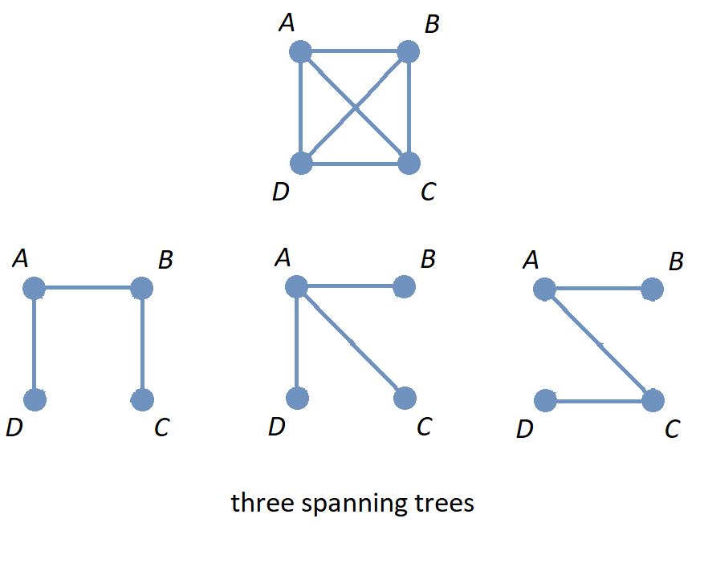
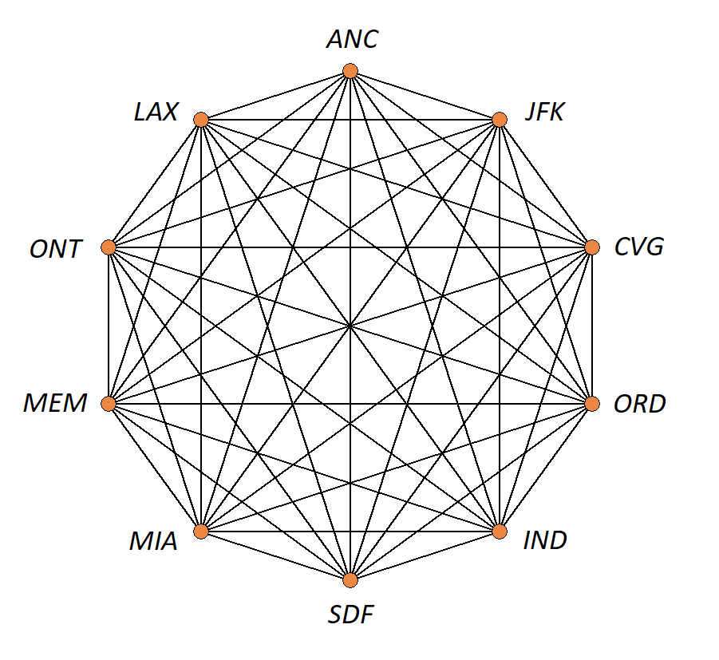

= Trees

//“”

#*CAUTION* - CHAPTER UNDER CONSTRUCTION!#

_This chapter was last updated on July 11, 2025._ + 
//[small]#Contents locked until 11:59 p.m. Pacific Standard Time on May 23, 2025.#

// MKD start topics lists
////
This is a new chapter, split off from the Graph Theory chapter of the GGC textbook.

AUG 2024 update on topics
Trees
Trees: Properties
trees (binary, spanning)
Trees: Traversal strategies
Traversal strategies
Spanning trees/forests
expression trees

TREES - January 2025 
DS2008/GraphsAndTrees	Trees
DS2013/Graphs and Trees	Trees: Properties
DS2013/Graphs and Trees	Trees: Traversal strategies
DS2013/Graphs and Trees	Spanning trees/forests [Core-Tier2]
DS2008/GraphsAndTrees	Trees
DS2008/GraphsAndTrees	Spanning trees/forests
DS2008/GraphsAndTrees	Traversal strategies
DS2001/Graphs and trees	Trees
DS2001/Graphs and trees	Spanning trees
DS2001/Graphs and trees	Traversal strategies
ACM_CCECC_2005/Graphs and trees	trees (binary, spanning)
ACM_CCECC_2005/Graphs and trees	expression trees
ACM_CCECC_2005/Graphs and trees	tree traversals

Also: 
Trees and forests
rooted TREES
binary trees -  full binary tree, complete binary trees, balanced???
APPLICATIONS:
	counting problems
	arithmietic/algebraic expressions
Binary tree representation
Tree traversal algorithms - preorder, inorder, postorder
Fundamental computing algorithms
	Binary search trees
	Depth- and breadth-first traversals
	Minimum spanning tree (Prim’s and Kruskal’s algorithms)

////
// MKD end topics lists

// MKD rewrite this blurb
//A *tree* is a connected graph that contains no simple circuits. 
//Trees are used to model decisions, to sort data, and to optimize networks.

A *tree* is a connected simple graph that contains no cycles. 
Trees are used to model decisions, to sort data, and to optimize networks.

//.Example {counter:treeex} 

Key terms and concepts covered in this chapter:

* Trees
** Definition of “tree” and “forest”
** Properties of trees
** Spanning trees 
** Binary trees 
*** Traversal strategies
*** Expression trees

==  Definitions, Examples, and Properties of Trees and Forests

//A *tree* is a simple graph $T$ that is connected and has no cycles (that is, there is no trail in $T$ that starts and ends at the same vertex.)

IMPORTANT: In this chapter, all graphs are assumed to be undirected (that is, have no directed edges) unless stated otherwise. 

Recall that a simple graph has no loops and no parallel edges. 
//, that is, no edge connects a vertex to itself, and no two edges can connect the same pair of vertices. In a simple graph, each edge is determined by its two vertices. 

Also, recall that a cycle in a graph is a path that starts and ends at the same vertex. 

A *tree* is 
//an undirected 
a 
simple graph that is connected and has no cycles. Some sources use the term *acyclic* to mean "has no cycles."

//+ 
//[small]#
//#

A *forest* is the union of several trees. In other words, a forest is a simple graph that has one or more connected components, where each connected component is a tree.

//image::imagesMKD/Trees1v1.png[Trees1v1,1040,260,float="right",align="center"]
image::imagesMKD/Trees1v1.png[Trees1v1,416,104,align="center"] 

//The image shows a forest composed of $3$ trees. Notice that for any two vertices in one of the trees, there is only one simple path that joins the vertices. This is True for every tree. 

The image shows a forest composed of three trees. 

Notice that if you choose any pair of vertices in one of the trees in the image, there is only one path that joins that pair of vertices. In fact, this property is True for _any_ tree.

.Theorem 
****
////
Suppose that $G$ is a undirected simple graph. 

$G$ is a tree if and only if for every pair of vertices of $G$ there is exactly one path between the vertices. 
////

Suppose that $G$ is a simple graph. The following statements are logically equivalent. 

* $G$ is a tree.
* $G$ is a simple graph such that for each pair of vertices of $G$ there is exactly one path between the vertices. 

[env.proof]
--
--

First, assume that $G$ is a tree; we will prove, using proof by contradiction, that for every pair of vertices of $G$ there is _exactly one_ path between the vertices. By assumption, $G$ is connected and for every pair of vertices in $G$ there is _at least one_ path joining those two vertices, so we only need to show that there cannot be two different paths that connect the same pair of vertices. To work toward a contradiction, let's suppose that for some pair of vertices $u$ and $v$ there are two different paths between $u$ and $v;$ then we can start to go from $u$ to $v$ along a first path and then “turn around and go back” to $u$ along a second path. This means that there must be a cycle in $G$ that starts and ends at $u.$ + 
[click.Why.must.there.be.a.cycle?]
--
[small]#If we can go all the way from $u$ to $v$ along the first path and then go all the way back, in reverse order, from $v$ to $u$ along the second path without repeating any edges or vertices (except $u$) then we have found a cycle that starts and ends at $u.$ + 
If the two paths have some common edges or vertices, we can use only part of each path to create a cycle that does not repeat any edges or vertices. To do this, write the first path as $v_{0}v_{1}...v_{n-1}v_{n}$ where $u = v_{0}$ and $v = v_{n}$ and let $j$ stand for the smallest positive index such that vertex $v_{j}$ appears in _both_ the first and second paths. Now create a cycle by using the beginning of the first path to go from $u$ to $v_{j}$ and then using the beginning part of the second path that goes from $u$ to $v_j$, but in reverse order, to go back from $v_{j}$ to $u.$ Notice that the index $j$ is chosen so that that no edge or vertex (except $u$ and $v_j$) that we use can belong to both of these shorter paths from $u$ to $v_{j},$ so no edges are repeated when we use this path to go from $u$ back to $u$ -  we have created a cycle.# + 
--
To continue with the proof by contradiction, we've shown that there is a cycle in $G,$ but this contradicts the assumption that $G$ is a tree that has no cycles. This means that the assumption "there is a pair of vertices in $G$ that are connected by two different paths" must be False. We have proven that for any pair of vertices in $G$ there is _exactly one_ path joining that pair of vertices.

////
 + 
[click.But.what.if.the.two.paths.from.$u$.to.$v$.use.some.of.the.same.edges?]
--
[small]#Since a cycle cannot repeat any edges, we may need to "prune" the paths instead of going all the way from $u$ to $v$ along the first path and then all the way back from $v$ to $u$ along the second path. If we write the first path as $v_{0}v_{1}...v_{n-1}v_{n}$ where $u = v_{0}$ and $v = v_{n},$ and we let $j$ stand for the least positive index such that vertex $v_{j}$ appears in _both_ the first and second paths, we can create a cycle by using the edges from the beginning of the first path to go from $u$ to $v_{j}$ and then using the edges from the beginning of the second path, but in reverse order, to go back from $v_{j}$ to $u.$ Notice that the index $j$ is chosen to ensure that no edge can belong to _both_ of these shorter paths from $u$ to $v_{j},$ so no edges are repeated in this cycle.# 
--
////

Secondly, assume that 
$G$ is a simple graph and that 
for every pair of vertices of $G$ there is exactly one path between the vertices. We will prove, using proof by contradiction, that $G$ must be a tree. By assumption, $G$ is connected because for any pair of vertices there is a path between those vertices, so we only need to prove that $G$ has no cycles. 
//; in fact, there is exactly one such path. 
//If $G$ has no cycles then it is a tree, so in order to get a contradiction we assume 
To reach a contradiction, let's suppose that $G$ does have a cycle 
of the form 
$v_{0}v_{1} \cdots v_{n-1}v_{n}$ where $v_{0} = v_{n}$ (that is, $v_{0}$ and $v_{n}$ are the same vertex, but no other vertex is repeated in the cycle.) 
Notice that, because $G$ is a simple graph, the integer $n$ must be greater than or equal to 3. + 
[click.Why.must.n.be.greater.than.or.equal.to.3?]
--
[small]#Notice that $n$ must be positive since there are at least two vertices in the path. + 
If $n=1$ then the cycle is $v_{0}v_{1}$ where $v_{0} = v_{1},$ but this cycle consists of a single loop, which contradicts that $G$ is a simple graph that has no loops. + 
If $n=2$ then the cycle is $v_{0}v_{1}v_{2}$ where $v_{0} = v_{2},$ but this cycle would use the same edge twice which contradicts the definition of a cycle. + 
This shows that $n \geq 3.$# + 
--
//, so 
//we can choose a value of $j$ so that $0 < j < n$ to create two different trails $v_{0} \cdots v_{j}$ and $v_{j} \cdots v_{n}.$  Now reverse the order of vertices in the second path to get two different paths between the vertices $v_{0}$ and $v_{j}$ 
This means that 
// MKD Jun 30 2025 changed "trail" to "path" in the following
we have two different paths, $v_{0}v_{1}$ and $v_{1} \cdots v_{n},$ between $v_0$ and $v_1$ (because $v_{0}$ and $v_{n}$ are the same vertex.) Now we can reverse the order of vertices in the second path to get two different paths between the vertices $v_{0}$ and $v_{1}$ - but we assumed that for every pair of vertices of $G$ there is exactly one path between those vertices. We have derived a contradiction, which means that $G$ cannot have a cycle. Therefore, $G$ is connected and has no cycles, which is the definition of a tree, so $G$ is a tree.

Q.E.D.

****

//(You know that $v_{n}$ is the same as $v,$ which appears in both the first and second paths, so such an integer $j$ must exist and is less than or equal to $n.$ You can now create a cycle by using the beginning of the first path from $u$ to $v_{j}$ and then using the edges from the beginning of the second path, but in reverse order, to go back from $v_{j}$ to $u$ - notice that no edge can belong to both of these shorter paths, so no edges are repeated in the cycle.)
//(You know that $v_{n}$ is the same as $v,$ which appears in both the first and second paths, so such an integer $j$ must exist and is less than or equal to $n.$ )# + 
//Now suppose that for some pair of vertices $u$ and $v$ there are (at least) two different paths between $u$ and $v,$ so we can go from $u$ to $v$ along a first path and then and go back from $v$ to $u$ along a second path. 
//Cycles.cannot.repeat.edges!
//By assumption $G$ is connected so every pair must be connected by at least one path. We conclude by combining the last two sentences that for any pair of vertices there must be exactly one path joining that pair of vertices.

//[small]#A path or circuit is *simple* if it does not contain the same edge more than once. A simple circuit is also called a *cycle.*#

//We now prove 

Here is another characterization of trees.

.Theorem 
****
For every positive integer $n,$ if a tree has $n$ vertices then the tree has $n-1$ edges.

[env.proof]
--
--

We use mathematical induction on the number of vertices $n.$ 

Let $P(n)$ be the predicate \[P(n): \text{If a tree has } n \text{ vertices  then the tree has } n-1 \text{ edges.}\] We will prove that the proposition $(\forall n \in \mathbb{N}_{>0})P(n)$ is True.

*Basis Step:* $P(1)$ is True since a tree that has $1$ vertex has $0$ edges (otherwise, the edge would have to be a loop, but trees are simple graphs that don't have loops.) + 
We can also prove that $P(2)$ is True in case the proof of $P(1)$ feels unsatisfying. 
//If a tree has $2$ vertices, then there is $1$ edge between those two vertices; since a tree is a simple graph, it cannot have either loops or parallel edges, so a tree with $2$ vertices must have exactly $1$ edge. This proves that $P(2)$ is True. 
If a tree has $2$ vertices, then since a tree is a connected simple graph, the $2$ vertices must be connected by a path, and since a tree cannot have parallel edges, the vertices are the endpoints of exactly $1$ edge. This proves that $P(2)$ is True. 

*Induction Step:* First, we assume that the induction hypothesis $P(k)$ is True for some positive natural number $k$.

Secondly, we will prove that the conditional $P(k) \rightarrow P(k+1)$ must be True, which means we can use _modus ponens_ (or the equivalent tautology $( P(k) \land ( P(k) \rightarrow P(k+1) ) ) \rightarrow P(k+1)$) to show that $P(k+1)$ is also True. 

Assume that $P(k)$ is True for the positive integer $k,$ that is, if a tree has $k$ vertices then the tree has $k-1$ edges. 
We can assume $k \geq 2$ since the cases when $k \in \{ 1, 2 \}$ were proved in the Basis Step. Suppose that we have a tree $T$ that has $k+1$ vertices; we will prove that the tree must have $k$ edges. 
//Let $v$ be a vertex of $T$ such that the degree of $v$ is $1$ - such a vertex must exist because the tree $T$ has no cycles. 
First, there must be at least one vertex $v$ in $T$ such that the degree of $v$ is $1:$ If every vertex had at least degree $2,$ then we could find a cycle in $T$ which cannot be True since $T$ is a tree. 
Remove one vertex $v$ that has degree $1$ along with the edge that has $v$ as an endpoint to obtain the subgraph $T-v.$ 
// MKD Jun 30 2025 changed "trail" to "path" in the following 
Notice that for every pair of vertices of $T-v$ there is exactly one path between the vertices, and applying the previous theorem shows that $T-v$ is a tree. Also, $T-v$ has $k$ vertices because we removed only $v,$ so we can apply the Induction Hypothesis to conclude that $T-v$ has $k-1$ edges. Now, reinsert vertex $v$ and the edge that was removed to obtain the tree $T$ that has $k+1$ vertices and $k$ edges. Therefore, if $P(k)$ is True then $P(k+1)$ is True, too. That is, $P(k) \rightarrow P(k+1)$.

*Conclusion Step:* We have proven both the Basis Step and the Induction Step. Therefore, we can use _universal generalization_ to conclude that 
for all positive integers $n,$ if a tree has $n$ vertices then the tree has $n-1$ edges.

Q.E.D. 

****

== Spanning Trees and Spanning Forests

Recall that a subgraph of a graph $G$ is a graph $H$ such that every vertex of $H$ is a vertex of $G$ and every edge of $H$ is a edge of $G$ (with both endpoints in the vertex set of $H.$) 

A *subtree* of a graph $G$ is a subgraph of $G$ that is also a tree. 
Likewise, a *subforest* of $G$ is a subgraph of $G$ that is also a forest.

//A *spanning tree* of a graph $G$ is a subgraph of $G$ that is a tree such that the vertex sets of $T$ and $G$ are the same. That is, a spanning tree is a connected subgraph of $G$ that includes all the vertices of $G.$ 
//Likewise, a *spanning forest* of a graph $G$ is a subgraph of $G$ that is a tree such that the vertex sets of $T$ and $G$ are the same

A *spanning tree* of a graph $G$ is a subgraph of $G$ that is a tree that includes all the vertices of $G.$ 
Likewise, a *spanning forest* of a graph $G$ is a subgraph of $G$ that is a forest that includes all the vertices of $G.$ 

//image::imagesMKD/three_spanning_trees.png[three_spanning_trees,877,707,align="center"] 
 

The image shows the graph $K_{4}$ along with three spanning trees.

//image::imagesMKD/not_spanning_trees.png[not_spanning_trees,650,761,align="center"] 
image::imagesMKD/not_spanning_trees.png[not_spanning_trees,325,380,align="center"] 

The image shows the graph $K_{4}$ along with a subgraph that is a subtree that is not a spanning tree, and also a subgraph that is a spanning forest.

//=== Kruskal’s Algorithm
//=== Finding A Minimal Cost Spanning Tree in a Weighted Graph: Kruskal's Algorithm 
=== Finding A Minimal-Weight Spanning Tree in a Weighted Graph: Kruskal's Algorithm 

Joseph Kruskal published a link:https://www.jstor.org/stable/2033241[paper] in 1956 that describes an algorithm for constructing “the shortest spanning subtree” of a connected simple graph, assuming that the each edge has a positive weight that represents the distance between its endpoints. However, since the weights can represent a quantity other than distance, e.g., cost, this textbook will refer to the tree that is constructed as a *minimal-weight spanning tree,* that is, a spanning tree with sum of edge weights less than or equal to the corresponding sum for any other spanning tree.

//Here is a description of the algorithm, based on Kruskal's original. 
Notice that this construction assumes that the graph is connected and has finitely-many weighted edges, with each weight being a positive number.

////
** Task: Given a graph $G=(V,E)$ with weighted edges, construct a spanning tree that has the minimal possible sum of weights.
//** Input: The list $V$ of all vertices of the graph, with the two vertices $a$ and $z$ specified, and the list $E$ of all weighted edges of the graph. + 
//[small]#For example, the input could be an adjacency matrix for the graph, with the first row of the matrix corresponding to $a$ and the last row corresponding to $z$.#
** Input: The list $E$ of all weighted edges of the graph. 
** Steps:  
. Define the lists $E_{chosen}$ and $E_{candidates},$ and initialize each list as an empty list. 
. Copy the list $E$ to $E_{candidates}.$ 
. Sort the list $E_{candidates}$ so that each edge $e_{k}$ in the list has a weight that is greater than or equal to the next edge $e_{k+1}$ in the list. 
. While list $E_{candidates}$ is not empty
.. Set $e$ to the last element in $E_{candidates}$
//.. If the set of edges $E_{chosen} \cup \{ e \}$ does not contain a cycle 
.. If it is impossible to form a cycle using edge $e$ along with some (or all) of the edges in list $E_{chosen}$
... Append $e$ to $E_{chosen}$
.. Remove edge $e$ from the list $E_{candidates}.$  
** Output: The list $E_{chosen}$ of weighted edges.

Notice that the list $E_{chosen}$ is constructed so that the edges it contains cannot be used to form a cycle. Also, because the graph is assumed to be connected, every vertex will be the endpoint of at least one edge in $E_{chosen},$ so that the graph with . 
////

** Task: Given a connected graph $G = (V,E)$ with weighted edges, construct a spanning tree of $G$ that has the minimal possible sum of weights.
** Input: The list $E$ of all weighted edges of the graph. 
** Steps:  
. Sort the list of edges $E$ so that each edge $e_{k}$ in the list has a weight that is less than or equal to the next edge $e_{k+1}$ in the list. 
. Define the list $E_{chosen}$ and initialize it list as an empty list. 
. Set integer index variable $i$ to 0.
. While $i$ is less than $|E|,$ the number of edges
.. If it is impossible to form a cycle using edge $e_{i}$ along with some (or all) of the edges in list $E_{chosen}$
... Append $e_{i}$ to $E_{chosen}$
.. Increment $i$ by 1  
** Output: The list $E_{chosen}$ of weighted edges.

Notice that the output list $E_{chosen}$ was constructed so that its edges cannot be used to form a cycle in the graph $G.$ Also, since the graph $G$ is assumed to be connected, every vertex will be the endpoint of at least one edge in $E_{chosen},$ so that the graph with vertex set $V$ and edge set $E_{chosen}$ will be a spanning tree of $G.$ 

Also notice that 
//, assuming that there are only finitely-many vertices, 
the condition for the while loop can be changed to “while $|E_{chosen}| < |V| - 1$” since a spanning tree must have one fewer edges than vertices.

****
.Example {counter:treeex} - An example of using Kruskal's algorithm

The image shows a drawing of a simple weighted graph along with all three possible spanning trees. 

//image::imagesMKD/graph5_MKDrevMST01.png[graph5_MKDrevMST01,1515,707,float="right",align="center"]
//image::imagesMKD/graph5_MKDrevMST01.png[graph5_MKDrevMST01,379,177,align="center"]
//image::imagesMKD/graph5_MKDrevMST01.png[graph5_MKDrevMST01,505,236,align="center"]
image::imagesMKD/graph5_MKDrevMST01.png[graph5_MKDrevMST01,757,353,align="center"]

//You can see that the spanning tree with the minimal sum of weights, 6, is drawn on the left.
The minimal-weight spanning tree, with total weight 6, is drawn on the lower left.

Let's trace through the steps of Kruskal's algorithm to examine how this minimal-weight spanning tree is constructed. The following table represents the input to the algorithm: A list of all the edges of the graph, along with their corresponding weights.

[cols="<1e,>1e",width=30%",align="center",options="header"]
|===
^| *Edge*     ^| *Weight* 
^| {c, d} ^| 1 
^| {a, b} ^| 2 
^| {b, c} ^| 3 
^| {a, c} ^| 5
|===
** Steps:  
. Sort the list of edges of the graph in order of increasing weight (This has already been done in the table shown.)  
. Set $E_{chosen}$ to the empty list. 
. Set the index $i$ to 0.
. Enter the while loop.
$i=0$:: $i$ is less than 4, and it is impossible to form a cycle using $\{c, d\}$ alone, + 
so set $E_{chosen}$ to $[\{c, d\}]$ and set $i$ to 1. 
$i=1$:: $i$ is less than 4, and it is impossible to form a cycle using $\{a, b\}$ along with the edge in $E_{chosen} = [\{c, d\}]$ + 
so set $E_{chosen}$ to $[\{c, d\} , \{a, b\}]$ and set $i$ to 2. 
$i=2$:: $i$ is less than 4, and it is impossible to form a cycle using $\{b, c\}$ along with the edges in $E_{chosen} = [\{c, d\} , \{a, b\}]$ + 
so set $E_{chosen}$ to $[\{c, d\} , \{a, b\}, \{b, c\}]$ and set $i$ to 3. 
$i=3$:: $i$ is less than 4, but it _is possible_ to form a cycle using $\{a, c\}$ along with the edges in $E_{chosen} = [\{c, d\} , \{a, b\}, \{b, c\}]$  + 
so make no change to $E_{chosen}$ and set $i$ to 4. 
$i=4$:: Since $i$ is not less than 4, exit the while loop. 

//Notice that the output is the list $E_{chosen} = [\{c, d\} , \{a, b\}, \{b, c\}]$ which is the list of edges used in the spanning tree drawn on the lower left of the image: The minimal-weight spanning tree. 
The output is $E_{chosen} = [\{c, d\} , \{a, b\}, \{b, c\}]$ which is the list of edges used in the spanning tree drawn on the lower left of the image. That is, in at least this one case, the algorithm does construct a minimal-weight spanning tree. 

[env.question]
--
How could you validate Kruskal's algorithm? + 
That is, how could you prove that Kruskal's algorithm must construct a minimal-weight spanning tree for any input graph that is connected and has finitely-many weighted edges?
--

[click.hint]
--
Try to create a predicate that you could prove True for all natural numbers by using mathematical induction. 
--

****

Here is another example.

****
.Example {counter:treeex} - Seven Busy Airports

//https://www.greatcirclemap.com/?routes=ATL-BOG%0AATL-CAI%0AATL-CAN%0AATL-DXB%0AATL-LHR%0AATL-SYD%0ABOG-CAI%0ABOG-CAN%0ABOG-DXB%0ABOG-LHR%0ABOG-SYD%0ACAI-CAN%0ACAI-DXB%0ACAI-LHR%0ACAI-SYD%0ACAN-DXB%0ACAN-LHR%0ACAN-SYD%0ADXB-LHR%0ADXB-SYD%0ALHR-SYD

Consider the complete graph on the seven vertices $\{ ATL, BOG, CAI, CAN, DXB, LHR, SYD \}.$ Each vertex is labeled using the International Air Transport Association code for one of the busiest airports in the world. 

Each edge represents the air route between two of the airports, and has a weight which is the shortest distance, in kilometers, between those two airports.
//All of the edges are listed in the table below, along with the distance, in kilometers, between the two airports.

[cols="<1e,>1e",width=30%",align="center",options="header"]
|===
^| *Edge*     ^| *Weight* 
^| {ATL, BOG} >| 3376
^| {ATL, CAI} >| 10256
^| {ATL, CAN} >| 13421
^| {ATL, DXB} >| 12230
^| {ATL, LHR} >| 6776
^| {ATL, SYD} >| 14942
^| {BOG, CAI} >| 11237
^| {BOG, CAN} >| 16794
^| {BOG, DXB} >| 13645
^| {BOG, LHR} >| 8473
^| {BOG, SYD} >| 14336
^| {CAI, CAN} >| 8005
^| {CAI, DXB} >| 2419
^| {CAI, LHR} >| 3536
^| {CAI, SYD} >| 14403
^| {CAN, DXB} >| 5837
^| {CAN, LHR} >| 9513
^| {CAN, SYD} >| 7507
^| {DXB, LHR} >| 5505
^| {DXB, SYD} >| 12039
^| {LHR, SYD} >| 17016
|===

////
// MKD July 8 2025 - sorted table
[cols="<1e,>1e",width=30%",align="center",options="header"]
|===
^| {CAI, DXB} >| 2419
^| {ATL, BOG} >| 3376
^| {CAI, LHR} >| 3536
^| {DXB, LHR} >| 5505
^| {CAN, DXB} >| 5837
^| {ATL, LHR} >| 6776
^| {CAN, SYD} >| 7507
^| {CAI, CAN} >| 8005
^| {BOG, LHR} >| 8473
^| {CAN, LHR} >| 9513
^| {ATL, CAI} >| 10256
^| {BOG, CAI} >| 11237
^| {DXB, SYD} >| 12039
^| {ATL, DXB} >| 12230
^| {ATL, CAN} >| 13421
^| {BOG, DXB} >| 13645
^| {BOG, SYD} >| 14336
^| {CAI, SYD} >| 14403
^| {ATL, SYD} >| 14942
^| {BOG, CAN} >| 16794
^| {LHR, SYD} >| 17016
|===

Kruskal's algorithm constructs the following set of edges with total weight 29451 kilometers.

[cols="<1e,>1e",width=30%",align="center",options="header"]
|===
^| {CAI, DXB} >| 2419
^| {ATL, BOG} >| 3376
^| {CAI, LHR} >| 3536
^| {CAN, DXB} >| 5837
^| {ATL, LHR} >| 6776
^| {CAN, SYD} >| 7507
|===

////

****

// MKD JULY 9 2025
//https://en.wikipedia.org/wiki/List_of_the_busiest_airports_in_the_United_States#Busiest_U.S._airports_by_total_cargo_throughput
// ANC MEM SDF MIA CVG LAX ORD ONT JFK IND

****
//.Example {counter:treeex} - Ten Airports
//.You Try
.Check Your Understanding

Find the minimal-weight spanning tree for the following graph. 

//image::imagesMKD/K10-US-airports.png[K10-US-airports,901,827,float="right",align="center"]
//image::imagesMKD/K10-US-airports.png[K10-US-airports,300,276,float="right",align="center"]

This drawing of the complete graph $K_{10}$ has vertices labeled with the International Air Transport Association codes of ten of the busiest airports, by total cargo throughput, in the United States of America. 
 + 
[small]#Image credit: Remixer-created derivative of original work  link:https://commons.wikimedia.org/wiki/File:9-simplex_graph.png["9-simplex graph.png"]. The original work "9-simplex graph.png" has been released into the public domain by its author, Tomruen at English Wikipedia. This applies worldwide.#

//The weight of each edge, which is the distance in kilometers between the endpoints, are listed in the table. 
//The table of edges and their weights is given below. 
The table lists each edge with its corresponding weight, which is the distance between the two endpoints, in kilometers.

++++
<iframe src="./imagesMKD/10_busiest_US_airports_by_total_cargo_throughput_2024.txt"></iframe>
++++ 
[small]#You can download the table as a link:./imagesMKD/10_busiest_US_airports_by_total_cargo_throughput_2024.txt[tab-delimited text file] so you can sort the list in a spreadsheet.#

This graph can be viewed in more geographically accurate form at Markus Englund's  link:https://www.greatcirclemap.com/?color=%23ED8744&label=iata&routes=ANC-CVG%0AANC-IND%0AANC-JFK%0AANC-LAX%0AANC-MEM%0AANC-MIA%0AANC-ONT%0AANC-ORD%0AANC-SDF%0A%0ACVG-IND%0ACVG-JFK%0ACVG-LAX%0ACVG-MEM%0ACVG-MIA%0ACVG-ONT%0ACVG-ORD%0ACVG-SDF%0A%0AIND-JFK%0AIND-LAX%0AIND-MEM%0AIND-MIA%0AIND-ONT%0AIND-ORD%0AIND-SDF%0A%0AJFK-LAX%0AJFK-MEM%0AJFK-MIA%0AJFK-ONT%0AJFK-ORD%0AJFK-SDF%0A%0ALAX-MEM%0ALAX-MIA%0ALAX-ONT%0ALAX-ORD%0ALAX-SDF%0A%0AMEM-MIA%0AMEM-ONT%0AMEM-ORD%0AMEM-SDF%0A%0AMIA-ONT%0AMIA-ORD%0AMIA-SDF%0A%0AONT-ORD%0AONT-SDF%0A%0AORD-SDF%0A[Great Circle Map] website.

////
// MKD July 11 2025 test
[click.Reveal.table.of.weights]
--
The table data can be downloaded as a link:./imagesMKD/10_busiest_US_airports_by_total_cargo_throughput_2024.txt[tab-delimited text file.]   
[format=tsv,cols="^20,>15e",width=35%",align="center",options="header"]
|===
include::imagesMKD/10_busiest_US_airports_by_total_cargo_throughput_2024.txt[]
|===
--
////

// MKD July 12 2025 ALTER THIS 
[click.FIX.ME!]
--
The image shows these edges in orange. + 
 +  
image:imagesMKD/K10-US-airports-spanning-tree.png[K10-US-airports-spanning-tree,300,276,float="right",align="center"] 
Let's suppose that we had such a one-to-one correspondence. 
As shown in the image, we could represent the one-to-one correspondence by a sequence $S_0 , S_1 , S_2 , \ldots$ of subsets of $\mathbb{N},$ which is what the elements of $\mathcal{P}(\mathbb{N})$ are. In the one-to-one correspondence, _every subset_ of $\mathbb{N}$ (that is, _every element_ of $\mathcal{P}(\mathbb{N})$) appears as one of the $S_{n}$ in the sequence: Every subset has been paired with a natural number and every natural number has been paired with a subset. + 
 +  
[small]#Image credit: Remixer-created derivative of original work  link:https://commons.wikimedia.org/wiki/File:9-simplex_graph.png["9-simplex graph.png"]. The original work "9-simplex graph.png" has been released into the public domain by its author, Tomruen at English Wikipedia. This applies worldwide.#

Another view of the spanning tree is can be displayed at this link:https://www.greatcirclemap.com/?color=%23ED8744&label=iata&routes=LAX-ONT%0ACVG-SDF%0ACVG-IND%0AIND-ORD%0AMEM-SDF%0ACVG-JFK%0AMEM-MIA%0AMEM-ONT%0AANC-LAX%0A[link.] 
--

++++
<iframe src="./imagesMKD/10_busiest_US_airports_by_total_cargo_throughput_2024.txt"></iframe>
++++

[click.Answer]
--
The spanning tree uses the edges shown in the table. 
//[cols="<1e,<4e",width=25%",align="center",options="header"]
[cols="<1e,>1e",width=30%",align="center",options="header"]
|===
^| *Edge*     ^| *Weight (km)* 
^| {LAX, ONT} | 76
^| {CVG, SDF} | 134
^| {CVG, IND} | 159
^| {IND, ORD} | 286
^| {MEM, SDF} | 514
^| {CVG, JFK} | 948
^| {MEM, MIA} | 1383
^| {MEM, ONT} | 2530
^| {ANC, LAX} | 3774
|===
The image shows these edges in orange. + 
 + 
image::imagesMKD/K10-US-airports-spanning-tree.png[K10-US-airports-spanning-tree,300,276,float="right",align="center"] 
The spanning tree for the graph $K_{10}$ with vertices labeled with the International Air Transport Association codes of ten of the busiest airports, by total cargo throughput, in the United States of America. 
 + 
[small]#Image credit: Remixer-created derivative of original work  link:https://commons.wikimedia.org/wiki/File:9-simplex_graph.png["9-simplex graph.png"]. The original work "9-simplex graph.png" has been released into the public domain by its author, Tomruen at English Wikipedia. This applies worldwide.#

Another view of the spanning tree is can be displayed at this link:https://www.greatcirclemap.com/?color=%23ED8744&label=iata&routes=LAX-ONT%0ACVG-SDF%0ACVG-IND%0AIND-ORD%0AMEM-SDF%0ACVG-JFK%0AMEM-MIA%0AMEM-ONT%0AANC-LAX%0A[link.]
--

****

== Additional Topics 
// in this chapter will include:

//#Students in CSC 230 Fall 2024 should refer to the slide decks posted in link:https://sfsu.instructure.com/[Canvas.]#
#Students in CSC 230 Spring 2025 can refer to the slide decks (from Spring 2024 and Fall 2024) that are posted in link:https://sfsu.instructure.com/[Canvas.]#

* Binary Trees

** Tree Traversal Strategies
		
** Expression Trees

//* Algorithms

** Algorithms for Binary search trees

*** Algorithms for Depth- and breadth-first traversals
		
//*** Algorithms for Minimum spanning tree (Prim’s algorithm)

//MORE TO COME!
////

== Examples of Trees

A *tree* is a connected graph that contains no simple circuits.

//MKD rewrite of first paragraph
//A *graph* $G=\left(V,\ E\right)$ is a structure consisting of a set of objects called vertices $V$ and a set of objects called edges $E$. An *edge* $e\in\ E$ is a set of the form $e=\left\{x,y\right\}$, where $x,y\in\ V$. That is, an edge is a set of vertices. We call the vertices $x$ and $y$ the *endpoints* of the edge $E$. In the case where $x = y$, we call the edge a *loop* since the edge connects the one endpoint to itself.

A graph consists of a set of *vertices*  (also called *nodes*) and a set of *edges,* 
where each edge  
connects either two different vertices or a vertex to itself. 

* For each edge, its *endpoints* are the vertices that it connects. The edge is said to be incident with each endpoint, and to connect the endpoints.
* If an edge has only one endpoint, it is called a *loop.* 
* An *isolated vertex* is a vertex that is not an endpoint of any edge.
* If two or more edges connect the same endpoints (or endpoint if the edges are loops), the graph is called a *multigraph.*
// MKD - can a multigraph contain ANY loops???
* A *simple graph* is a graph that has no loops and does not have two or more edges that connect the same endpoints.
//If there are no loops and no two edges connect the same endpoints, the graph is called *simple.* 

Graphs discussed in this textbook are assumed to be simple unless stated otherwise.

****
.Example {counter:treeex} 
//- A multigraph that contains a loop and an isolated point
//- An undirected graph.

//The graph shown has vertex set $\left\{A,\ B,\ C,\ D,\ E,\ F\right\}$ and 
//edge set $\{\{A,C\},\{D\},\{B,D\}\{B,F\},\{D,F\}\}.$ 

The graph shown has 7 vertices 
// set $\left\{A,\ B,\ C,\ D,\ E,\ F\right\}$ 
and 7 edges.
// set $\{\{A,C\},\{D\},\{B,D\}\{B,F\},\{D,F\}\}.$ 

image::imagesMKD/graphMKD1.png[]
//image::imagesMKD/graph1withAddedLoopAndComponents_MultigraphVersion.png[]
//image::imagesMKD/graph1withAddedLoopAndComponents.png[]
//image::images/graph1.png[]

This is _one graph_ that is made up of three separate _connected components_ (Connectivity will be defined in detail later in the chapter, but is introduced informally here). 

* One connected component contains the vertices $A$ and $C$ and two edges that connect them.  
* A second connected component contains the vertices $B$, $D$, $E$, and $F$ and the edges that are incident to those vertices. 
* A third connected component contains the single isolated vertex $G$ and no edges.
 
In the second connected component, 
the graph is drawn so that 
the edge with endpoints $B$ and $F$ and 
the edge with endpoints $D$ and $E$ 
cross, but the point of intersection is ignored 
because it is not a vertex. 
//We could redraw this graph with $E$ to the left of $D$ so that the two edges do not cross; 
We could redraw this graph so that the two edges do not cross; for example, we could move $E$ inside the triangle. 
However, there are some graphs which cannot be drawn in 2 dimensions without some edge crossings.

This graph is a multigraph because there are multiple edges that connect the pair of vertices $\{A,C\}$.

This graph is not simple because (1) it contains a loop and (2) it has a pair of vertices that are connected by two different edges.

****

//We will define simple graphs formally using set theory 
//which is done 
//after the next example, but we will usually represent graphs using a 
//"connect-the-dots" style 
It is possible to write a formal definition of graphs in terms of set theory, but it is common to use a drawing as in the preceding example when there are small numbers of vertices and edges. 

// MKD define digraphs in separate section

== Simple Graphs

// MKD - probably need to keep this formal definition

Here is a formal definition of simple graph: 
The formal definition of 
//simple graphs 
may be useful to you if you need to implement a simple graph in code.

A *simple graph* $G=\left(V,\ E\right)$ is an ordered pair consisting of a set $V$ of objects called *vertices* (or *nodes*) and a set $E$ of objects called *edges*.
// MKD need to update to say that edges can be any of 
// an unordered pair, a singleton, or an ordered pair. 
An edge $e\in\ E$ is a set of the form $e=\left\{x,y\right\}$, where the vertices $x$ and $y$ are two different elements of $V$. The two vertices $x$ and $y$ in the edge $e=\left\{x,y\right\}$ are said to be *adjacent* or *connected*, and $x$ and $y$ are called the *endpoints* of $e$. 
// MKD no loops in simple graphs.
//If the two vertices of an edge are the same, that is, $e=\left\{x,y\right\}$, then the edge $e$ is called a *loop*.  

//The graph in the previous example has vertex set 
//$\left\{A,\ B,\ C,\ D,\ E,\ F\right\}$ and 
//edge set
//$\{\{A,C\},\{D\},\{B,D\}\{B,F\},\{D,F\}\}.$ Note that the graph is not a //simple graph because there is a loop that has endpoint $D$.

****
.Example {counter:treeex} - an undirected graph.

The graph shown has vertex set $V=\left\{A,\ B,\ C,\ D,\ E,\ F\right\}$ and edge set
$E=\{\{A,C\},\{A,D\},\{B,D\}\{B,F\},\{C,F\},\{D,F\},\{F,E\}\}$

image::images/graph1.png[]

****

== Directed Graphs

A *directed graph* (or *digraph*) is 
//an extension of the definition of 
a graph in which the edges are directed from one vertex to another vertex.

****
.Example {counter:treeex} - A directed graph.

The graph $G=(V,E)$ with vertex set 
$V=\{A,B,C,D,E,F\}$  and 
edge set
$E=\{ (A,C),(D,A),(B,D),(F,B),(C,F),(D,F),(F,E) \}$. 
The first coordinate of each edge is the initial vertex and the second coordinate is the terminal vertex.

image::images/graph2.png[]

****

The *degree* of a vertex $v \in V$, denoted $d(v)$, is the number of edges in the graph $G$
containing the vertex $v$.

****
.Example {counter:treeex}

The degrees of each of the vertices in the undirected graph $G$  with vertex set
$V=\{A,B,C,D,E,F,G\}$ and edge set $E=\{\{A,C\},\{A,D\},\{B,D\}\{B,F\},\{C,F\},\{D,F\},\{F,G\}$
are,

$d\left(A\right)=2$

$d\left(B\right)=2$

$d\left(C\right)=2$

$d\left(D\right)=3$

$d\left(E\right)=0$

$d\left(F\right)=4$

$d\left(G\right)=1$

****

Notice that the total sum of all the degrees
$d\left(A\right)+\ d\left(B\right)\ +\ d\left(C\right)+\ \ d\left(D\right)\ \ +d\left(E\right)+\ d\left(F\right) + d\left(G\right)=14$
is twice the number of edges $\left|E\right|=7$ in the graph.
This is true in general and we state this result as  theorem, often called the handshaking lemma.

.Handshaking Lemma
****
The sum of the degrees of the vertices of a graph $G=\left(V,\ E\right)$ is equal to twice the number of edges
in $G$. That is, $\displaystyle \sum_{v\in V}{d\left(v\right)=2\ \left|E\right|}$.
****

[NOTE]
====
A useful consequence of this to keep in mind is that the sum of the degrees of a graph is always even.
====

== Representing graphs.

In addition to the vertex-edge representation of graphs there are alternative ways to represent a
graph, especially useful for computing.

=== The Adjacency Matrix
One way is the use of an adjacency matrix. The adjacency matrix $M$ represents a graph in a
table form, containing a row and column for each vertex $v_i$. If the vertices
$v_i$ and $v_j$ are connected by an edge
$e$, the adjacency matrix will contain a $1$ in the $i-th$ row and $j-th$ column and $0$ otherwise.
Denoting by $m_{i,\ j}$ the component of the adjacency matrix in the $i-th$ row and $j-th$ column,
we define the adjacency matrix for the graph $G=\left(V,E\right)$ as

latexmath:[
m_{i,j}=\left\{
\begin{array}{cc}
 1 & \text{if}\text{  }\left\{v_i,v_j\right\} \text{is}\text{  }\text{in}\text{  }E\text{  } \\
 0 & \text{otherwise}
\end{array}
\right.
]

****
.Example {counter:treeex} - adjacency matrix of a graph

The graph with  vertex set $V=\left\{A,\ B,\ C,\ D,\ E,\ F\right\}$ and edge
set
$E=\{\{A,C\},\{A,D\},\{B,D\}\{B,F\},\{C,F\},\{D,F\},\{F,E\}\}$ has adjacency matrix

\begin{matrix}A&0&1&1&0&0&0\\C&1&0&0&0&1&0\\D&1&0&0&1&1&0\\B&0&0&1&0&1&0\\F&0&1&1&1&0&1\\E&0&0&0&0&1&0\\\ &A&C&D&B&F&E\\\end{matrix}

****

****
.Example {counter:treeex} - obtaining the graph from the adjacency matrix

The graph with adjacency matrix

\begin{matrix}a&0&1&1&1\\c&1&0&1&1\\d&1&1&0&1\\b&1&1&1&0\\\ &a&c&d&b\\\end{matrix}

is the graph shown below.

image::images/graph3.png[]

****

=== The Adjacency Matrix for Directed Graphs

Undirected graphs are represented using symmetric adjacency matrices while digraphs are represented by adjacency matrices that are not symmetric.

****
.Example {counter:treeex} - adjacency matrices for an undirected graph and for a directed graph

In the figure below the first graph is undirected while the second is a digraph.

image::images/graph4.png[]

Their adjacency matrices are respectively,

latexmath:[
\left(\begin{matrix}0&1&1&0\\1&0&1&0\\1&1&0&0\\0&0&0&0\\\end{matrix}\right)
]
 and
latexmath:[
\left(\begin{matrix}0&1&0&0\\0&0&1&0\\1&0&0&0\\0&0&0&0\\\end{matrix}\right).
]

****

== Weighted Graphs

A *weighted graph* is one in which each edge $e$ is assigned a nonnegative number $w(e)$,
called the weight of that edge. Weights are typically associated with costs, or capacities of
some type like distance or speed.  The adjacency matrices for weighted graphs are very
similar to those for graphs that are not necessarily weighted. Instead of using a $1$ to
represent an edge between two vertices, say $v_i$, and $v_j$, we place the the weight of the edge
$w(e)$ in position $m_{i,j}$ of the adjacency matrix as shown in the following two examples.

****
.Example {counter:treeex}
Consider first the following weighted undirected graph

image::images/graph5.png[]

Its adjacency matrix is
latexmath:[
\left(\begin{matrix}0&2&5&0\\2&0&3&0\\5&3&0&1\\0&0&1&0\\\end{matrix}\right).
]

By contrast, the directed weighted graph below

image::images/graph6.png[]

has adjacency matrix
latexmath:[
\left(\begin{matrix}0&2&0&0\\0&0&3&0\\5&0&0&1\\0&0&0&0\\\end{matrix}\right).
]
****

== Subgraphs

A graph $H=(V_1,E_1)$ is said to be a *subgraph* of the graph $G=(V,\ E)$ if
$V_1\subseteq V$ and $E_1\subseteq E$.

If the vertex $v\in V$ belongs to the graph  $G=(V,E)$, we denote by *$G-v$*,
the subgraph obtained from G by removing the vertex $v$ and all edges in $E$
adjacent to the vertex $v$.

Below is shown a graph $G$, and the subgraph $G-d$ formed by removing the vertex $d$.

image::images/graph7.png[]

A natural generalization of the subgraph obtained by removing a vertex is the subgraph
obtained by removing multiple vertices and the  edges associated with the removed vertices. The subgraph obtained is called the subgraph *induced* by removing those vertices.

****
.Example {counter:treeex}
Below is a graph $G=(V,E)$ and the subgraph obtained by $V-\{a,d\}$, called the induced subgraph
$G-\{a,d\}$, with a slight abuse of notation

image::images/graph8.png[]
****

== Connectivity, Eulerian Graphs, and Hamiltonian Graphs
A *walk* on a graph $G=\left(V,E\right)$ is a finite, non-empty, alternating sequence of
vertices and edges of the form, $v_0e_1v_1e_2\ldots e_nv_n$, with vertices $v_i\in V$ and edges $e_i\in E$.

A *trail* is a walk that does not repeat an edge, ie. all edges are distinct.

A *path* is a trail that does not repeat a vertex.

The *distance* between two vertices, $u$ and $v$, denoted $d(u,v)$, is the number of
edges in a shortest path connecting them.

A *cycle* is a non-empty trail in which the only repeating vertices are the beginning and
ending vertices, $v_0=v_n$.

In the graphs below the first shows a trail $CFDBFE$.
It is not a path since the vertex $F$ is repeated.
The second shows a path $CADFB$, and the third a cycle $CADFC$. Also note the following
distances, $d(A,D)=1$, while $d(A,F)=2$, and $d(A,E)=3$.

image::images/graph9.png[]

A graph is *connected* if there is a path from each vertex to every other vertex.

The graph below is not connected,

image::images/graph10.png[]

and has adjacency matrix,

latexmath:[
\left(\begin{matrix}0&1&1&0&0\\1&0&1&0&0\\1&1&0&0&0\\0&0&0&0&1\\0&0&0&1&0\\\end{matrix}\right).
]

=== Eulerian Graphs

Informally an  *Eulerian graph* is one in which there is a closed (beginning and ending with the
same vertex) trail that includes all edges. To define this precisely, we use the idea of an Eulerian trail.

An *Eulerian trail* or *Eulerian circuit* is a closed trail containing each edge of the
graph  $G=(V,\ G)$ exactly once and returning to the start vertex. A graph with an
Eulerian trail is considered *Eulerian* or is said to be an *Eulerian graph*.

In the following, the first graph is Eulerian with the Eulerian circuit sequenced from $1$ to $7$.
The second is not an Eulerian graph. Convince yourself of this fact by  looking at all
necessary trails or closed trails.

image::images/graph11.png[]

An *Euler path* on a graph is a path that uses each edge of the graph exactly once. The following are useful
characterizations of graphs with Euler circuits and Euler paths and are due to Leonhard Euler

.Theorem on Euler Circuits and Euler Paths

****
.. A finite connected graph has an Euler circuit if and only if each vertex has even degree.
.. A finite connected graph has an Euler path if and only if it has most two vertices with odd degree.
****

=== Hamiltonian Graphs

A cycle in a graph $G=\left(V,E\right)$, is said to be a *Hamiltonian cycle* if every vertex,
except for the starting and ending vertex in $V$, is visited exactly once.

A graph is *Hamiltonian*, or said to be a *Hamiltonian graph*, if it contains a Hamiltonian cycle.

The following graph is Hamiltonian and shows a Hamiltonian cycle $ABCDA$, highlighted, while
the second graph is not Hamiltonian.

image::images/graph12.png[]

While we have the Euler Theorem to tell us which graphs are Eulerian or not, there are no
comparable simple criteria to determine if graphs are Hamiltonian or not. We do have the following sufficient
criterion due to Paul Dirac.

.Theorem (Dirac) on Hamiltonian graphs
****
A simple graph, with $n≥3$ vertices, is Hamiltonian if every vertex $v$ has degree $d(v)\geq \frac{n}{2}$.

****
== Exercises

. For each of the following graphs, find their
	.. Adjacency matrices
	.. Adjacency lists
+
image::images/graphex1.png[GGC,1000,1000]

. For each of the following digraphs, find their
	.. Adjacency matrices
	.. Adjacency lists
+
image::images/graphex2.png[GGC,750,750]

. Draw, with labeled edges and vertices, the graphs given by the following
adjacency matrices.

	.. $ $
latexmath:[
\left(
\begin{matrix}0&1&0&1&1\\1&0&1&1&0\\0&1&0&0&0\\1&1&0&0&0\\1&0&0&0&0\\\end{matrix}
\right)
]

	..  $  $
latexmath:[
\left(
\begin{matrix}0&1&1&0&1\\1&0&0&0&0\\1&0&0&0&0\\0&0&0&0&1\\1&0&0&1&0\\\end{matrix}
\right)
]

	..  $  $
latexmath:[
\left(
\begin{matrix}0&0&0&1&0&0\\0&0&1&0&0&1\\0&1&0&0&1&1\\1&0&0&0&0&0\\0&0&1&0&0&0\\0&1&1&0&0&0\\\end{matrix}
\right)
]

	..  $  $
latexmath:[
\left(
\begin{matrix}0&1&0&0&1&1\\1&0&0&0&1&1\\0&0&0&0&0&0\\0&0&0&0&1&1\\1&1&0&1&0&0\\1&1&0&1&0&0\\\end{matrix}
\right)
]

. Draw, with labeled edges and vertices, the digraphs given by the following
adjacency matrices

	.. $ $
latexmath:[
\left(
\begin{matrix}0&1&1&0&0\\0&0&0&0&1\\0&1&0&0&0\\1&0&1&0&1\\0&1&0&0&0\\\end{matrix}
\right)
]

	..  $  $
latexmath:[
\left(
\begin{matrix}0&1&1&0&1\\1&0&0&0&0\\1&0&0&0&0\\0&0&0&0&1\\1&0&0&1&0\\\end{matrix}
\right)
]

. Draw, with labeled edges and vertices, the weighted graphs (or digraphs) given by the following
adjacency matrices.

	.. $ $
latexmath:[
\left(
\begin{matrix}0&10&3&0&5\\10&0&2&3&0\\3&2&0&7&4\\0&3&7&0&1\\5&0&4&1&0\\\end{matrix}
\right)
]

	..  $  $
latexmath:[
\left(
\begin{matrix}0&2&3&4\\0&0&5&7\\0&0&0&6\\5&8&8&0\\\end{matrix}
\right)
]

	..  $  $
latexmath:[
\left(
\begin{matrix}0&0&0&1&0&0\\0&0&1&0&0&1\\0&1&0&0&1&1\\1&0&0&0&0&0\\0&0&1&0&0&0\\0&1&1&0&0&0\\\end{matrix}
\right)
]

	..  $  $
latexmath:[
\left(
\begin{matrix}0&5&3&2&5\\0&0&0&0&0\\8&2&0&5&4\\0&1&0&0&1\\0&0&0&1&0\\\end{matrix}
\right)
]

. The *complete graph* $K_n$ is the graph with $n$ vertices and
edges joining every pair of vertices. Draw the complete graphs $K_2,\ K_3,\ K_4,\ K_5,$ and $K_6$
and give their adjacency matrices.

. The *path graphs* $P_n$ are connected graphs with $n$ vertices (vertex set $V={v_1,v_2,\ldots,\ v_n}$) and with $n-1$ edges
(edge set $E=\{\{v_1,v_2\},\{v_2,v_3\},\{v_3,v_4\},...,\{v_{n-1},v_n\} \}$). Draw the  path graphs
$P_2,\ P_3,\ P_4,\ P_5,$ and $P_6$ and give their adjacency matrices.

. 	*Regular graphs* are graphs in which all the vertices have the same degree.
A graph in which all vertices have degree $k$ is called a $k-$regular graph.
	.. Describe all $0-$regular,  $1-$regular, and $2-$regular graphs.
	.. Explain using the handshaking lemma why all $3-$regular graphs must
	have an even number of vertices.
	.. Explain why all the complete graphs $K_n$ are regular.
	.. Draw a $3-$regular graph with 8 vertices and give its adjacency matrix.

. A graph $G=G(V,E)$ is said to be *bipartite* if its vertex set, $V$,
can be partitioned into two disjoint sets $M$ and $N$, with $V=M\cup N$,
so that every edge $e\in E$ joins two vertices, with one vertex in $M$ and
the other in $N$. One way to think of bipartite graphs is to partition
the vertices by two colors, say black and white, and every edge connects a
black vertex with a white vertex (never connecting two vertices of the same color).

	.. Show that the following are bipartite graphs by explicitly partitioning them using a coloring scheme to partition
	the vertices.
+
image::images/graphex5.png[GGC,1000,1000]
	.. Explain why the following are not bipartite graphs.
+
image::images/graphex4.png[GGC,1000,1000]

. A *tree* is a connected graph with no cycles. It can be shown, using mathematical induction,
that  a tree with $n$ vertices must have exactly $n-1$ edges. Determine which of  following graphs are trees and which are not. Explain your reasoning.
+
image::images/graphex6.png[GGC,1000,1000]

. Use the Euler Theorem to determine which of the following graphs are Eulerian (have Euler circuits). For those graphs
that are Eulerian, give an Eulerian circuit.
+
image::images/graphex7.png[GGC,1000,1000]

. Use the Euler Theorem to explain why the following graphs do not have Eulerian circuits but do have
Eulerian paths. Give an  Eulerian path for each graph.
+
image::images/graphex8.png[GGC,1000,1000]

. Use the Dirac Theorem to explain why the following graphs are Hamiltonian (have Hamiltonian circuits).
Provide a Hamiltonian circuit for each graph.
+
image::images/graphex9.png[GGC,1000,1000]

. A *spanning tree* on a graph $G$ with $n$ vertices is a subgraph of
$G$ with $n-1$ edges that form a tree. For a weighted graph, the *minimum spanning
tree* is a spanning tree with minimum total edge weights. *Kruskal’s algorithm* is a
procedure that finds the minimum spanning tree for a weighted graph. It sorts the
edges in nondecreasing order by weight and then builds the minimum spanning tree,
beginning just with the vertices (technically called a forest), and then successively
adding edges of nondecreasing weights that do not form cycles.
Formally the Kruskal
algorithm is,
+
(1) Choose an edge with minimum weight and add it to the tree provided it does not
	create a cycle.
+
(2) Choose an edge with minimum weight and add it to the tree provided it does not
	create a cycle.
+
(3) Repeat step (2) until $n-1$ edges are added to create a spanning tree of $n-1$ edges.
+
Apply Kruskal's algorithm to the following graphs.
+
image::images/graphex3.png[GGC,500,500]
////
